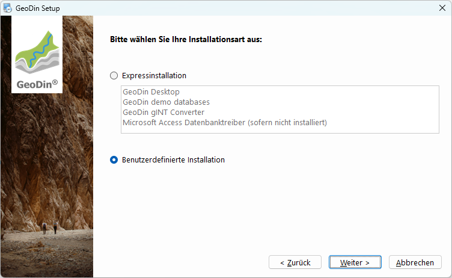
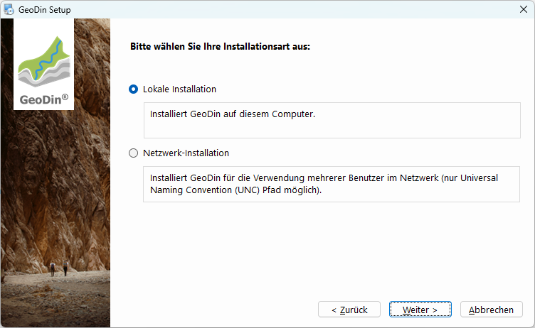
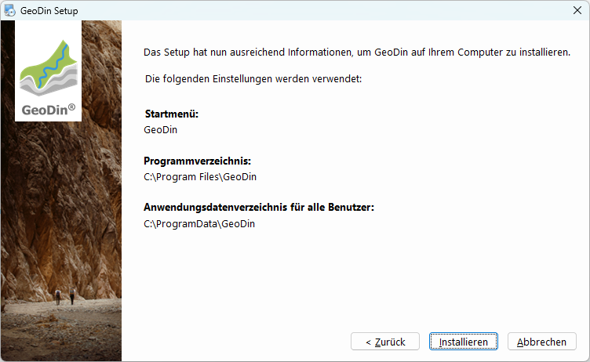

# Benutzerdefinierte Installation

## Bevor Sie beginnen

Um GeoDin® zu verwenden, benötigen Sie eine gültige GeoDin®-Lizenz-Seriennummer. Sie können eine Lizenz erwerben oder eine Testlizenz beantragen, indem Sie www.geodin.com besuchen.

Stellen Sie sicher, dass Sie über Administratorrechte auf dem Computer verfügen, auf dem Sie GeoDin® installieren möchten.

Sie benötigen auch das Installationsprogramm. Ein Download-Link für das Installationsprogramm wird Ihnen nach dem Kauf automatisch per E-Mail zugesandt.

Nach dem Herunterladen starten Sie die Installation, indem Sie auf die Datei `GeoDin-Setup.exe` doppelklicken.

<figure><figcaption>
GeoDin Setup
</figcaption></figure>

## 1. Lizenzvereinbarung

Bitte lesen Sie die Lizenzvereinbarung sorgfältig durch und fahren Sie fort, indem Sie diese akzeptieren.

<figure><figcaption>
Lizenzvereinbarung
</figcaption></figure>

## 2. Installationstyp (Express oder Benutzerdefiniert)

GeoDin® unterstützt viele Bereitstellungskonfigurationen.

Erfahrene Benutzer können ihre Installation anpassen. Wählen Sie dazu die Option **Benutzerdefinierte Installation**.

Wenn Sie GeoDin® zum ersten Mal verwenden, wählen Sie die **Express-Installation**; diese wird schnell alles installieren, was Sie benötigen, um GeoDin® auf einem einzelnen Computer auszuführen. Es enthält Demo-Datenbanken, um Ihnen den Einstieg zu erleichtern. Es gibt eine separate Installationsanleitung für die Express-Installation.

Um Ihre Wahl zu bestätigen, klicken Sie auf `<Weiter>`.

<figure><figcaption>
<strong>Benutzerdefinierte Installation</strong>
</figcaption></figure>

### 3.1. Lokale Installation

Wählen Sie die Option **Lokale Installation**, um GeoDin® lokal auf Ihrem Computer zu installieren, oder **Netzwerk-Installation**, wenn Sie GeoDin® zentral auf einem Netzlaufwerk für den Mehrbenutzerzugriff installieren möchten. Weitere Informationen finden Sie [hier](https://docs.geodin.com/geodin-desktop/de/installation/benutzerdefinierte-installation#id-4.1.-netzwerkinstallation).

Um Ihre Wahl zu bestätigen, klicken Sie auf `<Weiter>`.

<figure><figcaption>
Lokale Installation
</figcaption></figure>

## 3.2. Installationspfad (Lokale Installation)

Geben Sie an, in welchem Ordner Sie GeoDin® installieren möchten.

Alle Verzeichnisse, auf die der Benutzer während der Arbeit mit GeoDin® Schreibzugriff benötigt (z.B. Layout-Verzeichnisse, Systembibliotheken), werden automatisch im Verzeichnis `C:\ProgramData\GeoDin` gespeichert. Dies stellt sicher, dass diese Ordner nicht im Verzeichnis `C:\Program Files` gespeichert werden, für das seit der Windows Vista®-Version der Schreibzugriff für Benutzer ohne Administratorrechte untersagt ist.

Um Ihre Wahl zu bestätigen, klicken Sie auf `<Weiter>`.

<figure><figcaption>
Installationspfad
</figcaption></figure>

## 3.3. Installationspakete (Lokale Installation)

Wählen Sie aus, welche Pakete Sie auf Ihrem Gerät installieren möchten. Eine Beschreibung der einzelnen Pakete wird angezeigt, wenn Sie im Installationsfenster darauf klicken. Einzelne Pakete können deaktiviert sein, wenn sie bereits auf Ihrem Gerät vorhanden sind.

Um Ihre Wahl zu bestätigen, klicken Sie auf `<Weiter>`.

<figure><figcaption>
Installationspakete
</figcaption></figure>

## 3.4. Zusammenfassung (Lokale Installation)

Die von Ihnen vorgenommenen Installationseinstellungen für die verschiedenen Pakete werden hier für Sie zusammengefasst.

Klicken Sie auf `<Installieren>`, um fortzufahren.

<figure><figcaption></figcaption></figure>

## 3.5. Installationsprozess (Lokale Installation)

Der Installer kopiert Dateien in die verschiedenen Verzeichnisse.

Bitte warten Sie, bis der Vorgang abgeschlossen ist.

<figure><figcaption>
Installationsprozess
</figcaption></figure>

## 3.6. Installation abschließen (Lokale Installation)

Die Installation ist nun abgeschlossen!

Wenn Sie GeoDin® sofort nach der Installation starten möchten, aktivieren Sie das Kontrollkästchen **GeoDin® nach Abschluss der Installation starten**.

Wenn Sie GeoDin® zum ersten Mal öffnen, können Sie die Lizenz eingeben. Es gibt eine separate Anleitung zur Aktivierung Ihrer Lizenz.

Klicken Sie auf `<Beenden>`, um die Installation abzuschließen.

<figure><figcaption>
Installation abschließen
</figcaption></figure>

## 4.1. Netzwerkinstallation

Wählen Sie die Option **Netzwerkinstallation**, wenn Sie GeoDin® zentral auf einem Netzlaufwerk für den Mehrbenutzerzugriff installieren möchten.

Um Ihre Wahl zu bestätigen, klicken Sie auf `<Weiter>`.

<figure><figcaption>
Netzwerkinstallation
</figcaption></figure>

## 4.2. Installationspfad (Netzwerkinstallation)

Geben Sie an, in welchem Netzwerkordner Sie GeoDin® installieren möchten (nur UNC-Pfad möglich).

<figure><figcaption>
Netzwerkinstallationspfad
</figcaption></figure>

## 4.3. Zusammenfassung (Netzwerkinstallation)

Die von Ihnen vorgenommenen Installationseinstellungen für die verschiedenen Pakete werden hier für Sie zusammengefasst.

Klicken Sie auf `<Installieren>`, um fortzufahren.

<figure><figcaption>
Zusammenfassung
</figcaption></figure>

## 4.4. Installationsprozess (Netzwerkinstallation)

Der Installer kopiert Dateien in die verschiedenen Verzeichnisse.

Bitte warten Sie, bis der Vorgang abgeschlossen ist.

<figure><figcaption>
Installationsprozess
</figcaption></figure>

## 4.5. Installation abschließen (Netzwerkinstallation)

Die Installation ist nun abgeschlossen!

Wenn Sie GeoDin® sofort nach der Installation starten möchten, aktivieren Sie das Kontrollkästchen **GeoDin® nach Abschluss der Installation starten**.

Wenn Sie GeoDin® zum ersten Mal öffnen, können Sie die Lizenz eingeben. Es gibt eine separate Anleitung zur Aktivierung Ihrer Lizenz.

Klicken Sie auf `<Beenden>`, um die Installation abzuschließen.

<figure><figcaption>
Installation abschließen
</figcaption></figure>
