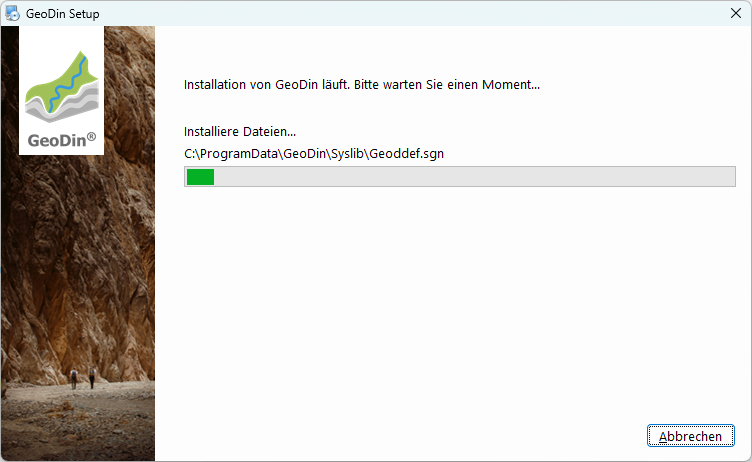

# Expressinstallation

## Bevor Sie beginnen

Um GeoDin® zu verwenden, benötigen Sie eine gültige GeoDin®-Lizenz-Seriennummer. Diese können Sie auf [www.geodin.com](https://www.geodin.com) erwerben oder eine Testlizenz beantragen.
\
Stellen Sie sicher, dass Sie über Administratorrechte auf dem Computer verfügen, auf dem Sie GeoDin® installieren möchten.
\
Sie benötigen auch das Installationsprogramm. Ein Download-Link für das Installationsprogramm wird Ihnen nach dem Kauf automatisch per E-Mail zugesendet.
\
Nach dem Herunterladen starten Sie die Installation, indem Sie auf die Datei `GeoDin-Setup.exe` doppelklicken.

<figure><figcaption>
GeoDin Setup
</figcaption></figure>

## 1. Lizenzvereinbarung

Bitte lesen Sie die Lizenzvereinbarung sorgfältig durch und fahren Sie fort, indem Sie diese akzeptieren.

<figure><figcaption>
Lizenzvereinbarung
</figcaption></figure>

## 2. Installationstyp (Express oder Benutzerdefiniert)

GeoDin® unterstützt viele Installationskonfigurationen.\

\
Wenn Sie GeoDin® zum ersten Mal verwenden, wählen Sie die Express-Installation; diese installiert schnell alles, was Sie benötigen, um GeoDin® auf einem einzelnen Computer auszuführen. Es enthält Demo-Datenbanken, um Ihnen den Einstieg zu erleichtern.\

\
Erfahrene Benutzer können ihre Installation anpassen. Wählen Sie dazu die Option [Benutzerdefinierte Installation](https://docs.geodin.com/geodin-desktop/de/installation/benutzerdefinierte-installation).&#x20;

<figure><figcaption>
Expressinstallation
</figcaption></figure>

## 3. Installationseinstellungen

Die von Ihnen vorgenommenen Installationseinstellungen werden hier für Sie zusammengefasst.
\
Klicken Sie auf `<Installieren>`, um fortzufahren.

<figure><figcaption>
Installationseinstellungen
</figcaption></figure>

## 4. Installationsprozess

Der Installer kopiert die notwendigen Dateien in die verschiedenen Verzeichnisse.\

\
Bitte warten Sie, bis der Vorgang abgeschlossen ist.

<figure><figcaption>
Installationsprozess
</figcaption></figure>

## 5. Installation abschließen

Die Installation ist nun abgeschlossen!\

\
Wenn Sie GeoDin® sofort nach der Installation starten möchten, aktivieren Sie das Kontrollkästchen `GeoDin® nach Abschluss der Installation starten`.
\
\
Beim ersten Öffnen von GeoDin® können Sie die Lizenz eingeben. Es gibt eine separate [Anleitung ](https://docs.geodin.com/geodin-desktop/de/installation/lizenzierung)zur Aktivierung Ihrer Lizenz.\

\
Klicken Sie auf `<Beenden>`, um die Installation abzuschließen.

<figure><figcaption>
Installation abschließen
</figcaption></figure>
