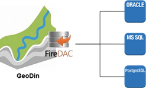
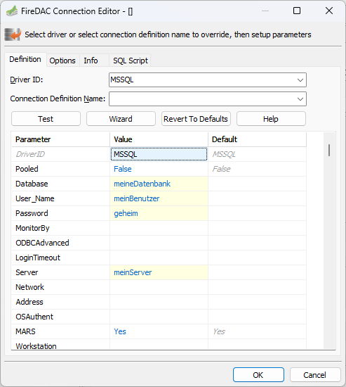
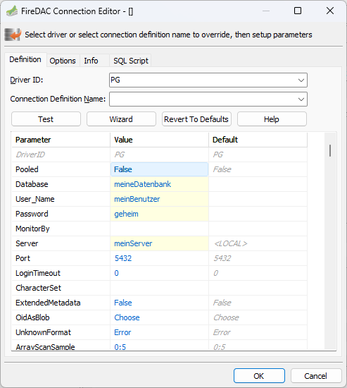
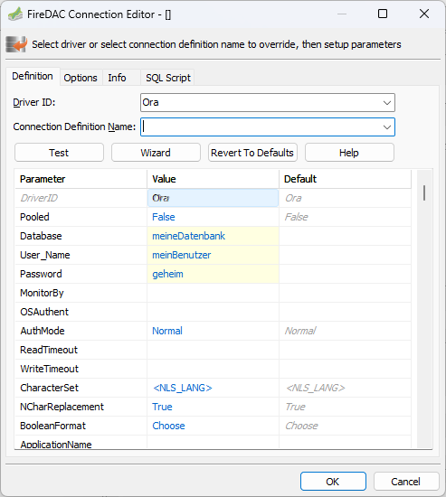
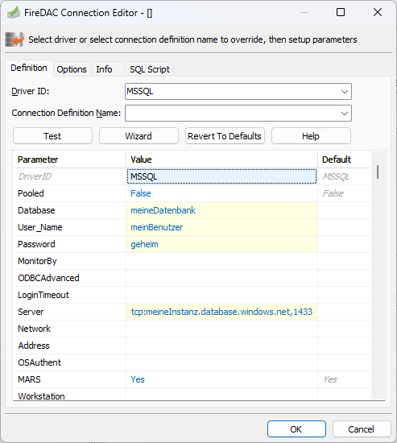

# Installations- und Umgebungs-Anleitung

## 1. Systemvoraussetzungen

**Betriebssystem**: Windows 10/11 64-bit

**Datenbank-Clients oder DLLs 64-bit** (je nach verwendeter Datenbank):

* **MS SQL Server**: SQL Server Native Client oder ODBC-Treiber
* **PostgreSQL**: PostgreSQL ODBC-Treiber (psqlODBC)
* **Oracle**: Oracle Instant Client
* Alternativ können die benötigten DLLs im GeoDin `BIN`-Verzeichnis abgelegt werden
* **MS Access**: Nur für Single-User-Umgebungen und kleinere Projekte empfohlen

## 2. GeoDin Installation

Installieren Sie GeoDin über das bereitgestellte Setup. Wählen Sie zwischen folgenden Optionen:

* **Client-Installation** (Standardinstallation)
* **Netzwerkinstallation** (Installation in einem UNC-Pfad)

### Netzwerkinstallation

Wenn GeoDin von mehreren Benutzerinnen und Benutzern innerhalb eines Netzwerks verwendet wird, empfiehlt es sich, die Software auf einem gemeinsamen Netzwerklaufwerk zu installieren. Dies bietet folgende Vorteile:

* **Zentrale Konfiguration**: Alle greifen auf dieselbe Konfigurationsdatei zu (z. B. Datenbankverbindungen, Wörterbücher, GeoDin-Layouts), was Inkonsistenzen vermeidet.
* **Einfachere Wartung**: Updates und Änderungen müssen nur einmal durchgeführt werden.
* **Reduzierter Verwaltungsaufwand**: Keine separate Installation auf jedem Client-PC erforderlich.
* **Zugriffsrechte steuerbar**: Über das Dateisystem des Netzwerks (z. B. NTFS-Berechtigungen) kann der Zugriff gezielt gesteuert werden.

<figure><figcaption></figcaption></figure>

***

Wenn Sie eine Empfehlung für Ihre Anforderungen benötigen, wenden Sie sich bitte an unser **Client Success Team**, um einen Beratungstermin zu vereinbaren.

## 3. GeoDin Datenbanken

GeoDin nutzt für die Verbindung zu Datenbanken **FireDAC** (Fire Data Access Components). Dies ist ein universelles Framework, das es ermöglicht, auf eine Vielzahl von Datenbanken zuzugreifen – lokal, remote oder in der Cloud.

<figure><figcaption></figcaption></figure>

#### Beispiele:

**Microsoft SQL Server**

```ini
DriverID=MSSQL
Server=meinServer
Database=meineDatenbank

Für SQL-Nutzer:
User_Name=meinBenutzer 
Password=geheim

Für Windows-Authentifizierung:
OSAuthent=Yes

Verbindungszeichenfolge:
Database=meineDatenbank;Server=meinServer;User_Name=meinBenutzer;Password=geheim;DriverID=MSSQL
```

<figure><figcaption></figcaption></figure>

**PostgreSQL**

```ini
DriverID=PG 
Server=meinServer
Database=meineDatenbank
Port=5432 
User_Name=meinBenutzer
Password=geheim
Verbindungszeichenfolge:
Server=meinServer;Database=meineDatenbank;User_Name=meinBenutzer;Password=geheim;DriverID=PG

```

<figure><figcaption></figcaption></figure>

**Oracle**

```ini
DriverID=Ora 
Server=meinServer
Database=meineDatenbank
User_Name=meinBenutzer
Password=geheim

Verbindungszeichenfolge:
Database=meineDatenbank;User_Name=meinBenutzer;Password=geheim;DriverID=Ora

```

<figure><figcaption></figcaption></figure>

**Azure Cloud (Microsoft SQL Server)**

```ini
DriverID=MSSQL 
Server= tcp:meineInstanz.database.windows.net,1433
Database=meineDatenbank
Für SQL-Nutzer:
User_Name=meinBenutzer 
Password=geheim

Für Windows-Authentifizierung:
OSAuthent=Yes

Für verschlüsselte Verbindungen:
Encrypt=Yes

Verbindungszeichenfolge:
Database=meineDatenbank;User_Name=meinBenutzer;Password=geheim;Server=tcp:meineInstanz.database.windows.net,1433;Encrypt=Yes;DriverID=MSSQL


```

<figure><figcaption></figcaption></figure>
