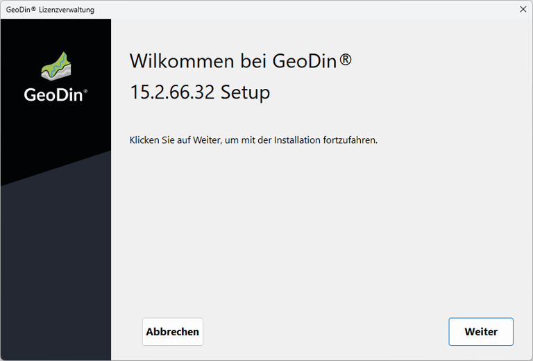

# Lizenzdienst (nur für GeoDin® Professional)

## GeoDin® Professional Lizenzierungssystem (Netzwerklizenz)

**Aktivierungsserver:**\
GeoDin® stellt Ihnen Ihre neuen oder aktualisierten Lizenzen über unseren Aktivierungsserver zur Verfügung.

**Lizenzservice:**\
Der Lizenzservice wird in einem Netzwerk auf einem Server (Professional-Lizenz) als Dienst installiert und nimmt die Lizenzanfragen von GeoDin® entgegen.

**Lizenzmanager:**\
Sie können Ihre GeoDin®-Lizenzen über den Lizenzmanager (Web-App des Lizenzdienstes) verwalten. Dies umfasst die Aktivierung und Aktualisierung Ihrer GeoDin®-Lizenzen sowie die Anzeige aktiver Nutzer.

<figure><figcaption>
<strong>GeoDin® Professional Lizenzierungssystem (Netzwerkinstallation)</strong>
</figcaption></figure>

## Allgemeine Informationen & Anforderungen

Für die Lizenzierung von GeoDin ist die Installation des GeoDin-Lizenzdienstes auf einem Server (Netzwerklizenz) erforderlich.\
\
Der GeoDin® Lizenzdienst wird als Dienst ohne grafische Benutzeroberfläche installiert, indem Sie die `LicenceServerRegistration.exe` ausführen, die [hier ](https://download.geodin.com/geodin/geodinlicenceservice/LicenceServerRegistration.exe)zum Download verfügbar ist.

<figure><figcaption>
GeoDin Lizenzdienst Installer
</figcaption></figure>

## Lizenzvereinbarung

Bitte lesen Sie die Lizenzvereinbarung sorgfältig durch und fahren Sie fort, indem Sie diese akzeptieren.

<figure><figcaption>
Lizenzvereinbarung
</figcaption></figure>

## Installationspfad

Geben Sie an, in welchem Ordner Sie den GeoDin® Lizenzdienst installieren möchten.

<figure><figcaption>
Installationspfad
</figcaption></figure>

## Einstellungen für den Lizenzdienst

In diesem Schritt können Sie die TCP-Port- und Passwort-Einstellungen für den Lizenzdienst konfigurieren.

Lizenzanfragen von GeoDin werden vom Lizenzdienst über **Port 8085** entgegengenommen. Über den **Admin-Port 8086** stellt der Lizenzservice eine HTTP-Verbindung zum Lizenzmanager her. Mit Hilfe des Lizenzmanagers können Lizenzen über eine Weboberfläche verwaltet, aktiviert und aktualisiert werden. \
\
Das Admin-Passwort dient zur Anmeldung am Lizenzmanager (Hinweis: Sie werden nur nach dem Pass-wort gefragt, wenn es vom Standardpasswort abweicht). Diese Einstellungen werden in der Datei `geodinlicenseserver.ini` im [gewählten Installationspfad](https://docs.geodin.com/geodin-desktop/de/installation/lizenzdienst-nur-fur-geodin-r-professional#installationspfad) gespeichert.

<figure><figcaption>
Lizenzdiensteinstellungen
</figcaption></figure>

## Zusammenfassung

Die von Ihnen vorgenommenen Installationseinstellungen für den GeoDin® Lizenzdienst werden hier für Sie zusammengefasst.\
\
Klicken Sie auf `<Weiter>`, um fortzufahren.

<figure><figcaption>
Zusammenfassung
</figcaption></figure>

## Installation

Das Installationsprogramm kopiert Dateien in die ausgewählten Installationsverzeichnisse.

Bitte warten Sie, bis der Vorgang abgeschlossen ist.

<figure><figcaption>
Installationsfortschritt
</figcaption></figure>

## Lizenz einrichten

Die Installation ist nun abgeschlossen. Um GeoDin verwenden zu können, müssen Sie jedoch zusätzlich Ihre Lizenz-Seriennummer über die Weboberfläche (Lizenzmanager) des GeoDin-Lizenzdienstes aktivieren.

Klicken Sie auf `<Beenden>`, um das Installationsprogramm zu verlassen und starten Sie die GeoDin-Lizenzverwaltung über die während der Installation erstellte Desktop-Verknüpfung `GeoDin Licence Management` .

Wenn Sie das [Passwort geändert haben](https://docs.geodin.com/geodin-desktop/de/installation/lizenzdienst#einstellungen-fur-den-lizenzdienst), werden Sie zunächst aufgefordert, sich mit diesem Passwort anzumelden.

<figure><figcaption>
Erfolgreiche Installation
</figcaption></figure>

## Geben Sie Ihre Seriennummer ein

Sie werden nun aufgefordert, Ihre Lizenz-Seriennummer im Lizenzverwaltungs-Browserfenster einzugeben. \
\
Geben Sie die Seriennummer der Lizenz ein, die Sie per E-Mail erhalten haben, und bestätigen Sie Ihre Eingabe mit der Schaltfläche `<Lizenz aktivieren>`.

<figure><figcaption>
Eingabe der Seriennummer
</figcaption></figure>

## Lizenzübersicht

Nachdem Sie Ihre Lizenz aktiviert haben, wird sie im Lizenzverwaltungsfenster angezeigt.\
\
Unter dem Menüpunkt **Lizenzinformationen** werden die Seriennummer, die Version und das Ablaufdatum Ihrer Lizenz angezeigt.\
\
Informationen zur Version und den Einstellungen des Lizenzdienstes selbst können unter dem Menüpunkt **Lizenzserver** eingesehen werden.\
\
Die aktuellen Benutzer der Lizenz sind unter dem Menüpunkt **User Status** aufgeführt.

<figure><figcaption>
Lizenzverwaltung
</figcaption></figure>

## Client-Zugriff auf eine Netzwerklizenz

Um von einem Client aus eine Verbindung zu einer GeoDin®-Netzwerklizenz herzustellen, folgen Sie bitte den folgenden [Schritten](https://docs.geodin.com/geodin-desktop/de/installation/lizenzierung#zugriff-auf-eine-professionelle-lizenz).\
\
Wenn ein Benutzer den GeoDin®-Client zum ersten Mal startet, öffnet sich der Lizenzaktivierungsassistent, der es Ihnen ermöglicht, sich mit Ihrer professionellen Lizenz zu verbinden.\
Klicken Sie auf `<Weiter>`, um fortzufahren.

<figure><figcaption>
Lizenzaktivierungsassistent
</figcaption></figure>

## Zugriff auf eine professionelle Lizenz

Bitte wählen Sie 'Meine Organisation oder Hochschule besitzt eine Lizenz' aus.

Klicken Sie auf `<Weiter>`, um fortzufahren.

<figure><figcaption>
Professionelle Lizenz
</figcaption></figure>

## Eingabe der IP-Adresse oder des Servernamens und Ports

Ihre Organisation oder Ihre Hochschule wird Ihnen die IP-Adresse oder den Servernamen und den Port zur Verfügung stellen, an dem der GeoDin®-Lizenzdienst konfiguriert ist und die GeoDin®-Professional-Lizenz gespeichert ist. Bitte geben Sie die bereitgestellte IP-Adresse oder den Servernamen und den Port ein. Die Verbindung zum GeoDin®-Lizenzserver wird automatisch hergestellt.&#x20;

Wenn die Verbindung erfolgreich ist, klicken Sie bitte auf `<Weiter>`, um fortzufahren.

<figure><figcaption>
Netzwerkserververbindung
</figcaption></figure>

## Lizenz akzeptiert

Falls Ihre Lizenz gültig ist, erhalten Sie eine Aktivierungsbestätigung. Klicken Sie auf `<Beenden>`, um GeoDin® zu verwenden.

<figure><figcaption>
Lizenzaktivierungsassistent beenden
</figcaption></figure>
