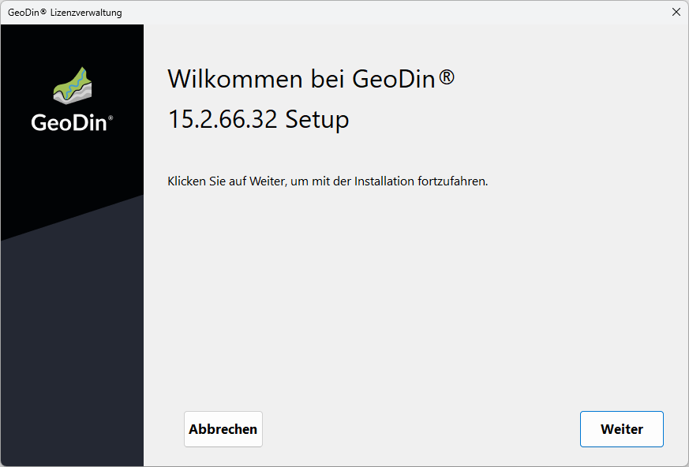
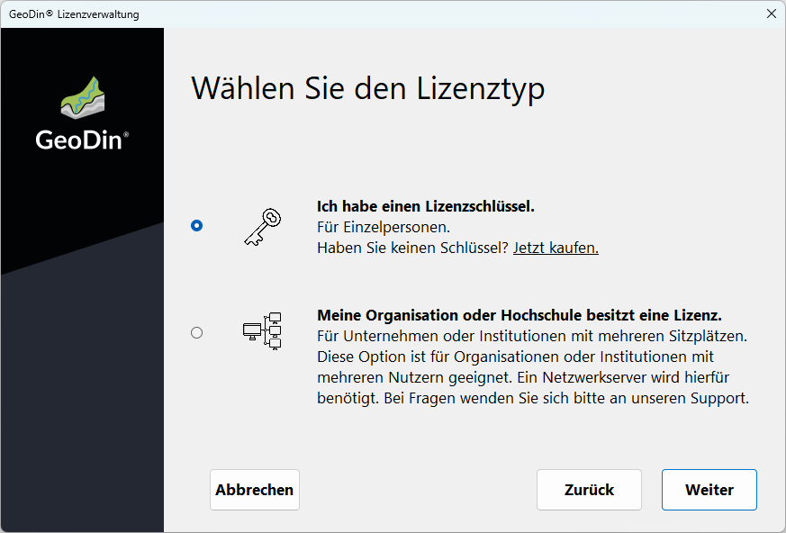
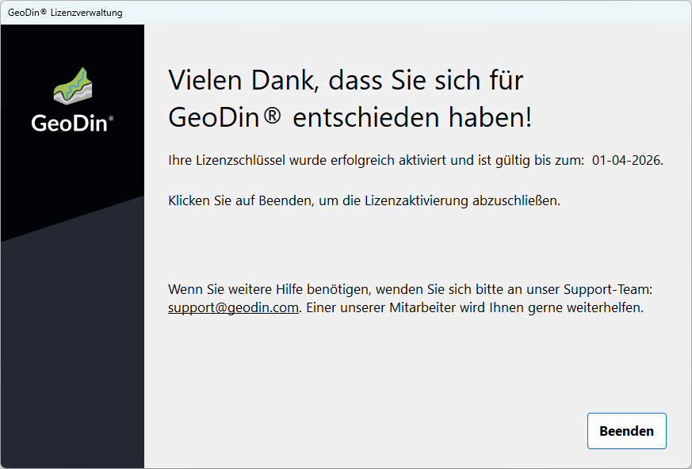
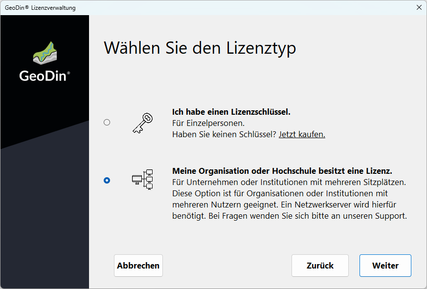

# Lizenzierung

## Lizenzaktivierungsassistent

Wenn Sie GeoDin® zum ersten Mal starten, öffnet sich die Lizenzverwaltung, die es Ihnen ermöglicht, Ihre individuelle Lizenz einzugeben oder sich mit Ihrer professionellen Lizenz zu verbinden.\
Klicken Sie auf `<Weiter>`, um fortzufahren.

<figure><figcaption>
Lizenzaktivierungsassistent
</figcaption></figure>

## Auswahl der Aktivierung des individuellen Lizenzschlüssels

Wenn Sie eine individuelle Lizenz haben, wählen Sie bitte 'Ich habe einen Lizenzschlüssel'.\
Klicken Sie auf `<Weiter>`, um fortzufahren.

<figure><figcaption>
Einzelplatzlizenz
</figcaption></figure>

## Aktivierung des individuellen Lizenzschlüssels

Um GeoDin® zu aktivieren, geben Sie bitte den Lizenzschlüssel ein, den Sie in Ihrer Bestätigungs-E-Mail erhalten haben.

<figure><figcaption>
Lizenzschlüsselaktivierung
</figcaption></figure>

## Lizenzprüfung

Sobald die Lizenz eingegeben wurde, wird sie validiert. Für diesen Vorgang ist eine Internetverbindung erforderlich. Wenn die Lizenz gültig ist, wird dies bestätigt, und Sie können fortfahren, indem Sie auf `<Weiter>` klicken.\
\
Wenn Sie GeoDin® offline aktivieren möchten oder Ihre Lizenz nicht erkannt wird, kontaktieren Sie uns bitte unter support@geodin.com.

<figure><figcaption>
Prüfung des Lizenzschlüssels
</figcaption></figure>

## Lizenz akzeptiert

Falls Ihre Lizenz gültig ist, erhalten Sie eine Aktivierungsbestätigung.\
Klicken Sie auf `<Beenden>`, um GeoDin® zu verwenden.

<figure><figcaption>
Lizenzverwaltung beenden
</figcaption></figure>

## Zugriff auf eine professionelle Lizenz

Wenn Ihre Organisation oder Ihre Hochschule über eine professionelle Lizenz verfügt, die auf einem Server gespeichert ist, wählen Sie bitte 'Meine Organisation oder Hochschule besitzt eine Lizenz' aus.\
Klicken Sie auf `<Weiter>`, um fortzufahren.

<figure><figcaption>
Professionelle Lizenz
</figcaption></figure>

## Eingabe der IP-Adresse oder des Servernamens und Ports

Ihre Organisation oder Ihre Hochschule wird Ihnen die IP-Adresse oder den Servernamen und den Port zur Verfügung stellen, an dem der GeoDin®-Lizenzdienst konfiguriert ist und die GeoDin®-Professional-Lizenz gespeichert ist.\
\
Bitte geben Sie die bereitgestellte IP-Adresse oder den Servernamen und den Port ein. \
\
Die Verbindung zum GeoDin®-Lizenzserver wird automatisch hergestellt.\
\
Wenn die Verbindung erfolgreich ist, klicken Sie bitte auf `<Weiter>`, um fortzufahren.

<figure><figcaption>
Netzwerkserververbindung
</figcaption></figure>

## Lizenz akzeptiert

Falls Ihre Lizenz gültig ist, erhalten Sie eine Aktivierungsbestätigung.\
Klicken Sie auf `<Beenden>`, um GeoDin® zu verwenden.

<figure><figcaption>
Lizenzaktivierungsassistent beenden
</figcaption></figure>
