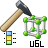

# Ground Description Standards

### Ground descriptions standards

This chapter describes the configuration and the technical background of the collection of ground types according to different collection standards and with variable properties.

### Configuration

For the configuration of ground types the method **"Edit configuration"** is available at the node   **"System configuration"** in the System tab of the GeoDin object manager:

_**Tip:**_ _The method is only available, if the following conditions are fullfilled:_

1\. The editing of settings on the system side may not be restricted (for example by the GeoDin licence or the settings of the GeoDin administrator).

2\. The configuration file GeoDin.ini contains the option "EditUGLConfig=true" in the system section.

After starting the method the chosen configuration file is selected (file type \*.ugl = universal ground description layers) and editing starts.

### Standards

Edit here the list of available standards. A [Coding standard](ground-description-standards.md) defines the different ground types and details of the entry and output of contents.

Where it is possible to define and edit any number of elements, they are displayed with their names in a list. This can be for example series of a data sequences, columns of a report element, lists of layout file names etc. Simultaneously these entries appear in the tree view of the object properties in the selected order. To add, remove and rearrange entries of the list on the right side the following icons are available:

**New**

Using this icon, entries can be added to the list.

**Duplicate**

Use this icon to create a copy of the selected entry. The new entry is added at the end of the list and selected automatically.

**Delete**

Using this icon, marked entries can be removed from the list.

**Move selected entry up**

Using this icon, entries can be moved up in the list. Moving entries is also possible using drag & drop.

**Move selected entry down**

Using this icon, entries can be moved down in the list. Moving entries is also possible using drag & drop.

**Edit without refresh**

Editing the entries of a list can occasionally cause long processing. So for example moving a series or column definition in the list can take relatively long, depending on the basic data material, because sometimes many pages are affected.

Using this icon the list can be edited without actualization. Editing the list can be abandoned with the cross or with the tick mark.

**Double-click an entry of the list**

Closes the list and changes in the tree view of the object properties to the particular entry, so that its properties can be edited.

### Coding standard

A standard is mainly defined by the selection of available properties and ground types. In the list of properties, these are managed, for example the properties "Main ground type", "Compactness of the packing", "Colour" etc. Any number of properties could be defined. A ground type is a compilation of concrete properties, which are necessary to describe a ground type. The translation style sheets control the deviation of a text description of the ground type out of the XML structure of a ground type.

Each standard contains a unique ID, which has to be selected in the entry field GUID. Additionally a name is given, which is displayed during the data management. The dictionary to select the kind of interbedding has to be selected. After creating new standards and selection of a dictionary name an empty dictionary can be added with the icon **Create**. Editing is possible in the branch dictionaries in the GeoDin configuration.

_**Important:**_ _During the collection of ground types in the GeoDin database only the GUIDs of standards, ground types and properties are saved and not the name. Because of this GUIDs that already have been used for the data collection may NOT be changed, because it would lead to a misinterpretation of existing data._

### Properties

Define here the properties, which should be used to describe the different soil types. The possible properties are defined directly in the [Ground type](ground-description-standards.md).

Where it is possible to define and edit any number of elements, they are displayed with their names in a list. This can be for example series of a data sequences, columns of a report element, lists of layout file names etc. Simultaneously these entries appear in the tree view of the object properties in the selected order. To add, remove and rearrange entries of the list on the right side the following icons are available:

**New**

Using this icon, entries can be added to the list.

**Duplicate**

Use this icon to create a copy of the selected entry. The new entry is added at the end of the list and selected automatically.

**Delete**

Using this icon, marked entries can be removed from the list.

**Move selected entry up**

Using this icon, entries can be moved up in the list. Moving entries is also possible using drag & drop.

**Move selected entry down**

Using this icon, entries can be moved down in the list. Moving entries is also possible using drag & drop.

**Edit without refresh**

Editing the entries of a list can occasionally cause long processing. So for example moving a series or column definition in the list can take relatively long, depending on the basic data material, because sometimes many pages are affected.

Using this icon the list can be edited without actualization. Editing the list can be abandoned with the cross or with the tick mark.

**Double-click an entry of the list**

Closes the list and changes in the tree view of the object properties to the particular entry, so that its properties can be edited.

### Property

A property is defined by its unique ID (GUID) and by its name. The GUIDs of the properties have to be unique in one standard. Each attribute is related to a precise dictionary, which can be created (e.g. after the creation of the attribute) using the icon **Create**. The dictionary can be edited in GeoDin. Select also which separators, should be used when entering the property.

_**Important:**_ _During the collection of ground types in the GeoDin database only the GUIDs of standards, ground types and properties are saved and not the name. Because of this GUIDs that already have been used for the data collection may NOT be changed, because it would lead to a misinterpretation of existing data._

### Ground types

Define here the available ground types in the input norm. Because the different ground types are described by different properties, a ground type is mainly defined by a list of properties, which should be used. In a ground type only those properties can be used, which were created in the list of the **Properties**.

Where it is possible to define and edit any number of elements, they are displayed with their names in a list. This can be for example series of a data sequences, columns of a report element, lists of layout file names etc. Simultaneously these entries appear in the tree view of the object properties in the selected order. To add, remove and rearrange entries of the list on the right side the following icons are available:

**New**

Using this icon, entries can be added to the list.

**Duplicate**

Use this icon to create a copy of the selected entry. The new entry is added at the end of the list and selected automatically.

**Delete**

Using this icon, marked entries can be removed from the list.

**Move selected entry up**

Using this icon, entries can be moved up in the list. Moving entries is also possible using drag & drop.

**Move selected entry down**

Using this icon, entries can be moved down in the list. Moving entries is also possible using drag & drop.

**Edit without refresh**

Editing the entries of a list can occasionally cause long processing. So for example moving a series or column definition in the list can take relatively long, depending on the basic data material, because sometimes many pages are affected.

Using this icon the list can be edited without actualization. Editing the list can be abandoned with the cross or with the tick mark.

**Double-click an entry of the list**

Closes the list and changes in the tree view of the object properties to the particular entry, so that its properties can be edited.

### Ground type

A ground type is described by a defined number of properties. This list is edited in the branch **Properties**. Additionally a ground type gets a unique ID (GUID), which has to be given in a standard, as well as a name and a key.

The labelling instruction controls the name of the ground type during the data collection. As long as no property is entered, the branch of the ground type in the data collection is labelled with the name of the ground type (general name). As data fields for a labelling instruction the GUIDs of a property of a ground type are available. Because of this the labelling macro $1$ will translate the entered content of a ground type property with the GUID = 1 and use it for the labelling of the ground type branch in the data collection.

_**Important:**_ _During the collection of ground types in the GeoDin database only the GUIDs of standards, ground types and properties are saved and not the name. Because of this GUIDs that already have been used for the data collection may NOT be changed, because it would lead to a misinterpretation of existing data._

### Translation style sheets

The translation style sheets control the translation of a GeoDin XML ground type description into a text for the labelling instructions of layers in graphics. For main and sublayers different style sheets are defined.

### Main-layer

The translation style sheets control the translation of a GeoDin XML ground type description into a text for the labelling instructions of layers in graphics. Simply copy the definition of the style sheet in the input field using the clipboard.

### Sub-layer

The translation style sheets control the translation of a GeoDin XML ground type description into a text for the labelling instructions of layers in graphics. Simply copy the definition of the style sheet in the input field using the clipboard.

### Dictionaries

**Hierarchy of dictionaries**

A dictionary for an attribute contains all codes for this property. Depending on the selected ground type only certain codes can be used for the description of the attribute. The selection, which codes are allowed for the description is defined by the tree structure (hierarchy of codes in the dictionary).

Editing the hierarchy is started with clicking on the icon **Hierarchy** in the method **Edit dictionary**.

The basic node of the tree structure is a class node with the name of the dictionary. For each ground type a class node below this basic node has to be created containing the name of the ground type.

While the basic node contains no "class data", a basic node has **obligatorily** to contain the #GeoDinHelpLink:**GUID**5366# of the ground type in the input field "class data".

Below the class node of a ground type any number of node of the type "code" can be entered, which define the code allowed in this ground type. A code of the dictionary can be valid in any number of ground types and therefore appear several times in the tree structure.

Example of a tree structure:

1. Principal soil type Class node Class data = empty
2. Fine grained cohesive soil Class node Class data = 1

\- C Code C

\- M Code M

1. Fine grained cohesionless soil Class node Class data = 2

\- ... Code ...

\- ... Code ...

1. Coarse grained cohesionless soil Class node Class data = 3

-S Code S

-G Code G

-cs Code cs

-f Code f

-me Code me

Without the relation of available codes for a ground type the property cannot be described in the data collection.

**Type lists and syntax check**

Beside the descriptive codes in the dictionary for the syntax control so called type codes have to be defined and each code has to be combined with type information. These type information controls, which code creates transitions (combination of two codes with the minus "-" or plus "+" symbol) and control also which codes may be attributes (describing properties) of other codes.

As an example a dictionary with 5 codes is defined:

S = Sand

G = Gravel

f = fine

m = intermediate

g = coarse

In the simplest case 2 types are enough:

$TYP1 = Property

$TYP2 = Attribute (of a property)

It is now defined for each code, which type of code it is (**Special settings - Tab Types**):

For the codes above this would be:

S = Sand = $TYP1 = Property

G = Gravel = $TYP1 = Property

f = fine = $TYP2 = Attribute

m = intermediate = $TYP2 = Attribute

g = coarse = $TYP3 = Attribute

Additionally it is defined, with which type a code may form a transition (list of transitions) and which types (of codes) may have attributes (list of attributes).

For the codes S and G in the list of transitions the type = Property is entered and in the list of attributes the type = attribute.

For the code f,m and g in the list of attribute the type = attribute is entered and the list of attributes

Syntactically the following dictions are possible:

S(f) = Sand, fine (fine is attribute of sand)

S(f-m) = Sand, fine to intermediate attributes may form transitions

S(g)-G(f) = Sand, coarse to Gravel, fine properties may form transitions and have attributes

The following dictions would not be allowed:

S(G) = Gravel can be no attribute of sand

f(S) = Sand can be no attribute of fine

S(f(m)) = fine cannot be attributed by 'intermediate'

The type list above is a very simple example and demonstrates only the minimum conditions for the syntax test of the parenthesis diction. Practically more complex syntax rules my be necessary, which require more typing of the codes in a dictionary, for example differentiation of the properties after technical or professional points of view to avoid senseless attributions.

### Data model

The complex dynamic structure of the description of ground types with variable properties is saved in a GeoDin database not in a classic table with defined columns, but in a universal table for GeoDin class data.

The table has the following structure:

PRJ\_ID VarChar(6)

LOCID SmallInt

RECID SmallInt

GCLASSID LongInt

GCLASSDATA Blob

The column GCLASSID contains the unique GeoDin class ID (for the class TGClass\_UGL\_LayerData this is the GCLASSID= 561) and the column GCLASSDATA contains the GeoDin class data in packed form (ZIP compressed). The GeoDin class data are stored in the GeoDin class XML structure of TGClass\_UGL\_LayerData:

The classes TGClass\_UGL\_LayerData, TGClass\_UGL\_Groundtype und TGClass\_UGL\_Property contain only the GUIDs of a [Coding standard](ground-description-standards.md), a [Ground type](ground-description-standards.md) or a **Property**. Because of this these GUIDs may not be changed in the **Configuration** after they have been used in the data collection and saving in the GeoDin database.

### Data collection

The data collection of a layer type with ground type descriptions is done in a tree structure of the layer description with the single layers, ground types of the layers and sublayers. The operational elements are equal to the GeoDin standards for the maintenance of open lists of objects.

Depending on the selection of the kind of interbedding a ground type (no interbedding) or minimum 2 or more ground types (in case of interbedding) can be entered for a layer or sublayer.

Depending on the selected ground type different properties can be recorded. If the ground type is changed already entered properties can be lost, if the new ground type does not contain these properties. Here a notification message is displayed and the change of the ground type can be aborted.

To enter properties and their attributes input fields with dictionary search functions are available. To enter attributes in parenthesis faster with the key **Arrow down** on the current cursor position in the input field both parenthesis can be entered:

Previous content: S

Press the button **Arrow down** leads to:

New content: S()

The cursor remains afterwards between the parentheses, so an attribute can be entered at once.

### Layouts

A borehole is displayed in a layout as usual. If interbedding occurs the single ground types are drawn in a horizontal periodic repetition of the different fill patterns. The kind of graphic can be configured in the branch [Interbedding](ground-description-standards.md).

### Samples

The shown list of codes defines the type of samples, for which ground descriptions can be entered. Enter the code in the entry field separated by commas, example:

GS,P,BC

If no list of codes is given, the entry is possible for all sample types.

### Description types

With description types, it is possible to enter several Layer/Sample descriptions for each object. For example "Clark and Walker englisch" and "Clark and Walker spanish" and present them in one or different GeoDin graphics.

_**Warning:**_ _If one description type is defined, then only the description types will be available for data input when chosing the coding standard. The configuration must be available if the database is passed over._

The name is shown together with the standard name when chosing the Coding standard.

The translation stylesheet defines which stylesheet of the standard will be taken. Usally this will be the complete language stylesheets.

The macro is used as an identifier within the graphic. Because of that, each macro must be unique for all standards.
