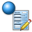
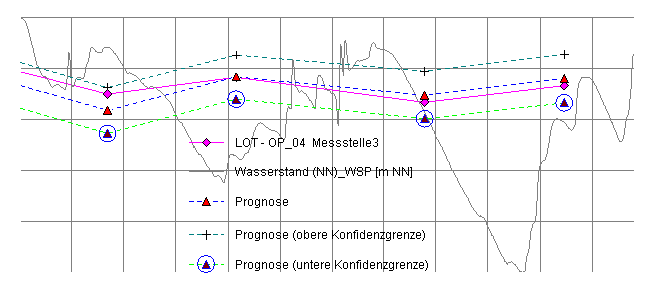

# Regression and Curve Fitting

## Regression and Curve Fitting

#### Presentation options

Optionally in a time line series presentation curves, bars and symbols (in any combination) can be used. If no presentation type is chosen, the series is not displayed (this can be sensible for series, which are used for aggregations).

While selecting the presentation type <**Curve**> optionally an interruption criterion can be selected. Here the time span between two measurements is decisive. This way you can avoid the visual impression of continuous measurements through a connected line. In combination with a symbol or bar diagram in the areas, in which samples were taken only seldom, you receive different graphic presentation types for irregular measurement intervals.

By default, two measuring points are connected by a line in the graph, which is inclined differently at each measurement values. With the option <**Step plot**> presentations can be achieved, which show a measuring point **from** a certain time. For the following measurement, the curve is drawn as a horizontal line and then perpendicularly to the next value. With this type of representation, the option <**drawing till end of diagram**> can be helpful, which continues the line of the series until the end of the timeline. Thus it can be shown that the measured value has not changed since the last measurement

By default data records on a curve are ignored if the chosen parameter has no value (although a time exists) and a line is drawn through these records. This line can be interupted using the option **break line for empty records**.

For the presentation type <**Bar chart**> the bar width can be selected. Like for the presentation type <**Symbols**>, here you can select, whether this should be drawn in the areas, in which samples were only taken seldomly (i.e. for interruptions of the curve).

#### Curve

In this branch no properties can be selected. Choose a subordinate branch, to edit detail properties.

#### Line

Additionally to presenting the series in a curve, bar or symbol any number of calculated (horizontal) lines can be added to a series.

Here three statistic parameters **Minimum**, **Mean value**, **Maximum** and **Median** are available, which are calculated basing on measurement values. Additionally numeric values of the Object data can be displayed. The selection is done in the drop down menu **"Calculation type"**. By selecting the type Object data in the underlying input field the data field can be chosen, which contains the numeric value.

By choosing the statistic parameters you select, whether here only the **Values of the displayed time interval** or **All measurement values** of the measurement point (not depending on the time interval displayed in the diagram) should be used.

A line or outline is displayed in the chosen Color and Line type. To select a color, which is not available in the drop down menu, click in the list on the first entry **"Individually"**. In the color dialogue you can adjust a new color.

The line thickness can be chosen in mm or pixels. The selection should be done in mm by preference. In this case the thickness of the lines in the preview is not equal to the print output and not depending on the used print resolution. The selection of a line thickness in pixels is only suitable for graphs, which are only viewed on the screen.

#### Drawing type

Selection of the presentation in graphic (Curve, Bar chart, Symbols and Curve + Symbols) or tabular form (Table) of the single measurement values.

The presentation type **Curve** starts with the first and ends with the last measured value. The nodes of the curve characterize a measurement point (measurement value in a certain depth).

Using the presentation type **Bar chart** the values characterize a measurement sector (interval), so that the first value is valid for the section from 0,00m to the first measurement value.

#### bar / curve

The option -Close line to axis- is illustrated in the following graph. In the left hand graph the option is deactivated, the surrounding line of the bar graph is not connected with the 0-axis at the starting and ending point.

The presentation of a curve can optionally be interrupted in not investigated areas. Here a value for the sector length, from which the area is not investigated, is necessary. A general adjusting possibility of this option for all series is available in the **Presentation options**.

The possibility to colorize the view using a diagram as legend is described in detail in the chapter **color coding**.

#### Table

The tabular presentation of a single measurement value as a text in a certain depth is possible as a combination with a curve or a bar chart and also as a pure table. For this choose the option **-Show individual values-**.

Is the option -Show values = 0- deactivated, all individual values that equal zero are counted as fault values and not labeled, otherwise these values are also displayed.

The option -Interpret values < 0- causes a presentation of the measurement values after the following rules:

Measurement value > 0 Value is labeled normally

Measurement value < 0 (except -88 und -99) Labeled as \<data sequence value

Measurement value = 0 Labeled with n.i. = not investigated

Measurement value = -88 Labeled with n.t. = not traceable

Measurement value = -99 Labeled with n.f. = not found

In case the measurement value is =0, the values are only labeled with n.i., if the option -Show values = 0- is activated.

For the presentation of the measurement values as text also the Font and the type of Intermediate lines can be adjusted.

#### color coding

Beside the fixed colorization of a curve or bar graph with a fixed signature and color, these presentations can be colored using a legend depending on the complex conditions.

Condition for this is either:

the presence of a graphic element measurement value graphic as "supplier" of the legend

or

the presence of a measurement series in the object data, which contains RGB colors for the presentation.

**Using a measurement value graphic**

The method to define areas in diagrams is described in chapter **Surfaces**. Select the option -Using diagram- and then chosen diagram in the list. Tip: The list contains only diagrams, which have received a [Measurement value graphic](../../data-visualization/layouts/measurement-value-graphics.md).

**Using a color value measurement series (RGB)**

Chose this option, if the actual object contains an already calculated series with RGB-values. Select the chosen series. The way to calculate data sequence series is described in chapter [Calculating sequences](../../data-collection/import/data-sequences.md)

#### Measurement values

**Requirements**

GeoDin organizes objects spatially. These are point objects with or without a depth value. At these objects measurements can be made. In order to use GeoDin to collect such data, measurement points need to be defined in the general data. Usually filters and sample intervals are used as measurement points. Also the object itself can be defined as a measurement point. In the GeoDin object manager measurement points are shown by three blue spheres.

GeoDin Demo Project

Object

All objects

General borehole log

Measurement point

filters

upper piezometer: (4.3-6.3m)

lower piezometer (7.8-8.7m)

samples

BH01: (1-7m)

BH01: (4-5m)

**Terminology**

The following hierarchy is used in the measurement point organization to relate a single measured value to a measurement object of the measurement point. There are the following different types:

**Measurement point type**

The measurement point type defines, what type of object it is. These can be either with or without a vertical component. An example of a measurement point with a vertical component is a borehole. A borehole can be the measurement point itself (e.g. where the whole length is sampled) or other measurement point types can be associated with it (discrete samples at various intervals over the length of the borehole). Examples of point samples (i.e. without a vertical component) are surface water or climate measuring stations.

**Data type**

Chemical investigations can be done for several objects for each type of measurement point. For these combinations data types are defined. For example at a groundwater well the water quality can be investigated or flow rates measured. For each case there is a data type. Each data type can be assigned to several measurement point types. So the data type "groundwater composition" can be entered for a groundwater measurement point as well as for a well. The results are combined in a data type table, although the data for each measurement point are distinct from one another.

**Chemical group**

Because the number of individual parameters within a data type can reach large amounts, the parameters are subdivided into chemical groups to allow a better overview. Each group is distinguished by a similarity in the chemical parameters or descriptive characteristics and may have up to 20 parameters.

**Parameter**

A parameter is an individual measurement described by a name, a field identification and a unit

**Query**

Queries are used within projects or databases to interrogate data. They define the amount and type of data from which the results are derived.

**Special values**

GeoDin organizes measurement values as numerical entries. Hence values below a detection limit cannot be saved as the character „<". In such cases a negative detection limit is entered (e.g. "-1"). These values are ignored by statistical analyses. If the detection limit is unknown (e.g. old data) the value"-88" is used. If the value is not detectable then"-99" should be entered:

***

Entry Description

-XX beneath detection limit (XX = detection limit) -88 beneath detection limit (detection limit value unknown)

-99 not detectable

\------- ---------------------------------------------------------

#### Measurement data

If an object is selected in the GeoDin Object Manager, for which measurement values can be entered, the method   **"Measurement value management"** is available.

The main elements of the measurement value editor are:

A complex **Data sheet**, the **Top tool bar**, the **Right tool bar** and the status bar.

#### Data sheet

The database grid shows the available measurement values. Depending on the object type definition and database configuration, one or more data types may be used for an individual measurement point. Each data type has its own database sheet - you can move between them using Ctrl+Tab, or just click the appropriate sheet.

Each data type has **"Measurement program"** and **"View"** settings. At the bottom of the grid there are small tabs with **"Parameter groups"** (containing the individual parameters), **"Diagrams and analysis"** and **"Additional measurement information"**.

The basic use of the data input grid as well as the management of views is described in the chapter [Using the data entry grid](../../navigating-the-geodin-workspace/measurement-values/working-with-measurement-data.md).

The parameter of a data type are arranged in so-called parameter groups. This option an be shown as a tab under the data entry grid, where the parameter columns are also displayed in groups. With the option turned off, this ordering is ignored and all data type parameters are shown. The number of displayed parameters can be further restricted by the choice of **"Measurement program"** which are a definable selection of named parameters that can be created for data types in the [Measurement program](../../navigating-the-geodin-workspace/measurement-values/working-with-measurement-data.md). In addition to the current measurement program there are the collections **"All parameters"** (no parameter restrictions) and **"Used parameters"** (display of parameters with values in the database). A further way to customize the display in the number and order of parameters is the use of the top left button to select the columns and moving the columns with the mouse.

#### Additional measurement information

_**ATTENTION:**_ _Additional data for a measured value can only be attributed to an existing measured value. If additional information is entered although no measured value is available, it will not be included in the current data set. If an attributed measured value is deleted, its additional information is also removed._

**Additional information - Measurement value**

By selecting this option additional information to the actual measurement value is available. For each measurement value information about the method of investigation, the used unit and the appropriate detection limits can be stored.

**•** Additional character

Alternative to recording the negative value instead of a measurement value below the detection limit also the additional symbol "<" can be entered. At all places in GeoDin where the values below the detection limit are treated different, both methods of displaying values below the detection limit are considered equally.

In the measurement value editor a record can be visualized by a colored mark of the particular value (**Display options**).

**•** Method

From a list of available examination methods the one the actual parameter was detected with can be chosen ([Investigation method](../../navigating-the-geodin-workspace/object-types/geotechnical-investigation-en-iso-22475.md)).

**•** Detection limit

The detection limit of the investigation method during the examination of the parameter can be entered.

**Laboratory information**

If the option Additional measurement specifications was activated during the creation of the current data type, any parameter can be added information about the laboratory analysis (**Properties**).

Using this information is sensible mainly for management of the chemical parameters, which require detailed information about the method of analysis. This information should be used for hydrochemical not for hydrodynamic (waterlevels) data.

On this side the laboratory information is stored:

1. Laboratory

Information about the analyzing laboratory ([Investigation method](../../navigating-the-geodin-workspace/object-types/geotechnical-investigation-en-iso-22475.md))

1. Sample number

Number of the sample in the laboratory

1. Detection limit

Detection limit of the used analyzing method

1. Confidence interval

Confidence interval of the investigated measurement value (+/- most reasonable fluctuation range)

1. Matrix

Matrix used for the sample investigation ([Investigation method](../../navigating-the-geodin-workspace/object-types/geotechnical-investigation-en-iso-22475.md)).

1. Extraction

Method of extraction

1. Date und time

Time of the measurement in the laboratory

1. Plausibility

Information about the plausibility of the measurement value

Auf der Seite der Ergänzungen werden verwaltet:

1. Sample preparation

Information about the preparation of the sample for the laboratory analysis

1. Reference to the result

Reference to the result

1. Interpretation

Interpretation of the measured value

#### Top tool bar

The top toolbar (default position - it may be moved elsewhere in the window) offers general editing functions:

**Start editing / Stop editing**

If the icon is activated (highlighted in light gray), table entries can be edited.

When inactive (i.e. not "pressed down") all the table fields are gray and cannot be edited.

The edit modus stays active until the icon is deactivated or the icon **Cancel edits** is clicked. Data are saved by moving from one row to another, by deactivating the edit modus, by changing from one data type to another, by selecting another object in the GeoDin Object Manager and by closing the editor.

**Save**

The current data set (row) in the table is saved.

**Cancel edits**

Data set editing is stopped and changes made in the current data set are undone (back to the last time saved). The editor is then placed in the non-editing mode by default.

**Load again**

Data are reloaded. Changes to the current dataset are first saved and then the grid is refreshed. This feature is especially useful to view changes made in a data set.

**Cut, Copy, Paste**

Clipboard functions (the key sequences **Ctrl + X**, **Ctrl + C** and **Ctrl + V** are available).

#### Right tool bar

The second menu strip offers functions for the special editing, navigation and changing settings. This menu strip can also be repositioned (by default it is on the right hand side).

#### Formula

As an alternative to presenting the measurement values in grid form you may view the current data set in a mask. At the top of the mask the general sample data (Name, Date, Time) and the group are displayed. Below the individual parameters for the current data set are listed in rows. For each parameter the name, measurement value, unit, detection limit and investigation method are shown. Name and unit are not editable.\
\
The contents of a data set can be saved as a simple text file (which can be subsequently loaded). By pressing the **OK** button the mask contents are saved to the data set - by pressing **Cancel** the contents are discarded. Optionally the short field name can be used for the parameter column.

#### Navigation

With the navigation arrows you can move around the table row-wise to the first, previous, next and last row (from top to bottom).

#### Location point link

Each data set is internally linked to a measurement point. This classification relationship can be changed in the measurement editor. If opened by clicking the icon, a list of all objects in the current group or query is shown.

After choosing a measurement point and the method (**Move** updates the classification, so that in the original object the measurement values do no longer exist; **Copy** duplicates the measurement values) reclassification is the carried out by clicking **OK**. Reload the object to see this displayed.

If several measurement points are selected when the reclassification is carried out, all these measurement points are reclassified.

#### Insert line

An empty data set is inserted above the current row. After entering data and reloading the view the data set is sorted in the correct row position.

#### Combine data sets

With many data sets you may encounter identical sample names, dates and times, although the contents (measured values) are different. This can occur when different laboratories have performed different analyses on the same samples and the values were imported into your database separately. In case such data sets belong together they may be combined. Upon starting this function the data sets are analyzed in the measurement value editor and a list is generated for those data sets, which can be combined. There is an option to include the sample name too.

If a data set is to be excluded, then it can be removed from the list by clicking on the icon.

By choosing **OK** the data sets will be combined.

_**Attention:**_ _If parameters are present in several data sets with different values, then the data sets will not be combined. If the values are identical however then the data sets will be combined._

#### Remove line

The current row will be deleted from the database after confirming a query. _WARNING:_\*\* _This action cannot be undone! You may delete several data sets using the keyborad shortcut Ctrl+Del._

#### Display options

Using these options you may control how measurement values are displayed to reflect their contents.

**Frames**

-Detection limit-

By activating this option all cells containing values below the detection limit (negative values for concentration) are displayed with a blue frame.

**Type**

Green, blue and red are available for use with a logical expression (short parameter name and comparison). The comparison can be "<", "=" or ">". The compared value must be a number. You may also influence the font style by using the "@" character with one (or a combination of) of the following four letters:

B bold

U underlined

I italics

S strike-through

The letters can be combined. For example the term "NO3>20@BI" in the color red results that all values for nitrate that exceed the value 20 are displayed in red, bold and serif.

An expression may contain more than one command if a semi-colon ";" is used to separate them (for example: "CL>50; NO3>10@BI"). Hence it is relatively simple for a user to set up a color scheme for use during data entry.

#### Input options

To support the data entry two options are available.

**Quick entry**

One activates this function by setting the start date and the time interval. As long as this option is active for each new data set the time interval of the starting date will be added incrementally.

**Datensatz-Vorgaben"no settings"**

A new empty data record is created.

**"Standard settings"**

This option allows presets for every parameter to be defined in a mask.

**"Use last data record"**

This option takes values from the last data record for the new one, where the parameter option \<Use last value> is available. See **Edit parameter**

**"Use last data record (same sample)"**

In addition to copying the same parameter contents, the new data set will be assigned to the same sample as the last data record.

#### Calculation

This function allows you to recalculate values for entire table in the measurement editor. You have two options:

**-Available formulae-**

1. Execute one or more formulae from the predefined [Formulas](../formulas/formula-basics.md)of the data type, found in the system configuration.
2. If you check the box \[only activate formulae] you will only see formulae which are set to active in the [General formulas](../formulas/formula-basics.md) in the system configuration. Note: These formulae will always be executed for the selected data records when using the Calculate function. This is because an update of a data record triggers the calculation of active formulas.
3. Formulae are marked with a red symbol instead of a black one if the target field of the formulas is always meant to be overwritten.
4. Formulae can be sorted by clicking on the actual column title, e. g. name or target field. _**Note:**_ _the execution order of the selected formulae will be the same as it has been set in the data type settings of the system configuration!_ \*\*This is important, especially for interdependent formulae.

**-Execute single formulas-**

1. To execute a single formula you may use and change one of the predefined formulas from the [General formulas](../formulas/formula-basics.md) of the system configuration or you define a new formula.
2. To accept a formula just mark it by clicking on the name (you do not have to check the box for this action) and click the button **Accept available marked forumla**. The fields _"Target field:", "Condition:"_ and _"Formula:"_ are automatically filled and can be edited.
3. Alternatively you can edit these fields without using a predefined formula but creating a new formula, which is applied to the target field.

_\[\[Overwrite target]]{.underline}_

For the following calculation you can set the configuration to overwrite existing values. By default the calculation won't overwrite existing fields but calculate results for those fields without values for the corresponding target field.

_\[\[All parameters have values]]{.underline}_

Furthermore you can specify only to execute the calculation if all parameters, which are used in the formula, contain values for the calculation. Therefore the calculation won't be executed for empty data fields (if they are used in the formula).

_**-All visible data records-**_

Choose here whether the calculation is done for all data records listed in the measurement data editor.

_**-All selected data records-**_

Choose this option to execute the calculation only for the data records (rows) selected in the measurement data editor.

**Definition of formulas**

A formula is defined as a string of characters (similar to a text macro definition) and contains mathematical operators for calculating a result.

For example: $DAT.PAR1$ \* 100

The characters inside the $-signs relate to a GeoDin data field. The following operators can be used:

***

\+ Addition - Subtraction \* Multiplication / Division SQR (x) Square of x SQRT (x) Square root of x LN (x) Natural logarithm of x EXP (x) Potency of x (e to the power of x) SIN (x) Sinus of x COS (x) Cosinus of x TAN (x) Tangent of X ARCTAN (x) Arctangent of X COTAN (x) Cotangent of X ABS (x) Absolute value of X

***

(x) stands for the table column of GeoDin (e.g. $DAT:PAR1$)

Empty spaces can be contained in the formulas. Fixed number values (100 in the example above), can be entered directly in the formula.

**Use of conditions**

In addition to the mathematical operators, special syntax constructions can be used to take a large number of special cases into consideration. For a formula, a condition can be defined in which the formula is executed. A condition is an expression which has two possible results: TRUE or FALSE. Several expressions can be combined using the logical operators AND and OR. The definition of the data type abbreviation is always necessary (e.g.: $WAS:NA$).

_**Note:**_

_The formula can be entered directly in the measurement editor after clicking the button_ _or on the system tab under Data types-> Data type settings->Formulas_ ([General formulas](../formulas/formula-basics.md)).

**Example for simple conditionExample:**

_Destination:_ WAS:NA\_CALC

_Condition:_ $WAS:MG$>3

_Formula:_ $WAS:NA$/2

The target parameter NA\_CALC is calculated if the parameter MG has a value of 3 or higher.

**Example for multiple conditionExample:**

_Destination:_ WAS:NA\_CALC

_Condition:_ $WAS:MG$>3 AND $WAS:CA$<10

_Formula:_ $WAS:NA$/2

The target parameter is calculated, if both the parameter MG has a value greater than three and the parameter CA has a value of less than 10.

**Conditions for changing values**

By using the formatting @O the original value of a data record BEFORE the last change can be recreated in the measurement editor. Hence checking for differences is possible.

**Example:**

_Condition:_ $WAS:PAR1$ - $WAS:PAR1@O$ >10

The condition is true, when the value of PAR1 in the cell is more than ten times the previously entered value.

**Further condition examples**

In a condition, the NULL operator can be used. It defines whether a parameter has a value.

**Example:**

_Destination:_ WAS:NA\_CALC

_Condition:_ $WAS:MG$>3 AND $WAS:CA$=NULL

_Formula:_ $WAS:NA$/2

The target parameter NA\_CALC is calculated by taking half the value of the parameter NA, if the value of the parameter MG exceeds 3 and the parameter CA is empty.

If strings are used in a condition, the text has to be included in inverted (or high) commas. Missing inverted commas and mis-spelling are interpreted as non-equal. The spelling of the condition is case sensitive.

**Example:**

_Destination:_ WAS:NA\_CALC

_Condition:_ $BEARBEIT$='Müller'

_Formula:_ $WAS:NA$/2

The target parameter NA\_CALC is calculated as half of the parameter NA, if the author of the data record has the name Müller.

**Using special rules**

Additionally to the mathematical operators special syntax constructions can be used for the usage of values from the GeoDin tables to take into consideration numerous special cases.

**Special cases in formula syntaxDetection Limits**

Detection limits present a special case. These are by definition negative values (e.g. -1 for <1). If these values are used without care, false results may be produced, for example when building sums from individual parameters. To do this, a construction in the form of @B(x) within the $-signs must be used, where x is a factor with which the detection limit enters the calculation. For example a detection limit of 5 mg (entered as -5) using the factor 0.5 produces the result 2.5.

**Example:** $WAS:BENZEN@B(0,5)$+$WAS:TOLUEN@B(0,5)$+$WAS:XYLEN@B(0,5)$

In the case above, where values for individual parameters of -5 or -1 are found, the sum calculation uses half of these values.

**Default values**

For certain calculations it may be necessary to work with predefined settings or defaults. When a parameter is either not present or has not been analyzed in a data set, a standard value can be assumed and used for calculation. This is realized by using the construct @D(x) inside the $ signs, whereby x is the predefined default value used when no value is present in the field.

**Example:** VALUE=$ORGANIC@D(10)$/$CLAY@D(25)

The calculated value has the quotients from the organic substances and clay in a soil sample. If no values are present in these fields the default values are used.

**Mean Value**

A mean value is calculated by using the symbols "@M" inside the dollar symbols of a formula. The individual values are separated by ";" and only filled fields can be used.

**Example:** UWDRYMIN=$UWDRYMIN1;UWDRYMIN2;UWDRYMIN3@M$

The result is an average of UWDRYMIN1 to UWDRYMIN3.

**Using a number from a dictionary**

If a dictionary is used, which produces a number when entering a code, this can be used for a calculation. By using the "@R" sign a recode is carried out.

**Example**: CU=($CONE@R$)/SQRT($PEN1;PEN2;PEN3;PEN4;PEN5@M$)

First of all the entry for CONE is replaced by the value from the dictionary. For the values P1 to P5 an average is taken from which the square root is calculated. The value for CONE is then divided by this value.

**Using values from another data type**

Values from one data type can be used in calculating values in other data types. To do this, the code of a data type is followed by a colon. The relationship to a data record in another data type is defined by time. To compare values the date is used in a number of different ways:

***

\[=SMPDATE] or no definition The date must be the same \[<=SMPDATE] The date can be the same or less than \[\<SMPDATE] The date must be less than \[>=SMPDATE] The date can be the same or more than \[\<SMPDATE] The date must be more than

***

**Example**: WASSPNN=$ROK:ROKNN\[<=SMPDATE]$-$WASSPROK$

The water level expressed in meters above sea level is calculated by using a value from the data type ROK (top of piezometer). The value used can be from the same day or the next most recent value. From this value the current level is subtracted.

**Using values from measurement point general data**

It is possible to incorporate general data fields in formula for measurement points. The relationship is defined as follows: $Tablel.Datafield$.

**Example:** $ASBFILTR.INVMBEG$-$WST:WASSPROK$

The water level in the destination WASSPNN calculated using the measurement point elevation ($ASBFILTR.INVMBEG$) and the measured water level from the top of the pipe $WST:WASSPROK$ in the data type.

**Ionic Balance**

By using the symbol %IONB the ionic balance can be calculated and used as result.

**Example**: IONICBALA=$%IONB$

_**Attention:**_ _For a correct calculation the fields with the names, which are expected by the calculation, must exist and be in use (see_ [_Ion balance_](geotechnical-analyses.md)_)._

**Automatic numbering**

To automatically assign consecutive numbers to a parameter, the expression $%FIRSTID:PARAMETER$ can be used. The numbering for the corresponding parameter always starts at 1.

**Example:** $%FIRSTID:TESTNO$

The test number is automatically assigned a consecutive number in the TESTNO field for each record. The first record is given the number 1.

**Further Symbols**

$%PI$ produces the number Pi

$%USERNAME$ can use a (text-)formula, to create the name of the current database user

$%NOW$ results the current date and time

**Object reference**

$%OBJECTID$ Access to the LOCID for general data tables if available

$%PRJID$ Access to the PRJ\_ID for general data tables if available

**Text exchange - Formulas to create formatted text**

By activating the control box _\[Text exchange (no calculation)]_ a calculation is prevented when carrying out the formula. This option is only useful, where a string parameter as result is required. The result is that the parameters are replaced by a string of actual values, whereby no calculation is carried out.

**Example:** $LOCREG.SHORTNAME$ / $SMPDATE$

In the selected target field a combination of the object short description, an oblique and the date is created, for example "Brg 12 / 12.10.2004".

**Text exchange with Macro**

In addition to the text exchange, format specifications can be resolved.

Example: $LOCREG.SHORTNAME$ from $SMPDATE@dd.mmmm.yyyy$

_**Attention:**_ _Only parameters of the same table (data type) or object type parameters can be evaluated. The parameter of the current table must be specified here without the table abbreviation. See example._

#### Measurement value editor options

On several tabs there are options to control the way you use the measurement value editor.

#### Excel export

**\_\_\_\_\_\_\_\_\_\_\_\_\_\_\_\_\_\_**

The method exports measurement values as a table that can then be edited further in Microsoft Excel.

The following dialogue appears when starting the method, where you can choose from the following options:

· **Data type**

One data type can be chosen for export from a list of data types that are available for the measurement point (group).

· **Measurement programs**

The number of parameters for export can be set by the choice of a measurement program (see [Measurement program](../../navigating-the-geodin-workspace/measurement-values/working-with-measurement-data.md)).

· **Layout**

<**Use short parameter names**> uses the GeoDin short parameter names for the table columns in Excel (note for the SDM the column names are identical; the default setting is no/unchecked)

<**Name tables after measurement points**> default setting is yes/checked - activating this option names each table tab after the measurement point.

#### Import/Export

In the GeoDin object manager at the level of a measurement point or a group of measurements the methods **"Export measurement values"** and **"Import measurement values"** can be selected.

By starting this method a dialogue appears where all import or export settings can be made:

[Import](../../data-collection/import.md)

[Export](../../data-collection/export.md)

#### Ion balance

## **Calculation of the ion balance**

The following parameters are used to calculate the ion balance:

***

N Parameter P Type Factor Sum 1 Calcium (CA) **1** cation 0,0499 Total mineralization 2 Magnesium (Mg) **1** cation 0,0822 3 Sodium (Na) **1** cation 0,0435 4 Potassium (K) **1** cation 0,0256 5 Bicarbonate (HCO3) **1** anion 0,0164 6 Carbonate (CO3) **3** anion 0,0333 7 Chloride (CL) **1** anion 0,0282 8 Sulfate (SO4) **1** anion 0,0208 9 Iron (total) **2** anion 0,0537 10 Manganese **2** anion 0,0364 11 Ammonia (NH4) **2** anion 0,0554 12 Nitrate (NO3) **2** anion 0,0161 13 Nitrite (NO2) **2** anion 0,0217 14 Phosphate **2** anion 0,0316

15 pH-value **3** Proton concentration 16 m-value **3** The parameter is used for carbonate substitution 17 p-value **3** 18 Carbonate hardness **3** 19 Total hardness **3** Total hardness - Check

***

P = Priority (**1** Main component, **2** secondary component, **3** Substitution)\
N = internal number

**Further details:**

1. If iron (total) is not measured, but iron 3, then iron 3 is used
2. If iron (total) and iron 3 are not measured, but iron 2, the iron 2 is used
3. If ammonium is not analyzed, but ammonium N, then is factorized and used
4. If nitrate is not analyzed, but nitrate N, then is factorized and used
5. If nitrite is not analyzed, but nitrite N, then is factorized and used
6. If phosphate is not analyzed, but phosphate P, then is factorized and used

## **Preparing the calculation**

Seven main components and six secondary components are used in the calculation. Before calculation the process is checked with the available data.

Values that lie below the detection limit or for which the detection limit is unknown (values -66, -88 or -99) have the value zero for the calculation. For parameters below known detection limits these limits are used in the calculation.

The calculation is not carried out when less than five main components are present. If five are present the missing values are estimated for balancing the ionic relationships. By definition only one anion or cation can be missing.

For the case that bicarbonate or CO3 were not analyzed, GeoDin tries to use the m-value, p-value and / or carbonate hardness instead.

The total hardness check gives the plausibility of the Calcium, Magnesium and Total hardness to each other.

The sum of the anions and cations for the error calculation is computed.\
The sum of the cations is added to the proton concentration (calculated from pH).

The error is the difference between anions and cations in relationship to the half of the total mineralization multiplied by the sum of the anions and cations.

Error = cations - anions / 0.5 \* ( cations + anions)

By values less than 5 mmoleq for the total mineralization the ion balance is plausible, if the absolute error is less than 0.05.\
By values more than 5 mmoleq for the total mineralization the ion balance is plausible, if the absolute error is less than 0.02.

#### Data model

**Registration of an investigation type (INVTYPES)**

Each investigation type is registered in the table INVTYPES with one data set:

As an investigation type the point or interval from which it was measured is considered. Usually these are groundwater-monitoring points (filter), sample intervals (samples) or even objects themselves. Further measurement point types can be defined on the system level. When working in a project only the measurement points known to the system are available for selection.

Data fields

***

INV\_TYPE Abbreviation (three letters) for a unique identification of the measurement point type INV\_NAME Long name to describe the measurement point type INV\_OPT System options

***

The definition of the data types occurs in the table DAT\_TYPES. Here each data type occurs only once. Only data types registered in this table can be linked to a measurement point type.

**Registration of a data type (DATTYPES)**

Data fields

***

DAT\_TYPE Abbreviation (three letters) for a unique identification of data type DAT\_NAME Long name to describe the data type DAT\_OPT System options

***

**Linking data types to investigation types (INVTABS)**

For data types measurement and investigation parameters are grouped together according to similarities in the measurement method and the describing contents. Common examples of such data types are water characteristics, hydrological factors and petrographic information. A data type can be constructed from several investigation types. The link giving which data type for which investigation type is available, is defined in the table INVTABS.

Data fields

***

INV\_TYPE Abbreviation (three letters) for a unique identification of the measurement point type DAT\_TYPE Abbreviation (three letters) for a unique identification of data type

***

**Registration of a chemical group (STFGRP)**

There are a variable number of measurement parameters for each data type. These are grouped together using similarity criteria. An example of such a group is a chemical group, which may contain a maximum of 20 parameters. Chemical groups are defined in the table STFGRP.

Data fields

***

DAT\_TYPE Abbreviation (three letters) for a unique identification of the data type FIELD\_GRP Abbreviation (three letters) for a unique identification of the chemical group GRP\_NAME Long name to describe the chemical group GRP\_CNT Counter GRP\_OPT System options TAB\_DESC Table descriptor, in which the chemical group is physically contained

***

The contents of the field TAB\_DESC must agree with the structure definitions in the table MESSTRS, associated with the chemical group. The contents cannot be longer than 8 characters and must conform to the DOS file naming conventions. Up to 12 Chemical groups can be combined in a database table.

**Structure of the data tables (MESSTRS)**

The structures of the measurement data tables are contained in the table MESSTRS. The structure of this table conforms to the table structure of LOCSTRS (see above).

The contents of the field TAB\_DESC must agree with the structure definitions in the table STFGRP. The contents cannot contain more than 8 characters and must conform to the DOS file naming conventions. The field FIELD\_GRP must show a valid entry from the table STFGRP.

**Pool Object Data**

The pool object data contains the physical data tables of the object descriptions of a project. GeoDin generates the data tables, if the particular object types are used. The description of the data tables is provided by the object type structure information in the system pool of the project. In addition to the data tables registration tables are also organized in the pool object data.

Object registration LOCREG

In this table every object is registered with one data set (independently of the object type).

***

PRJ\_ID Project ID LOCID Up to 4 digit number (running counter) for each object in the project values: 1-9998 LOCTYPE Contains descriptor of the object type INVID is an exact 16 character long string with the measurement point number:

```
          zzzzzzxxxxyyy000

          zzzzzz is the Project ID
          xxxx is the 4 digit LOCID filled up with zeros (e.g. 0025)
          yyy is the ID of the investigation type
          Project ID
```

OPT\_PARAM empty XCOORD X coordinate YCOORD Y coordinate ZCOORDB Object absolute height ZCOORDE End depth in meters below ground surface (for depth related objects) SHORTNAME is the Short name for the object LONGNAME is the Long name for the object PHYSFILE Name of the object file (only in GeoDin standard projects) LOCKINFO empty

***

\
Measurement point registration for developed measurement points FILREG

In this table all developed measurement points of a project are organized (e.g. monitoring wells). A object may contain several measurement points.

***

LOCID ID number of the object RECID Counter of developed measurement points per object INVID Measurement point ID number

```
        zzzzzzxxxxyyynnnn

        zzzzzz is the Project ID
        xxxx is the 4 digit LOCID filled up with zeros (e.g. 0025)
        yyy is the ID of the investigation type
        nnnn is xxxx is the 4 digit counter filled up with zeros for developed measurement points per object
```

INVZBEG Top of the measurement point in meters below ground surface INVZEND Bottom of the measurement point in meters below ground surface INVNAME Name of the measurement point

***

Measurement point registration for undeveloped measurement points PRBREG

In this table all developed measurement points of a project are organized (for example sediment sampling). A object may contain several measurement points. The structure is identical to the table with the table FILREG.

**Measurement values in SDM (Small Data Model) or LDM (Large Data Model)**

In the GeoDin system version 3 or better a further data model is available for measurement values. In the current Small Data Model (SDM) a sample or measurement in a measurement value table takes up one data set. The table columns correspond to the individual parameters. This form of data organization has the advantage of a great degree of transparency in data distribution. A disadvantage occurs with heterogeneous data distributions and/or with many different parameters. In the first case a table results with lots of empty spaces needing a large amount of space. In the second case of an extensive number of parameters, the table becomes ever broader and consequently slower. A further disadvantage is that a change to the parameters necessitates the creation of a new table. This in turn means that a user must be able to create tables on a database server, which for desktop databases is a time-consuming and complicated process.\
\
To combat the disadvantages mentioned above a second data model was developed in GeoDin, the Large Data Model (LDM). This model organizes the data parameter wise, i.e. in the measurement value table each value is contained in a row. Through this form of effective data organization there are no empty spaces and remains small even with large numbers of parameters. Additional parameters can be added to the table by a simple redefinition as opposed to a restructuring in the SDM. The conversion from one data model to the other is carried out in the data type model and is reversible.\
The actual values are kept in three tables in the Large Data Model, optimized for the particular type of parameter. There individual tables for values, text and dates. The LDM table structure is shown below:

Table of numerical values: \<DATATYPE>VAL01

***

FIELD\_NAMEFIELD\_TYPEFIELD\_LEN FIELD\_DEC FIELD\_LONG INVID C 16 Measurement point ID SMPID N 9 GeoDin Sample ID PARAM\_DESC C 8 Parameter ID MESCHAR C 1 Additional character MESVALUE N 20 8 Measurement value MESUNIT C 15 Measurement unit MESSENSIB N 20 Detection limit METHODID N 9 Investigation method MESOPT N 9 Measurement - option MESSIGNIF C 10 Measurement - significance

***

Table of text values: \<DATATYPE>TXT01

***

FIELD\_NAME FIELD\_TYPE FIELD\_LEN FIELD\_DEC FIELD\_LONG

INVID C 16 GeoDin measurement point ID SMPID N 9 GeoDin Sample ID PARAM\_DESC C 8 Parameter ID MESTEXT C 254 Text entry MESOPT N 9 Measurement - option

***

Table of text values: \<DATATYPE>DAT01

***

FIELD\_NAME FIELD\_TYPE FIELD\_LEN FIELD\_DEC FIELD\_LONG

INVID C 16 GeoDin measurement point ID SMPID N 9 GeoDin Sample ID PARAM\_DESC C 8 Parameter ID MESDATE D 8 Date entry MESOPT N 9 Measurement - option

***

**Object type - Measurement point - Investigation type - Data type - Chemical group - Parameter**

In the definition of a object any investigation type may be defined for every measurement point type. An investigation type is basically a combination of data types. Data types are the sum of the investigation parameters that are individually related by the time/date of the measurement and or the investigation type (chemical laboratory measurement, in-situ measurement, geotechnical measurement). Chemical groups are logical arrangements in a data type (for example anions in the data type groundwater chemistry). Parameters of individual chemical groups are shown in GeoDin in various masks as "views".

Fig.1: Relation between general data and the measurement values

Fig 2: Relationship between object type - measurement point type and investigation type - data type general data\
\
\
**Measurement points and investigation types**

GeoDin recognizes different types of measurement points and investigation types. These may be defined for individual object types and can contain varying parameters. Basically anything can be a measurement point as long as measurement values are measurable.

The GeoDin object points are geographically definable. For example a object can be a weather station, a borehole, a monitoring well or a surface water collection point. Each object has its own distinct properties and each object can be a measurement point. Optionally a measurement point may include depth related information. In the following list these would be boreholes and wells.

In GeoDin there are three types of measurement points:

**Object**

A relationship between measurement values and objects is necessary (or makes good sense) when the measurement object has no vertical depth property, where the depth information for the measurement values is unknown, or where the depth related information has been averaged or combined (for example a mixture of water from different depths in a water-works well). This kind of measurement point can only exist once per GeoDin object and is defined by its coordinates.

**Undeveloped measurement point**

An undeveloped measurement point is usually defined by an upper and lower boundary. The most common example is a sample collected during drilling, where no permanent construction exists and where the investigations are carried out only once or at most episodically. Additional information on the composition of the sample may also be noted. GeoDin allows up to 99 undeveloped measurement points per object.

**Developed measurement point**

When measurements are to be collected at a defined depth range at regular intervals some sort of permanent construction normally exists to guarantee access (for example a filter in a piezometer for groundwater sampling). Additionally details on the measurement point construction may be recorded. A single object may contain up to 9 developed measurement points.

The individual investigation types, based on the three types of measurement point can have entirely different definitions and configurations. During the design of the data model the main decision is on which type of measurement point is the investigation type to be based.

Both undeveloped and developed measurement points are related via their depth information to a object. In the following example three types of measurement points are shown in the graph of a borehole and water well.

There are

1\. the measurement point type "Object"

The relation in this case is a borehole. All measurement values, which are related to the borehole and have no depth values, are related here. This can be mixed water from the pipes or measurement values of the place, where the borehole is brought down (plants etc.).

2\. the measurement point type "Undeveloped measurement point"

It is measured related to a filter pipe, which is again representing a certain aquifer. Also related to the filter is the information about its construction. Normally in time intervals samples are taken.

3\. the measurement point type "Developed measurement point"

During the boring samples are taken and investigation results were achieved. The samples are only taken once but examined several times. The sample is sufficiently described by the depth, from which it is taken. Additional information is given about the sample material.

\
**Relationship between investigation types and data types**

Data types are groups of measurable parameters. The composition of each group may be freely defined, but usually reflects the type of measurement point and/or investigation. Data types are assigned to one or more investigation types.

**Example:**

The data types groundwater chemistry and groundwater dynamics are assigned to the investigation type GWBR-Filter, although both may also be assigned in another combination to another investigation type (e.g.: groundwater chemistry, groundwater dynamics and groundwater dynamics to the investigation type Water Supply Well).

#### Curve type

Here you can select the way the displayed points are connected.

For curves, the curve quality can be set. This value determines how many interpolated points are calculated. This value has a considerable influence on the duration of the calculations.

#### Regression calculation

With the help of a regression calculation you aim to find a relationship between a response (dependent) variable and possible predictor(s) (independent) variable(s) by the method of least squares.

A regression calculation allows us to explore the relationship between two (or more) variables. It indicates the nature of the relationship between two (or more) variables. In particular, it indicates the extent to which you can predict some variables by knowing others, or the extent to which some are associated with others.

The conditional expected value is referred to here as the **estimation target**.

This can be estimated from various   **influencing factors**.

**Methodology:**

A set of linear equations is constructed using the estimation target and influencing factots. Internally a multiple linear regression calculation is performed which is a method for predicting (approximating) the value of a dependent variable _**y**_, based on the value of independent variable(s) _**x**_.

In a cause and effect relationship, the independent variable is the cause, and the dependent variable is the effect. In our terminology the **influencing factors** are the independent variables _**xi**_ and the **estimation target** the dependent variable _**y**_. Numerical instability that occur will be recognised during calculation and can be labelled in the status information using the property "IsSingular". If "IsSingular"=True the regression equation or the regression coefficient should not be used and no results will be displayed in the time series graphic.

**Considering time as an influencing factor**

Set this option if you wish to use time as an influencing factor.

The time-stamp of the measurements is interpreted as a numerical value and used for the regression analysis just like one of the the other influencing factors. This option should be used when time dependent relationships between the measurement size exist.

#### Input magnitude

Please select a measurement size from an existing time series element. This will be considered as a dependent variable y, which is the target of the the regression approximation.

#### Effective size

**Series**

Choose the independent variable source which will be used in the regression calculation as an influencing factor,

**Time offset**

For the regression calculation it is necessary to analyse the time of each measurement for the source series. Each influencing factor can include a time offset in order to smooth out irregularities in measurement intervals. A time offset of zeo days is only possible in the regression analysis for measurement values taken oin the same day.

#### Result text

You can position the results of the regression analysis here as freely positionable text.

**Statisical results**

Choose the statistical result to display from the items in the drop-down list

**X, Y**

Define the relative position of the text.

**Remove text outside the diagram area**

The text generated may have large variations in length. This can be truncated when this option is set.

#### Event

Events generated by a time-series graphic using a regression analysis, are not evaluated directly but may be analysed using the following options.

A graphic with a time series element including a regression series can generate events that can be further processed using the "Evaluate measured values" method. With this method, measured values can be automatically subjected to a regression analysis in order to subsequently generate corresponding evaluations for a measured value.

**Target field**

Choose the field in which a text will be entered upon the event occuring.

**Field value**

Enter the text to be written to the target field.

**Trigger**

Choose between the following options:

1. limit exceeded
2. below limit
3. above or below limits
4. within limits
