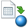
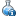

# Formulas in Measurement Values

### Measurement values

**Requirements**

GeoDin organizes objects spatially. These are point objects with or without a depth value. At these objects measurements can be made. In order to use GeoDin to collect such data, measurement points need to be defined in the general data. Usually filters and sample intervals are used as measurement points. Also the object itself can be defined as a measurement point. In the GeoDin object manager measurement points are shown by three blue spheres.

GeoDin Demo Project

Object

All objects

General borehole log

Measurement point

filters

upper piezometer: (4.3-6.3m)

lower piezometer (7.8-8.7m)

samples

BH01: (1-7m)

BH01: (4-5m)

**Terminology**

The following hierarchy is used in the measurement point organization to relate a single measured value to a measurement object of the measurement point. There are the following different types:

**Measurement point type**

The measurement point type defines, what type of object it is. These can be either with or without a vertical component. An example of a measurement point with a vertical component is a borehole. A borehole can be the measurement point itself (e.g. where the whole length is sampled) or other measurement point types can be associated with it (discrete samples at various intervals over the length of the borehole). Examples of point samples (i.e. without a vertical component) are surface water or climate measuring stations.

**Data type**

Chemical investigations can be done for several objects for each type of measurement point. For these combinations data types are defined. For example at a groundwater well the water quality can be investigated or flow rates measured. For each case there is a data type. Each data type can be assigned to several measurement point types. So the data type "groundwater composition" can be entered for a groundwater measurement point as well as for a well. The results are combined in a data type table, although the data for each measurement point are distinct from one another.

**Chemical group**

Because the number of individual parameters within a data type can reach large amounts, the parameters are subdivided into chemical groups to allow a better overview. Each group is distinguished by a similarity in the chemical parameters or descriptive characteristics and may have up to 20 parameters.

**Parameter**

A parameter is an individual measurement described by a name, a field identification and a unit

**Query**

Queries are used within projects or databases to interrogate data. They define the amount and type of data from which the results are derived.

**Special values**

GeoDin organizes measurement values as numerical entries. Hence values below a detection limit cannot be saved as the character „<". In such cases a negative detection limit is entered (e.g. "-1"). These values are ignored by statistical analyses. If the detection limit is unknown (e.g. old data) the value"-88" is used. If the value is not detectable then"-99" should be entered:

***

Entry Description

-XX beneath detection limit (XX = detection limit) -88 beneath detection limit (detection limit value unknown)

-99 not detectable

\------- ---------------------------------------------------------

### Measurement data

If an object is selected in the GeoDin Object Manager, for which measurement values can be entered, the method   **"Measurement value management"** is available.

The main elements of the measurement value editor are:

A complex **Data sheet**, the **Top tool bar**, the **Right tool bar** and the status bar.

### Data sheet

The database grid shows the available measurement values. Depending on the object type definition and database configuration, one or more data types may be used for an individual measurement point. Each data type has its own database sheet - you can move between them using Ctrl+Tab, or just click the appropriate sheet.

Each data type has **"Measurement program"** and **"View"** settings. At the bottom of the grid there are small tabs with **"Parameter groups"** (containing the individual parameters), **"Diagrams and analysis"** and **"Additional measurement information"**.

The basic use of the data input grid as well as the management of views is described in the chapter [Using the data entry grid](../../navigating-the-geodin-workspace/measurement-values/working-with-measurement-data.md).

The parameter of a data type are arranged in so-called parameter groups. This option an be shown as a tab under the data entry grid, where the parameter columns are also displayed in groups. With the option turned off, this ordering is ignored and all data type parameters are shown. The number of displayed parameters can be further restricted by the choice of **"Measurement program"** which are a definable selection of named parameters that can be created for data types in the [Measurement program](../../navigating-the-geodin-workspace/measurement-values/working-with-measurement-data.md). In addition to the current measurement program there are the collections **"All parameters"** (no parameter restrictions) and **"Used parameters"** (display of parameters with values in the database). A further way to customize the display in the number and order of parameters is the use of the top left button to select the columns and moving the columns with the mouse.

### Additional measurement information

_**ATTENTION:**_ _Additional data for a measured value can only be attributed to an existing measured value. If additional information is entered although no measured value is available, it will not be included in the current data set. If an attributed measured value is deleted, its additional information is also removed._

**Additional information - Measurement value**

By selecting this option additional information to the actual measurement value is available. For each measurement value information about the method of investigation, the used unit and the appropriate detection limits can be stored.

**•** Additional character

Alternative to recording the negative value instead of a measurement value below the detection limit also the additional symbol "<" can be entered. At all places in GeoDin where the values below the detection limit are treated different, both methods of displaying values below the detection limit are considered equally.

In the measurement value editor a record can be visualized by a colored mark of the particular value (**Display options**).

**•** Method

From a list of available examination methods the one the actual parameter was detected with can be chosen ([Investigation method](../../navigating-the-geodin-workspace/object-types/geotechnical-investigation-en-iso-22475.md)).

**•** Detection limit

The detection limit of the investigation method during the examination of the parameter can be entered.

**Laboratory information**

If the option Additional measurement specifications was activated during the creation of the current data type, any parameter can be added information about the laboratory analysis (**Properties**).

Using this information is sensible mainly for management of the chemical parameters, which require detailed information about the method of analysis. This information should be used for hydrochemical not for hydrodynamic (waterlevels) data.

On this side the laboratory information is stored:

1. Laboratory

Information about the analyzing laboratory ([Investigation method](../../navigating-the-geodin-workspace/object-types/geotechnical-investigation-en-iso-22475.md))

1. Sample number

Number of the sample in the laboratory

1. Detection limit

Detection limit of the used analyzing method

1. Confidence interval

Confidence interval of the investigated measurement value (+/- most reasonable fluctuation range)

1. Matrix

Matrix used for the sample investigation ([Investigation method](../../navigating-the-geodin-workspace/object-types/geotechnical-investigation-en-iso-22475.md)).

1. Extraction

Method of extraction

1. Date und time

Time of the measurement in the laboratory

1. Plausibility

Information about the plausibility of the measurement value

Auf der Seite der Ergänzungen werden verwaltet:

1. Sample preparation

Information about the preparation of the sample for the laboratory analysis

1. Reference to the result

Reference to the result

1. Interpretation

Interpretation of the measured value

### Formula

As an alternative to presenting the measurement values in grid form you may view the current data set in a mask. At the top of the mask the general sample data (Name, Date, Time) and the group are displayed. Below the individual parameters for the current data set are listed in rows. For each parameter the name, measurement value, unit, detection limit and investigation method are shown. Name and unit are not editable.\
\
The contents of a data set can be saved as a simple text file (which can be subsequently loaded). By pressing the **OK** button the mask contents are saved to the data set - by pressing **Cancel** the contents are discarded. Optionally the short field name can be used for the parameter column.

### Location point link

Each data set is internally linked to a measurement point. This classification relationship can be changed in the measurement editor. If opened by clicking the icon, a list of all objects in the current group or query is shown.

After choosing a measurement point and the method (**Move** updates the classification, so that in the original object the measurement values do no longer exist; **Copy** duplicates the measurement values) reclassification is the carried out by clicking **OK**. Reload the object to see this displayed.

If several measurement points are selected when the reclassification is carried out, all these measurement points are reclassified.

### Display options

Using these options you may control how measurement values are displayed to reflect their contents.

**Frames**

-Detection limit-

By activating this option all cells containing values below the detection limit (negative values for concentration) are displayed with a blue frame.

**Type**

Green, blue and red are available for use with a logical expression (short parameter name and comparison). The comparison can be "<", "=" or ">". The compared value must be a number. You may also influence the font style by using the "@" character with one (or a combination of) of the following four letters:

B bold

U underlined

I italics

S strike-through

The letters can be combined. For example the term "NO3>20@BI" in the color red results that all values for nitrate that exceed the value 20 are displayed in red, bold and serif.

An expression may contain more than one command if a semi-colon ";" is used to separate them (for example: "CL>50; NO3>10@BI"). Hence it is relatively simple for a user to set up a color scheme for use during data entry.

### Calculation

This function allows you to recalculate values for entire table in the measurement editor. You have two options:

**-Available formulae-**

1. Execute one or more formulae from the predefined [Formulas](formula-basics.md)of the data type, found in the system configuration.
2. If you check the box \[only activate formulae] you will only see formulae which are set to active in the [General formulas](formula-basics.md) in the system configuration. Note: These formulae will always be executed for the selected data records when using the Calculate function. This is because an update of a data record triggers the calculation of active formulas.
3. Formulae are marked with a red symbol instead of a black one if the target field of the formulas is always meant to be overwritten.
4. Formulae can be sorted by clicking on the actual column title, e. g. name or target field. _**Note:**_ _the execution order of the selected formulae will be the same as it has been set in the data type settings of the system configuration!_ \*\*This is important, especially for interdependent formulae.

**-Execute single formulas-**

1. To execute a single formula you may use and change one of the predefined formulas from the [General formulas](formula-basics.md) of the system configuration or you define a new formula.
2. To accept a formula just mark it by clicking on the name (you do not have to check the box for this action) and click the button **Accept available marked forumla**. The fields _"Target field:", "Condition:"_ and _"Formula:"_ are automatically filled and can be edited.
3. Alternatively you can edit these fields without using a predefined formula but creating a new formula, which is applied to the target field.

_\[\[Overwrite target]]{.underline}_

For the following calculation you can set the configuration to overwrite existing values. By default the calculation won't overwrite existing fields but calculate results for those fields without values for the corresponding target field.

_\[\[All parameters have values]]{.underline}_

Furthermore you can specify only to execute the calculation if all parameters, which are used in the formula, contain values for the calculation. Therefore the calculation won't be executed for empty data fields (if they are used in the formula).

_**-All visible data records-**_

Choose here whether the calculation is done for all data records listed in the measurement data editor.

_**-All selected data records-**_

Choose this option to execute the calculation only for the data records (rows) selected in the measurement data editor.

**Definition of formulas**

A formula is defined as a string of characters (similar to a text macro definition) and contains mathematical operators for calculating a result.

For example: $DAT.PAR1$ \* 100

The characters inside the $-signs relate to a GeoDin data field. The following operators can be used:

***

\+ Addition - Subtraction \* Multiplication / Division SQR (x) Square of x SQRT (x) Square root of x LN (x) Natural logarithm of x EXP (x) Potency of x (e to the power of x) SIN (x) Sinus of x COS (x) Cosinus of x TAN (x) Tangent of X ARCTAN (x) Arctangent of X COTAN (x) Cotangent of X ABS (x) Absolute value of X

***

(x) stands for the table column of GeoDin (e.g. $DAT:PAR1$)

Empty spaces can be contained in the formulas. Fixed number values (100 in the example above), can be entered directly in the formula.

**Use of conditions**

In addition to the mathematical operators, special syntax constructions can be used to take a large number of special cases into consideration. For a formula, a condition can be defined in which the formula is executed. A condition is an expression which has two possible results: TRUE or FALSE. Several expressions can be combined using the logical operators AND and OR. The definition of the data type abbreviation is always necessary (e.g.: $WAS:NA$).

_**Note:**_

_The formula can be entered directly in the measurement editor after clicking the button_ _or on the system tab under Data types-> Data type settings->Formulas_ ([General formulas](formula-basics.md)).

**Example for simple conditionExample:**

_Destination:_ WAS:NA\_CALC

_Condition:_ $WAS:MG$>3

_Formula:_ $WAS:NA$/2

The target parameter NA\_CALC is calculated if the parameter MG has a value of 3 or higher.

**Example for multiple conditionExample:**

_Destination:_ WAS:NA\_CALC

_Condition:_ $WAS:MG$>3 AND $WAS:CA$<10

_Formula:_ $WAS:NA$/2

The target parameter is calculated, if both the parameter MG has a value greater than three and the parameter CA has a value of less than 10.

**Conditions for changing values**

By using the formatting @O the original value of a data record BEFORE the last change can be recreated in the measurement editor. Hence checking for differences is possible.

**Example:**

_Condition:_ $WAS:PAR1$ - $WAS:PAR1@O$ >10

The condition is true, when the value of PAR1 in the cell is more than ten times the previously entered value.

**Further condition examples**

In a condition, the NULL operator can be used. It defines whether a parameter has a value.

**Example:**

_Destination:_ WAS:NA\_CALC

_Condition:_ $WAS:MG$>3 AND $WAS:CA$=NULL

_Formula:_ $WAS:NA$/2

The target parameter NA\_CALC is calculated by taking half the value of the parameter NA, if the value of the parameter MG exceeds 3 and the parameter CA is empty.

If strings are used in a condition, the text has to be included in inverted (or high) commas. Missing inverted commas and mis-spelling are interpreted as non-equal. The spelling of the condition is case sensitive.

**Example:**

_Destination:_ WAS:NA\_CALC

_Condition:_ $BEARBEIT$='Müller'

_Formula:_ $WAS:NA$/2

The target parameter NA\_CALC is calculated as half of the parameter NA, if the author of the data record has the name Müller.

**Using special rules**

Additionally to the mathematical operators special syntax constructions can be used for the usage of values from the GeoDin tables to take into consideration numerous special cases.

**Special cases in formula syntaxDetection Limits**

Detection limits present a special case. These are by definition negative values (e.g. -1 for <1). If these values are used without care, false results may be produced, for example when building sums from individual parameters. To do this, a construction in the form of @B(x) within the $-signs must be used, where x is a factor with which the detection limit enters the calculation. For example a detection limit of 5 mg (entered as -5) using the factor 0.5 produces the result 2.5.

**Example:** $WAS:BENZEN@B(0,5)$+$WAS:TOLUEN@B(0,5)$+$WAS:XYLEN@B(0,5)$

In the case above, where values for individual parameters of -5 or -1 are found, the sum calculation uses half of these values.

**Default values**

For certain calculations it may be necessary to work with predefined settings or defaults. When a parameter is either not present or has not been analyzed in a data set, a standard value can be assumed and used for calculation. This is realized by using the construct @D(x) inside the $ signs, whereby x is the predefined default value used when no value is present in the field.

**Example:** VALUE=$ORGANIC@D(10)$/$CLAY@D(25)

The calculated value has the quotients from the organic substances and clay in a soil sample. If no values are present in these fields the default values are used.

**Mean Value**

A mean value is calculated by using the symbols "@M" inside the dollar symbols of a formula. The individual values are separated by ";" and only filled fields can be used.

**Example:** UWDRYMIN=$UWDRYMIN1;UWDRYMIN2;UWDRYMIN3@M$

The result is an average of UWDRYMIN1 to UWDRYMIN3.

**Using a number from a dictionary**

If a dictionary is used, which produces a number when entering a code, this can be used for a calculation. By using the "@R" sign a recode is carried out.

**Example**: CU=($CONE@R$)/SQRT($PEN1;PEN2;PEN3;PEN4;PEN5@M$)

First of all the entry for CONE is replaced by the value from the dictionary. For the values P1 to P5 an average is taken from which the square root is calculated. The value for CONE is then divided by this value.

**Using values from another data type**

Values from one data type can be used in calculating values in other data types. To do this, the code of a data type is followed by a colon. The relationship to a data record in another data type is defined by time. To compare values the date is used in a number of different ways:

***

\[=SMPDATE] or no definition The date must be the same \[<=SMPDATE] The date can be the same or less than \[\<SMPDATE] The date must be less than \[>=SMPDATE] The date can be the same or more than \[\<SMPDATE] The date must be more than

***

**Example**: WASSPNN=$ROK:ROKNN\[<=SMPDATE]$-$WASSPROK$

The water level expressed in meters above sea level is calculated by using a value from the data type ROK (top of piezometer). The value used can be from the same day or the next most recent value. From this value the current level is subtracted.

**Using values from measurement point general data**

It is possible to incorporate general data fields in formula for measurement points. The relationship is defined as follows: $Tablel.Datafield$.

**Example:** $ASBFILTR.INVMBEG$-$WST:WASSPROK$

The water level in the destination WASSPNN calculated using the measurement point elevation ($ASBFILTR.INVMBEG$) and the measured water level from the top of the pipe $WST:WASSPROK$ in the data type.

**Ionic Balance**

By using the symbol %IONB the ionic balance can be calculated and used as result.

**Example**: IONICBALA=$%IONB$

_**Attention:**_ _For a correct calculation the fields with the names, which are expected by the calculation, must exist and be in use (see_ [_Ion balance_](../calculation-engine/geotechnical-analyses.md)_)._

**Automatic numbering**

To automatically assign consecutive numbers to a parameter, the expression $%FIRSTID:PARAMETER$ can be used. The numbering for the corresponding parameter always starts at 1.

**Example:** $%FIRSTID:TESTNO$

The test number is automatically assigned a consecutive number in the TESTNO field for each record. The first record is given the number 1.

**Further Symbols**

$%PI$ produces the number Pi

$%USERNAME$ can use a (text-)formula, to create the name of the current database user

$%NOW$ results the current date and time

**Object reference**

$%OBJECTID$ Access to the LOCID for general data tables if available

$%PRJID$ Access to the PRJ\_ID for general data tables if available

**Text exchange - Formulas to create formatted text**

By activating the control box _\[Text exchange (no calculation)]_ a calculation is prevented when carrying out the formula. This option is only useful, where a string parameter as result is required. The result is that the parameters are replaced by a string of actual values, whereby no calculation is carried out.

**Example:** $LOCREG.SHORTNAME$ / $SMPDATE$

In the selected target field a combination of the object short description, an oblique and the date is created, for example "Brg 12 / 12.10.2004".

**Text exchange with Macro**

In addition to the text exchange, format specifications can be resolved.

Example: $LOCREG.SHORTNAME$ from $SMPDATE@dd.mmmm.yyyy$

_**Attention:**_ _Only parameters of the same table (data type) or object type parameters can be evaluated. The parameter of the current table must be specified here without the table abbreviation. See example._

### Measurement value editor options

On several tabs there are options to control the way you use the measurement value editor.

### Import/Export

In the GeoDin object manager at the level of a measurement point or a group of measurements the methods **"Export measurement values"** and   **"Import measurement values"** can be selected.

By starting this method a dialogue appears where all import or export settings can be made:

[Import](../../data-collection/import.md)

[Export](../../data-collection/export.md)

### Adding data set records

**\_\_\_\_\_\_\_\_\_\_\_\_\_\_\_\_\_\_\_\_\_\_\_\_\_\_\_\_\_\_\_\_\_\_**

The method   **Add data set records** is available for measurement points or groups thereof.

This method is used to add data sets using a date or date list.

The method is especially useful for creating empty data sets for a monitoring program, either on a certain day or over a specified time period, after which the data are to be added in one import to the GeoDin database.

**Attention:** Decisive for the processing of the method is the level, at which it is called up. Is it a single measurement point, only this is edited, is it a measurement point group, the data set is added on every measurement point of the group.

· **Data type**

Choice of data type for the measurement objects.

· **Measurement presets**

Useful for defining defaults (e.g. detection limit, investigation method) for each parameter of the data type

· **Date list**

Default value is the current date, but a list of dates may be created, saved and loaded.

· **Time**

It may be useful to specify the same time for a number of measurement points or monitoring stages.

### Datatype Manager

The method **"Data Type Manager"** is available at the database level. It is the most important tool for defining and configuring options for measurement data collection. In particular you may define here which data types (thematic groups of measurement parameters) and which measurement parameters are to be used in the current database.

Method symbol of the Data Type Manager

Since data types are related to specific objects and measurement points, they can first be configured once an object has been created in the database.

The Data Type Manager gives an overview of the data types available in the current database. The following functions are available:

[Add data type](../../navigating-the-geodin-workspace/data-types.md)

This function allows you to add a data type to your database. This is described in more detail in Chapter [Add data type](../../navigating-the-geodin-workspace/data-types.md).

**Remove data type**

This function will remove any data records belonging to the data type selected, as well as the database tables and definitions. _**Attention:**_ _Deleting measurement value data records cannot be undone! GeoDin calculates how many data records will be deleted and displays this as a warning message. This is the last point at which you may still cancel._

&#x20; **Determine number of records**

Function calculates the number of data records present for each data type in the database and shows an overview.

**Add data type to the system configuration**

Editing individual parameters of a data type is only possible when the data type is part of the current system configuration. Normally this is the case with GeoDin databases, but sometimes you may receive a database from another user with data types that are not defined in your system configuration. With this function you can then add the definition from the database to your system configuration. Please note that when using dictionaries in data fields of the data type that these will not be present. Please ask the user from whom you have received the database to export the user-defined data type from his system configuration, for you to then import. Hence you should use the method "Add data type to the system configuration" only when no possibility exists to obtain the data type as a configuration file.

**Search data type**

Enter a search string for the data type search in the data type overview. The entries in the overview are reduced to fit the search entry. With a double-click you can then edit the properties of the selected data type.

**Search parameter**

Enter a search string for the parameter search in the data type overview. The parameter will be searched for in all the data types in the database (or in the restricted list as defined by your search parameter). Parameters found will be listed underneath the relevant data type. Double-clicking on the parameter takes you to the edit modus (Adding / Deleting/ Properties) for the chosen parameter.

**Delete parameters**

This function can delete parameters that do not contain any measurement values in the database. All parameters without measurement values are displayed in a dialogue window, where it is possible to edit the parameter list again. All selected parameters will be deleted from the database. If this then causes empty data types, they will be removed from the database too.

### Data type settings

Here you can edit the data type properties of a database.

Data mode**l**

With the help of the function **"Convert data model"** you can change the way that measurement values are stored for a data type in a database. This is achieved by making structural changes to the database tables, which may take some time , depending on the number of measurement values for the data type. This process may be canceled at any time without losing any data (aready available measurements will be completely converted to the other structure). Further information on the data model can be found in the Chapters [Add data type](../../navigating-the-geodin-workspace/data-types.md) and [Data model](../../navigating-the-geodin-workspace/data-types.md)

During the conversion process new tables are created in the database, hence the user needs the database rights to create and delete tables. Please contact your database administrator as required.

**Properties**

Define which columns are to be hidden during the data collection. The defaults settings show the sample name, date and time, which can be entered for every data record. For data types where a separate naming of the measurement data record or the entry of time information meaningless is, these columns can be hidden.

without sample name: the column sample name is hidden.

without date/time: The columns date and time are hidden.

without time: column time is hidden (date column remains visible).

**Association with measurement point types**

The association of a data type to measurement point types controls the availability of the data type for data collection and analysis for actual measurement point types in the database. The system configuration already contains useful data type - measurement point type associations, which can be expanded. Typically the data type "sediment chemistry" is associated with the measurement point type "sample", whilst the data type "groundwater chemistry" is associated with the measurement point type "filter". When a sample is selected in the GeoDin Object Manager (GOM), the [Measurement data](../../data-collection/import/measurement-data.md) a data entry grid for measurement values of sediment chemistry is shown, whereas when a filter is chosen the measurement parameters for groundwater chemistry are offered. Further information to measurement point types can also be found in Chapter [Measurement values](../../navigating-the-geodin-workspace/measurement-values/working-with-measurement-data.md)

The correlation between data types to a measurement point type can be set by selecting the relevant row. The name of the associated measurement point type can be edited by double-clicking on the column name, which defines the GOM measurement point type labelling

Object; A measurement point of this type is generated when an object is created in a GeoDin database..

Sample; A measurement point of this type is generated when a data record for an object is created in the sample table.

Filter; A measurement point of this type is generated when a filter is created in the well design table of an object.

### Diagrams and analysis

If the checkbox _\[diagrams and analysis]_ is activated, additional information for the current data pool is shown below the data entry grid.

**Column chart**

The values of the current column are graphically represented in the order that the data sets are displayed in the data entry grid.

To represent a particular parameter in the chart (to fill the chart) one data set of the appropriate column has to be selected (e.g. a data record of the column CHLORIDE). The current data record will be displayed as a filled rectangle in the chart. With a click on the rectangle (filled or not filled) it is possible to navigate to the data record in the data entry grid.

**Row chart**

Graphical representation of the values of the current row (data record) in the order that the columns are displayed in the data entry grid. To navigate to the column in the data entry grid click on the bar of the desired parameter in the row chart.

**Plausibility control**

This tab displays the plausibilities analysis of the currently checked row. A [Plausibility](../calculation-engine/data-checks-and-validations.md) can be defined within the **Properties**.

**Formulae**

The last executed formulae will be displayed when a new data set is recorded. The [General formulas](formula-basics.md) can be defined directly within the method **"Measurement data"** or within the **Properties**.

**List comparison**

The chosen list comparison of the current data record will be carried out and the result displayed. The **List group** can be created und managed within the **Properties**.

**Ionic balance**

The ionic balance will be displayed for the current data record. The [Ion balance](../calculation-engine/geotechnical-analyses.md) is calculated and evaluated based on the DVWK 1992 recommendations.

### Import

Use the method **"import measurement values"**

to import measurement values from external data sources into your GeoDin database.

Follow the following steps:

**Data source**

Open the external file or database that contains the data to be imported and select the format options.

**Measurement point assignment**

Map the data sets to a GeoDin measurement point. Skip this step if you start the method at a single measurement point in the GeoDin object manager. The program will map the data sets to the selected measurement point automatically.

**Parameter links**

Assign import columns to GeoDin parameters of the selected data type.

[Import](../../data-collection/import.md)

Select further import options, preview the import data and execute the import.

**Save and load a configuration**

All import settings can be saved in a configuration file to quickly select and import data with a similar data structure.

You can also load only parts of the settings stored in the configuration file, for example if your parameter mapping is always the same while the mapping for measurement points varies. To do this, select the desired configuration settings in the dialog 'Assign configuration settings'.

### Measurement point assignment

In this step you can link the data records of your import file to a measurement point in GeoDin. The GeoDin measurement points of the current query or group are listed in the table "Measurement points:". Select from the drop-down list **"Data source:"** the column of your import table that contains the name or id number of the measurement point, to use to create the link with the GeoDin measurement point. The contents available from this column are displayed in the table "Data source:".

To create a link between data records to be imported and the measurement points in GeoDin, select and pair the entries of the lists "Data source:" and "Measurement points:" by drag and drop on one another. The direction that this is carried out does not matter (i.e. Data source dropped onto Measurement points or vice-versa). The links created are displayed in the table "Links:" and the already linked entries of the columns are removed from the lists of origin. In this manner only entries, which are not yet linked, remain in the lists "Measurement points:" and "Data source:".

If the import table contains names that match the names of the measurement points in GeoDin or even the GeoDin ID of the measurement point (INVID) you can use the button **Automatically link** to create a link for the corresponding entries.

The input fields are to reduce the amount of the displayed fields or columns. Only entries, which contain the search string, will be displayed. Please clear the input field to see all entries.

If you have saved a configuration and links for an import in a former GeoDin version as a configuration file (file extension .ini) it is possible to load this using the button **Import**. These configuration files had the following structure:

\[Import measure links]

MEAS\_PT\_ID=

'B 01 : (4 - 5m)'=U9SYT40001FIL001

'B 02 : (6 - 7m)'=U9SYT40002FIL001

...

The first row in the paragraph \[Import measure links] contains the column name of the import table. After that follows one row for each link: First an entry (name) from the column of the import file then the equals sign and next the GeoDin ID of the measurement point.

Invalid links will be highlighted in pink. Those links can occur if you change the data source or choose another data type after the parameters were linked. You can remove these invalid links by using the button .

### Format options

GeoDin supports two general arrangements of tabular data to be imported.

The format **-Table by row-** describes a table, which contains each sample in one row, the values of the parameters are stored in separate columns for each parameter.

***

NAME DATE NA MG NH3 ... Sample 1 12.07.2012 2,4 4,5 1,23 ... ... ... ... ... ... ...

***

The format **-Table by column-** describes a table, in which one measurement of one parameter builds one row. A sample can consist of a certain number of rows (as many as measured parameters) in this format. This format also allows additional information for each measured parameter to be imported and organised in GeoDin too.

***

SAMPLE DATE PARAM VALUE COMMENT Sample 1 12.07.2012 NA 2,4 verified Sample 1 12.07.2012 MG 4,5 unverified Sample 1 12.08.2012 NA 9,5 implausible ... ... ... ... ...

***

To import data from this type of table you have to first make further adjustments. At first choose the columns, which group the data records of one sample. Therefore tick the appropriate columns in the list of **"Grouping data fields"**; in the example above tick the columns SAMPLE and DATE. The result of this choice would be that the first two rows (Sample 1 from 12.07.2012) would generate one cumulative import row and the third row (Sample 2 from 12.08.2012) another.

Choose from the drop-down list "**Data field with parameter name:"** the column, which contains the parameter name or id; PARAM in the example above.

From the drop-down list "**Data field with measurement value:"** please choose the column, which contains the value of the parameter; in the example above VALUE.

GeoDin now will transform the import table to the table format -table by rows- (please see above). The preview of the import data of our example now will be displayed as follows:

***

SAMPLE DATE NA MG ...

Sample 1 12.07.2012 2,4 4,5 ... Sample 1 12.08.2012 9,5 ... ...

... ... ... ... ...

***

Please note that the information from the column COMMENT isn't lost. The import preview the cells of the measurement values are tagged at the right top corner with a red triangle. To display the additional information for the measurement value, please hold the mouse pointer over this corner. For the cell NA=2,4 the information 'COMMENT:verified' would be shown. This information can be imported using the [Additional measurement information](../../navigating-the-geodin-workspace/measurement-values/working-with-measurement-data.md).

There is also a special pre-formatting for text files in the Octoware format available. There are no further adjustments necessary for this format.

Example fragment of an Octoware file:

OCT>12072240RE0003\10.08.2000 09:10\\\\\\\\\T2000-07949\\\\\\\1\1

EST>FI1

PPA>pH 0\\\\\7.24

PPA>LF 0\\\\\998

PPA>Temp 0\\\\\11.1

### Export

You will find this method within the method collection **"Publish and export"**.

This method exports measurement values for a data type in various formats. In addition the measurement point name and object name is also exported.

Choose a data type and select the export format. further settings may be available

**Column headers**

Choice of different header types

**Export ID fields**

In addition to values and general of the measurement point, internal GeoDin fields like LOCID, INVID etc. are exported.

**General data**

In addition to values, general data like coordinates and depth information are exported.

### Time range controller

For data types with measurement values with a time component an optional time range controller can be used to navigate data. This is useful for quickly getting an overview for particular time periods, by only loading the necessary data sets. Additionally, the user has feedback on the amount, distribution, storage requirements and loading time.

**Information on data sets and distribution**

In the top part of the window information is shown on the available data sets. This includes the start and end points of the time range, the total number of data sets and their distribution, shown by different blue coloured areas (white areas have no data, dark blue the most concentrated). Detailed information is also shown by hovering the mouse over these areas. When opening a data type in the measurement editor, the information for the time range is read from the database and the areas where data has not yet been read coloured orange. The final colouring of all areas is carried out once all the values have been loaded.

Querying the information from the database takes a few seconds. The most current data sets are loaded, and you can navigate in the data grid already. When using the time range controller, only a specified maximum number of data records is loaded into the data grid. This number of data records can be set in the configuration of the data type and is preset to 5000 data records. If the number of data records is less than the set maximum value, all data of the data type are loaded into the data grid as before.

The system configuration of a data type for the use of the time domain controller is done at

**Editor options**. User-specific settings for the use of the time domain controller can be made in the [Time range controller](../../data-visualization/time-series-charts.md).

[Time range controller](../../data-visualization/time-series-charts.md)

Which data sets to load can be configured in several ways:

On the left and right there are time icons , to pick direct calendar entries. Clicking a month or a year zooms the pop-up calendars out for more choice. The current date can also be selected.

The left and right arrows and move the defined time range forward or backward in time. Each step represents the selected time range.

It is simplest to choose a time range with the slider controls. The time range set can also be slid horizontally left and right (i.e. forwards and backwards) keeping the range intact. Moving one oft he two sliders leaves the other start or end date intact.

Above the time range controller several useful pieces information are displayed. The time range is shown (date/time from-to) and below this the number of data sets, memory usage and the time to load the data sets. When using the controller these values are estimated, so that the user receives feedback before a selection is made (this may depend upon other factors). After defining a time interval (i.e. after making a selection with the mouse and releasing) the values shown are calculated. Two small vertical lines also show the currently selected time range.

### Import measurement data

This button can be used to import measurement values to a parent dataset.

The button is not available on groups or queries for several measuring points, but only if you have selected a single measuring point in the GeoDin Object Manager.

Detailed information on the settings in the import dialogue can be found in the chapter [Import](../../data-collection/import.md).
