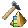

# Complex Layer Queries

### Layer query

Layer queries are queries on attributes of the layer description. These can usually not be queried with an SQL query on the database, because the description usually consists of a string of codes.

Even if an attribute is only described by one code, a query with direct comparison of a string like WHERE SOILNAME = 'fS' is possible, but will in practice not lead to the desired result, because all layers, in which more codes than the code fS was entered, would not fulfil the condition.

Even a partial string query with operators like LIKE would not lead to the desired result, because for example the capital letter C is in a series of codes. Finding the letter C does not mean that the layer contains clay.

The layer query tool solves these problems and allows also an investigation on the relations of the codes among each other. This is based on the decomposition of the description of an attribute in single codes and a projection of the relations of the codes among each other. Coding a fine sand leads to:

**s(fi)**

the following decomposition:

1. The description consists of:

s

1. attributed by:

fi

Derived from the decomposition are the single codes as well as the property of the code s as main component and the property of the code fi as an attribute (describing property) of the sand.

Beside the code itself also their properties and relations can be investigated. This leads to specialized and professional research options. Layer queries can be used to query complex classifications of the layers concerning different technical questions and are far more than just a query on single codes.

For layer queries in GeoDin two different methods are available:

1. Query a single layer property to find and provide all boreholes that have that property.
2. Query several layer properties in one step to classify or generalize all layers or create sequences of predefined layers of the selected boreholes.

While the first method can be done without further preparation, for the second method a layer query definition is required.

### Query individual layer properties

Querying a single layer characteristic with the goal of finding all boreholes that meet this characteristic is the simplest form of layer query and will be demonstrated with the following example.

The goal is to find all boreholes that contain layers from the stratigraphic horizons of the Lower Cretaceous. The layer characteristic to be examined is therefore the Stratigraphy field, and the keys to be searched for must describe horizons of the Lower Cretaceous.

The query is performed with the method **"Data checks and calculations".**_**Note:**_ _The query with the method_ _**"Data checks and calculations"**_ _is only possible for the SEP3-object typ and the KA5-object type. This also applies to_ [_Complex layer queries_](complex-layer-queries.md)_._

This method can be started at all queries and groups in the _**Objects**_ branch in the GeoDin object manager. This allows a preselection of the boreholes to be examined using the known methods for creating queries and groups, enabling the layer queries to be applied to this set of objects. If a preselection is not necessary, the method is best started at the _**All Objects**_ branch. To perform the desired query, select the method **"Layer Queries Single Conditions"** from the list.

After selecting the Stratigraphy data field in the **"Data Fields"** dropdown box, click on the question mark icon next to the _"Key:"_ input field. The dictionary search will be initiated. Set the search to Plain Text and the option to -Full Text Search-, and enter the term "Lower Cretaceous" in the input field. All entries containing this term will be displayed. For **example:**

Upper lower cretacious

Lower lower cretacious

Lower cretacious

With the **apply** button, the code of the selected entry "Lower Cretacious" can be entered into the input field _"Key:"_ (in this case: kru (german SEP 3 stratigraphy)). To search for several codes simultaneously, these can be entered separated by a comma:

kru,kru1,kru2

A layer matches the query conditions, if at least one of the given codes are used in the data field "stratigraphy".

It is easier to use wildcards in place of precise codes, using special characters as placeholders for characters.

\_ Underscore substitutes any one character, which may not be missing

% Percent subsitutes any zero or more characters in this place

This way, the code list in the given example kru,kru1,kru2 could be simplified to:

kru% (German SEP 3 stratigraphy)

_**Note:**_ _The use of wildcard characters simplifies the definition of entire lists of keys but also carries the risk of including keys in the search that are not desired. To check this, click on the percent symbol at the end of the input field to view a list of all keys that are included in the search through the wildcard definition._

After the codes have been defined, enter a name for the query result, e.g. "boreholes lower cretacious". Leave the option -Create location query automatically- selected. This option creates a query branch in the object manager, containing all objects matching the query conditions.

Start the query by clicking **Proceed**. Now, all locations will be queried. After the search is completed, a message window appears, displaying the internal ID of the query and information about the query. In the object query "boreholes lower cretacious" in the GeoDin object manager, all locations can be found in which the field stratigraphy contains the codes for the lower cretacious. All methods normally available to edit the query or the boreholes are available here.

GeoDin stores the results of a layer query in the current database. Each query executed is assigned a unique ID. To manage layer queries, the [Layer query manager](complex-layer-queries.md) is available.

### Complex layer queries

Querying multiple layer characteristics simultaneously with the goal of classifying layers is much more complex than querying a single characteristic and requires a series of preparations.

The conditions of layer queries are defined in layer query definition files (GLQ), which can be re-used and are not discarded after use.

The use of layer query definition files offers the following capabilities:

1. Searching for Codes in layer properties
2. Creating logical connections between any number of layer properties, including mathematical computations
3. The following properties of codes and layers can be taken into account:

o Position (hierarchy) of the code in the description of the properties

o Type of the possible or desired joins or listings

o Type of the possible or desired attributes of the codes

o Layer type

o Type of the possible or desired sub-layers of the investigated layer

1. Use of additional layer properties, like depth or thickness
2. The groundwater level can be taken into account
3. For each layer, a resulting value can be calculated
4. Layers with the same classification can be grouped (generalized)
5. Layers or layer series with given thicknesses can be queried
6. Series of layers with specific sequences can be searched
7. Characteristic values for the borehole can be calculated
8. Geothermal characteristics for layers or boreholes can be calculated
9. Results can be displayed as a borehole graphic
10. The borehole column can be labeled with the results of the classification
11. The query result can be stored in the database

### Organisation

A layer query definition file (file extension \*.GLQ) is a collection of of the single definition conditions, layer classifications, layer packages, layer package sequences and execution options. It is possible to create and use any number of layer query definition files. Under the system tab of GeoDin new definition files can be created and existing files can edited and deleted.

The layer query definition file is stored by default in the folder QUERYDEF of the GeoDin installation. In a network environment this area is normally write-protected and can only be accessed by entering the password. Therefore you can create your own layer query definition files wherever you like, also the access to data from other users is possible. With the method '  **Properties**' a list of folders can be configured to be searched by GeoDin for layer query definition files:

The folder QUERYDEF is set by default and cannot be deleted from the search path with the consequence that all layer query files from this folder will always be displayed.

With the button **Add** any number of folders can be added:

Now all layer query definition files from the added folder are displayed in the object manager:

The search pathes are a local setting at the work station of the user. For this reason each user of the GeoDin system may have an own search path list.

### Preview

In the [Layer data](../../navigating-the-geodin-workspace/concepts/layer-and-stratigraphy.md) in the method **"Data management"**, a preview of the layer queries is available. It can be opened with the   **Layer queries** button:

Here, the desired layer query definition and the classification can be selected. The results of the layer query and the classification are displayed for the current layer. The selected layer query definition and the classification will remain until GeoDin is shut down.

The filling pattern is generated to represent the result of the layer query. The patterns of the layer classification which meet the query conditions TRUE are displayed. If for the current layer several classifications are TRUE, the representation of the borehole collumn is split vertically (a maximum of 4 layer classifications can be displayed in one borehole column).

In the _**Result**_ window, the according text is displayed. Here, the layer classifications which are TRUE for the current layer are listed by name. If a formula for a calculated value was defined for this layer classification, the result of the calculation is also displayed in the line **Calculation value**. A list of the single conditions meeting the query conditions TRUE is also displayed.

If the current layer is a main layer and contains sublayers, the layer classifications and single conditions for all sublayers are listed also.

With the buttons **Previous** and **Next** it is possible to page through the layers without leaving the preview. With the button **To layer**, it is possible to go directly to the layer currently in the preview. With the **Close** button, the view goes back the layer in which the preview was opened.

### Data checks and calculations

The method [Data checks and calculations](../calculation-engine/data-checks-and-validations.md) is available to query a group of boreholes for layer properties. The query result can be used to make the data available at a query result in the GeoDin Object manager or to select boreholes for more detailed analysis.

The method can be started at all queries and groups in the **Objects** branch of the GeoDin Object Manager. This way, it is possible to create a selection of objects with normal queries and groups, and to use layer queries on the resulting set of objects.

There are two general methods for layer queries:

1\. Layer queries with a single condition without the use of a layer query definition file.

This type of layer query is explained in detail in the chapter [Query individual layer properties](layer-queries.md).

2\. Layer queries using a layer query definition file

For this kind of query, select one of the methods **"Classification"**, **"Generalisations"**, **"Layer packet sequences"** or **"Calculations"**.

First, the desired layer query definition file is selected from the pull-down menu **"Queries:"**, then the desired operation is selected from the second pull-down menu. The layer query has to be given a name to find it in the layer query manager and as a name for the (optional) object query.

With the option -Create location query automatically- is normally deactivated, as the result set of the query for these operations is normally as large as the original set. If the opion is activated, a GeoDin Object Manager query is created automatically, containing all objects for which at least one layer classification is TRUE.

The query is started with the **Proceed** button. After the query was performed, the following results are available:

1\. Query results in the database (Tables of the data pool GLQ). The description of these tables is given in the chapter **Results**

2\. Object query with the name given, if the option -Create location query automatically- was selected.

3\. Object group in the GeoDin Object Manager, containing all boreholes in which errors occurred or ambiguous layer classifications occurred. This group is created only if errors occur.

If one or more errors occurred at one borehole, the object will be listed in the object group, and the name will be complemented by an addition, detailing the nature of the error:

LOCTYPE Wrong object type. The object cannot be queried, as it is of a location point different from the one specified in the layer query definition.

PREPERR Calculation error. During the calculation of characteristics or the conditions of a layer classification, an error occurred. The reasons may be a syntactically incorrect definition of a condition for a layer classification, wrong identifiers for variables, or a division by zero when numerical values are calculated.

DUPLIDS Ambiguous layer classifications. One layer meets the conditions of different classifications, making an unambiguous classification impossible. Whether this is an error is dependent on the aims of the layer classification. Depending on how the query results are used, it may be necessary to refine the layer query definition further.

### Results

The results of a layer classification are saved in the current database in the following tables:

GLQ\_EXECUTE Table of the Layer queries performed

GLQ\_RESDESC Table with the result description (Legend)

GLQ\_LAYER Table with the investigated layers and the results

GLQ\_EXECUTE

***

Data field Description GLQ\_ID Query ID GLQ\_NAME File name of the layer query definition file or empty when the query was run with a single condition OP\_TYPE Layer query type: 1 = Classification 2 = Generalisation 3 = Layer sequences 4 = Calculation 5 = Geothermy OP\_ID ID in the layer query definition for the operation run OP\_NAME Name in the layer query definition of the classification run OP\_COMMENT Name of the query result OP\_OPT Internal parameter OP\_DATE Date the query was run OP\_TIME Time the query was run

***

GLQ\_RESDESC

The table contains one data set for each result of a layer classification resulting from the query.

***

Data field Description GLQ\_ID Query ID (Link to GLQ\_EXECUTE) RES\_ID Result ID (This is the ID of the layer classification in the layer query definition) RES\_NAME Result name (Name of the layer classification) RES\_EXPR Calculation formula of the layer classification RES\_GUID Global unique ID of the layer classification

***

GLQ\_LAYER

The table contains one data set for each layer data set investigated with the query.

***

Data field Description PRJ\_ID GeoDin Project ID LOCID GeoDin Location ID RECID GeoDin Record ID GLQ\_ID Query ID (Link to GLQ\_EXECUTE) DEPTHFROM Top of layer DEPTHTO Bottom of layer THICKNESS Thickness of layer RES\_ID Result ID (This is the ID of the layer classification in the layer query definition) RES\_VALUE Calculation result of the layer classification formula RES\_ERR Classification errors

***

_**Notes:**_

Data field **PRJ\_ID, LOCID** and **RECID**

These data fields are the database keys for the layer data table. Each layer data set is related to exactly one data set in the GLQ\_LAYER table.

Data field **DEPTHFROM**

Contains for main layers the bottom depth of the previous layer, and a 0 for the first layer.

For sublayers, this contains the top of the sub-layer if available, otherwise, the bottom of the previous main layer is used.

Data field **DEPTHTO**

Contains for main layers the bottom of the layer.

For sublayers, this contains the bottom of the sub-layer if available, otherwise, the bottom of the current main layer is used.

Data field **THICKNESS**

Contains the calculated thickness of the main layer.

For sublayers, the calculated thickness is only given if both the top and bottom depth were contained in the layer data.

Data field **RES\_ID**

This field contains the ID of the layer classification. If a layer fulfills the conditions of different classifications, the data field RESS\_ERR = 1 (If it is OK = 0). As the calculation begins with the lowest classification ID, the field RES\_ID will contain the lowest classification ID if the classification is ambiguous.

Data field **RES\_VALUE**

If the classification uses a formula, the result is stored in this field. If the formula contains variables referring to top or bottom of layer (including total thickness), no result will be calculated if the layer is a sublayer and contains no entries for the variables used in the formula.

Data field **RES\_ERR**

If a layer is classified as belonging to several different classes, the Field RES\_ERR contains a 1 instead of a 0.

### Layer query manager

The layer query manager provides an overview over all layer queries run in the database or project and is avaiable at the **Objects** branch.

The queries are displayed with their ID (GLQ\_ID), the name of the classification scheme or the single condition, the name of the query result and date of the query.

The symbol "Query result present" shows that a complete result of the query is available and that the query definition file has not been changed since. The symbol does not mean, however, that no changes to the layer data themselves were made. Due to performance reasons, it is impossible to monitor changes in the layer descriptions. It is therefore in the responsibility of the user to decide whether significant changes to the layer data were made, which would have changed the query results. Especially in a multi-user environment, a layer query is always a snapshot of the current data.

The symbol "Query result may be out of date" shows that the layer query definition has been changed after the query was executed. This can apply to another classification in the same layer query definition, but in case of doubt it is advised to run the query again.

The symbol "No query definition" shows that the file of the layer query definition cannot be found. Executing the query once again is not possible, but the results of the executed query are still valid.

The symbol "Query result partly deleted" shows that some parts in the current database have been deleted (through direct access to the database). It is recommended to delete this query.

By the help of the button **Delete** a query result is removed from the database. All data sets with the appropriate query-ID are going to be removed from the tables of the GLQ pool. An eventually automatically created object query is deleted at the same time. Due to the large amount of data you should delete the layer query results from the database if there is no need any longer.

### Layer query definition

A list of all available layer query definitions contains the node **Layer queries**.These can be edited with the method **"Edit layer queries"**:

A layer query definition is made up of the two sections _**Definitions**_ and _**Processing options**_. In the section _**Definitions**_ the search criteria in individual conditions are, layer order, layer packages (generalisations) and layer pakage order. These definitions are the basis for the _**Processing options**_ which the method **"Search and Replace"** or the graphic visualization uses.

**Example:**

The individual conditions "Search for sand" and "Search for clay" are set in the section _**Definitions**_, as well as the layer order "Sand" and "clay" which is based on those definitions. In the **Processing options** section a classification is then created with the name "Graphic display of sand and clay layers", which encompasses both conditions and is used for presentation with the appropriate fill patterns.

### Definitions

The fundamental determination of search criteria (single conditions), conditions for the layer classifications, layer packages and layer packages sequences are done in the branch definitions. By the help of these definitions the later operations to be carried out can be set. A layer query definition must contain at least a single condition and layer classification, whilst the other definitions are optional.

### Single conditions

Here you can manage the single conditions of the definition of the layer query. The specification of complex properties is often easier if you duplicate a single condition (with a later change of name and code to be searched).

Where it is possible to define and edit any number of elements, they are displayed with their names in a list. This can be for example series of a data sequences, columns of a report element, lists of layout file names etc. Simultaneously these entries appear in the tree view of the object properties in the selected order. To add, remove and rearrange entries of the list on the right side the following icons are available:

**New**

Using this icon, entries can be added to the list.

**Duplicate**

Use this icon to create a copy of the selected entry.

The new entry is added at the end of the list and selected automatically.

**Delete**

Using this icon, marked entries can be removed from the list.

**Move selected entry up**

Using this icon, entries can be moved up in the list. Moving entries is also possible using drag & drop.

**Move selected entry down**

Using this icon, entries can be moved down in the list. Moving entries is also possible using drag & drop.

**Edit without refresh**

Editing the entries of a list can occasionally cause long processing. So for example moving a series or column definition in the list can take relatively long, depending on the basic data material, because sometimes many pages are affected.

Using this icon the list can be edited without actualization. Editing the list can be abandoned with the cross or with the tick mark.

**Double-click an entry of the list**

Closes the list and changes in the tree view of the object properties to the particular entry, so that its properties can be edited.

### Layer classification

Here you can manage the layer classifications of the definition of the layer query. The specification of complex properties is often easier if you duplicate a layer classification (with a later change of name and condition).

Where it is possible to define and edit any number of elements, they are displayed with their names in a list. This can be for example series of a data sequences, columns of a report element, lists of layout file names etc. Simultaneously these entries appear in the tree view of the object properties in the selected order. To add, remove and rearrange entries of the list on the right side the following icons are available:

**New**

Using this icon, entries can be added to the list.

**Duplicate**

Use this icon to create a copy of the selected entry.

The new entry is added at the end of the list and selected automatically.

**Delete**

Using this icon, marked entries can be removed from the list.

**Move selected entry up**

Using this icon, entries can be moved up in the list. Moving entries is also possible using drag & drop.

**Move selected entry down**

Using this icon, entries can be moved down in the list. Moving entries is also possible using drag & drop.

**Edit without refresh**

Editing the entries of a list can occasionally cause long processing. So for example moving a series or column definition in the list can take relatively long, depending on the basic data material, because sometimes many pages are affected.

Using this icon the list can be edited without actualization. Editing the list can be abandoned with the cross or with the tick mark.

**Double-click an entry of the list**

Closes the list and changes in the tree view of the object properties to the particular entry, so that its properties can be edited.

### Layer types

Besides the fulfilment of the logical condition the layers to be analysed can be restricted.

The type of the layers to be analysed can be defined fundamentally:

**Into main layers and sub layers**

The layer classification will be calculated for main and sub layers.

**Only into main layers**

The layer classification will be calculated for main layers only.

**Only into sub layers**

The layer classification will be calculated for sub layers only.

The option should be used for the cases that the desired layer classification can be reasonably applied to specific types of layers. This may enhance the speed of calculation.

You can restrict sub layers belonging to the main layers if selecting the option - in main layers and sub layers - or - in main layers only -. This restriction may cause the main layer not to be part of the layer classification.

**Any sub layers are accepted**

There is no restriction to sub layers. The main layer is allowed to have an arbitrary number of sub layers.

**Sub layers are not accepted**

The main layer must not have a sub layer.

**Sub layers limited**

The main layer may have sub layers, but is does not have to.

**There must be sub layers**

The main layer must have sub layers, otherwise the layer classification is not fulfilled.

Sub layers can be optionally defined if selecting the options - sub layers limited - or - There must be sub layers -. The definition is done by entering the layer classification ID's from a list into the input fields. The desired ID's are separated by a comma (e.g. 2,3,23).

**And at least one sub layers must fulfill one of the layer classifications listed here**

If you leave this field empty when selecting the option - sub layers limited -, the layer classification will be fulfilled if the main layer does not have any sub layers.

If layer classification ID's are provided here, the main layer must have at least one sub layer since at least one sub layer must fulfill one of the listed layer classification.

**The type of sub layers can be restricted further**...

This option is distinguished to:

**Sub layers must o n l y fulfill the layer classifications listed below**

If all of the layer classifications from a sub layer are marked with TRUE, they must be listed. Sub layers not fulfilling the layer classification result in FALSE as well as sub layers with a TRUE but without an entry in the list.

**Sub layers m u s t n o t fulfill the layer classifications listed below**

The list is to exclude layer classification of sub layers. It will result in 'TRUE' if the sub layer does not fulfill any layer classification.

### New layer query

To create a new layer query definition choose the **System** tab and the method "  **New layer query**":

Layer query definitions are tied to object types since the conditions that the data field contents describe are particular to the object type structure. Hence the first choice tobe made is for which object type the query definition shall be defined.

For the graphical presentation of the query results in borehole columns the fill pattern signatures must be defined. This can be a different fill pattern file than the one normally used for the borehole logs (e.g. one specially created for this purpose).

_**Note:**_ _Once the object type and fill pattern file have been defined for a query they cannot be changed!_

After confirming with **OK** the folder must be selected and a file name given. The new query file will be shown in the GeoDin object manager and if necessary the folder will be automatically added to the search path list.

The editor fort he layer query definition is also started automatically for editing.

### Delete layer query

To delete a layer query definition file use the method "**Delete layer query"**:

If a layer query definition is already running this method cannot be used.

After a check the appriopriate file will be deleted.

In a network environment with password protected GeoDin System tab it is impossible to delete layer query files from the default folder QUERYDEF (except by using the correct password). Therefore this method is only shown when working on self-created layer query files.

### Layer packets

Here you can manage the layer packages of the layer's query definition. In most of the cases duplicating a layer package (with a later change of name and the condition) makes it easier to set the complex properties.

Where it is possible to define and edit any number of elements, they are displayed with their names in a list. This can be for example series of a data sequences, columns of a report element, lists of layout file names etc. Simultaneously these entries appear in the tree view of the object properties in the selected order. To add, remove and rearrange entries of the list on the right side the following icons are available:

**New**

Using this icon, entries can be added to the list.

**Duplicate**

Use this icon to create a copy of the selected entry.

The new entry is added at the end of the list and selected automatically.

**Delete**

Using this icon, marked entries can be removed from the list.

**Move selected entry up**

Using this icon, entries can be moved up in the list. Moving entries is also possible using drag & drop.

**Move selected entry down**

Using this icon, entries can be moved down in the list. Moving entries is also possible using drag & drop.

**Edit without refresh**

Editing the entries of a list can occasionally cause long processing. So for example moving a series or column definition in the list can take relatively long, depending on the basic data material, because sometimes many pages are affected.

Using this icon the list can be edited without actualization. Editing the list can be abandoned with the cross or with the tick mark.

**Double-click an entry of the list**

Closes the list and changes in the tree view of the object properties to the particular entry, so that its properties can be edited.

### Layer packet

By setting layer packages and executing a generalisation afterwards, the following questions can be answered:

1. summary of single layers to layer packages and removing intermediate layers with low thicknesses by given criteria
2. search for layer packages with given layer thickness

**Generalisation**

After setting the classifications of the layers for the search for fine sand, coarse sand and clay these layers consisting of fine and coarse sand can be summarised to a new layer "sand" by the definition of a new layer package. There will be a new layer directory with depth intervals differing from the original layer directory. In addition some intermediate layers with low thicknesses of clay can be removed if they are not necessarily needed. It is possible to set detailed conditions for removing these layers.

**Search for layer packages**

The search for layers or layer packages with a given minimum layer thickness is useful for exploration reasons to identify the drillings, which fulfil certain minimum conditions of the wanted material.

At first a layer package is defined by a unique name and a list of ID's of layer classifications. The list in the lower section of the dialogue field gives an overview of the available layer classifications. You can sort the list on names or ID's by clicking on the column header. A layer package can be defined by a single ID of a layer classification, e.g. to execute a generalisation by setting another exclusion of intermediate layers.

### Layer packet sequence

Here you can manage the layer package sequences of the definition of the layer query. The specification of complex properties is often easier if you duplicate a layer package sequence (with a latter change of name and condition).

Where it is possible to define and edit any number of elements, they are displayed with their names in a list. This can be for example series of a data sequences, columns of a report element, lists of layout file names etc. Simultaneously these entries appear in the tree view of the object properties in the selected order. To add, remove and rearrange entries of the list on the right side the following icons are available:

**New**

Using this icon, entries can be added to the list.

**Duplicate**

Use this icon to create a copy of the selected entry.

The new entry is added at the end of the list and selected automatically.

**Delete**

Using this icon, marked entries can be removed from the list.

**Move selected entry up**

Using this icon, entries can be moved up in the list. Moving entries is also possible using drag & drop.

**Move selected entry down**

Using this icon, entries can be moved down in the list. Moving entries is also possible using drag & drop.

**Edit without refresh**

Editing the entries of a list can occasionally cause long processing. So for example moving a series or column definition in the list can take relatively long, depending on the basic data material, because sometimes many pages are affected.

Using this icon the list can be edited without actualization. Editing the list can be abandoned with the cross or with the tick mark.

**Double-click an entry of the list**

Closes the list and changes in the tree view of the object properties to the particular entry, so that its properties can be edited.
