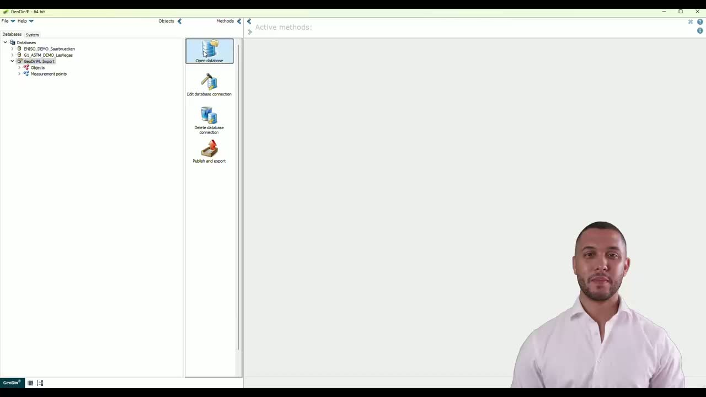
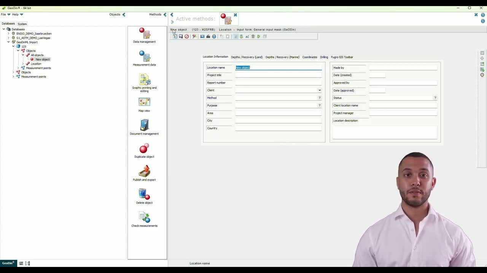
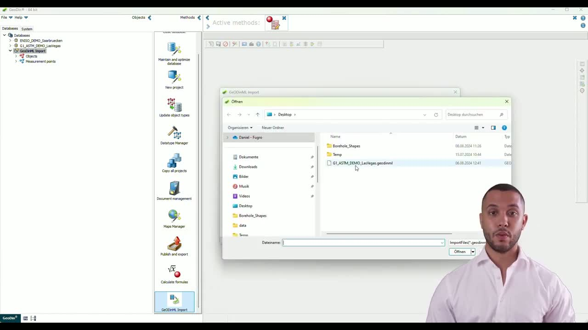
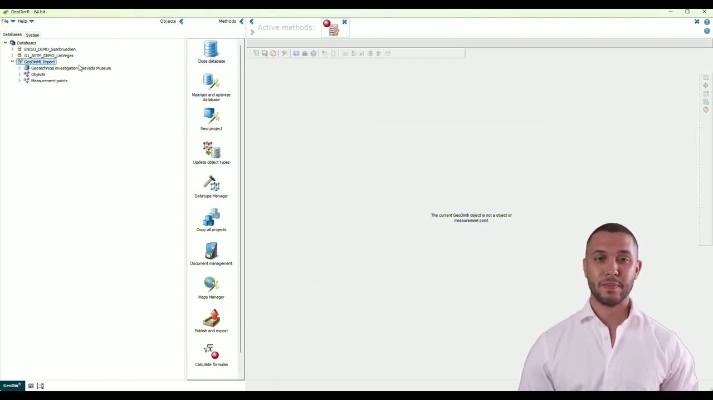

# GeoDinML Import

**GeoDinML** is the file format used to move structured geotechnical data from **GeoDin Onsite** (field) into **GeoDin Desktop** (office). GeoDin Onsite has no server front-end and cannot talk directly to a GeoDin database, so GeoDinML files are the bridge.

This page covers what GeoDinML is, the field-to-office workflow, how to use a GeoDinML file as a project metadata source, and a step-by-step import procedure.

## Field-to-office data flow

The basic loop:

1. In Onsite, click `Export to GeoDin` (or `Publish`) to write a GeoDinML file.
2. Move the file to the office (cloud folder, file delivery, etc.).
3. In Desktop, run the GeoDinML importer to bring the records into your database.

On `Publish as Complete`, Onsite generates the full set of deliverables (`.GDOF`, PDF, GeoDinML, AGS) and places them in the shared delivery folder.

### Which Onsite forms produce GeoDinML

Only two form types currently produce GeoDinML output:

- The **G1 drilling form**.
- The **Step 3 form** (ISO standard).

The **picture log form** does **not** produce GeoDinML — it produces a PDF with embedded thumbnails plus the original JPEG/PNG source files. These can be delivered via file delivery but cannot be imported into GeoDin as structured data.


**EN ISO E2 standard is currently disabled in Onsite** because of a bug in the GeoDinML importer specifically for E2-flavoured GeoDinML. The form exists in both E2 and Step 3 flavours; E2 has been temporarily hidden to prevent users from creating data they cannot import. Re-activation in Onsite is a ~5-minute turnaround once the Desktop importer is fixed and released.


## Loading project metadata into Onsite via GeoDinML

GeoDinML is also the only server-less way to push a project list to field users. The intended workflow: one person centrally exports a GeoDinML file from Desktop and shares it (e.g. via a cloud folder) so that all field users pick from the same canonical project list.

**On the Desktop side:** export all projects to GeoDinML with "no samples, no other data, just locations".

**On the Onsite side:** in `Configuration > Integration > Project metadata`, choose between:

- **Manual** — user types the project number freely.
- **GeoDinML-based** — pull-down menu listing all projects from a selected `.GeoDinml` file. Onsite reads the client name and project name for each project automatically. A `Reload` action re-reads the file if it has been updated in the background.

Onsite never sanitizes data on import via GeoDinML beyond the standard project-number file-name sanitization rules.

***

## Step-by-step: importing a GeoDinML file



#### Step 1: Prepare the database

Open your database, then create a **dummy project** and a **dummy object** inside it. This forces GeoDin to generate the table structures the import process relies on.



#### Step 2: Remove the temporary project

Delete the dummy project once the table structures exist. The database is now ready to receive the import.



#### Step 3: Open the GeoDinML import plugin

Go to the **Methods** section and open the **GeoDinML import plugin**.


#### Step 4: Select the file and run the import

Choose the GeoDinML file you want to import and start the process. Review the records shown during the import to confirm the data being brought in.



#### Step 5: Refresh the database to view imported records

When the import finishes, refresh your database. The imported records should now appear.




---


Prefer to watch? The same walkthrough is available on YouTube:



