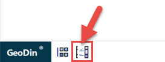
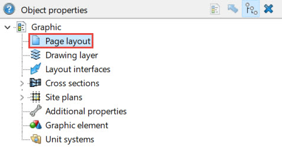
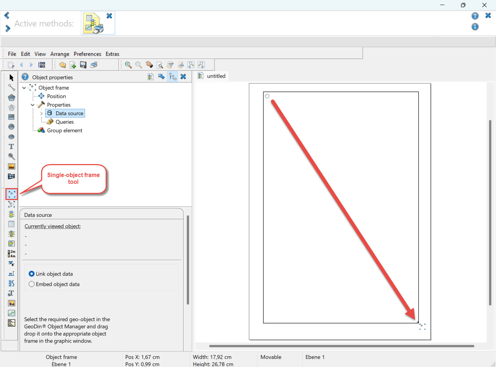
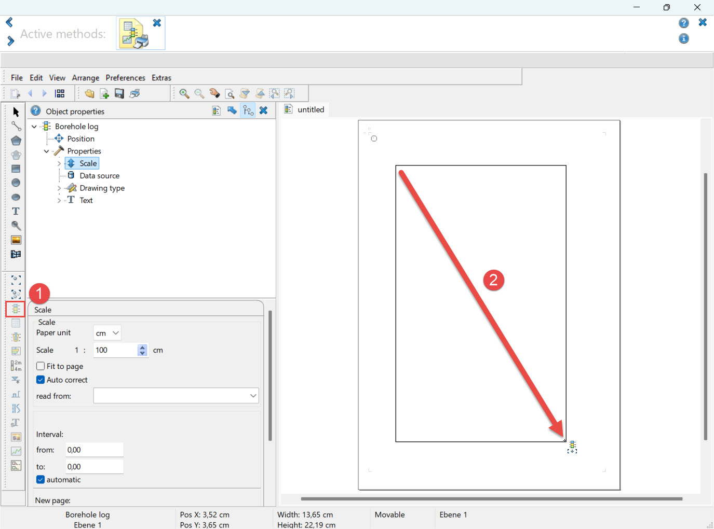
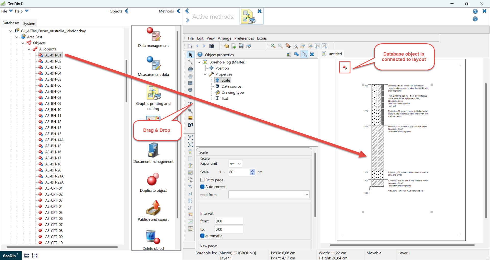
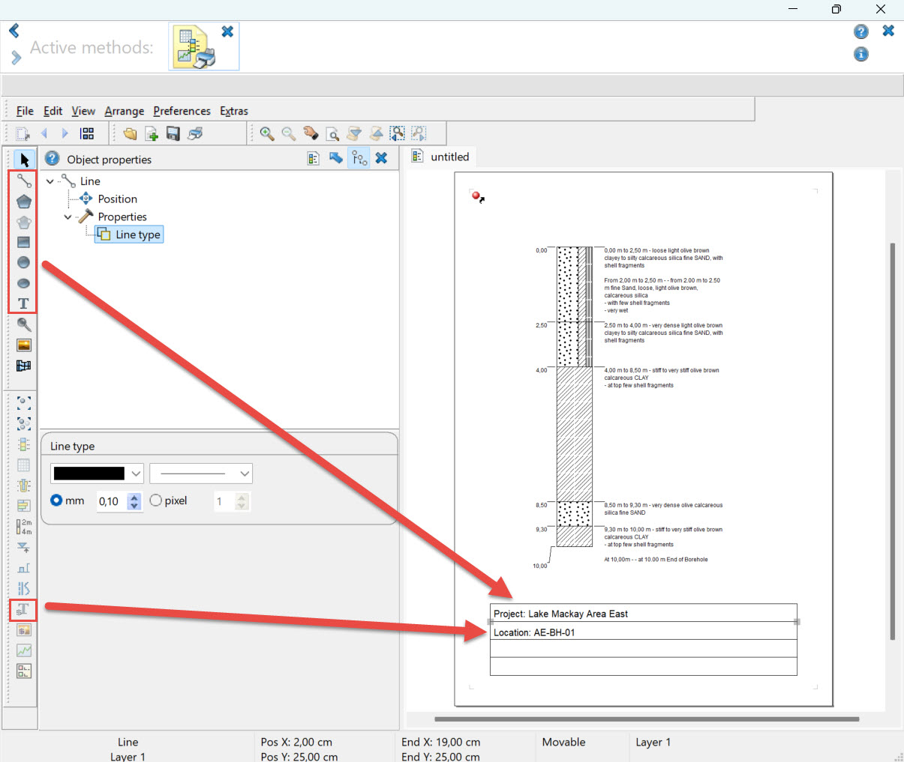

# Creating Custom Layouts

### Step 1: Create a New Layout

Open the **GeoDin Graphics Editor** by clicking the **Edit Graphics** button located at the **bottom left of the GeoDin user interface**.

This opens the layout editor where new layouts can be created, and existing layouts can be edited.

<figure><figcaption></figcaption></figure>

### Step 2: Define the Page Layout

When the graphics editor opens, a **blank A4 portrait page** is created by default.

To adjust the page size or orientation:

1. Open the **Object Properties** window using **F11**.
2. Select **Page layout** at the top of the Object Properties panel.
3. Configure the required page size and orientation.

These settings define the overall layout format.

<figure><figcaption></figcaption></figure>

### Step 3: Create an Object Frame

An **object frame** is required to link graphic elements to database data.

1. Select one of the following tools:
   * **Single‑Object Frame** – displays data for one object (e.g. one borehole)
   * **Multi‑Object Frame** – displays multiple objects simultaneously
2. Draw a rectangle on the page to define the object frame.

In most cases, it is recommended to draw the object frame to cover **the entire page**.

> The object frame is the link between the layout and the GeoDin database. It retrieves the data that will be displayed in the graphic elements.

<figure><figcaption></figcaption></figure>

### Step 4: Insert Graphic Elements

In general, simple graphic elements can be added without the requirement of creating an object frame. However, for complex graphic elements, a multi-object frame as mentioned above must be created first before we add the graphic elements.

1. Select the object frame by:
   * Clicking its **top‑left corner**, or
   * Left‑clicking anywhere inside the layout while holding **CTRL key**
2. Choose the required graphic element (for example **Borehole Log**) from the left toolbar.
3. Draw the element as a rectangle **inside the object frame**.

At this stage, the layout is **not yet linked to any database object**.\
Graphic elements will therefore appear as **gray and blue dashed placeholders**.

<figure><figcaption></figcaption></figure>

### Step 5: Link the Layout to Data

To display real borehole data:

1. Open the **GeoDin Object Manager** (tree view on the left side of the GeoDin interface).
2. Drag the required **database object** onto the layout using **drag & drop**.

The borehole log is now displayed based on the recorded layer data.

* If no layer data exists, an **empty frame with a fuchsia dashed outline** is shown.
* A **small red circle** in the top‑left corner of the object frame indicates that the layout is linked to database data.

<figure><figcaption></figcaption></figure>

### Step 6: Add Additional Information

Additional information such as headers, footers, and annotations can be added using graphic elements.

You can include:

* Project information
* Borehole metadata
* Company logos
* Titles, scale bars, and notes

Use:

* **Basic graphic elements** (lines, rectangles, static text)
* **Variable text elements** to display object‑related data directly from the database

This allows layouts to be reused as **templates** across different projects and databases.

<figure><figcaption></figcaption></figure>

### Further Reading

More detailed information is available in the **GeoDin Help (F1)** under:

**Create and Edit Graphics**
