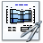

# Cross Section Layouts

The cross-section layout interfaces control how scales, axis ranges, labels, and data sequences are presented in a cross-section graphic. These settings are accessible from the cross-section properties tree after the cross-section is started. For cross-section panel settings (objects, line of section, scenarios, display settings), see [Creating Cross Sections](creating-cross-sections.md).

***

## Reference: Scales

The **Scales** interface sets the horizontal and vertical scales and is available for layouts that contain the following graphic elements: [Borehole log](../borehole-logs/creating-borehole-logs.md), [Well design](../../navigating-the-geodin-workspace/objects/well-design-data.md), [Data sequence](../../data-collection/import/data-sequences.md), and [Samples](../../navigating-the-geodin-workspace/objects/sample-data.md).

Here the desired horizontal and vertical scales of the cross-section can be defined.

If the option **Automatic page layout** is active, a suitable paper size is selected automatically. This way, the manual adaption of the page size in the **Page layout** branch of the graphic properties is not necessary.

The position of the cross-section, measured from the upper left corner, can be set in the fields **Position X** and **Position Y**. The position is also taken into account when calculating the necessary paper size.

It is possible to select different vertical scales for the ground elevation and for the borehole profiles. This is especially helpful in cases where the differences in elevation are large relative to the borehole depth. Otherwise, a reasonable scale for the start elevation would lead to a too small print of the borehole profiles.

**Scale text macros**

The scales used in the cross-section can be written automatically into existing text elements. If a layout contains text elements with the content:

* `$%SectionHorizontalScale$` - Horizontal scale of the cross-section
* `$%SectionVerticalScale$` - Vertical scale of the cross-section

the text is replaced with the corresponding scale value. This way, any scale specifications in prepared layouts are filled automatically and do not need to be changed manually.

## Reference: Axis range

In the **Interval** section the option **User defined** can be selected.

| Option | Effect |
|---|---|
| **Automatic** | Uses actual measurement values to define the lower and upper limit of the axis (minimum and maximum value). |
| **Round** | Rounds the main division ticks at the minimum and maximum of the displayed interval to an even number. |
| **Percent value** | Extends the displayed interval by the entered percentage, so the minimum and maximum values do not coincide with the diagram margins. |

For the presentation of values, the options **Logarithmic** and **Mirror axis** are also available.

**Main divisions**

The selection of the main divisions can be done by entering the division unit or by entering a number of main divisions. If the view area is set to **Automatic**, selecting **Number of main divisions** is often more useful than setting a division unit. Regardless of the overall view area (for example 0-5 or 0-50,000), a sensibly displayable number of main divisions is created.

The number of **Help ticks** and the number of **decimal places** can also be selected. The option **Cut surplus decimals** cuts surplus zeros in the labelling - especially useful for logarithmic axes, to produce labelling like: 0.001 - 0.01 - 0.1 - 1 - 10 - 100 - 1,000.

## Reference: Presentation options

If you choose the presentation type **bar** or **curve** for the series of a data sequence graph, you can interrupt the bar or curve where it is known that sections exist in which samples were not taken continuously and the bar or curve would otherwise give the impression that measured values are available throughout. Enter the length of the section from which the section is not examined.

The chosen setting applies to all series of the diagram and does not need to be set for each individual series. Besides this general setting, the option can also be selected separately for each series. For per-series configuration, see [Measurement Value Graphics](../layouts/measurement-value-graphics.md).

## Reference: Labeling

The **Labeling** layout interface offers input options for text elements and is usable for layouts that contain the graphic elements [Text](../layouts/text-macros-and-variable-text.md) and [Variable text](../layouts/text-macros-and-variable-text.md).

## Reference: Cross-section panel settings

**Graphic elements of a cross-section**

The graphic elements of the profile cross-section are stored in special drawing layers. Editing these graphic elements is possible only by changing the properties in the cross-section - they cannot be selected with the mouse. To manipulate the elements individually, the cross-section elements must be written into standard graphic layers using the **Break up cross-section** function. Each object is written into a special layer; these layers are shown in the layer list with a cross-section symbol, cannot be edited, but can be toggled visible or invisible.

All settings made in the cross-section - defining the line of section, changing the scale, or changing the display properties of a scenario - are visible immediately. Display property changes are automatically applied to all applicable objects.

**Starting a cross-section**

A cross-section can be started by different methods:

1. From a query or group of objects: double-click the method icon  **Cross-section** - the graphics window opens, the cross-section starts, and all objects of the query are loaded into the site plan.
2. From the menu **Extras** > **Cross-Section** in the graphics window - starts the cross-section without objects added automatically. Objects can be added manually by drag and drop into the **Cross-section Objects** window.
3. By navigating to the **Cross-section** branch in the properties of the current graphic - select the desired cross-section and click **Start** to make the settings branches available.

**Start and Close**

To start or resume work on a cross-section (and thus the contained graphic elements), use the **Start** switch. The branches for selecting objects, defining the line of section, setting the scales, and changing the cross-section scenarios are displayed. The **Close** switch ends editing the cross-section and the branches with the settings are hidden.

**Refresh cross-section**

With this button, the objects in the cross-section are read again from the database and the cross-section is refreshed. Use this option to transfer changes made to data in the database to the cross-section.

**Options**

Defines how the objects in the cross-section are stored in the cross-section graphic.

| Option | Behavior |
|---|---|
| **Save object data in the cross section graphic** | Borehole data is saved in the graphic file. Changes to the data in the database have no effect on the graphic when the file is reopened (static cross section). No database connection is required to edit or share the file. Not available if the cross section contains elements that require a database connection, for example data sequences. |
| **Save object link in the cross section graphic** | Only a link to the borehole data is saved. Changes to the data are reflected when the graphic file is reopened (dynamic cross section). A connection to the current database is required to edit the graphic. If possible, save the file in the documents branch of the current database to ensure access when reopening. |

**Break up cross-section**

If it is necessary to edit the individual graphic elements of a cross-section, the cross-section can be dissolved with the **Break up cross-section** switch. Graphic elements and layers are then unlocked and individual elements can be selected and edited normally.


The link to the cross-section is lost and cannot be restored if the cross-section is dissolved. It is no longer possible to edit the display properties for the element or set the scales of the cross-section. The loaded objects and the line of section are removed from the current cross-section.


**Drawing order**

The entire cross-section can be moved as a whole to the foreground or background relative to other objects.

With the **Visible** and **Invisible** buttons, the drawing layers of the current cross section are toggled with a single click. Use this to remove the cross-section temporarily from the graphic.

## Reference: Horizontal scale bar

The **Horizontal scale** scenario creates a horizontal scale bar in a cross-section.

By defining the **Minimum width** you can set the horizontal extent for the scale bar. Depending on the coordinate range for the cross-section, a scale bar with rounded divisions is created - the minimum width setting may therefore have a limited effect.

The positioning options allow you to place the horizontal scale bar according to your requirements.

## Layout lists

Layout lists (`.GLL`) and layout collections (`.GLC`) allow multiple layouts to be grouped for report sequences and quick access. For file formats, editing, and the GLL->GLC conversion, see [Layout Files and Lists](../layouts/layout-files-and-lists.md).


Only `.GLL` files can be declared as the standard layout list. `.GLL` files can no longer be created - use `.GLC` for creating new layout lists.

