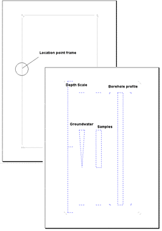

# Object Frames

The **Object Frame** is the first required element on any layout. It connects the layout to actual database objects via drag-and-drop from the GeoDin Object Manager tree, and it groups the graphic elements that belong to one borehole (or a set of boreholes). All complex graphic elements — borehole log, depth scale, samples, groundwater, data sequence, well design — must be placed inside an object frame. See [Creating Custom Layouts](../creating-custom-layouts.md) for the step-by-step walkthrough.

## Working with object frames

### Visual indicators

The object frame uses sphere icons to show its connection state:

* **White sphere** — no database object connected; layout is in template mode.
* **Red sphere** — a single database object is connected (single object frame).
* **Multiple spheres** — multiple objects connected (multi-object frame).

Selected frames show **4 grey squares** and 4 grey side lines. An unselected frame is represented by **4 grey angles** at the corners.

### Selecting a frame

The object frame is a special type — a further development — of the group frame. To select it, click in the **boundary area** of the frame, or hold the **Ctrl** key and click at any place inside the frame. The special features for the scaling of group frames are also available for object frames.

### Data linking and drag-and-drop

Drag a database object from the **GeoDin Object Manager** onto the layout to link it to the object frame. Drag-and-dropping during layout editing is for editing-mode preview only — it does not permanently link objects to the template. The permanent data source for a layout run is set through the **Data source** branch in Object Properties.

For a **Multi-Object Frame**, hold the **Command** key while dragging to add multiple objects to the data source. The data source can be defined to specify exactly which boreholes to include in the output.

### Graphic elements inside the frame

The geological graphic elements inside the object frame always refer to the borehole chosen by the frame. Individual graphic elements can be arranged in any way inside the frame — for example, a borehole log and a borehole table can be displayed side by side using the available labeling options.

The frame should be large enough to hold all the graphic elements it will contain. In most layouts it is recommended to draw the object frame to cover the entire page.

<figure><figcaption>An object frame grouping the graphic elements of one borehole: one layout page highlights the location point frame; the second shows dashed placeholders for the depth scale, borehole profile, groundwater and samples elements.</figcaption></figure>

***

## Reference: Object Frame element

### Frame types

| Type | Description |
|---|---|
| **Single Object Frame** | Displays data from one database object (e.g., one borehole) at a time. A small red circle appears in the top-left corner when a database object is connected. |
| **Multi-Object Frame** | Displays data from multiple objects simultaneously (e.g., 5 borehole logs side by side). Hold **Command** while dragging to add objects to the data source. |

An object frame therefore has to be drawn for each borehole if more than one borehole should be shown in one graph, unless a multi-object frame is used.

### Position

Object frame position can be set exactly via **Properties > Position > X**, **Y**, **Width**, **Height**. For example, setting X=0, Y=0, Width=21 cm, Height=29.7 cm produces an A4 portrait frame covering the full page.

### Converting between frame types

An object frame can be converted to or from a multi-object frame. Select the frame, right-click, and choose **Convert Object Frame**. After confirmation, the frame is converted.


Some graphic elements — **well design**, **groundwater**, **special symbols**, and **samples** — can only be used in a single object frame, not in a multi-object frame. These elements are removed during conversion, and the confirmation window lists all removed elements. If the frame is linked to a dataset in the GeoDin Object Manager, the connection is also removed during conversion; re-establish the link by dragging the object onto the layout.

