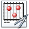

# Creating Site Plans

The site plan tool constructs a georeferenced plan of GeoDin objects in a configurable map frame, with automatic non-overlapping label placement. Objects are added from any database or project - they do not need to share a project. Scenarios control how object symbols, labels, and the map frame are drawn.

## Creating a site plan

The site plan tool can be started in three ways:

1. **From a query or group of objects:** double-click the method symbol  **Site plan**. The graphics window opens and the site plan tool starts with all objects of the query or group already added.
2. **From the graphics window menu:** choose **Extras** > **Site plan**. The site plan tool starts without objects; add the desired objects later by drag and drop from the GeoDin object manager onto the site plan or the object list in the **Objects** window.
3. **From the object properties:** navigate to the **Site plan** branch in the object properties of the current graphic, select the desired site plan, and click **Start**. The branches for creating and editing site plans are added to the object properties.

Once started, the construction workflow follows four steps:

1. Select the desired objects (see [Reference: Objects](#reference-site-plan-properties) below).
2. Define the extent of the map frame.
3. Define the map scale and the position of the site plan on the print (see [Reference: Scale](#reference-site-plan-properties) below).
4. Select and configure the presentation options for map frame, point symbols, object names, and other scenarios (see [Reference: Site plan scenarios](#reference-site-plan-properties) below).

All settings made in the site plan branch - adding objects, changing scale or display properties - are immediately reflected in the site plan graphic.

## Optional settings

* **Snap distance:** the maximum distance for connecting one point automatically to another; adjustable from 1 to 50 mm via **Preferences** > **Snap preferences**. Affects graphic elements with nodes (line, rectangle, polyline, and borehole profile).

***

## Working with site plans

**Graphic elements of site plans**

All graphic elements used for site plan construction are placed in special drawing layers of the graphic. These elements can only be edited by changing their parameters in the site plan branch - it is not possible to select and edit them directly, unless the site plan is dissolved using **Break up site plan**.

Each site plan scene (object symbols, object names, map frame, etc.) is placed in a separate drawing layer. These layers appear in the layer list with a site plan symbol and can be shown or hidden like any other drawing layer.

**Start and Close site plan**

Use the **Start** button to begin or continue editing a site plan and all objects included. The branches for object selection, map scale and position, and site plan scenarios become visible. The **Close** button stops editing mode and hides the properties branches.

**Break up site plan**

The **Break up site plan** switch dissolves the site plan element so that individual graphic elements and layers are unlocked and can be selected and edited normally.


The link to the site plan is lost and cannot be restored after breaking up. It is no longer possible to edit general display properties or set the scales of the site plan. The objects loaded are removed from the current site plan.


**Drawing order**

The entire site plan can be moved as a whole to the foreground or background relative to other objects.

**Portal links**

GeoDin-portal layouts can set references to other sites - this is the essential difference from normal GeoDin layouts.


To use portal links, activate the portal function in the advanced properties.


Portal links are differentiated by their jump target:

* **Change page** - scroll through a multipage portal layout.
* **Go to portal page** - jump to a portal layout.
* **Get portal report** - retrieve a PDF of a portal report.
* **Go to website** - jump to an arbitrary URL in the internet or intranet.
* [Show document](../../navigating-the-geodin-workspace/documents/managing-documents.md) - call a document from the GeoDin document manager or from the file system.

Selecting a link below the **portal links** node opens the properties dialogue for that link. The following properties can be set:

* **Name of the link:** free name for the link.
* **Conditions:** specify whether and to what conditions the portal function is bound:
  * **-without conditions-** - the portal function is always active.
  * **-Data set conditions-** - click the editing field to enter a data set condition (enter directly or use a frame query).
  * **-Conditions of cell content-** - condition based on cell content; enter directly or use a frame query. The **type of the cell content** must be set: **-Numeric-** (numbers and `+`/`-`/decimal point), **-Alpha numeric-** (numbers, letters, and special characters), or **-Date setting-** (standard date format, e.g. `mm.dd.yyyy`). The syntax for conditions is described in [Selection syntax](../../data-analysis/queries/conditions-and-operators.md).
* **Font colour:** font colour of the link as displayed in the browser.

**Go to website target**

To set the target of a portal link of type **Go to URL**: select the **portal links** node in the element properties tree, set the type to **"Go to URL"**, then at the **Go to URL** node enter the target as free text or choose it from a frame query.

***

## Reference: Site Plan Properties

### Objects

Selecting the **Objects** branch opens the **Site plan: Objects** window. The window is freely scalable and stays visible until another branch is selected or the window is closed.

Add objects by drag and drop from the GeoDin object manager - single objects, queries, or groups can be dropped onto the list or the site plan directly for the site plan or for orientation in the site plan. Objects already in the list are not added again. Objects from any database or project can be used; they do not need to share a project.

Selected objects are shown with a symbol and label in the site plan; the site plan can be zoomed and moved as necessary with the available tools. An object selected in the list is highlighted in red in the site plan. The coordinates, elevation, and depth of a selected borehole are displayed below the object list. Use the **Remove** button to remove an object from both the list and the site plan.

Object coordinates can be multiplied by a user-defined factor if necessary.

If borehole coordinates are in different meridian zones, transform them to a single zone by selecting the desired zone (available for the Gauss-Krüger coordinate system). For boreholes in the **southern hemisphere** (Y coordinate increasing downward), check the **-Southern hemisphere-** option to mirror the site plan.

**Map limits:** the **Map limits** fields automatically display the minimum and maximum X and Y coordinates of the selected boreholes. Edit the values to display only part of the site plan. Manually entered values are preserved when more objects are added. Use **-Set to maximum-** to set the fields to the values required for the current objects, or **-Automatic-** to automate this.

In the preview, the map frame for the object coordinates is shown with a black frame; the red frame shows the extent of the coordinates entered in the input fields.

To round corner coordinates to a convenient number (for example, a multiple of 100), check **-Round up corner values-** and enter the rounding value. The resulting rounded map frame is shown in red in the preview.

Switch between the different parts of the site plan (objects, line of section, scales, and site plan scenarios) by clicking the branch in the object properties window, or using the buttons above the site plan when the object window is large enough to hide the branches.

### Scale

**Define scale** - use this option to define the scale explicitly. The paper size is determined by the corner coordinates and the selected scale. The map size in centimetres at the selected scale is shown, not accounting for coordinate labels at the map frame border.

**Define width and height** - use this option to define the physical size of the site plan on paper. GeoDin calculates and displays the required scale. Enter optional preferred scales in the **"Round scale to"** field as comma-separated values (for example, `1,2,5`); usable scales are those values and their multiples (1, 2, 5, 10, 20, 50, 100, ...).

**Paper size:** the minimum paper size and orientation required for the site plan is displayed. Set the position of the site plan from the upper-left corner using the **"Position X:"** and **"Position Y:"** fields. With **-Automatic page layout-** active, the minimum size shown under `<Min:>` is used for construction.

### Site plan scenarios

Scenarios define the detailed appearance of the site plan. Each scenario contains a graphic element to be displayed for all selected objects - for example, one scenario for the symbol and another for the label.

Possible site plan scene types:

* [Symbol](../../configuration/fill-patterns-and-symbols.md) - displaying the point symbols
* [Variable text](../layouts/text-macros-and-variable-text.md) - labelling the objects
* [Map frame](../maps-and-site-plans.md) - display properties of the map frame
* [Text tag](../layouts/text-macros-and-variable-text.md) - tag lines

Scenes can be added as needed (also twice, if required), except for the **tag line** scene type, which can be added only once. The standard preset includes map frame, point symbol, tag line, and borehole name. Additional scenes can be added, deleted, or edited.

Use the add button to select the desired scene type from the menu. The order of scenes in the scene list determines the drawing order: the upper scene is drawn first, the bottom scene last. Change the order using the arrow icons - this matters when graphic elements overlap.

Scenarios can be saved and loaded independently of the objects currently loaded. Save with **Save** (stores as a `.gpz` scenario file in any directory); load with **Load** to reuse the scenario in another site plan. Any number of scenario files can be created for different thematic site plans.

### Site plan scene

For each scene, enter a name and choose whether the scene is visible.

**Relative scene position:** controls where scene elements are drawn relative to the base position. The effect depends on the scene type:

* **Symbol scenes:** the relative position offsets where the symbol is drawn relative to the object's original plot position. Use this to create exploded-chart presentations (for example, four circle segments drawn slightly offset from the object position).
* **Text scenes:** determines where the text is printed relative to the position of the non-overlapping labels. Only necessary when multiple scenes contain labels (for example, one scene with a large bold label and another with a smaller depth label). Without a relative position, a single variable text scene supports multi-line labels using `\` (backslash) as a line separator.

  **Example:** for a borehole name in Bold Italic plus an end-depth label in a smaller font, define two scenes:
  1. Variable text with macro `$LONGNAME$`
  2. Variable text with macro `End depth: $ZCOORDE$ m` and relative position X:0, Y:3 (moves the text 3 mm downward)

* **Map frame scenes:** defines the position of frame elements relative to the selected map extent.

  **Example:** to draw a second map frame 3 mm outside the first, add a second Map frame scene with position X:3, Y:3.

### Symbol

The **Symbol** scene type displays symbols at object locations. Symbol type, colour, and size can be defined as **Fixed** (same for all objects) or **Variable** (read from a data field in the general data for each object):

**Symbol type**

* **Fixed:** the selected symbol type is applied to all objects.
* **Variable:** the selected general data field must contain valid [Symbol tables](../../configuration/fill-patterns-and-symbols.md) entries. If no valid entry is found, no symbol is drawn for that object.

**Symbol colour**

* **Fixed:** select the color directly.
* **Variable:** the selected database field must contain a valid colour number (1-16 from [Color tables](../../configuration/fill-patterns-and-symbols.md)); invalid entries result in the symbol being drawn in black.
* **-Transparent-** background: graphic elements behind the symbol show through unfilled areas.
* **-Opaque-** background: all graphic elements behind the symbol are completely hidden regardless of unfilled areas.

**Symbol size**

Size (height and width) ranges from 0.2 to 100 mm. With **Variable** selected, the data field must contain valid entries; otherwise the symbol is drawn with a diameter of 2 mm.

**Symbol pen**

* **-As symbol color-** active: symbol lines are drawn in the same color as the symbol fill color.
* **-As symbol color-** inactive: only the filled areas are drawn in color; lines are drawn as selected separately.

## Reference: Drawing Layer Properties (Layout Snippets)

### Drawing layer properties

When a layout snippet is used, GeoDin automatically creates a drawing layer named after the snippet. Elements on this layer cannot be directly selected or edited in the layout. The following settings control how the layer is displayed:

* **Visible** - Controls overall layer visibility.
* **Screen presentation** - Defines whether the layer's elements are shown on screen. This setting affects the layout overview only, not the layout edit mode.
* **Printing** - Defines whether the layer's elements are included in print output.
* **Make available for layout quick settings** - Allows the drawing layer to be shown or hidden via the layout overview's quick settings panel.

### Column properties

**Creating columns**

In addition to manually creating columns, you can automate this process based on data fields from the chosen data source. This option is useful for reports designed for export (e.g. Excel). Further column headings options and formatting of automatic macros can be defined **Options**. It is better to use a fixed report width, independent of the number of columns.

**Report width**

Define if your report should have a fixed width.

With this setting you can fix the report width even if there are invisible or removed (if empty) columns.

Each remaining column has their width calculated proportional to the report width.

**Example:**

Column 1: 20mm

Column 2: 40mm

Column 3: 50mm

Column 4: 30mm

Column 5: 10mm (invisble)

Column 6: 20mm (invisible)

fixed report width: 200mm

Complete width of the remaining columns is 20+40+50+30=140.

The outcome of this is:

Column 1: 20/140\*200=29mm

Column 2: 40/140\*200=57mm

Column 3: 50/140\*200=71mm

Column 4: 30/140\*200=43mm

**Horizontal report orientation**

This setting is only active when the report width is not fixed and coulmns are either invisible or empty columns removed. Hence the report will be smaller than the element frame would allow and can be positioned horizontally. The default orientation setting is left

**Vertical report orientation**

This setting is only available when the report data overflows one page. The default orientation setting is top.

_**Note:**_ _Both settings are independant from element anchors, since they are only releated to their respective element container._
