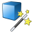
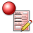
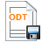

<!--
**Content status:** Scaffolded — needs screenshots and a verification pass against the current GeoDin release
**Source quality:** C (structural scaffold; specific UI labels need product verification)
-->

# First steps

This walkthrough takes you end-to-end through GeoDin's core workflow: open a database, create a project, add a borehole, describe its layers, and produce a borehole log. Each step links to the deeper reference page if you want more detail.

**What you need before you start**

* GeoDin installed and licensed — see [Install & activate](install-and-activate.md)
* The Express installation's **demo database** (installed by default) — or a database of your own

## Step 1 — Open the demo database

 Launch GeoDin. In the left-hand **Databases** panel, expand the tree to find the demo database installed with the Express setup.

Double-click the database to connect. The tree populates with any existing projects.


Databases are colour-coded — blue for local, yellow for network. The demo database is a local Microsoft Access database.


→ Reference: [Connecting to a Database](../navigating-the-geodin-workspace/databases/connecting-to-a-database.md)

## Step 2 — Create a new project

 Right-click the demo database and choose **New Project** (or double-click the **New Project** method in the ribbon). Give the project a name and save.

The new project appears under the database in the tree, with empty sub-branches for **Objects**, **Measurement Points**, and **Documents**.

→ Reference: [Working with Projects](../navigating-the-geodin-workspace/projects/working-with-projects.md)

## Step 3 — Create your first borehole

 Select your new project in the tree. In the central **Methods** ribbon, double-click **New object** (or right-click the project → **New object**).

Choose an object type — for a standard geotechnical borehole,  **(G1) Location** is the common choice — and enter identifying information (borehole ID, coordinates, elevation).

The new borehole appears under the project's **Objects** branch.

→ References:
* [Object Types Overview](../navigating-the-geodin-workspace/object-types.md)
* [Creating Objects](../navigating-the-geodin-workspace/objects/creating-objects.md)
* [General Data](../navigating-the-geodin-workspace/objects/general-data.md)

## Step 4 — Enter layer data

 With the borehole selected, double-click the **Data management** method in the ribbon. The data management editor opens — this is a parallel method, so it stays open as you work.

 Switch to the **Layer Data** section and add stratigraphic layers: depth top, depth bottom, soil/rock description, and any other fields required by your workflow. Layer colours, patterns, and consistency come from the configured dictionaries.

Save your changes. Because Data management is a parallel method, you can keep it open while navigating to other parts of the tree.

→ References:
* [Layer and Stratigraphy](../navigating-the-geodin-workspace/concepts/layer-and-stratigraphy.md)
* [Dictionaries](../navigating-the-geodin-workspace/concepts/dictionaries.md)

## Step 5 — Generate a borehole log

 With your borehole selected, open the **Layout Overview** from the bottom-left of the object manager to see the templates available for this object type.

Pick a borehole log template and run it. GeoDin produces a PDF-style log showing the stratigraphy, annotations, and any configured elements (groundwater, samples, test results).

→ References:
* [Creating Borehole Logs](../data-visualization/borehole-logs/creating-borehole-logs.md)
* [Print Preview and Layer Overview](../reporting/print-preview-and-layer-overview.md)

---

## Where to go next

| If you want to… | Go to… |
|---|---|
| Bring data in from CSV, AGS, or GeoDinML files | [Importing Data](../data-collection/import.md) |
| Build cross-sections between boreholes | [Creating Cross Sections](../data-visualization/cross-sections/creating-cross-sections.md) |
| Visualize boreholes on a map | [Getting Started with Maps](../maps/getting-started-with-maps.md) |
| Query your database | [Creating Queries](../data-analysis/queries/creating-queries.md) |
| Produce a full report | [Report Templates](../reporting/report-templates.md) |
