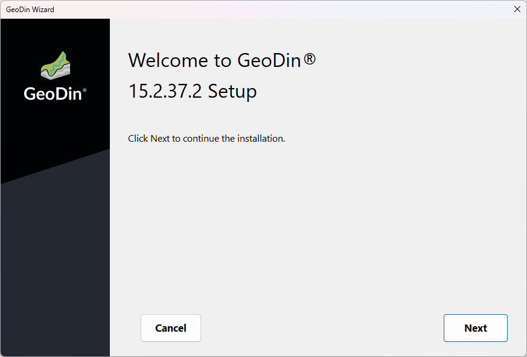
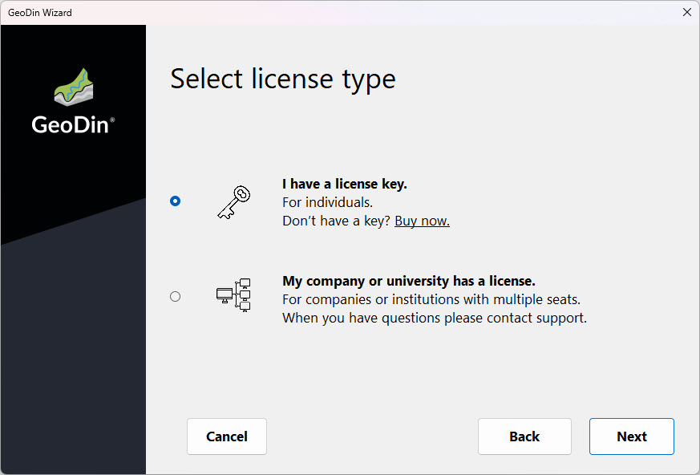
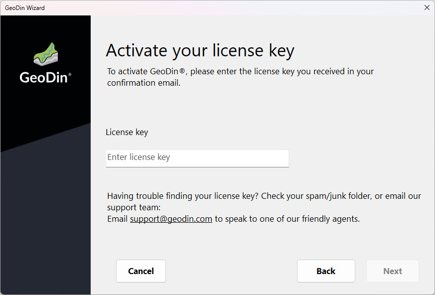
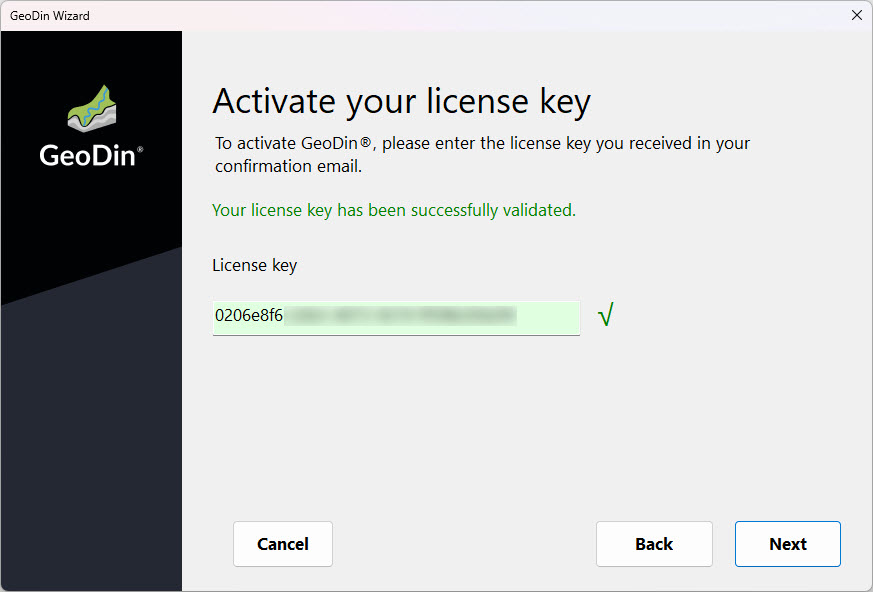
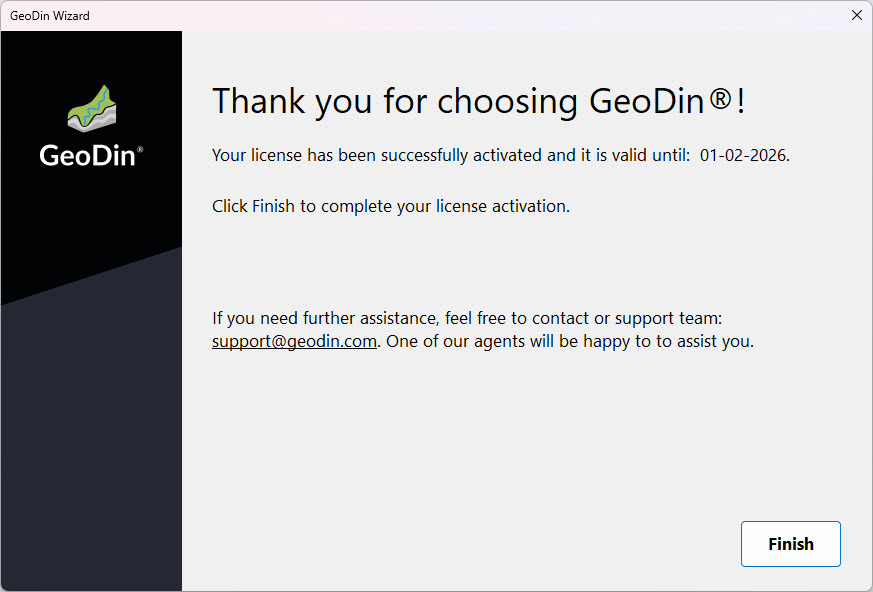
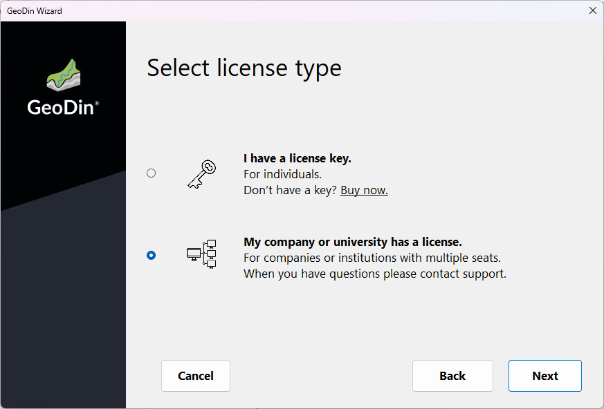
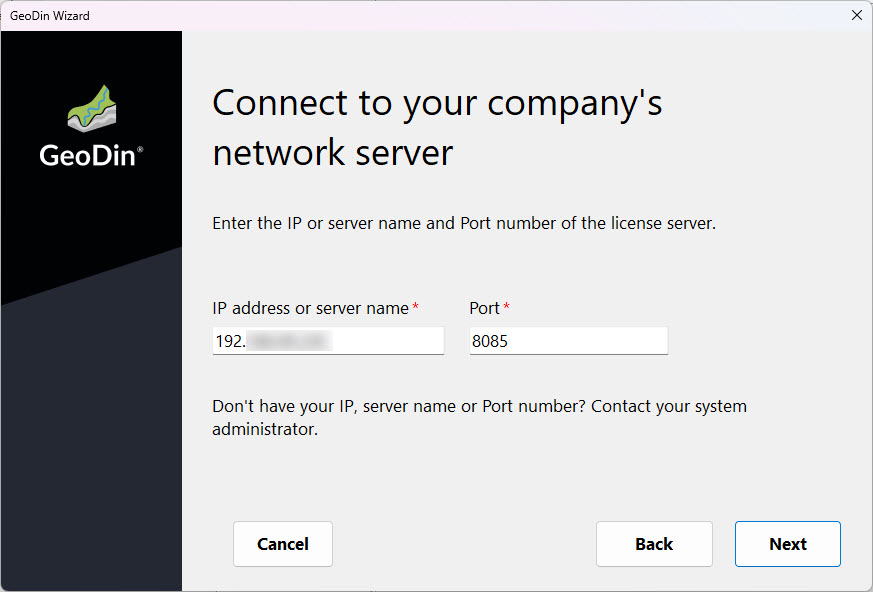
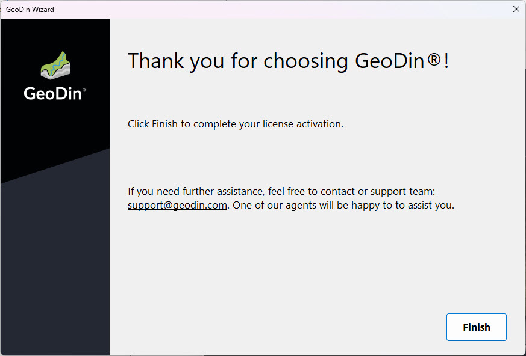

# Licensing

## Licence Activation Wizard

When you start GeoDin® for the first time, the Licence Activation Wizard will open, allowing you to enter your individual licence or connect to your professional licence.\
Click `<Next>` to continue.

<figure><figcaption>
GeoDin® Licence activation wizard
</figcaption></figure>

## Select Individual Licence Key Activation

If you have an individual licence, please select ‘I have a licence key’.\
Click `<Next>` to continue.

<figure><figcaption>
GeoDin® Licence Activation Wizard
</figcaption></figure>

## Activation of Individual Licence Key

To activate GeoDin®, please enter the licence key you have received in your confirmation email.\
Click `<Next>` to continue.

<figure><figcaption>
Activation of individual Licence Key
</figcaption></figure>

## Licence Check

Once the licence has been entered, it will be validated. An internet connection is required for this process. If the licence is valid, this will be confirmed, and you can proceed by clicking `<Next>`.\
If you wish to activate GeoDin® offline or if your licence is not recognized, please contact us at support@geodin.com.

<figure><figcaption>
Licence Check
</figcaption></figure>

## Licence Accepted

In case your licence is valid, you will receive an activation confirmation.\
Click `<Finish>` to start using GeoDin®.

<figure><figcaption>
Licence accepted
</figcaption></figure>

## Access a Professional Licence

If your company or university has a professional licence, which is stored on a server, please select ‘My company or university has a licence’.\
Click `<Next>` to continue.

<figure><figcaption>
Access a Professional Licence
</figcaption></figure>

## Enter IP Address or Server Name and Port

Your company or university will provide you with the IP address or server name and the port where the GeoDin® licence service is configured, and the GeoDin® Professional licence is stored.\
Please enter the provided IP address or server name and the port. The connection to the GeoDin® licence server will be established automatically.\
If the connection is successful, please click `<Next>` to continue.

<figure><figcaption>
Enter IP address or server name and port
</figcaption></figure>

## Licence Accepted

In case your licence is valid, you will receive an activation confirmation.\
Click `<Finish>` to start using GeoDin®.

<figure><figcaption>
Licence accepted
</figcaption></figure>
