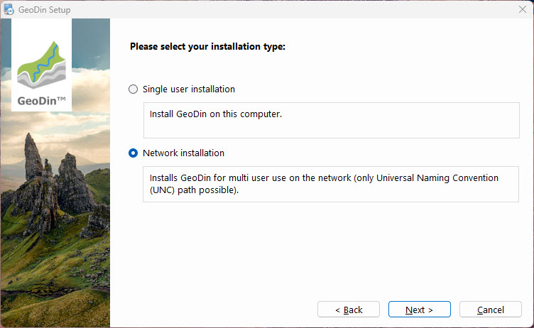
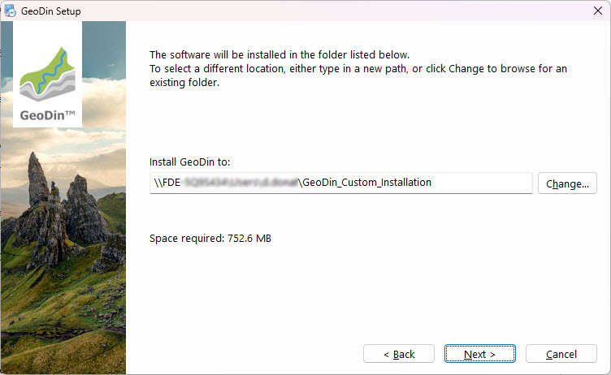
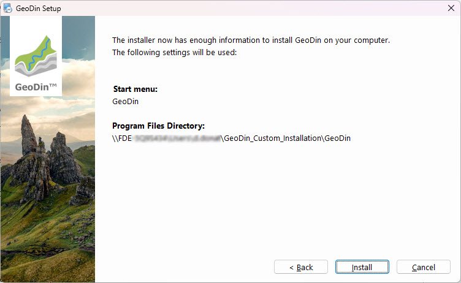
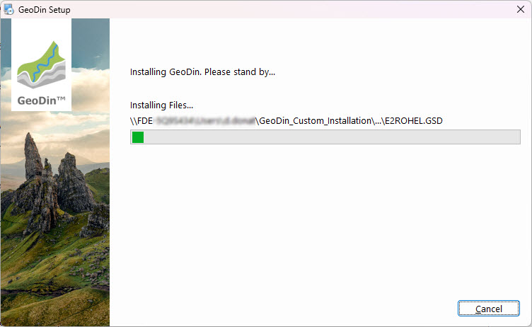
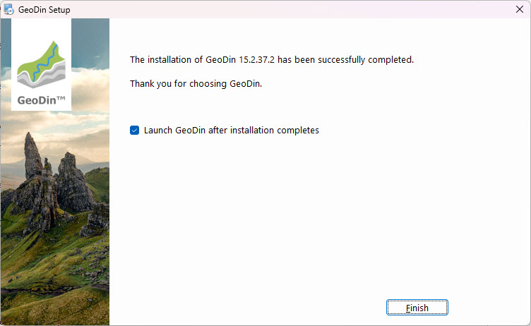

# Custom Installation

## Before You Start

To use GeoDin®, you need a valid GeoDin® license serial number. You can obtain one by visiting www.geodin.com to purchase a licence or apply for a trial licence.

Ensure you have administrative privileges on the machine where you will install GeoDin®.

You will also need the installer. A download link for the installer will be sent to you automatically via email after your purchase.

Once downloaded, start the installation by double-clicking on the file `GeoDin-Setup.exe`.

.jpg>)

## 1. Licence Agreement

Please read the licence agreement carefully and proceed by accepting it.

.jpg>)

## 2. Installation Type (Express or Custom)

GeoDin® supports many deployment configurations to meet your corporate and individual needs.

Experienced users can customize their installation. To do this, choose the **Custom installation** option.

If this is your first time using GeoDin®, choose the **Express installation**; this will quickly install everything you need to run GeoDin® on a single computer. It includes demo databases to get you started. There is a separate installation guide for the express installation.

.jpg>)

### 3.1. Single User Installation

Select the option **Single user installation** to install GeoDin® locally on your computer or **Network installation** if you want to install GeoDin® centrally on a network drive for multi-user access (for instructions on the network installation go to section 4.1 Network installation).

To confirm your choice, click `<Next>`.

.jpg>)

## 3.2. Installation Path (Single User)

Specify in which folder you want to install GeoDin®.

All directories to which the user needs write access while working with GeoDin® (e.g., layout directories, system libraries) are automatically stored in the directory `C:\ProgramData\GeoDin®`. This ensures that these folders are not stored in the `C:\Program Files` directory, for which write access has been prohibited for users without administrator rights since the Windows Vista® version.

.jpg>)

## 3.3. Installation Packages (Single User)

Select which packages you would like to install on your device. A description of the individual packages is displayed when clicking on them in the installation window. Individual packages may be disabled if they are already present on your device.

To confirm your choice, click `<Next>`.

.jpg>)

## 3.4. Summary (Single User)

The installation settings you have made for the various packages are summarized for you here.

Click `<Install>` to continue.

.jpg>)

## 3.5. Installation Process (Single User)

The installer copies files to the various directories.

Please wait for it to complete.

.jpg>)

## 3.6. Finish Installation (Single User)

The installation is now complete!

If you do wish to start GeoDin® immediately after installation, check the box labeled **Launch GeoDin® after installation completes**.

When you open GeoDin® for the first time, you can enter the license. There is a separate guide for activating your license.

Click `<Finish>` to finalize the installation.

.jpg>)

## 4.1. Network Installation

Select the option **Network installation** if you want to install GeoDin® centrally on a network drive for multi-user access.

To confirm your choice, click `<Next>`.

## 4.2. Installation Path (Network)

Specify in which network folder you want to install GeoDin® (only UNC path possible).

## 4.3. Summary (Network)

The installation settings you have made for the various packages are summarized for you here.

Click `<Install>` to continue.

## 4.4. Installation Process (Network)

The installer copies files to the various directories.

Please wait for it to complete.

## 4.5. Finish Installation (Network)

The installation is now complete!

If you do wish to start GeoDin® immediately after installation, check the box labeled **Launch GeoDin® after installation completes**.

When you open GeoDin® for the first time, you can enter the license. There is a separate guide for activating your license.

Click `<Finish>` to finalize the installation.

