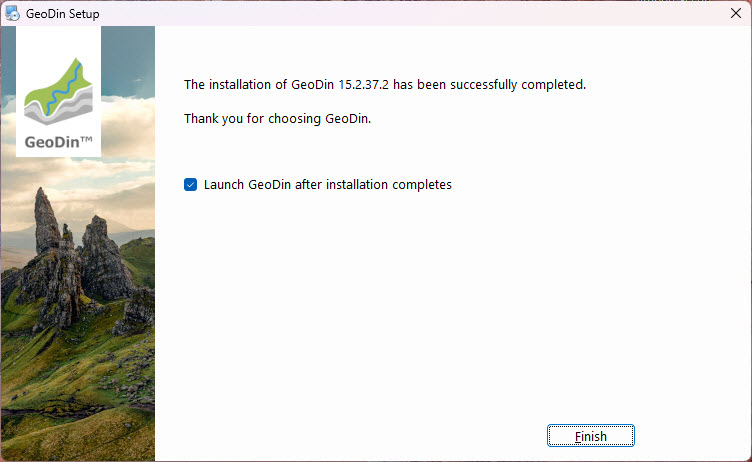

# Express Installation

## Before you start

To use GeoDin®, you need a valid GeoDin® license serial. You can obtain one by visiting the below website to purchase a licence or apply for a trial licence here:



A download link for the installer will be sent to you automatically via email after your purchase. Once downloaded, start the installation by double-clicking on the file `GeoDin-Setup.exe`. Alternatively, you can download the latest setup here.&#x20;



> <mark style="color:red;">Note: Ensure you have administrative privileges on the machine before you run the installer.</mark>

.jpg>)

## 1. Licence agreement

Please read the licence agreement carefully and proceed by accepting it.

.jpg>)

## 2. Installation type (express or custom)

GeoDin® supports many deployment configurations to meet your corporate and individual needs. If this is your first time using GeoDin®, choose the Express installation; this will quickly install everything you need to run GeoDin® on a single computer. It includes demo databases to get you started. Experienced users can customize their installation. To do this, choose the Custom installation option. There is a separate installation guide for the custom installation.

.jpg>)

## 3. Installation settings

The installation settings you have made are summarized for you here. Click `<Install>` to continue.

.jpg>)

## 4. Installation process

The installer copies files to the various directories. Please wait for it to complete.

.jpg>)

## 5. Finish installation

The installation is now complete! If you do wish to start GeoDin® immediately after installation, check the box labeled `Launch GeoDin® after installation completes`. When you open GeoDin® for the first time, you can enter the license. There is a separate guide for activating your license. Click `<Finish>` to finalize the installation.

