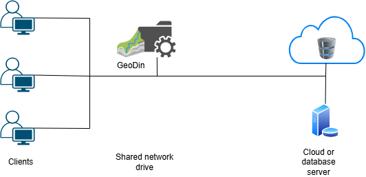

# Infrastructure and Environment Setup Guide

## 1. System Requirements

**Operating System**: Windows 10/11 64-bit

**Database Clients or DLLs 64-bit** (depending on the database used):

* **MS SQL Server**: SQL Server Native Client or ODBC driver
* **PostgreSQL**: PostgreSQL ODBC driver (psqlODBC)
* **Oracle**: Oracle Instant Client
* Alternatively, the required DLLs can be placed in the GeoDin `BIN` directory
* **MS Access**: Recommended only for single-user environments and smaller projects

## 2. GeoDin Installation

Install GeoDin using the provided setup. Choose between the following options:

* **Client Installation** (standard installation)
* **Network Installation** (installation in a UNC path)

### Network Installation

If GeoDin is used by multiple users within a network, it is recommended to install the software on a shared network drive. This offers the following advantages:

* **Centralized Configuration**: Everyone accesses the same configuration file (e.g., database connections, dictionaries, GeoDin layouts), which avoids inconsistencies.
* **Simplified Maintenance**: Updates and changes only need to be made once.
* **Reduced Administrative Effort:** No separate installation required on each client PC.
* **Controllable Access Rights**: Access can be specifically managed via the network's file system (e.g., NTFS permissions).


<figure><figcaption></figcaption></figure>

***

If you need a recommendation based on your requirements, please contact our [**Client Success Team**](mailto:geodinclientsuccess@fugro.com) to schedule a consultation.

## 3. GeoDin Databases

GeoDin uses **FireDAC** (Fire Data Access Components) to connect to databases. This is a universal framework that enables access to a wide range of databases – locally, remotely, or in the cloud.

<figure><figcaption></figcaption></figure>

#### Examples:

**Microsoft SQL Server**

```ini
DriverID=MSSQL
Server=myServer
Database=myDatabase

For SQL users:
User_Name=myUser
Password=secret

For Windows Authentication:
OSAuthent=Yes

Connection string:
Database=myDatabase;Server=myServer;User_Name=myUser;Password=secret;DriverID=MSSQL
```

<figure><figcaption></figcaption></figure>

**PostgreSQL**

```ini
DriverID=PG 
Server=myServer
Database=myDatabase
Port=5432 
User_Name=myUser
Password=secret

Connection string:
Server=myServer;Database=myDatabase;User_Name=myUser;Password=secret;DriverID=PG
```

<figure><figcaption></figcaption></figure>

**Oracle**

```ini
DriverID=Ora 
Server=myServer
Database=myDatabase
User_Name=myUser
Password=secret

Connection string:
Database=myDatabase;User_Name=myUser;Password=secret;DriverID=Ora
```

<figure><figcaption></figcaption></figure>

**Azure Cloud (Microsoft SQL Server)**

```ini
DriverID=MSSQL 
Server=tcp:myInstance.database.windows.net,1433
Database=myDatabase

For SQL users:
User_Name=myUser 
Password=secret

For Windows Authentication:
OSAuthent=Yes

For encrypted connections:
Encrypt=Yes

Connection string:
Database=myDatabase;User_Name=myUser;Password=secret;Server=tcp:myInstance.database.windows.net,1433;Encrypt=Yes;DriverID=MSSQL
```

<figure><figcaption></figcaption></figure>
