# Attach Reports

<!-- src: loom/arcgis-2d-4 -->

This workflow attaches GeoDin-generated PDF reports to the corresponding borehole points in ArcGIS Pro, so each feature carries its geotechnical report as an attachment.



> **Video chapters:** 0:00 Preparing your data in ArcGIS Pro | 0:12 Enabling attachments on the dataset | 0:28 Reviewing the attribute table | 0:46 Spotting naming discrepancies | 0:58 Creating a field to correct names | 2:09 Generating the attach key | 2:25 Adding the table with geoprocessing | 3:18 Adding the attachments | 4:03 Verifying the results

## Requirements

- The borehole point feature class in a **file geodatabase** - attachments are a geodatabase feature (created in [Export to ArcGIS Pro](export-to-arcgis-pro.md)).
- The per-object report PDFs in one folder (created in [Generate Reports](generate-reports.md) with **Create a PDF per object**).

### Step 1: Open the target dataset

In the **Catalog** pane, locate the feature class that will receive the attachments and open its **Properties**.

<figure>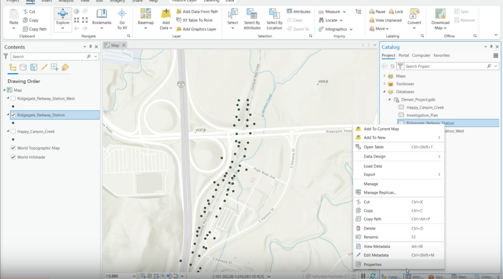<figcaption><p>Catalog pane - right-click the feature class and choose Properties</p></figcaption></figure>

### Step 2: Enable attachments

On the **Manage** tab of the feature class properties, enable **Attachments**. This must be done before any files can be attached.

<figure>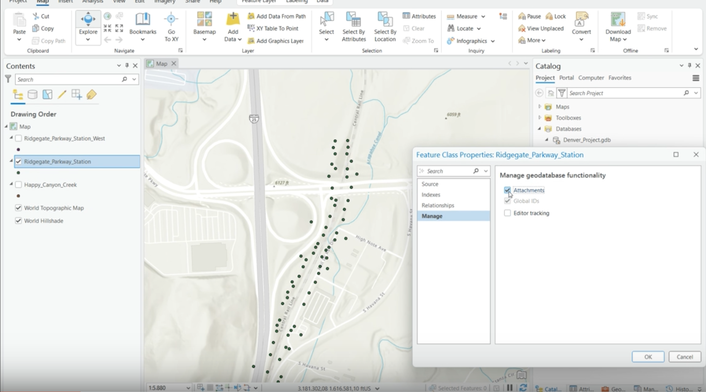<figcaption><p>Enabling attachments on the dataset</p></figcaption></figure>

### Step 3: Compare borehole names to report file names

Open the attribute table and compare the **Full location name** values against the PDF file names. Feature names use `/` (for example, `BH2/CPT2`) while the exported PDFs use `_` (`BH2_CPT2.PDF`) - so a matching key is needed.

<figure>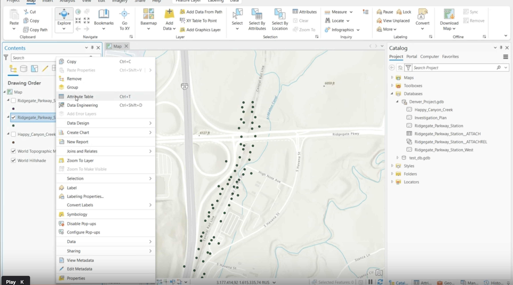<figcaption><p>The attribute table with the Full location name values</p></figcaption></figure>

<figure>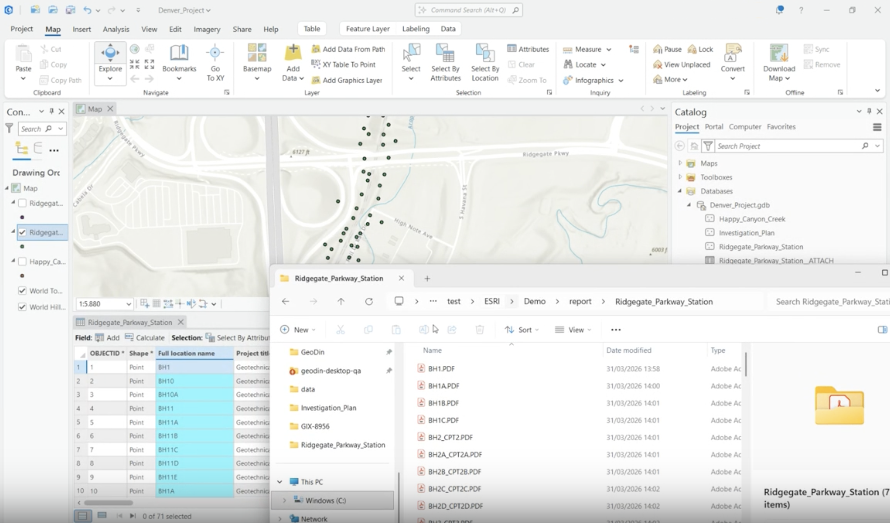<figcaption><p>The report folder - underscores in the file names</p></figcaption></figure>

### Step 4: Create a matching field for attachment keys

Add a new field named **AttachKey** with **Data Type = Text**, then **save** the field changes - an unsaved field cannot be populated. Afterwards, open **Calculate Field** on the new column.

<figure>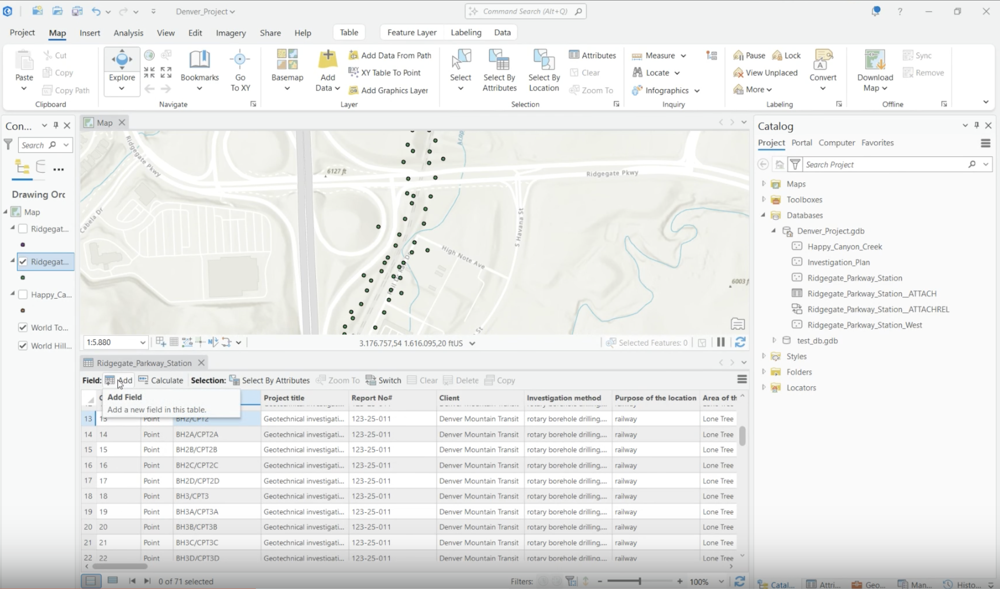<figcaption><p>Adding a field in the attribute table</p></figcaption></figure>

<figure>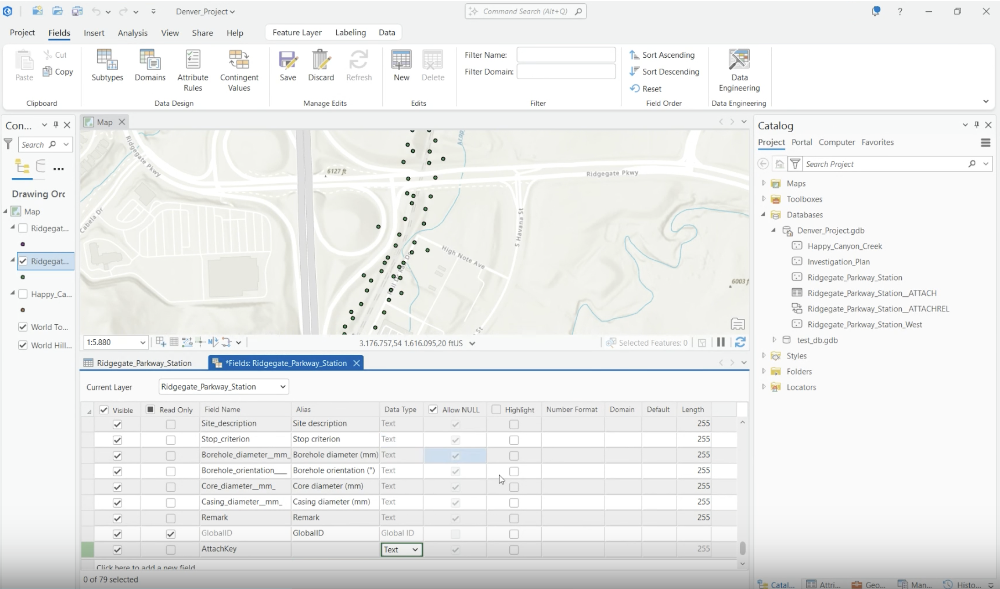<figcaption><p>Field name AttachKey, data type Text</p></figcaption></figure>

<figure>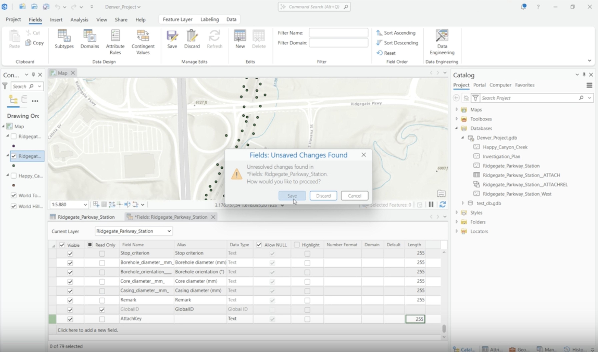<figcaption><p>Saving the field changes</p></figcaption></figure>

<figure>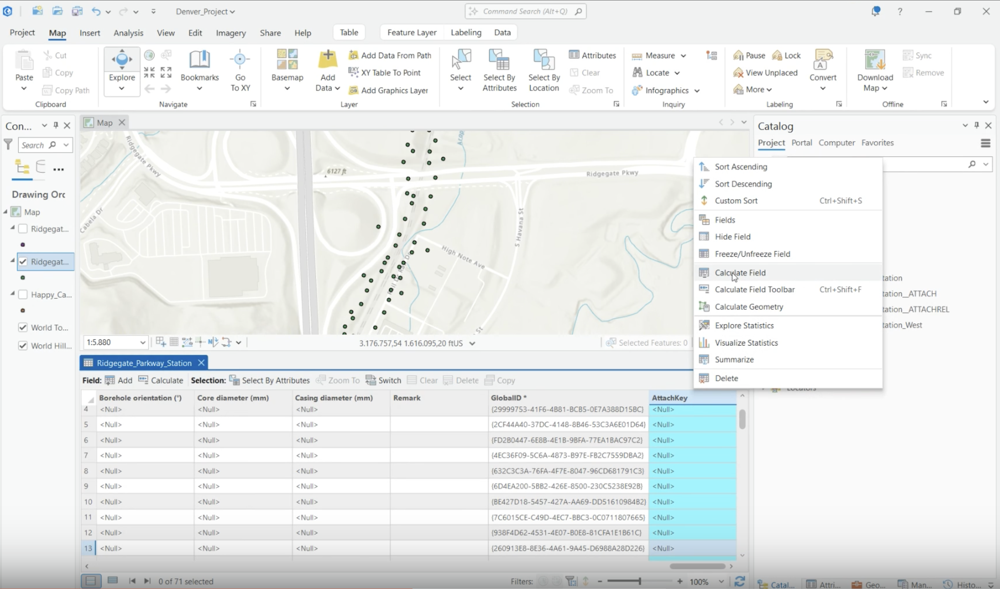<figcaption><p>Calculate Field on the AttachKey column</p></figcaption></figure>

### Step 5: Calculate the attachment key and verify the match

Calculate the key by replacing the slash with an underscore:

```python
AttachKey = !Full_location_name!.replace("/", "_")
```

Verify the populated column matches the report file names exactly - even small differences in punctuation or spacing prevent a match.

<figure>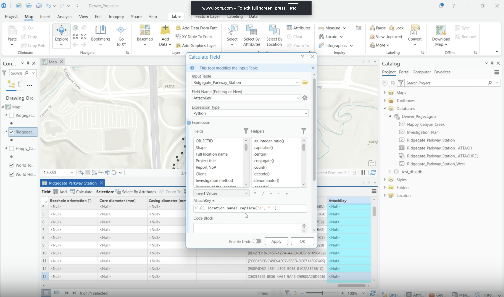<figcaption><p>The replace expression in Calculate Field</p></figcaption></figure>

<figure>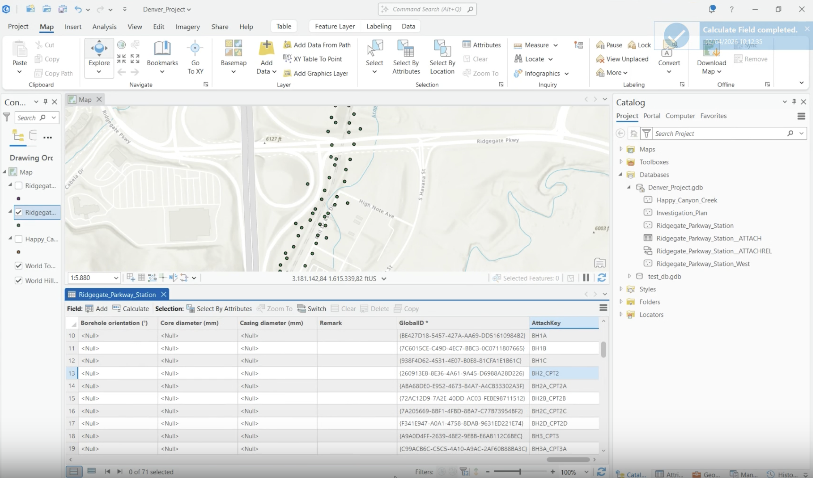<figcaption><p>The corrected AttachKey column</p></figcaption></figure>

### Step 6: Create the attachment match table

Run the **Generate Attachment Match Table** geoprocessing tool:

- **Input Dataset**: the feature class.
- **Input Folder**: the folder with the report PDFs.
- **Key Field**: `AttachKey` - **Input Data Filter**: `*.pdf`.

<figure>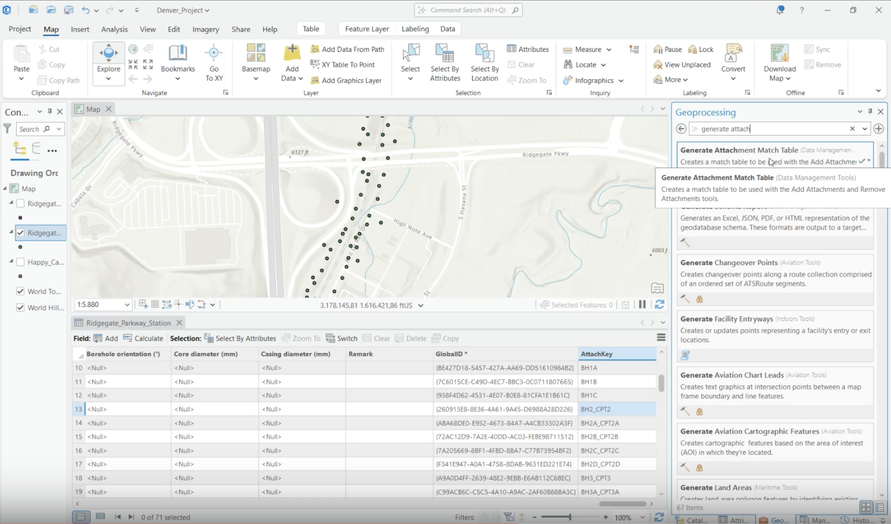<figcaption><p>Finding Generate Attachment Match Table in Geoprocessing</p></figcaption></figure>

<figure>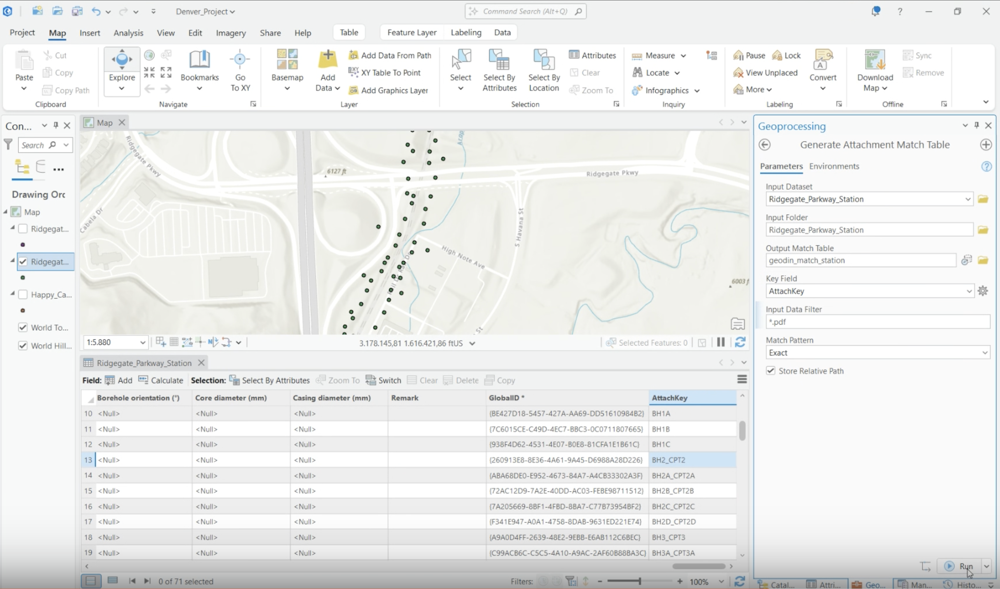<figcaption><p>Match table parameters - Key Field AttachKey, filter *.pdf</p></figcaption></figure>

### Step 7: Add the attachments

Run **Add Attachments** with **Input Join Field** = `OBJECTID`, the match table from step 6, **Match Join Field** = `MatchID`, **Match Path Field** = `Filename`, and the report folder as the working folder. Click **Run**.

<figure>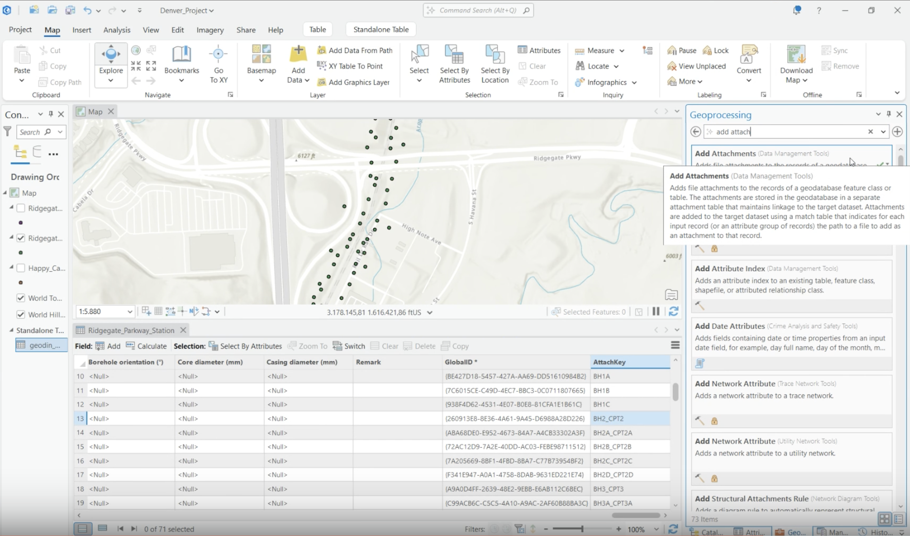<figcaption><p>The Add Attachments tool</p></figcaption></figure>

<figure>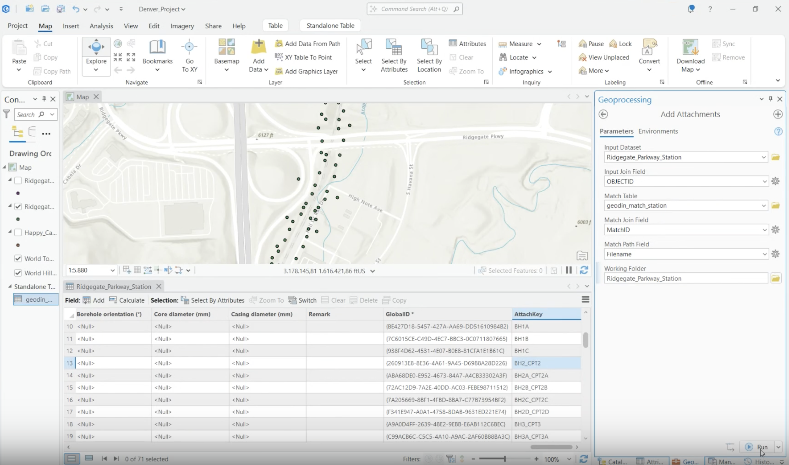<figcaption><p>Join fields OBJECTID and MatchID, path field Filename</p></figcaption></figure>

### Step 8: Check the final results

Click borehole points on the map and confirm each pop-up carries its PDF report as an attachment. Spot-check a few records of both types.

<figure>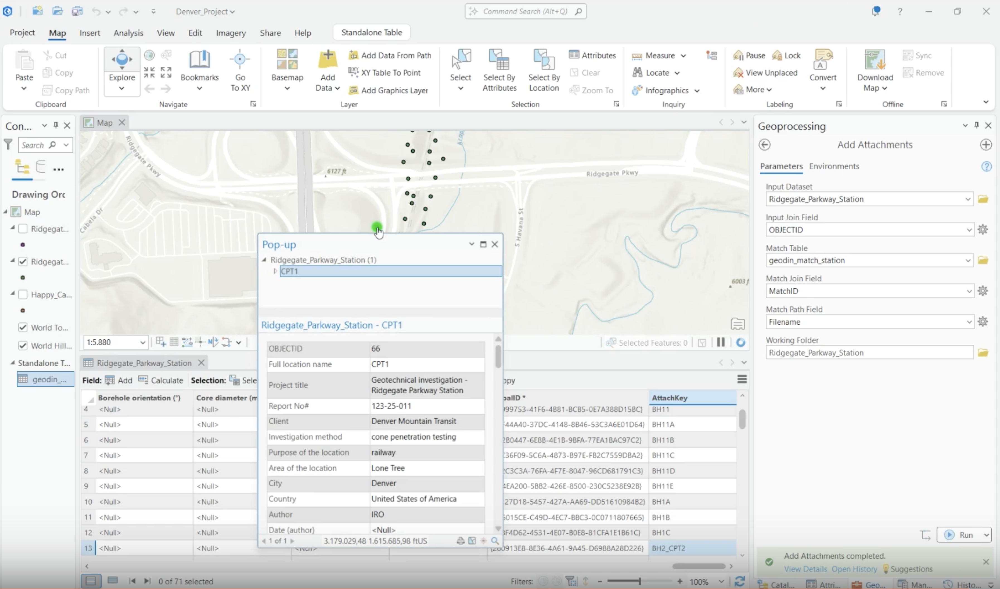<figcaption><p>A borehole pop-up with the attached report</p></figcaption></figure>

<figure>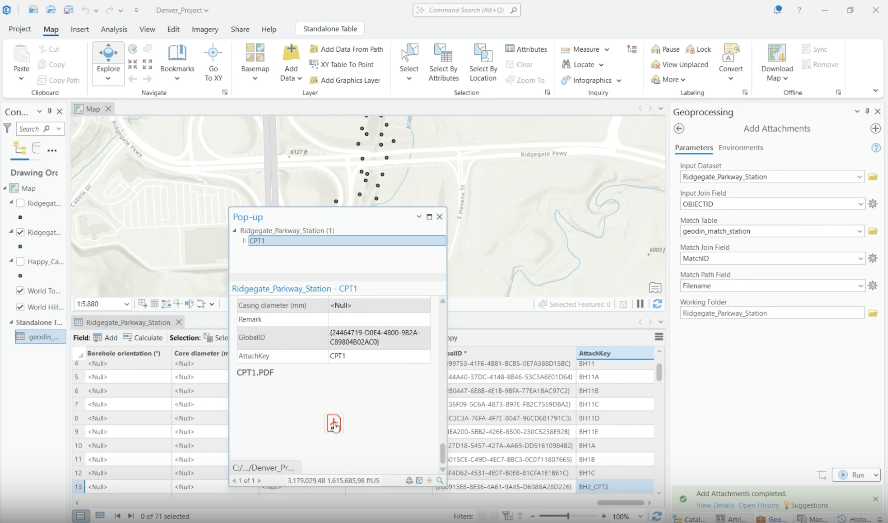<figcaption><p>Opening the attached PDF from the pop-up</p></figcaption></figure>

***

## Working with attachment matching

The key exists because two naming conventions meet here: GeoDin object names carry `/`, exported file names carry `_`. The `*.pdf` filter keeps stray files out of the match table, and spot-checking after each major step (key calculated, table generated, attachments added) catches problems while they are still one step away from their cause.

For the equivalent workflow with 3D ground-model annotations from Civil 3D, see [Attaching geotechnical reports to borehole annotations](https://docs.geodin.com/geodin-ground/workflows-and-integrations/arcgis-pro-attach-reports) in the GeoDin Ground documentation.

***

**Next step:** [Publish the data with attachments to ArcGIS Online](publish-to-arcgis-online.md).
