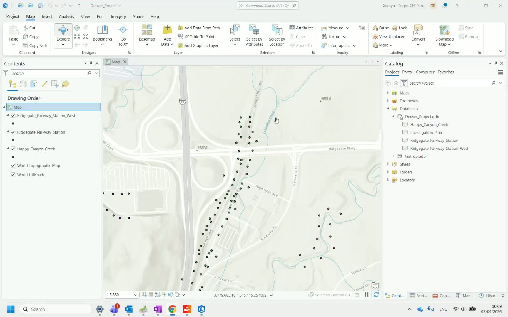
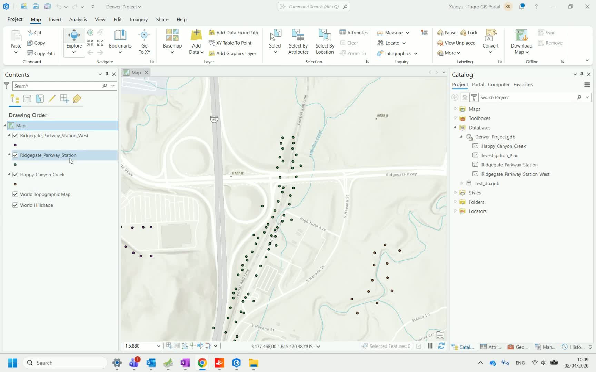
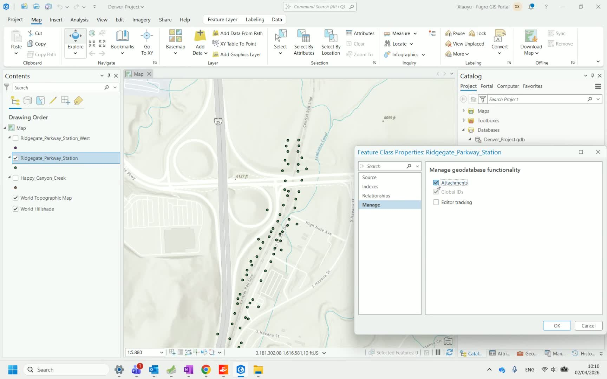
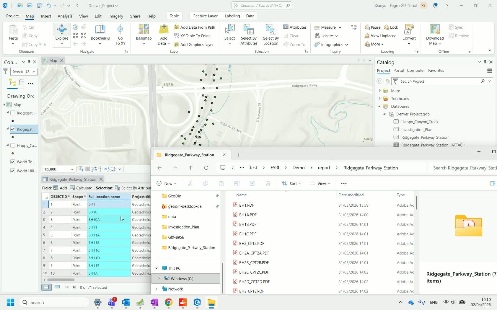
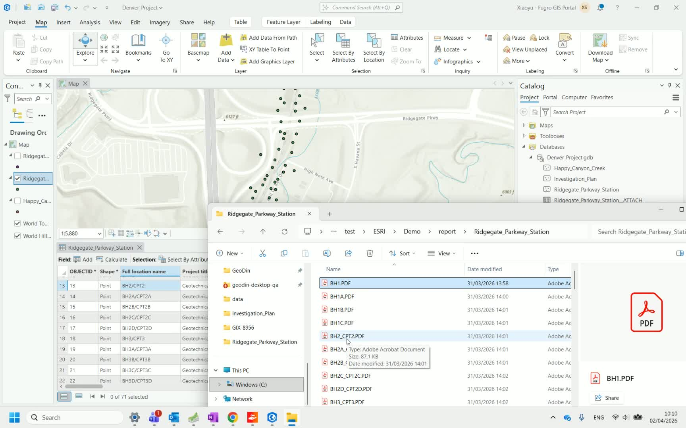
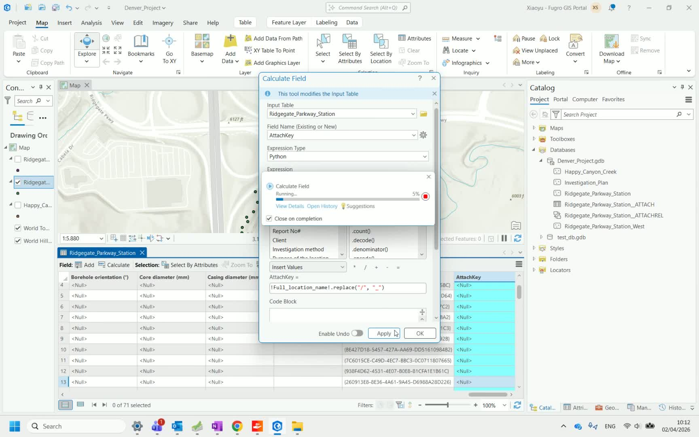
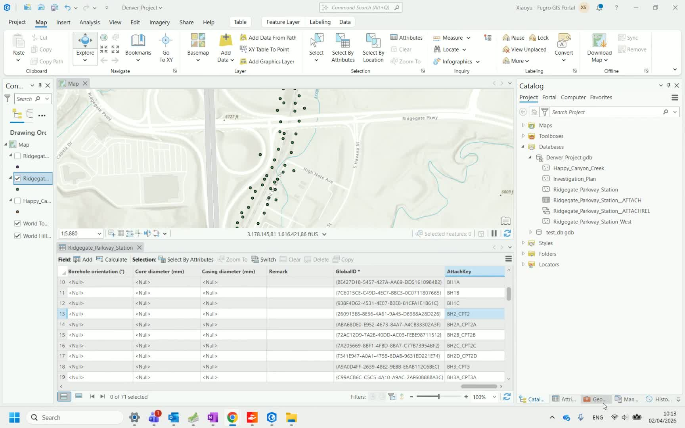
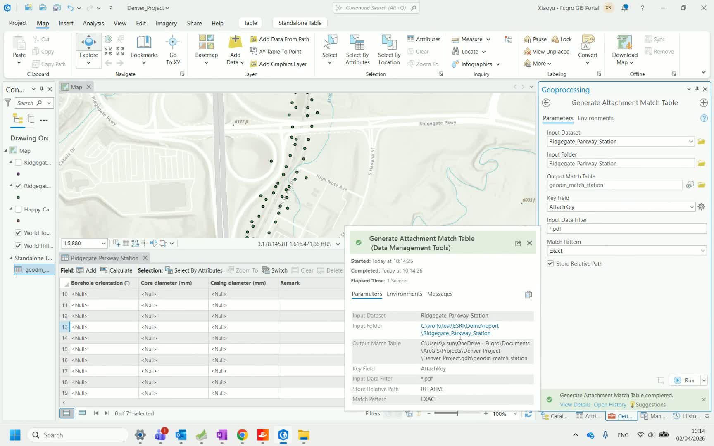
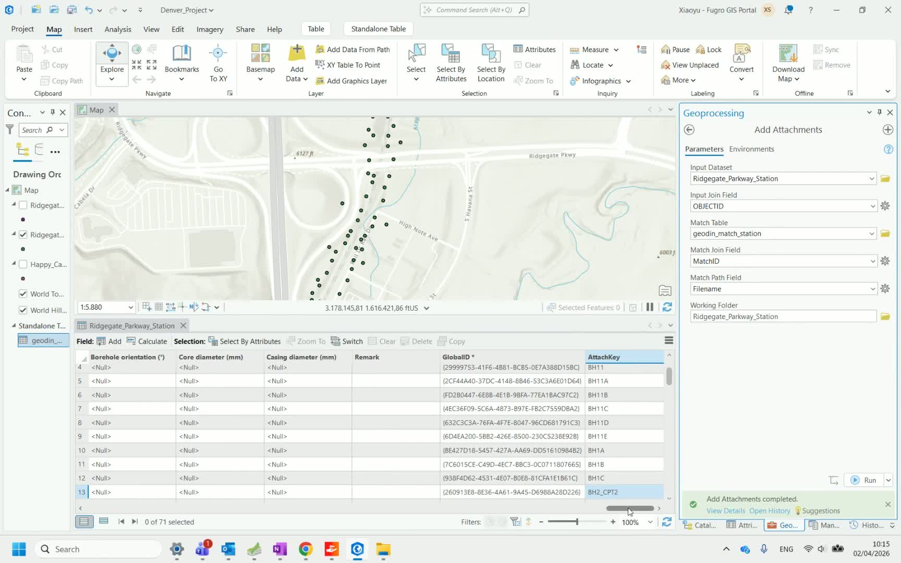

# Attach Reports

This workflow shows how to attach GeoDin-generated PDF reports to the corresponding borehole points in ArcGIS Pro, so that each feature carries its geotechnical report as an attachment.

## Step 1: Prepare the feature class

Open ArcGIS Pro and identify the feature class containing the borehole points you want to attach reports to.



## Step 2: Enable attachments

Navigate to the feature class settings and enable the **Attachments** feature for the dataset. This is required before any files can be attached to features.



## Step 3: Review the attribute table

Open the attribute table and locate the borehole name field. This name must match the PDF report filenames exactly for the automated attachment process to work.



## Step 4: Handle naming discrepancies

Compare the borehole names in the attribute table with the GeoDin report filenames. If there are discrepancies (e.g., slashes `/` in ArcGIS vs. dashes `-` in filenames), you'll need to create a matching key.



## Step 5: Create an attach key field

Add a new field to the attribute table and use a field calculation to replace any problematic characters (e.g., replace slashes with dashes). This **attach key** field must contain values that exactly match the report PDF filenames (without the `.pdf` extension).



## Step 6: Verify the attach key

Confirm that the attach key values match the report filenames. Each row should correspond to one PDF report.



## Step 7: Create a match table

Use the **Geoprocessing > Add Table** tool to create a table that maps the attach key to the PDF file paths. Run the process to build the mapping.



<!-- CORRECTION-PROPOSED: The ArcGIS Pro tool used in video D (Loom, June 2026) is "Generate Attachments Match Table" (Key Field = the attach key, Match Pattern option Exact/Prefix, input filter *.pdf) — "Add Table" appears to be a mislabel. The subsequent Add Attachments step uses Input Join Field OBJECTID and Match Join Field MatchID. Please verify and update the step wording. src: loom/arcgis-3d-D -->

## Step 8: Add attachments

Use the **Geoprocessing > Add Attachments** tool with the match table you just created. Configure the input table, match field (the attach key), and the folder containing the PDF reports. Click **Run** to execute the attachment process.



## Step 9: Verify results

Check the results to confirm that attachments have been added successfully. Click on individual borehole points to verify that their PDF reports are accessible as attachments.



<!-- src: loom/arcgis-3d-D -->
### Variant: annotation layers with multiple records per borehole

When the feature class was exported from a Civil 3D drawing, each borehole can have several annotation rows (general data, document, layer descriptions, and so on), not one row per borehole. In this case, build the attach key in two extra steps before running **Generate Attachments Match Table**:

1. Use **Select By Attributes** to isolate only the document annotation records — build the query so that **RefName contains the text** `document`. Apply the selection and confirm the correct records are highlighted before continuing.


2. With those records still selected, right-click the attach key field and choose **Calculate Field**. Make sure the calculation applies **only to the selected records** — calculating across all rows can create incorrect matches. Set **Expression Type** to **Python**, use `extract_bh(!Layer!)` as the expression, and supply this code block:

```python
def extract_bh(layer):
    layer = layer.upper()

    # Define known prefix and suffix
    prefix = "LOC_BASE-"
    suffix = "-BASIC"

    if layer.startswith(prefix) and layer.endswith(suffix):
        return layer[len(prefix):-len(suffix)] + " -"

    return None
```


The trailing `" -"` in the returned value is intentional: it makes the extracted borehole name specific enough to match only the correct report filename, avoiding accidental matches against similarly named boreholes.

***

**Next step:** [Publish the data with attachments to ArcGIS Online](publish-to-arcgis-online.md).

[Watch the full video walkthrough](https://www.youtube.com/watch?v=Xo-wNWrR5TY&list=PLfA_dsMIot34WQYVtEluk87UsZt0hb21A&index=4)
