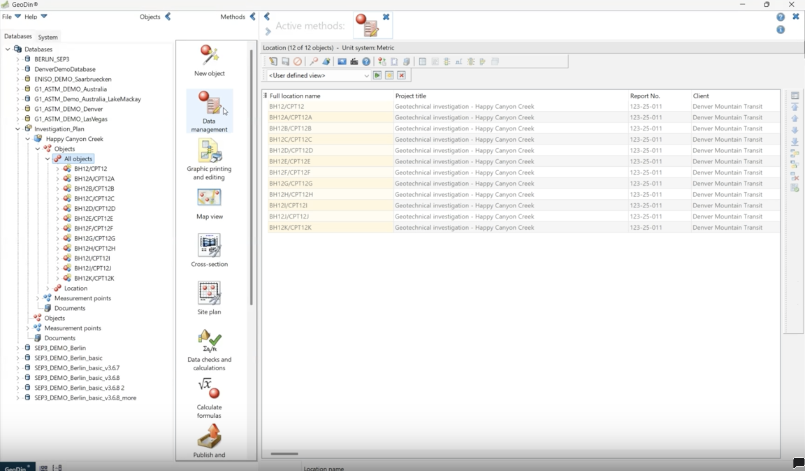
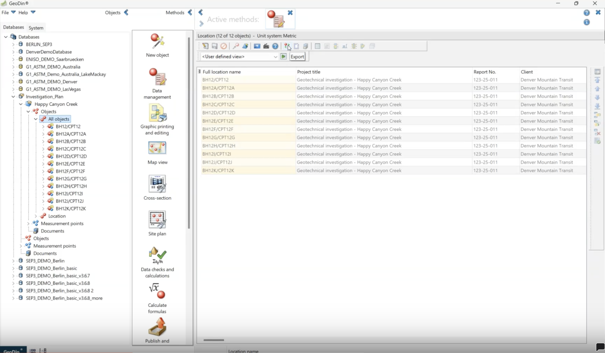
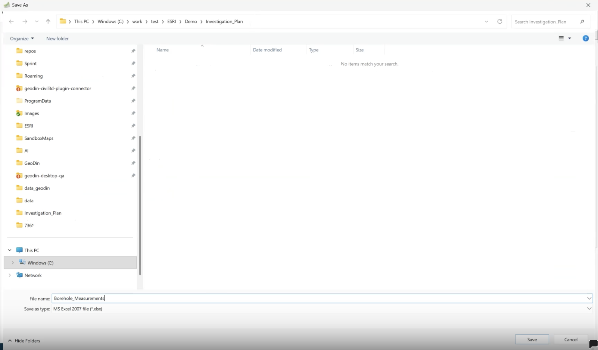
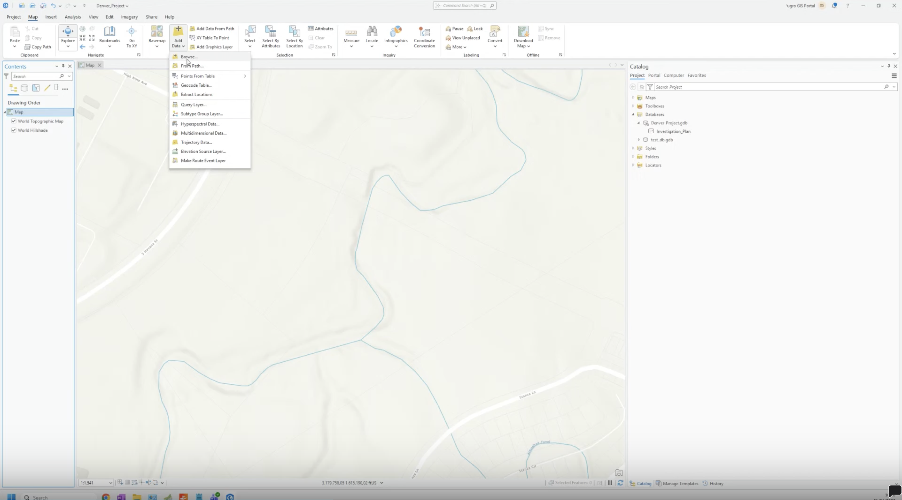
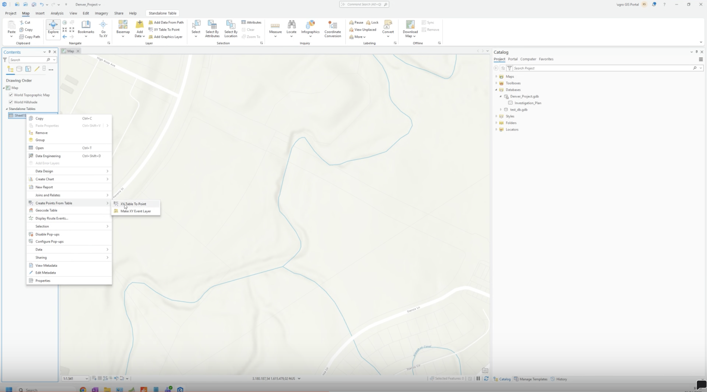
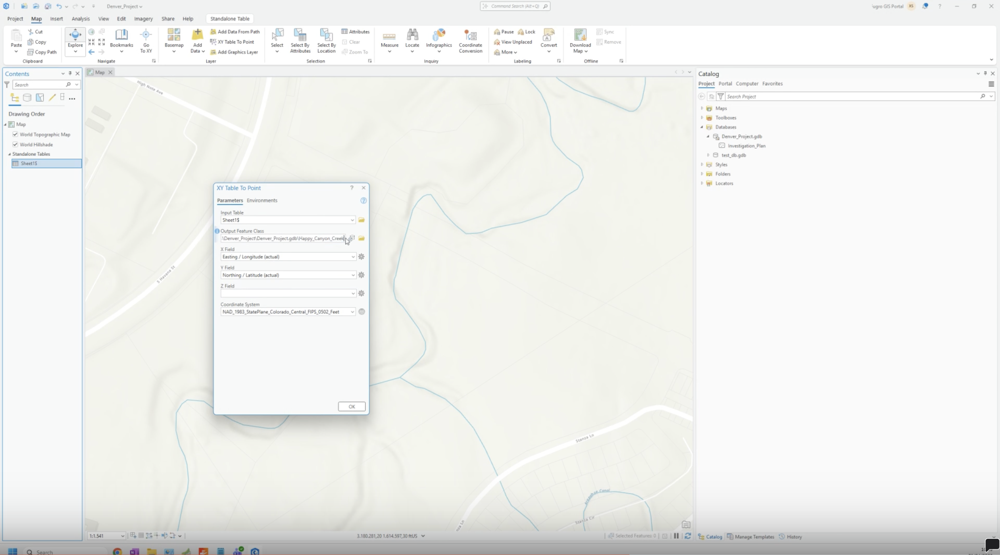
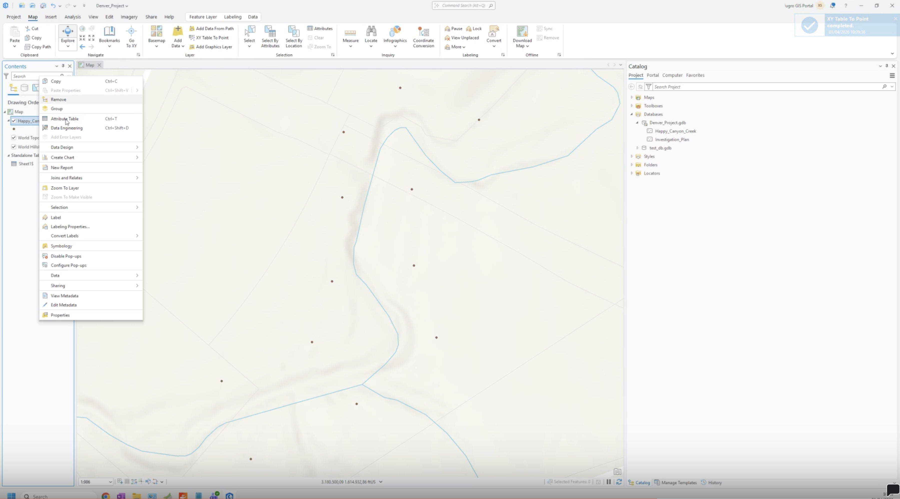
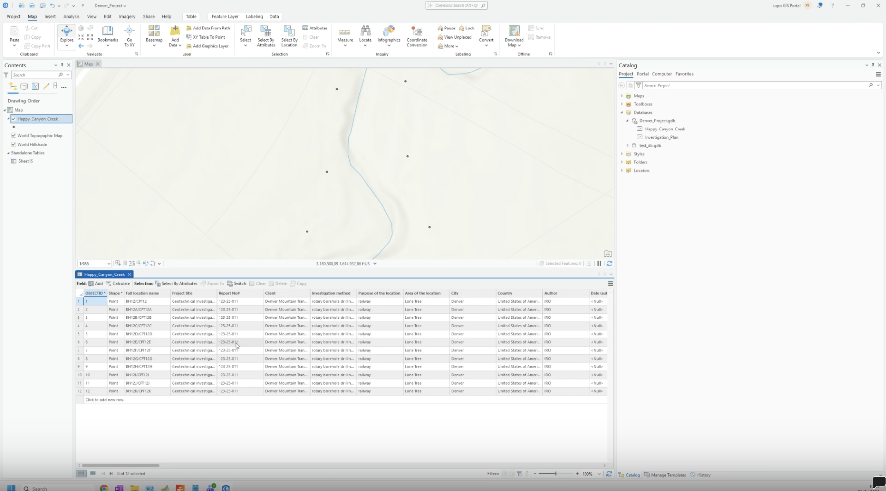
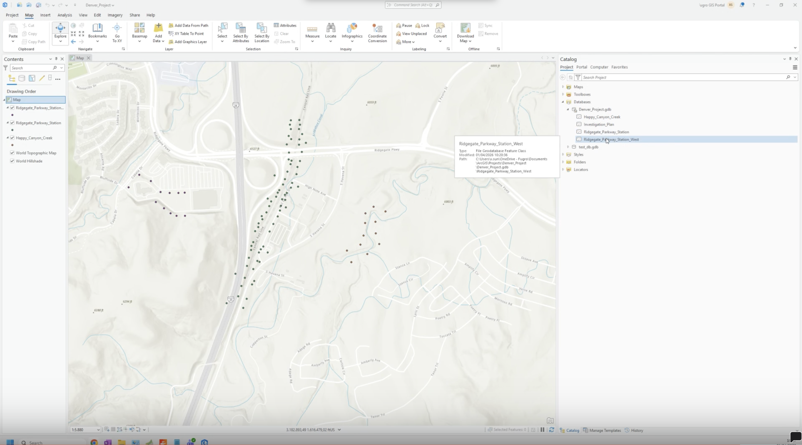
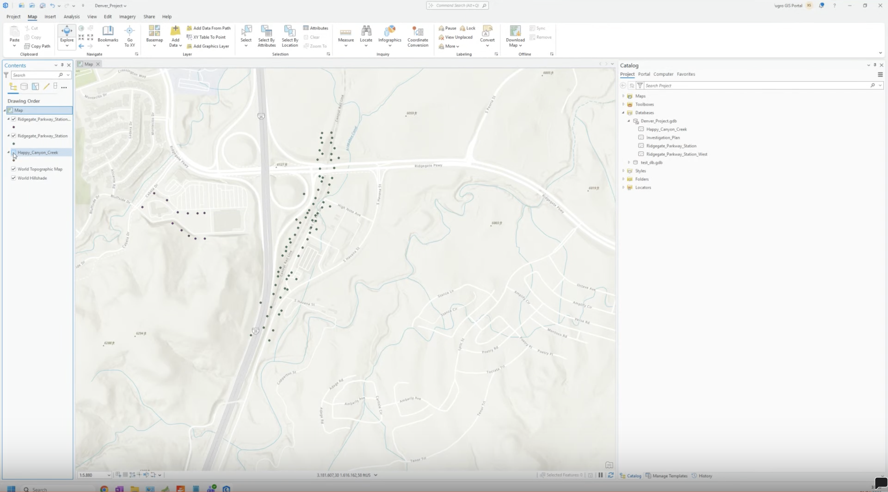

# Export to ArcGIS Pro

<!-- src: loom/arcgis-2d-2 -->

After the field investigation, this step brings the collected GeoDin data back into ArcGIS Pro: export to Excel, convert to point features, and organize the result as one feature class per investigation area.



> **Video chapters:** 0:02 Field investigation and data collection | 0:17 Accessing borehole data in GeoDin | 0:54 Exporting data from GeoDin | 1:48 Adding exported data into ArcGIS Pro | 2:13 Checking attributes | 2:25 Creating feature classes for different areas

## Requirements

- A GeoDin project with borehole data that includes coordinates (entered directly or imported per [Plan and Export to GeoDin](plan-and-export-to-geodin.md)).
- An ArcGIS Pro project with a file geodatabase to receive the feature classes.

### Step 1: Review the field data in GeoDin

Select the project's objects and open the **Data management** method. Check that the borehole records and related information are visible and complete - the view you see is what will be exported.

<figure><figcaption>
The Data management view listing the borehole records
</figcaption></figure>

### Step 2: Inspect borehole details before export

Review the additional attributes carried by each record (project title, report number, client, and so on). Whatever the view shows is exported - so ArcGIS Pro receives the full attribute set. Once verified, locate the **Export** control in the toolbar.

<figure><figcaption>
Record attributes that will travel along with the export
</figcaption></figure>

### Step 3: Export the GeoDin data to Excel

Click **Export** to generate an Excel file from the borehole dataset. Save it with a clear name in a known folder (for example, `Borehole_Measurements.xlsx`) and confirm the file opens without errors. For the full reference on export options, see [Export](../../data-collection/export.md).

<figure><figcaption>
Saving the exported Excel file
</figcaption></figure>

### Step 4: Add the exported Excel file into ArcGIS Pro

In ArcGIS Pro, use **Add Data > Browse** and select the exported worksheet. It appears in the **Contents** pane under **Standalone Tables**.

<figure><figcaption>
The Excel worksheet added as a standalone table
</figcaption></figure>

### Step 5: Convert the imported records into point features

Right-click the table and choose **Create Points From Table > XY Table To Point**. Confirm the settings before running:

- **X Field** = Easting / Longitude, **Y Field** = Northing / Latitude.
- **Output Feature Class** in the project geodatabase, named for the area.
- **Coordinate System** matching the data's EPSG code.

Click **OK** and verify the points are created.

<figure><figcaption>
Create Points From Table on the standalone table
</figcaption></figure>

<figure><figcaption>
XY Table To Point with the field mapping and coordinate system
</figcaption></figure>

> ⚠️ **Field mapping:** X = Easting and Y = Northing - swapping them, or picking the wrong coordinate system, places points in the wrong location.

### Step 6: Verify the imported point data and attributes

Check the new layer on the map and in the **Contents** pane. Open the **Attribute Table** and confirm the additional GeoDin attributes imported correctly.

<figure><figcaption>
The completed conversion and the new point layer
</figcaption></figure>

<figure><figcaption>
The attribute table with the full GeoDin attribute set
</figcaption></figure>

### Step 7: Repeat for additional GeoDin datasets

Follow the same export, import, and conversion procedure for any additional data - creating a **separate feature class per area**. Confirm each one lands in the correct area with the expected records.

<figure><figcaption>
Multiple area feature classes on the map
</figcaption></figure>

### Step 8: Organize feature classes by area

Name and store the feature classes consistently (area name = feature class name) so they are easy to identify in mapping and analysis later.

<figure><figcaption>
The organized feature classes in Contents and Catalog
</figcaption></figure>

## Optional settings

- **Coordinate System** in XY Table To Point must match the data's EPSG code, or points land in the wrong location.
- **X/Y field assignment**: X = Easting/Longitude, Y = Northing/Latitude.

***

## Working with exported feature classes

Set up the GeoDin data view once with all the fields ArcGIS needs - every later export then carries the full attribute set automatically. Use a repeatable naming convention for exported Excel files and feature classes, verify one borehole record before processing the full dataset, and when several areas are in play, document which export corresponds to which feature class.

For a 3D representation - boreholes as multipatch solids and soil boundaries as surfaces - see the GeoDin Ground workflow in the [GeoDin Ground documentation](https://docs.geodin.com/geodin-ground/workflows-and-integrations/arcgis-integration).

***

**Next step:** [Generate geotechnical reports](generate-reports.md) in GeoDin for attaching to ArcGIS features.
