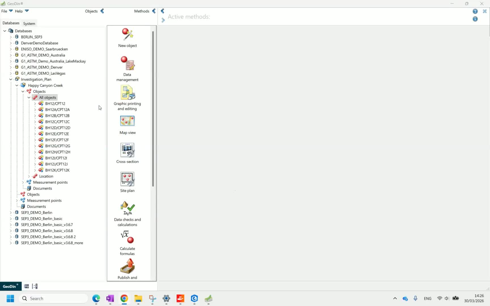
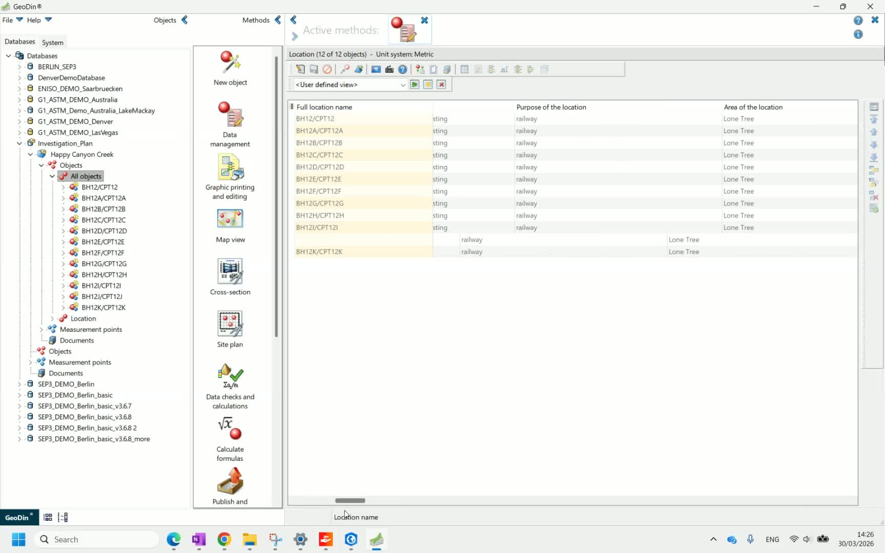
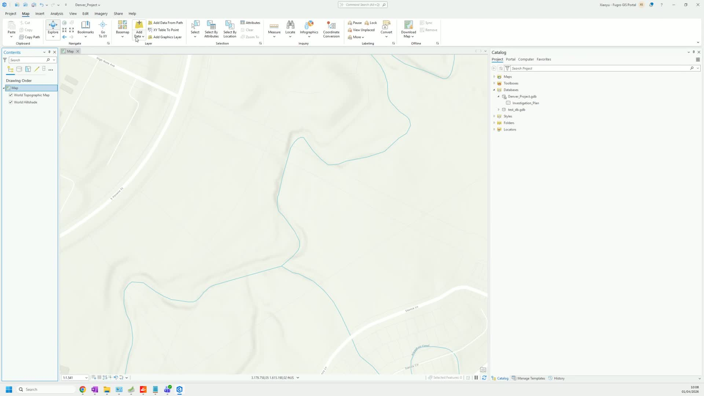
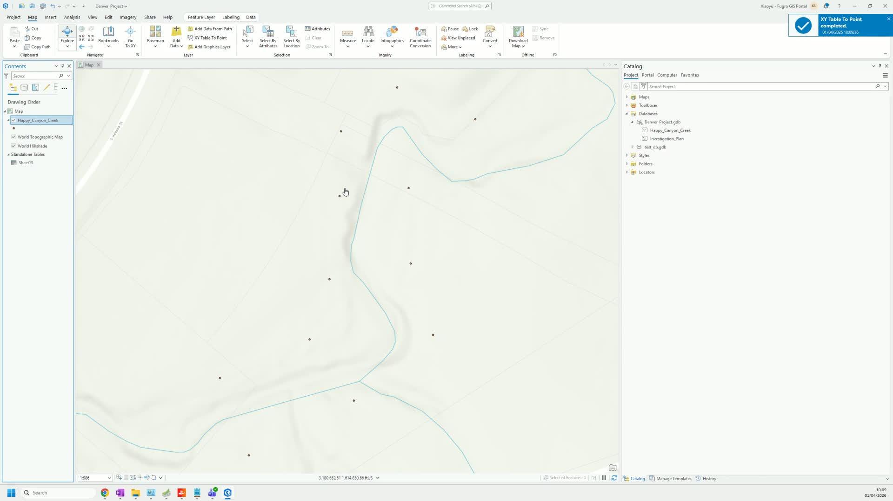
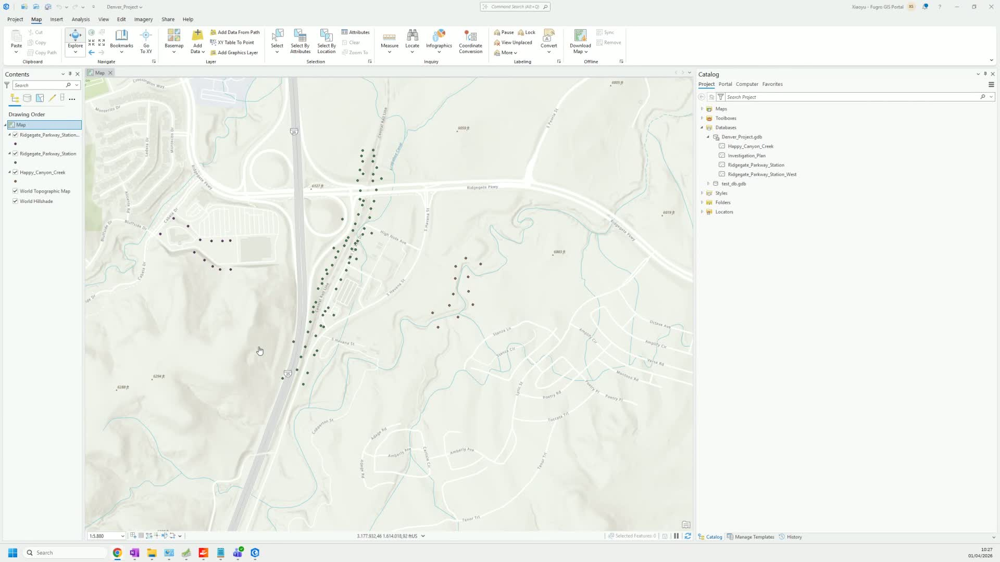
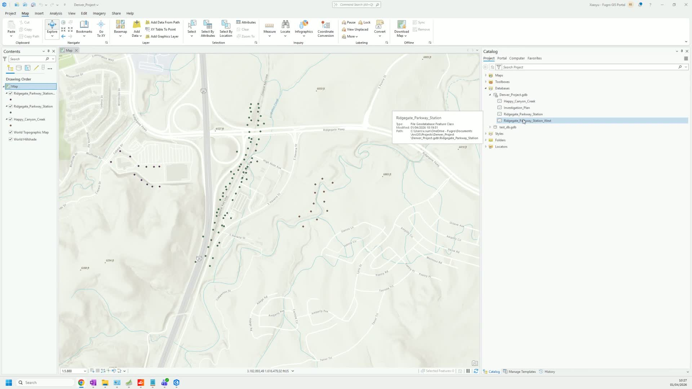

# Export to ArcGIS Pro

After conducting field investigations and entering data into GeoDin, this workflow shows how to export the enriched borehole data and import it into ArcGIS Pro as feature classes for spatial analysis.

## Step 1: Complete data collection in GeoDin

Ensure all field investigation and measurement data has been entered into GeoDin. This includes general data, layer descriptions, sample records, and any test results for each borehole.

## Step 2: Review borehole data

Navigate to individual boreholes in GeoDin to review the additional information available — layer data, samples, measurement values, and any attached documents. This is the data that will be exported alongside the location coordinates.

## Step 3: Export data from GeoDin

Export the borehole data from GeoDin to Excel. The export includes coordinates, general data fields, and any additional attributes you select.

For detailed export options, see [Export](../../data-collection/export.md).

## Step 4: Import into ArcGIS Pro

In ArcGIS Pro, add the exported Excel data and convert it to points using the coordinate fields.

## Step 5: Verify attributes

Open the attribute table in ArcGIS Pro to verify that all GeoDin data fields are correctly imported, including any additional investigation information beyond basic coordinates.

## Step 6: Create feature classes by area

For projects with multiple investigation areas, create separate feature classes for each area by repeating the import process with filtered data. This organizes your GIS data by spatial extent or project phase.

***

**Next step:** [Generate geotechnical reports](generate-reports.md) in GeoDin for attaching to ArcGIS features.

[Watch the full video walkthrough](https://loom.com/share/44be6a90c6544b1290a8a6706b548cb2)
