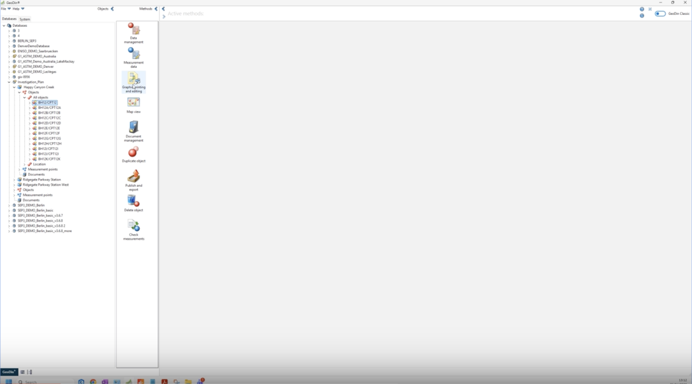
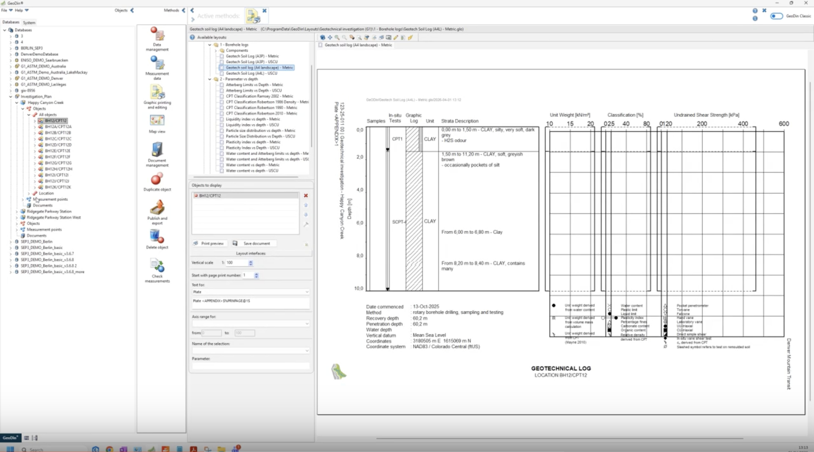
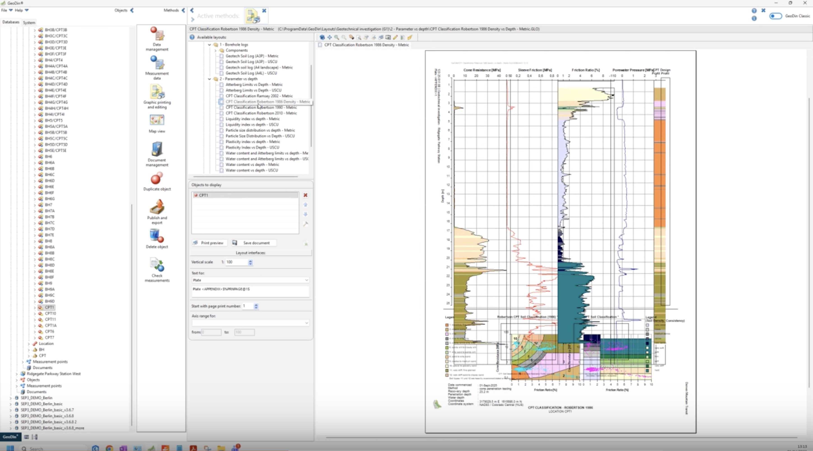
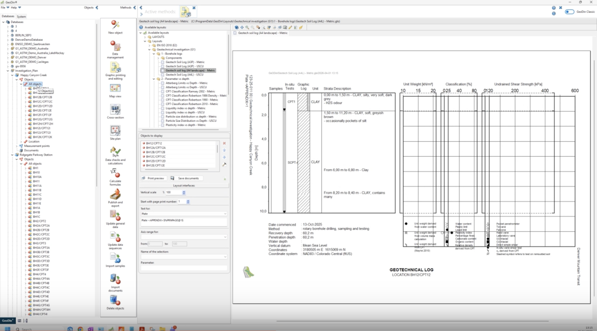
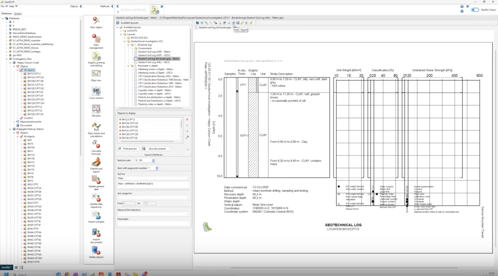
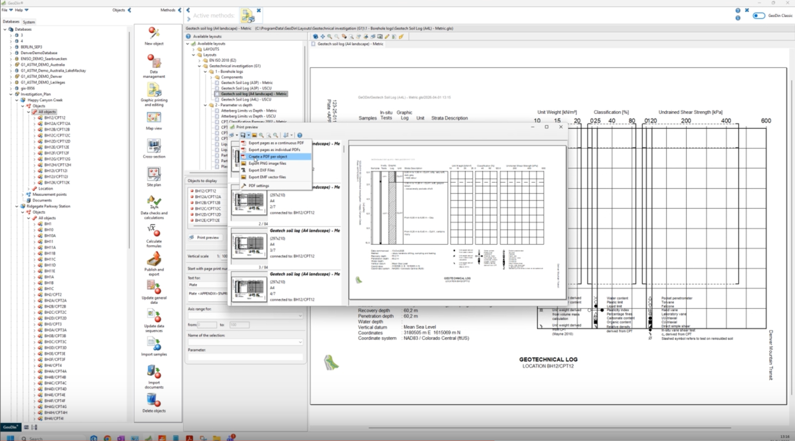
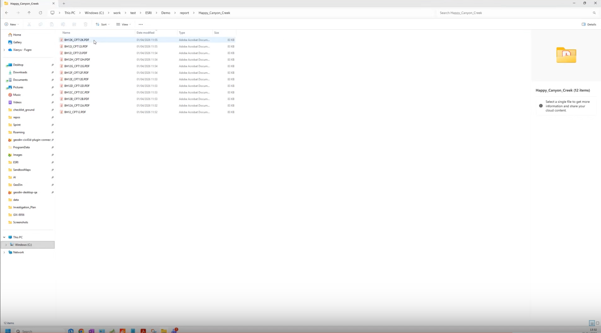
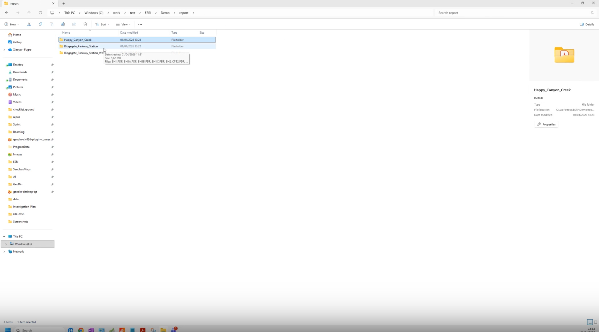

# Generate Reports

<!-- src: loom/arcgis-2d-3 -->

This workflow generates borehole log and CPT reports in GeoDin and exports them as one PDF per object - the attachment-ready files the ArcGIS workflow consumes in the next step.



> **Video chapters:** 0:00 Selecting a borehole for the report | 0:23 Choosing a borehole report template | 0:32 Generating the borehole report | 0:52 Selecting CPT data | 1:09 Generating the CPT report and accessing print preview | 1:27 Exporting the report as PDF | 1:48 Verifying the exported files | 2:02 Generating reports for additional areas

## Requirements

- A GeoDin project containing borehole and/or CPT data.
- No layout setup required - the report layouts used here ship with GeoDin (loaded from `C:\ProgramData\GeoDin\Layouts\`).

### Step 1: Open the report layouts and select an object

Select a borehole and start the **Graphic printing and editing** method. The **Available layouts** tree loads, with borehole log layouts under **1 - Borehole logs** and CPT/parameter layouts under **2 - Parameter vs depth**. Confirm whether you are working with a **borehole** or **CPT data** before choosing a layout - they use different layouts (and exist in Metric and USCU unit-system variants).

<figure><figcaption>
Graphic printing and editing with the Available layouts tree
</figcaption></figure>

### Step 2: Generate a borehole report

Choose a borehole log layout (for example, **Geotech soil log (A4 landscape) - Metric**) and verify the preview: the log, strata descriptions, and header metadata all render from the database.

<figure><figcaption>
The borehole log rendered from the selected layout
</figcaption></figure>

### Step 3: Generate a CPT report

For CPT data, choose a CPT layout (for example, **CPT Classification Robertson 1986 Density - Metric**) and verify the preview the same way.

<figure><figcaption>
The CPT classification report rendered from the CPT layout
</figcaption></figure>

### Step 4: Select the objects to output and open print preview

Drag the objects you want to output into **Objects to display** - you can drag the whole **All objects** node to queue every borehole at once. Then open the print preview and review before exporting.

<figure><figcaption>
Dragging All objects into Objects to display
</figcaption></figure>

<figure><figcaption>
Print preview of the queued reports
</figcaption></figure>

### Step 5: Export the reports as PDF

Open the export menu and choose **Create a PDF per object**. This produces one PDF per borehole - the format the attachment workflow expects.

<figure><figcaption>
The export menu with Create a PDF per object
</figcaption></figure>

### Step 6: Verify the exported PDF files

Open the destination folder and confirm one PDF exists per object. Note the naming: a `/` in the object name becomes `_` in the file name (`BH12/CPT12` becomes `BH12_CPT12.PDF`) - this matters when [attaching reports in ArcGIS Pro](attach-reports.md).

<figure><figcaption>
The exported PDFs with the underscore naming
</figcaption></figure>

### Step 7: Repeat for additional projects or areas

Generate and export reports for the remaining areas the same way, keeping one folder per project so the files stay easy to find and batch-attach.

<figure><figcaption>
Reports generated for an additional project area
</figcaption></figure>

## Optional settings

- **Layout variants** - borehole vs. CPT layouts, each in Metric and USCU unit systems; match the layout to the object type.
- **Print preview** - review before export to avoid rework; confirm the destination folder afterwards.

***

## Working with reports

Drag the whole **All objects** node into *Objects to display* to report an entire project in one run. **Create a PDF per object** produces exactly the per-borehole files the [Attach Reports](attach-reports.md) workflow consumes, and one-folder-per-project keeps batch attachment simple. When reporting multiple areas, verify each folder individually so no files go missing.

For the exhaustive reference on layouts and bulk output, see [Report Templates](../../reporting/report-templates.md) and [Bulk Print and PDF Export](../../reporting/bulk-print-and-pdf-export.md).

***

**Next step:** [Attach the exported reports to ArcGIS feature classes](attach-reports.md).
