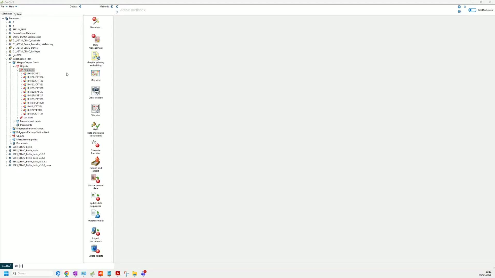
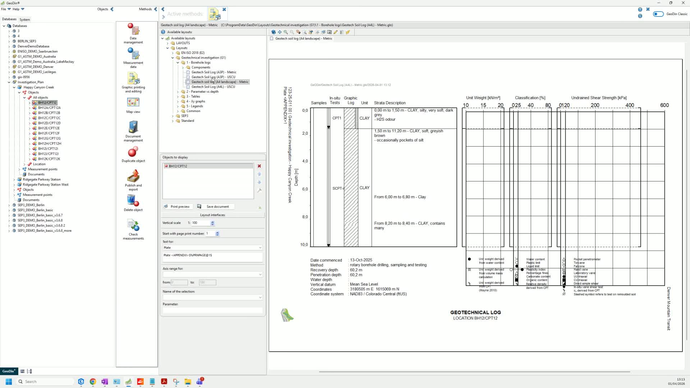
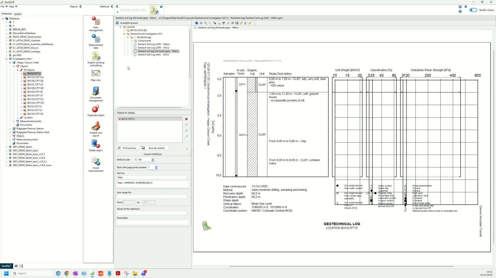
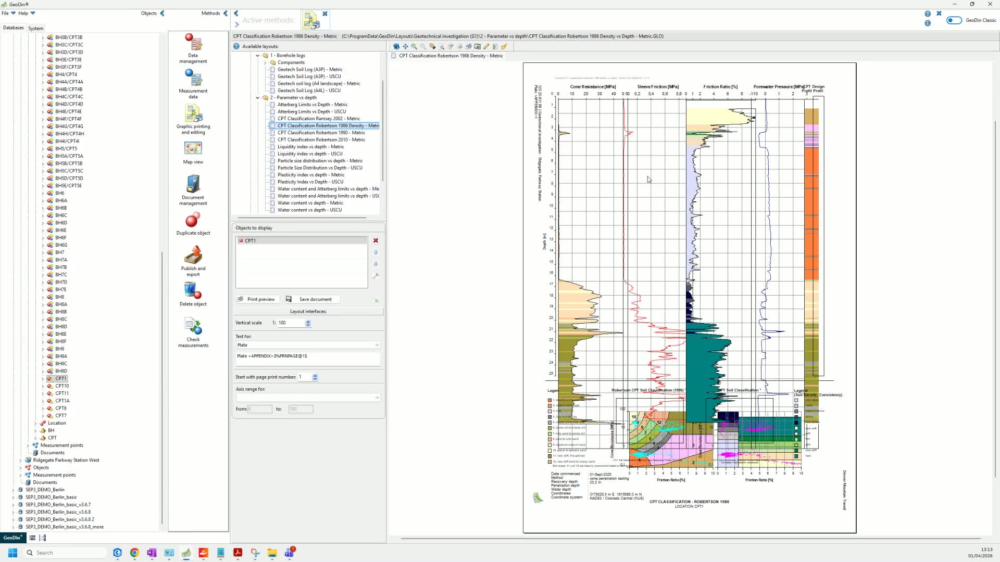
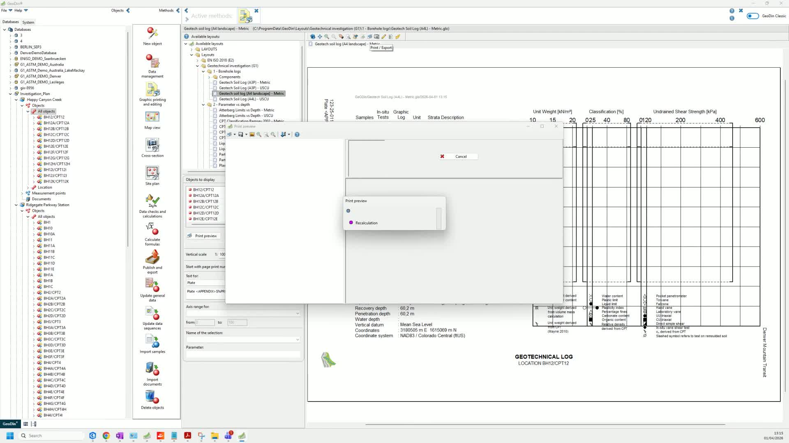
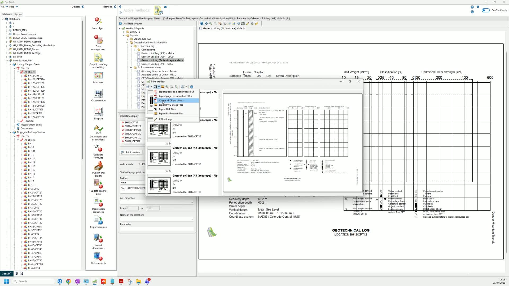
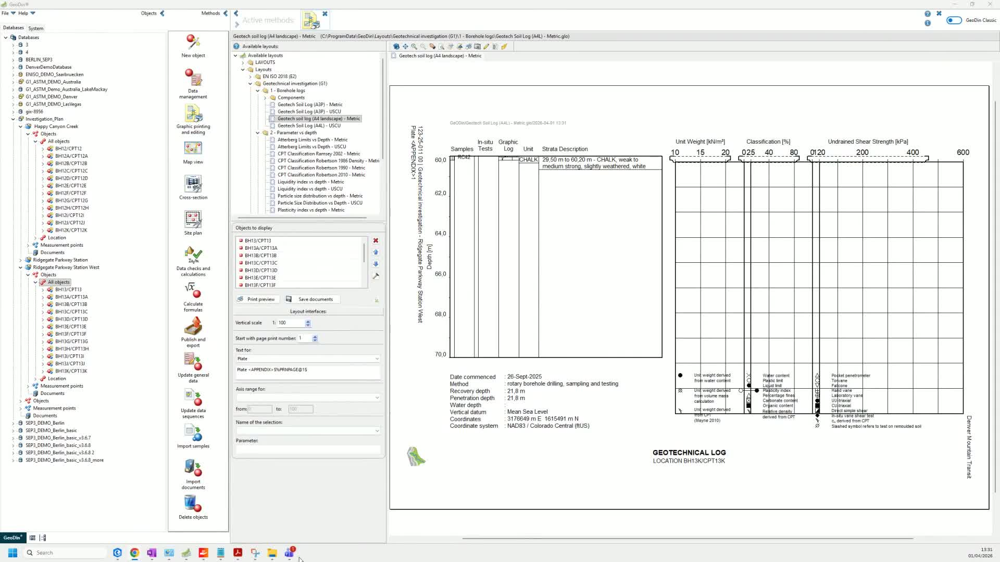
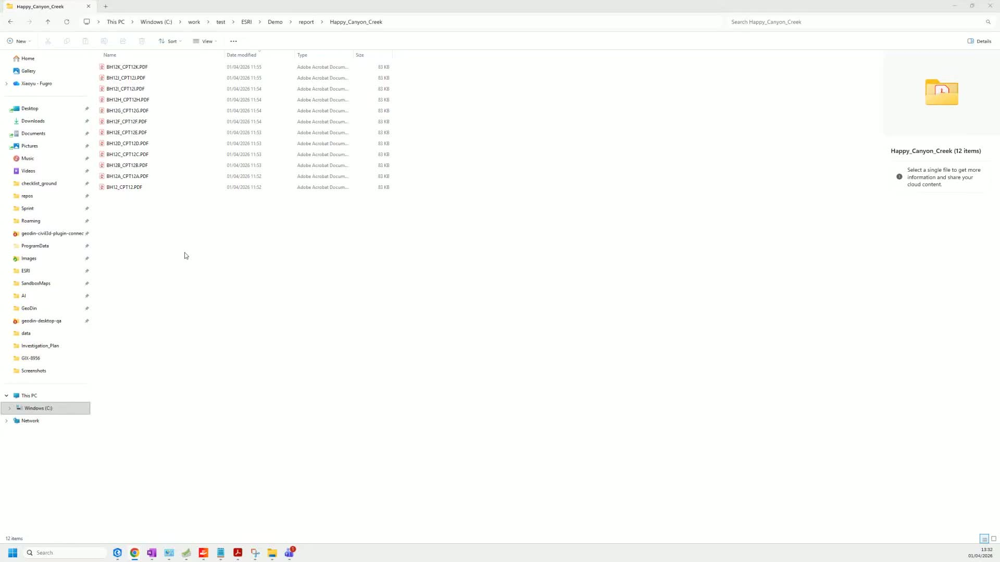

# Generate Reports

This workflow covers generating borehole log and CPT reports in GeoDin and exporting them as PDF files. The exported PDFs can then be attached to ArcGIS feature classes (see [Attach Reports](attach-reports.md)).

## Step 1: Select a borehole

Open GeoDin and select the borehole you want to generate a report for. Navigate to the **Graphic Printing and Editing** method.

## Step 2: Choose a report template

Review the available templates for borehole reports. GeoDin ships with pre-built templates organized by object type. Select the template that matches your reporting needs.

For more on templates, see [Report Templates](../../reporting/report-templates.md).

## Step 3: Generate the borehole report

The report is generated automatically based on the selected template and the borehole's data (layer descriptions, fill patterns, measurements, etc.).

## Step 4: Generate CPT reports (if applicable)

If the borehole includes Cone Penetration Test (CPT) data, select the relevant CPT data and choose the appropriate CPT template. The CPT report is generated from the data sequence measurements.

## Step 5: Preview and export

After generating the report, open the **Print Preview** to review the output. Select the export option to save the report.

Choose **Export as PDF per object** to create one PDF file per borehole. Confirm the export and select the destination folder.

For detailed export options, see [Bulk Print and PDF Export](../../reporting/bulk-print-and-pdf-export.md).

## Step 6: Verify exported reports

Navigate to the export folder and verify that the PDF reports have been generated correctly. Each file should be named after the borehole it represents.

Repeat the process for additional investigation areas as needed.

***

**Next step:** [Attach the exported reports to ArcGIS feature classes](attach-reports.md).

[Watch the full video walkthrough](https://loom.com/share/03ad413e30cc4f40b289645ca2f27278)
