# Plan and Export to GeoDin

<!-- src: loom/arcgis-2d-1 -->

This first step of the integration workflow plans borehole locations as a point feature class in ArcGIS Pro, exports them to Excel, and imports them into GeoDin - so the investigation starts from one consistent, georeferenced set of locations. The walkthrough uses the demo dataset: 12 boreholes named like `BH12/CPT12`, EPSG 2232 (NAD83 / Colorado Central ftUS).



> **Video chapters:** 0:00 Create a Project and Feature Class in ArcGIS Pro | 0:16 Add Points to the Map | 0:35 Review Attributes of Points | 1:04 Export Data to Excel | 1:17 Import Data into GeoDin | 1:46 Verify Imported Data

## Requirements

- ArcGIS Pro with a file geodatabase (GDB) for the project.
- GeoDin with the target database and project already created - the import step needs an existing project to receive the records.

### Step 1: Create a project, geodatabase, and point feature class in ArcGIS Pro

Create a new ArcGIS Pro project. In the **Catalog** pane under **Databases**, the project geodatabase is created with it. Right-click the geodatabase and choose **New > Feature Class**, set the geometry type to **Point**, and name it for the investigation (for example, `Investigation_Plan`).

<figure>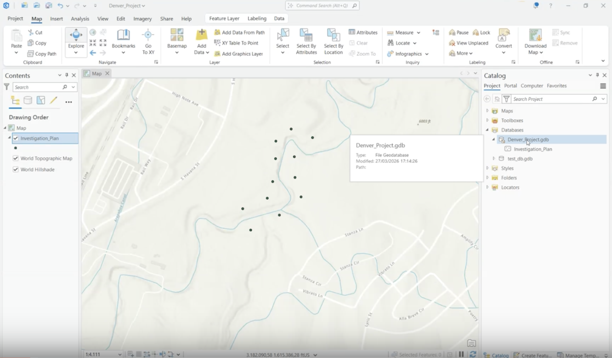<figcaption>
The project geodatabase and point feature class in the Catalog pane
</figcaption></figure>

### Step 2: Add borehole points to the map

On the **Edit** ribbon, choose **Create**, pick the feature template for the point feature class, and click each planned borehole location on the map. **Save** the edits when done.

<figure>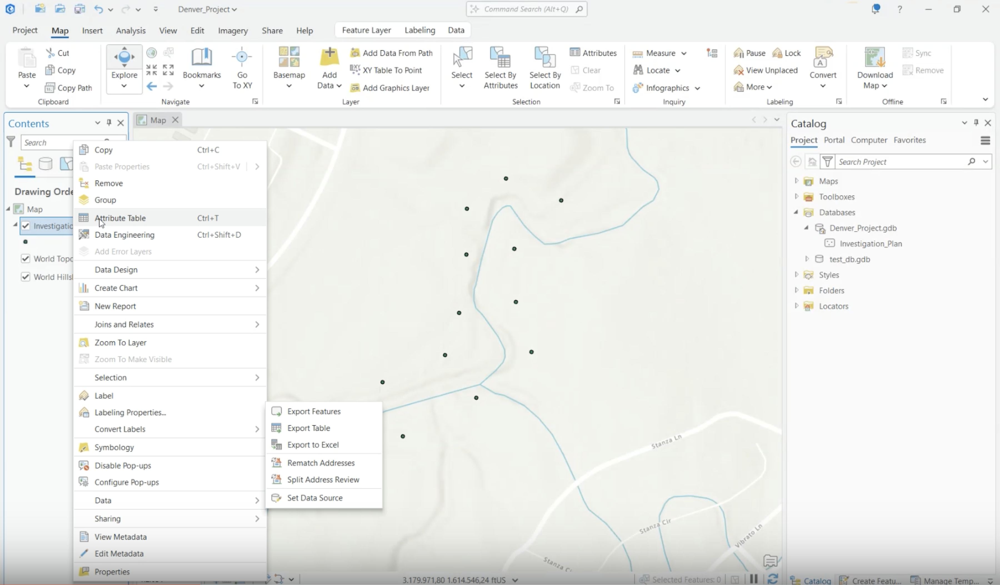<figcaption>
Creating the planned borehole points on the map
</figcaption></figure>

### Step 3: Populate and review point attributes

Open the attribute table and complete the fields each record needs before export:

- **Full location name** - the borehole name (for example, `BH12/CPT12`).
- **Easting / Longitude** and **Northing / Latitude** - the coordinates.
- **EPSG-code** - the coordinate reference system (for example, 2232).
- **Status** - the investigation status.

Missing fields can be added with **Field: Add** in the attribute table before populating them.

<figure>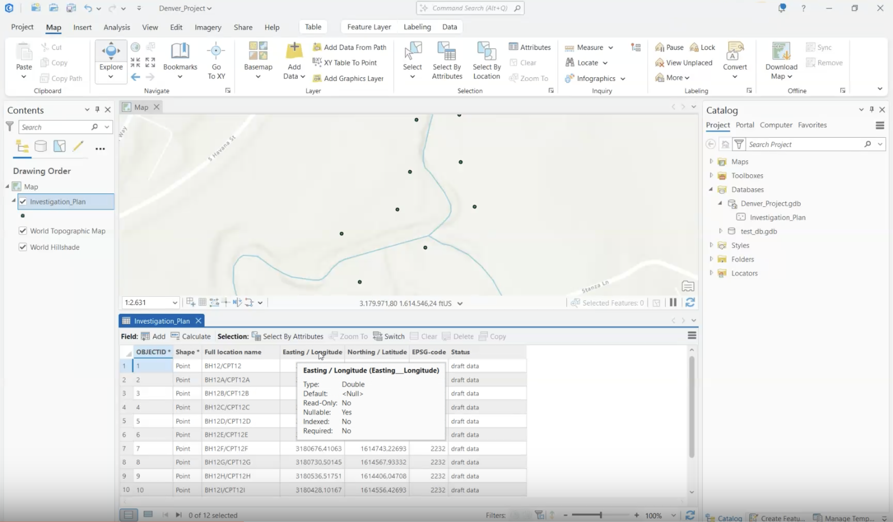<figcaption>
The attribute table with names, coordinates, and EPSG codes completed
</figcaption></figure>

> ⚠️ **Export gotcha:** ArcGIS Pro doubles underscores in field names on export (`Easting__Longitude`). Keep this in mind when mapping columns during the GeoDin import - the content is unchanged, only the header differs.

### Step 4: Export the point data to Excel

Right-click the layer and export the attribute data to Excel. Confirm the export completes and the file opens without errors.

<figure>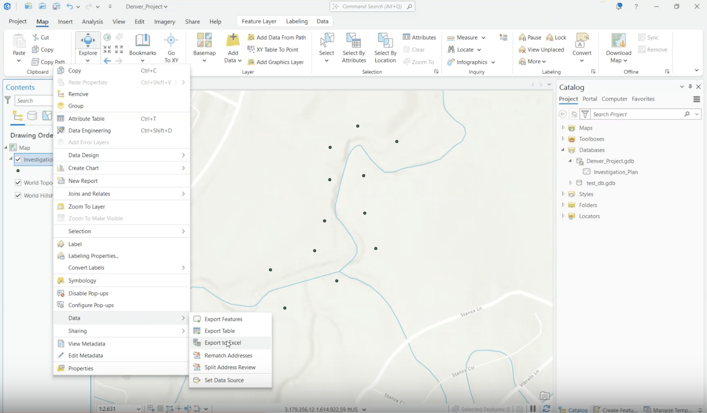<figcaption>
Exporting the layer's attribute data
</figcaption></figure>

<figure>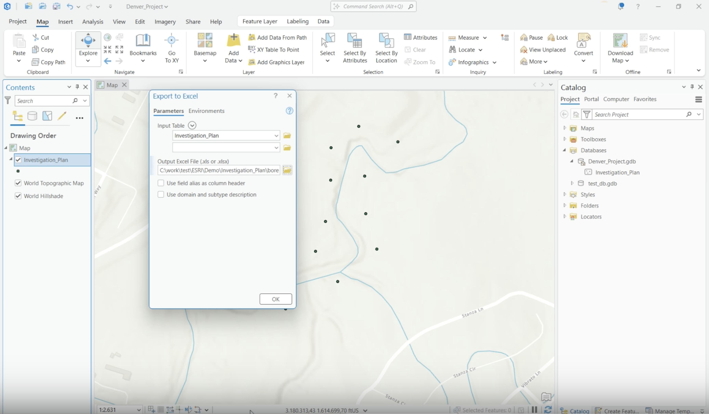<figcaption>
The export dialog with the output Excel file
</figcaption></figure>

### Step 5: Configure the import in GeoDin

In GeoDin, select the project's **Objects** node and start the **Import general data** method:

- On the **Data source** tab, select the exported Excel file, pick the worksheet, and enable **First row contains column names**. Check the preview.
- On the **Parameter links** tab, set **Object type** to **Location** and link the spreadsheet columns to GeoDin parameters - or use **Load configuration** to reuse a saved mapping.

<figure>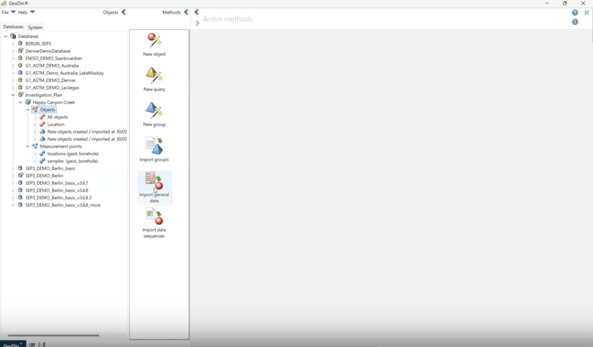<figcaption>
The project's Objects node - starting point for the import
</figcaption></figure>

<figure>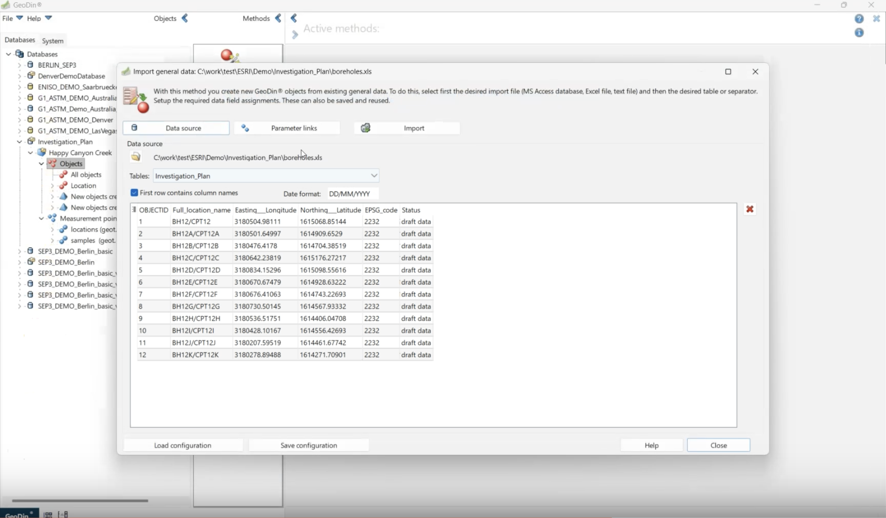<figcaption>
Data source tab with the Excel worksheet and preview
</figcaption></figure>

<figure>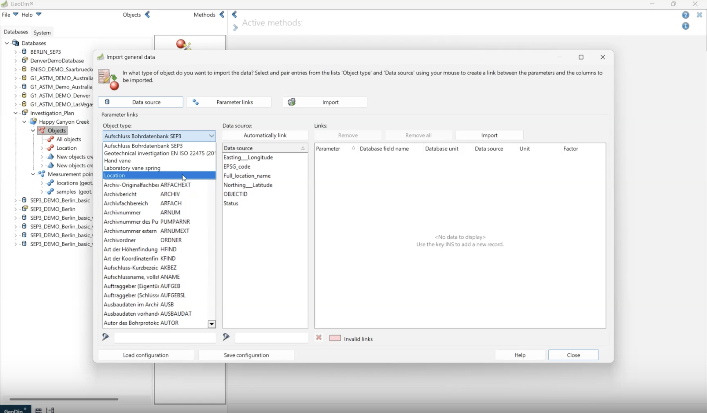<figcaption>
Parameter links tab with Object type set to Location
</figcaption></figure>

<figure>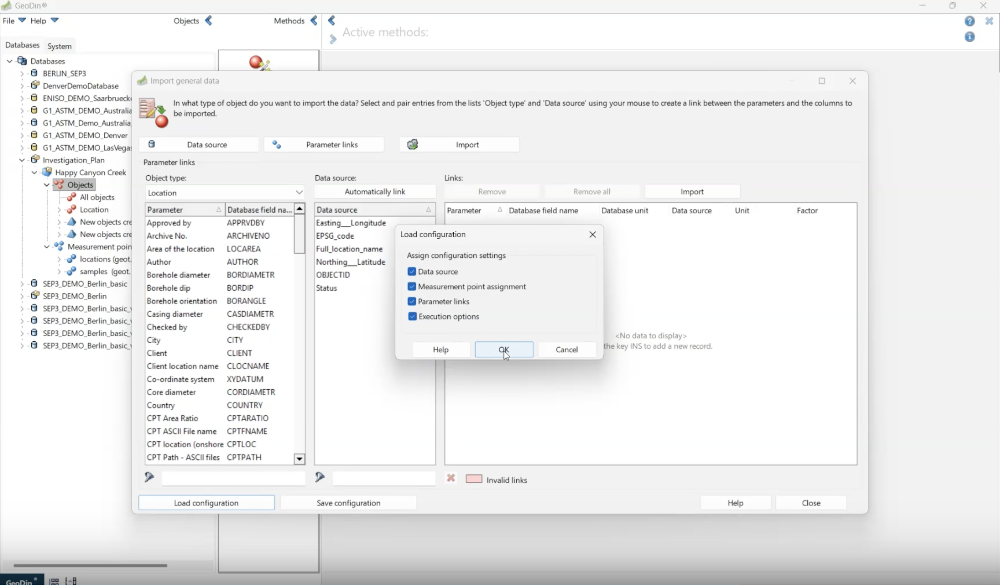<figcaption>
Loading a saved import configuration
</figcaption></figure>

For the full reference on import options, see [CSV and Excel Import](../../data-collection/import/csv-and-excel-import.md).

### Step 6: Run and verify the import

On the **Import** tab, review the preview and check that the **Summary** shows the expected count (for example, "New data records: 12"). Click **Perform import** and confirm with **Yes**.

<figure>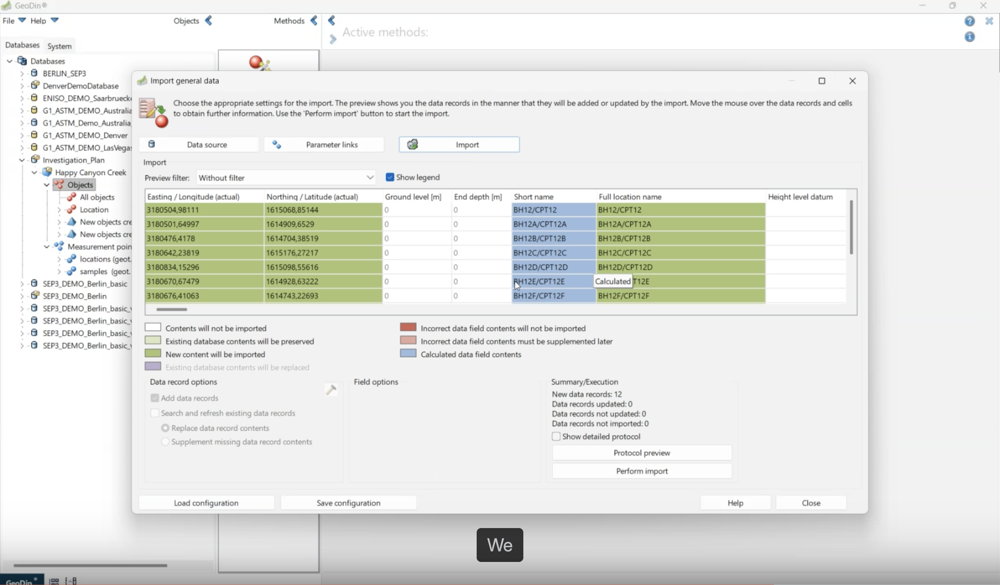<figcaption>
Import preview with the record count in the summary
</figcaption></figure>

<figure>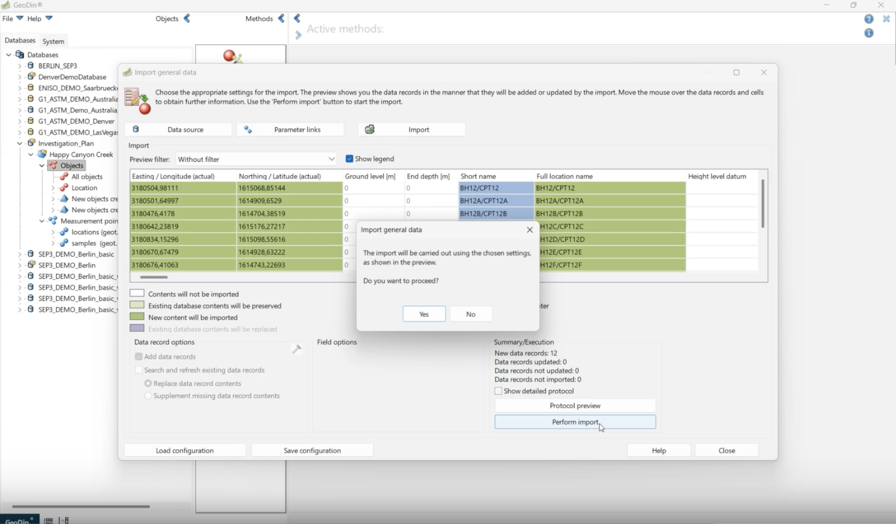<figcaption>
Confirming the import
</figcaption></figure>

### Step 7: Verify the imported borehole records

Open an imported borehole in GeoDin and confirm the name, coordinates, and EPSG code match the planned values from ArcGIS Pro.

<figure>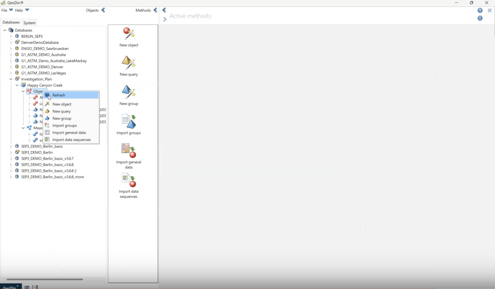<figcaption>
Opening an imported record
</figcaption></figure>

<figure>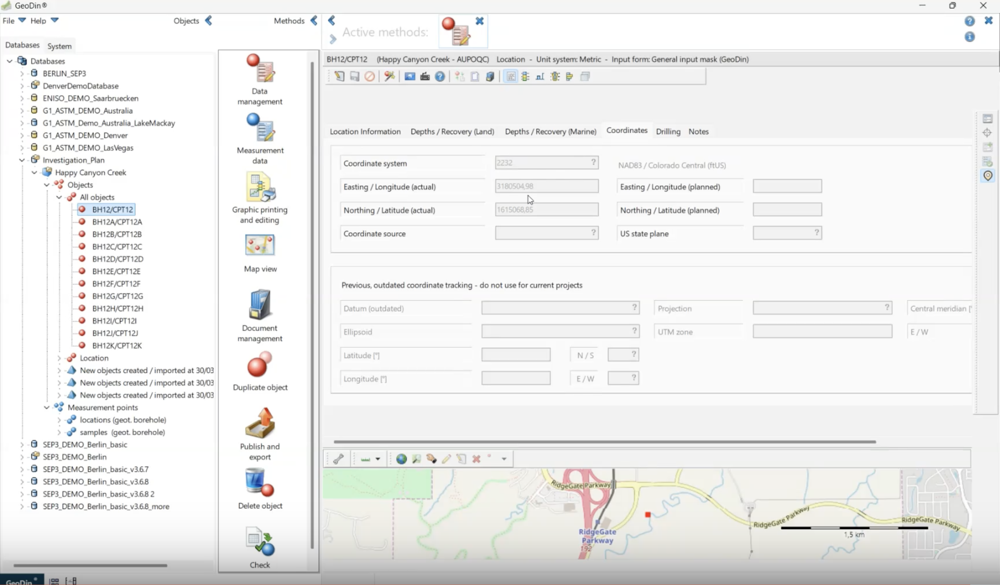<figcaption>
The imported borehole with its location on the map panel
</figcaption></figure>

## Optional settings

- **Load configuration / save configuration** - after the first import, save the column mapping in GeoDin; repeat imports become a two-click operation.
- **EPSG consistency** - keep one EPSG code across all records of an investigation; mixed codes place points in different systems.

***

**Next step:** [Export the collected field data back to ArcGIS Pro](export-to-arcgis-pro.md) once the investigation has been carried out in GeoDin.
