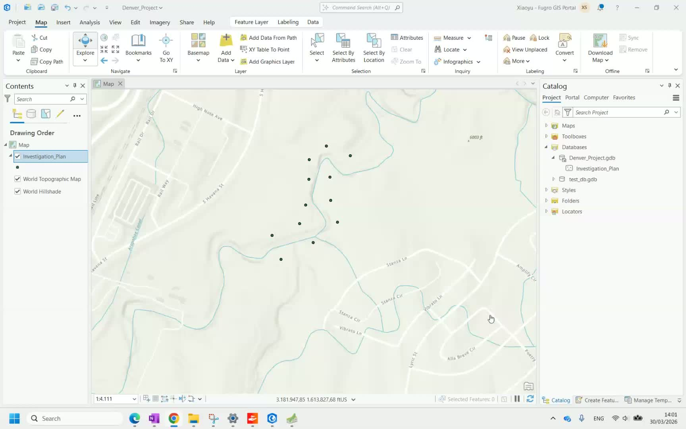
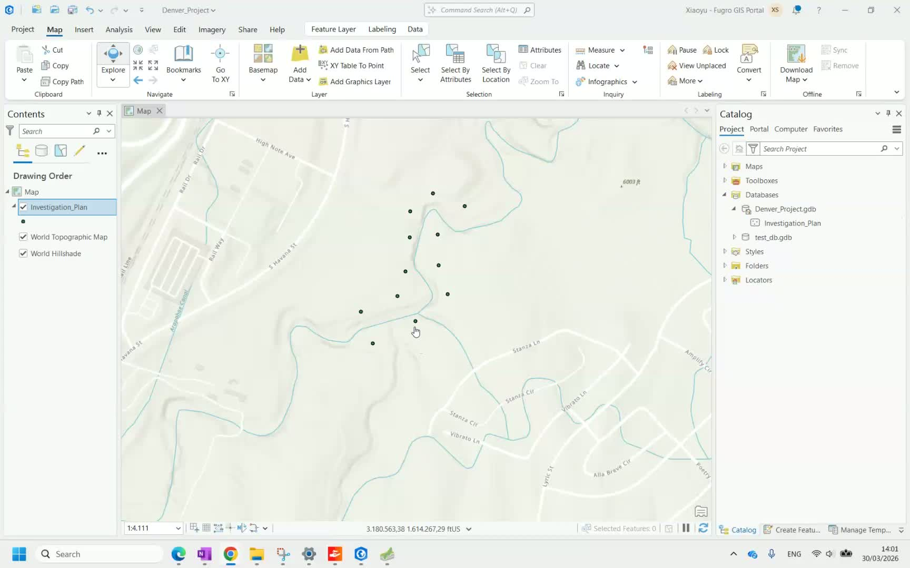
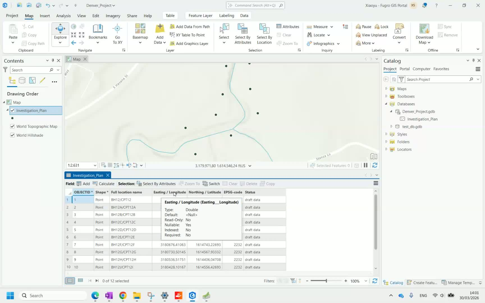
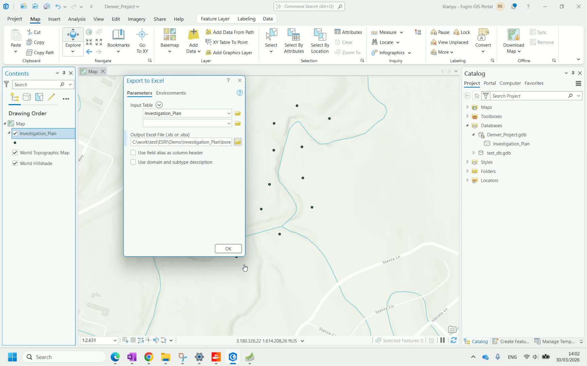
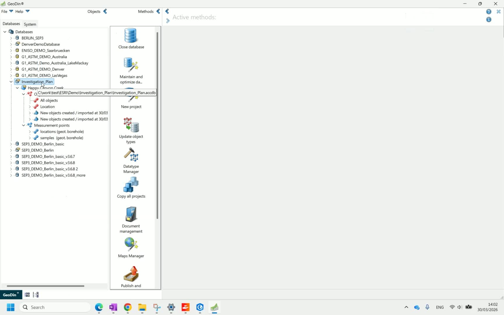
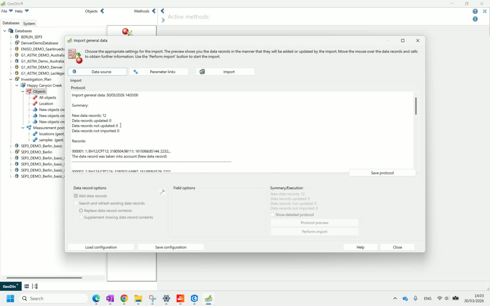

<!--
**Content status:** Polished from Loom how-to video, screenshots included
**Source quality:** A (step-by-step video walkthrough)
**Needs:** editorial review
**Video:** https://loom.com/share/e7bded01de9148eb8e20ca003c68119c
-->

# Plan and Export Data to GeoDin

This workflow covers creating borehole locations in ArcGIS Pro and importing them into GeoDin, allowing you to plan investigation points in your GIS environment before field work begins.

## Step 1: Create a project and feature class in ArcGIS Pro

Open ArcGIS Pro and create a new project. Within the project, create a geodatabase (GDB), then create a **point feature class** inside the GDB to represent your borehole locations. <!-- src: loom/plan-export-to-geodin#step-1 -->

## Step 2: Add points to the map

Add the point feature class to your map and create points representing the planned borehole locations. Each point represents one borehole or investigation location. <!-- src: loom/plan-export-to-geodin#step-2 -->

## Step 3: Review point attributes

Open the attribute table for the point feature class and verify that each point has the required fields: <!-- src: loom/plan-export-to-geodin#step-3 -->

- **Borehole name** — unique identifier for each location
- **Coordinates** — X and Y in the appropriate coordinate system
- **EPSG code** — coordinate reference system identifier
- **Status** — investigation status

## Step 4: Export data to Excel

Export the attribute data from ArcGIS Pro to an Excel file. This file will be used as the import source for GeoDin. <!-- src: loom/plan-export-to-geodin#step-4 -->

## Step 5: Import data into GeoDin

Open GeoDin and ensure you have a database and project ready. Import the Excel file using GeoDin's data import function. For detailed import instructions, see [CSV and Excel Import](../../data-collection/import/csv-and-excel-import.md). <!-- src: loom/plan-export-to-geodin#step-5 -->

## Step 6: Verify imported data

After import, verify that the borehole locations have been created correctly in GeoDin. Check that borehole names and coordinates match the original ArcGIS data. <!-- src: loom/plan-export-to-geodin#step-6 -->

---

**Next step:** After field data collection, [export the enriched data back to ArcGIS Pro](export-to-arcgis-pro.md).

[Watch the full video walkthrough](https://loom.com/share/e7bded01de9148eb8e20ca003c68119c)
