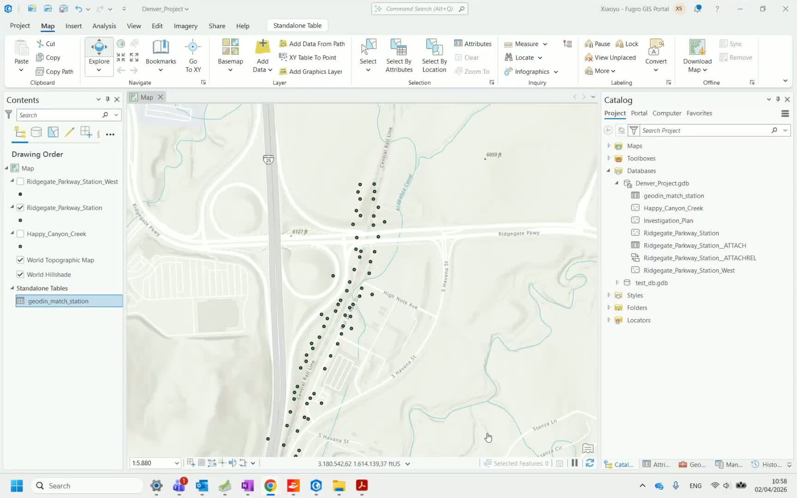
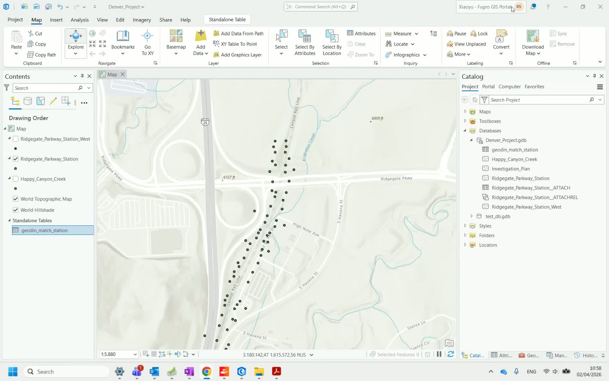
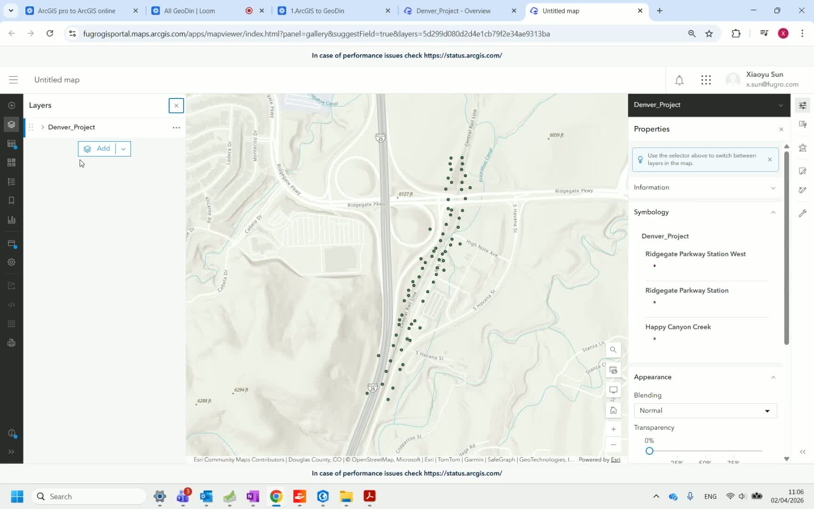
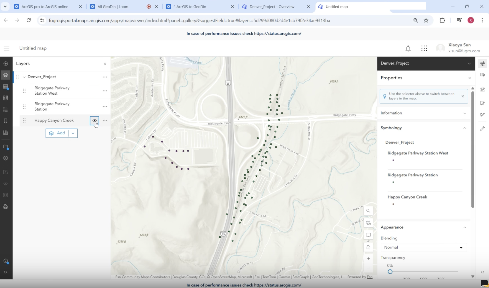
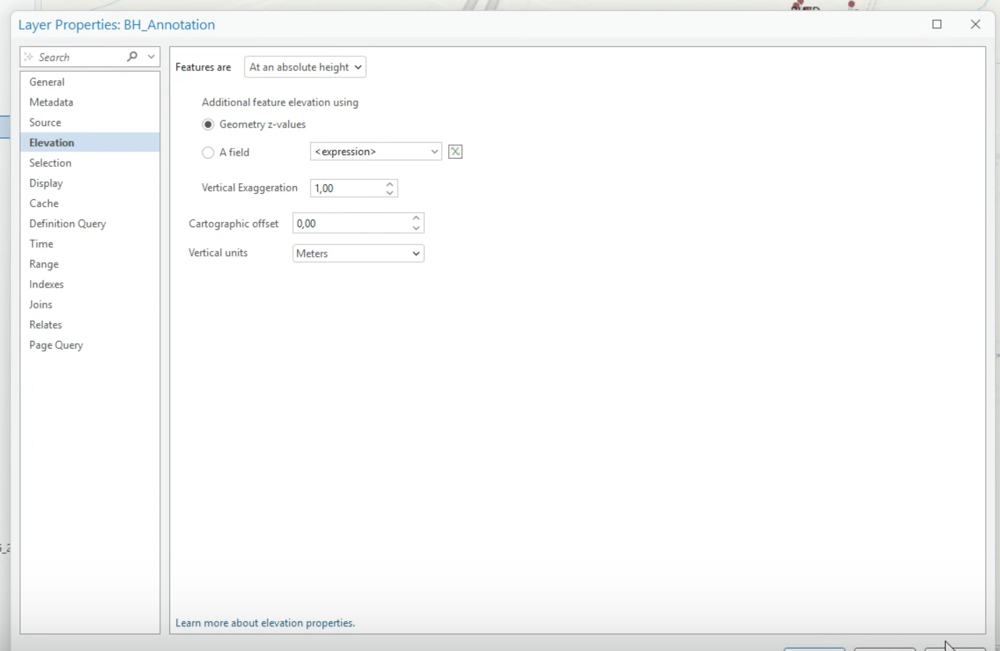
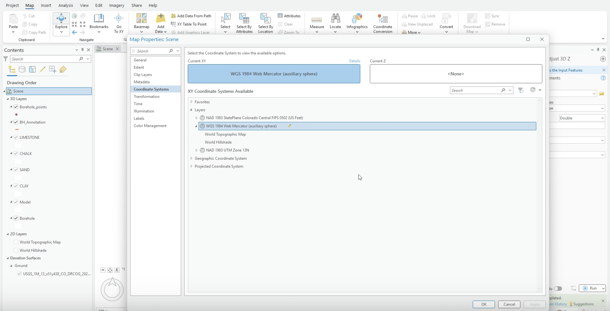
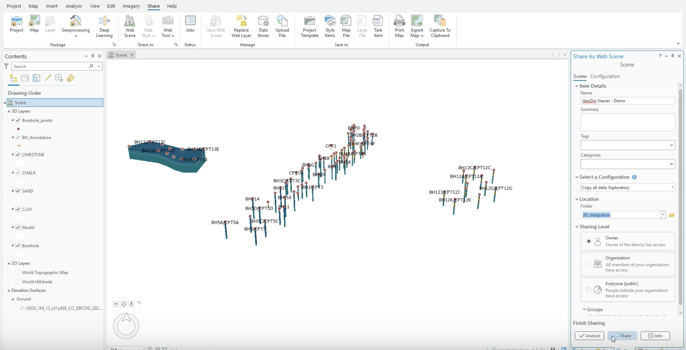
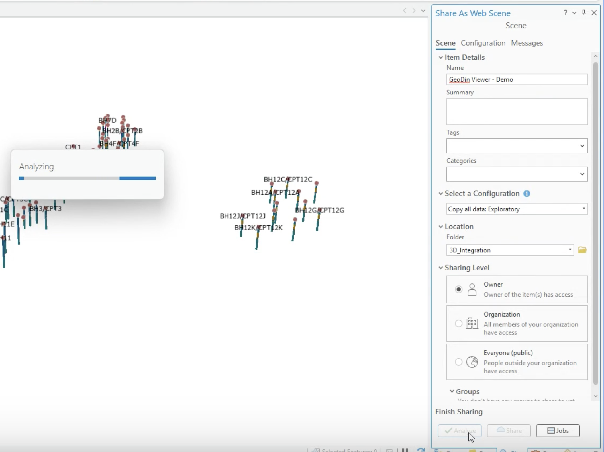

# Publish to ArcGIS Online

This final step in the integration workflow publishes your borehole feature layers - including attached GeoDin reports - to ArcGIS Online, making them accessible through a web browser to stakeholders and team members.

## Step 1: Open the project in ArcGIS Pro

Open ArcGIS Pro with the project containing your borehole feature classes and attached reports.

## Step 2: Log in to ArcGIS Online

Log in to your ArcGIS Online account from within ArcGIS Pro. This connects your desktop project to your organization's online portal.

## Step 3: Share the data

Choose the option to share your feature layer data. Select the appropriate sharing level (organization, specific groups, or public) depending on your project requirements.

## Step 4: Name and publish

Give the published layer a descriptive name. If there are validation warnings, use the **auto-assign** option to resolve them. Click **Publish** to upload the data to ArcGIS Online.

## Step 5: Confirm publication

Verify that the data has been published successfully. Click **Manage the web data** to open the ArcGIS Online management interface.

## Step 6: View feature layers

In the web data management section, locate your published feature layers. Make the layers visible to verify that the borehole points appear correctly on the map.

## Step 7: Access reports online

Click on individual borehole points to verify that the attached GeoDin reports are accessible. Both borehole log reports and CPT reports should be available as downloadable attachments directly from the web map.

## Step 8: Browse additional boreholes

Navigate between borehole points on the map to verify that all locations have their corresponding reports attached and accessible.

<!-- src: loom/arcgis-3d-E -->
<!-- src: loom/arcgis-3d-F -->
## Publishing a 3D web scene

Beyond 2D feature layers, a scene containing 3D borehole solids and soil surfaces (see [Export to ArcGIS Pro](export-to-arcgis-pro.md)) can also be shared as an **ArcGIS Online web scene**. This lets stakeholders review subsurface conditions directly in a browser, without ArcGIS Pro or other specialist software installed.



> **Video chapters:** 0:00 Adding borehole location points & labels · 1:17 Converting annotation units to meters · 2:26 Setting the WGS 1984 coordinate system · 2:42 Publishing the web scene · 3:31 Viewing the published scene online

### Prepare the scene before sharing

1. **Check elevation units.** If your borehole elevations are in feet, run the **Adjust 3D Z** geoprocessing tool with **Reverse Sign of Z Values** set to **Maintain Z Orientation** and convert **From Feet** **To Meters**.

2. **Update layer elevation settings.** Open **Layer Properties → Elevation** for the relevant layer and set the vertical units to **Meters**.

3. **Set the scene coordinate system.** Open the scene's **Map Properties → Coordinate Systems** and select **WGS 1984 Web Mercator** as the required coordinate system. See [Coordinate systems and EPSG](../../maps/coordinate-systems-and-epsg.md) for background on coordinate system settings.

### Share the web scene

1. Go to the **Share** tab in the ribbon and choose **Web Scene**.
2. Enter a name, choose the destination folder, and select the sharing level.

3. Click **Analyze** and resolve any errors it reports — do not proceed to publishing until Analyze returns no errors.

4. Click **Share** to publish, and once processing finishes, open the item's portal page to verify the scene and confirm all data is present.

Document pop-ups — including attached geotechnical reports — carry over into the published scene, so the same attachments available in ArcGIS Pro remain accessible when reviewing the model online. The published scene opens via **Open in Scene Viewer**, ready for review in a browser.

For an example of the result, see the public demo scene at [arcg.is/0rD1OL3](https://arcg.is/0rD1OL3) — a borehole and ground-model scene published with exactly this workflow. <!-- src: loom/arcgis-3d-E -->

If your 3D model originates from a GeoDin® Ground drawing in Civil 3D, see [ArcGIS integration](https://docs.geodin.com/geodin-ground/workflows-and-integrations/arcgis-integration) in the GeoDin® Ground documentation for how to bring the model into ArcGIS Pro.

***

**This completes the GeoDin ↔ ArcGIS integration workflow.** Your team can now access geotechnical reports directly from the web map without needing GeoDin or ArcGIS Pro installed.

[Watch the full video walkthrough](https://www.youtube.com/watch?v=v7Lb_Vphhzc&list=PLfA_dsMIot34WQYVtEluk87UsZt0hb21A&index=5)

***

## Related pages

* [Plan and Export to GeoDin](plan-and-export-to-geodin.md) - Step 1: ArcGIS → GeoDin
* [Export to ArcGIS Pro](export-to-arcgis-pro.md) - Step 2: GeoDin → ArcGIS
* [Generate Reports](generate-reports.md) - Step 3: Create PDFs in GeoDin
* [Attach Reports](attach-reports.md) - Step 4: Link PDFs to features
