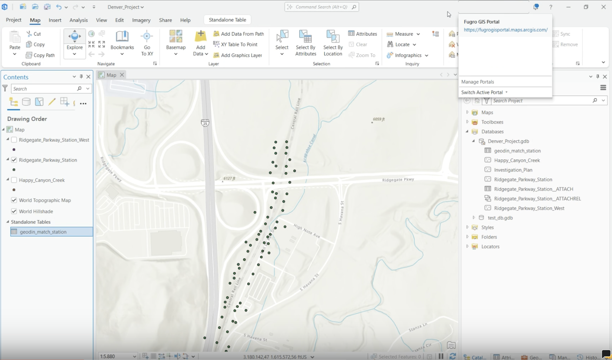
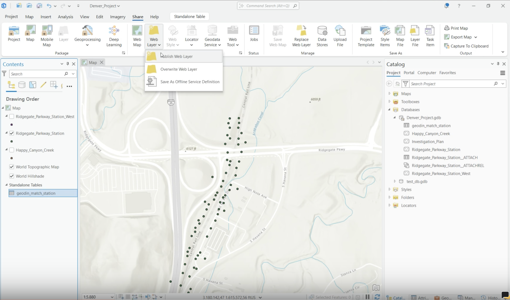
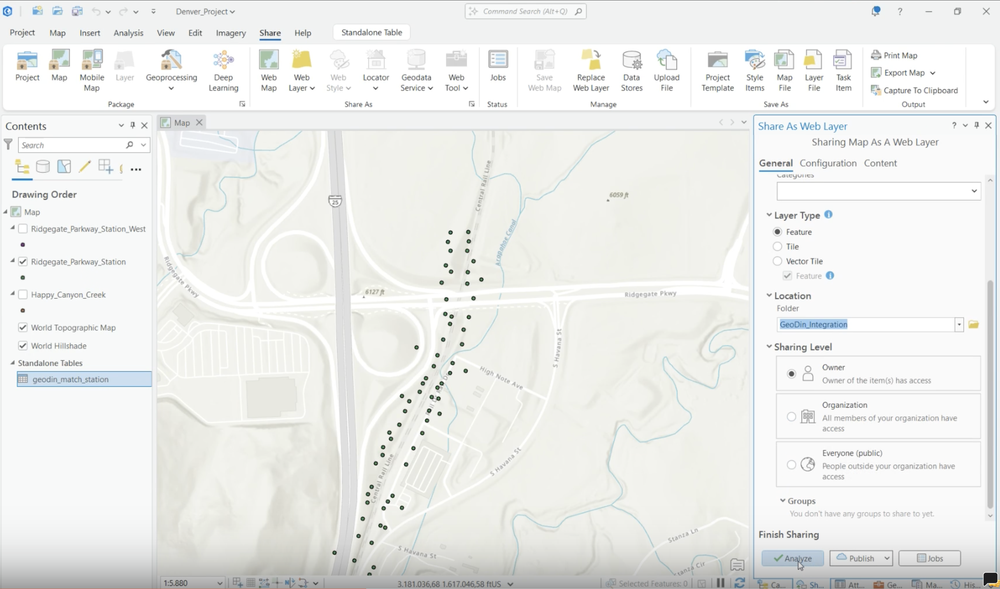
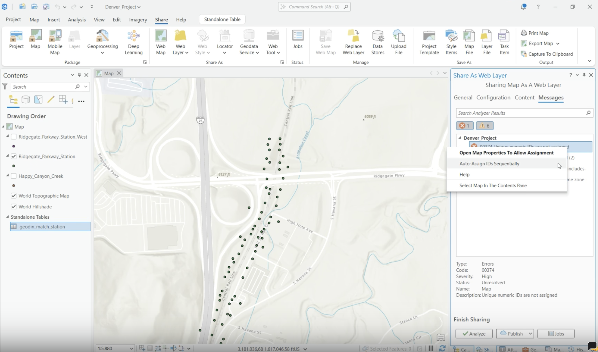
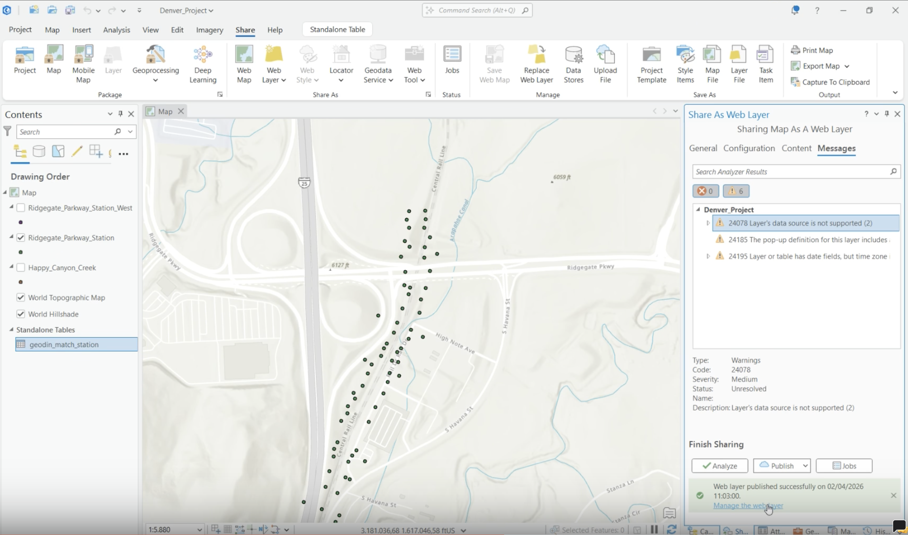
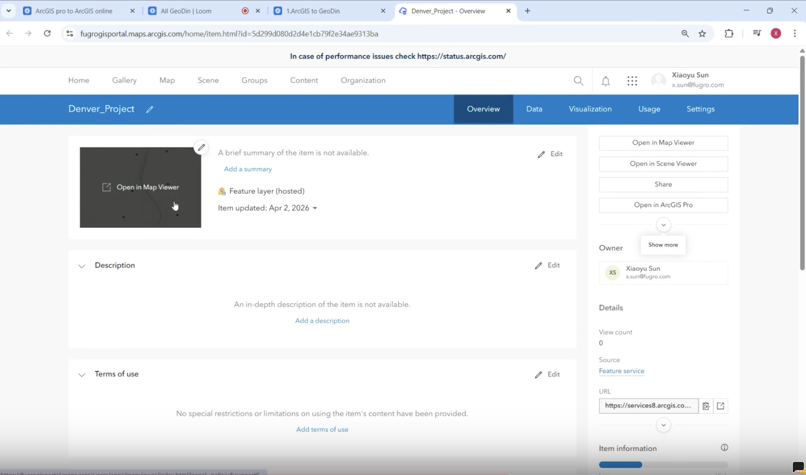

# Publish to ArcGIS Online

<!-- src: loom/arcgis-2d-5 -->

This final step publishes the borehole feature layers - including the attached GeoDin reports - to ArcGIS Online, making them accessible in a browser for stakeholders and team members.



> **Video chapters:** 0:00 Accessing the data in ArcGIS Pro | 0:15 Logging into ArcGIS Online and starting the share | 0:35 Naming and publishing the data | 1:19 Managing the published web data | 1:44 Viewing the field layers | 1:57 Accessing CPT data and reports | 2:19 Opening additional borehole reports

## Requirements

- An ArcGIS Online account with publishing privileges, signed in via the ArcGIS Pro account menu.
- The map with the area feature classes and report attachments completed (see [Export to ArcGIS Pro](export-to-arcgis-pro.md), [Generate Reports](generate-reports.md), and [Attach Reports](attach-reports.md)).

### Step 1: Confirm the ArcGIS Online sign-in

Open the account menu in ArcGIS Pro and confirm you are signed in to the organization's ArcGIS Online portal.

<figure><figcaption>
The account menu with the active portal
</figcaption></figure>

### Step 2: Configure sharing and publish the dataset

On the **Share** tab, choose to publish the feature layer. Enter a name, pick a portal folder, and set the **sharing level** deliberately - **Owner**, **Organization**, or **Everyone (public)**. Run **Analyze** before publishing:

- The error **00374 "Unique numeric IDs are not assigned"** can be fixed in place - right-click it and choose **Auto-Assign IDs Sequentially**.
- Ignore warnings only if they are understood and acceptable for the workflow.

Then click **Publish**.

<figure><figcaption>
Starting the share from the ribbon
</figcaption></figure>

<figure><figcaption>
Name, folder, sharing level, and Analyze
</figcaption></figure>

<figure><figcaption>
Fixing error 00374 with Auto-Assign IDs Sequentially
</figcaption></figure>

### Step 3: Confirm the publish was successful and open the web layer

When publishing completes, click **Manage the web layer** - this opens the hosted item in the browser.

<figure><figcaption>
Publish confirmation with Manage the web layer
</figcaption></figure>

### Step 4: Review layer visibility and validate the data

Open the item in **Map Viewer**, expand the layer group, and toggle visibility to confirm the borehole points appear correctly.

<figure><figcaption>
Opening the published item in Map Viewer
</figcaption></figure>

<figure><figcaption>
Expanding the layer group and toggling visibility
</figcaption></figure>

### Step 5: Open and verify associated reports

Click a data point such as a **CPT** record - the attached report loads straight from the browser. Repeat the check for a **borehole** record to confirm multiple record types work. Use this final check to confirm the published web layer and reports are functioning as expected.

<figure><figcaption>
A CPT pop-up with its attached report
</figcaption></figure>

<figure><figcaption>
A borehole pop-up with the full attribute set and report
</figcaption></figure>

## Optional settings

- **Sharing level**: Owner (only you) / Organization (all members) / Everyone (public) - pick deliberately before publishing.
- **Portal folder**: a dedicated folder keeps published items easy to find later.

***

## Working with published layers

**Overwrite Web Layer** (same Share menu) republishes updates to the same item without breaking links. Keep a standard review sequence - publish, open web layer, verify layers, test pop-ups and attachments - and validate both record types (CPT and borehole) with at least one opened attachment to catch report issues early.

If you are working with a full 3D ground model from Civil 3D rather than 2D borehole points, see [Publishing and reviewing the model as a web scene](https://docs.geodin.com/geodin-ground/workflows-and-integrations/arcgis-web-scene) in the GeoDin Ground documentation.

***

**This completes the GeoDin - ArcGIS integration workflow.** Your team can now access geotechnical reports directly from the web map without needing GeoDin or ArcGIS Pro installed.

***

## Related pages

* [Plan and Export to GeoDin](plan-and-export-to-geodin.md) - Step 1: ArcGIS to GeoDin
* [Export to ArcGIS Pro](export-to-arcgis-pro.md) - Step 2: GeoDin to ArcGIS
* [Generate Reports](generate-reports.md) - Step 3: Create PDFs in GeoDin
* [Attach Reports](attach-reports.md) - Step 4: Link PDFs to features
