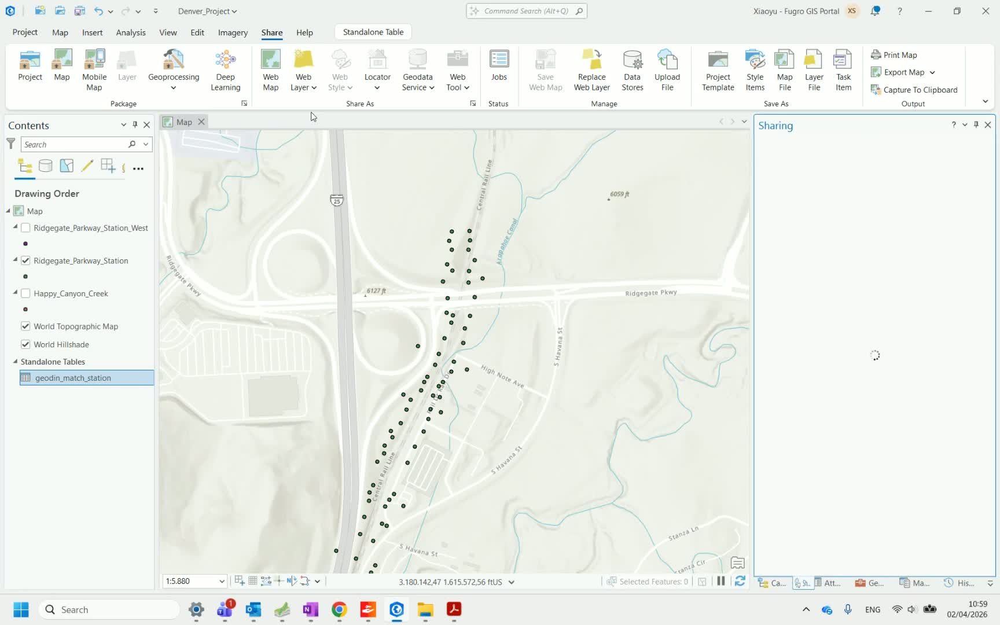
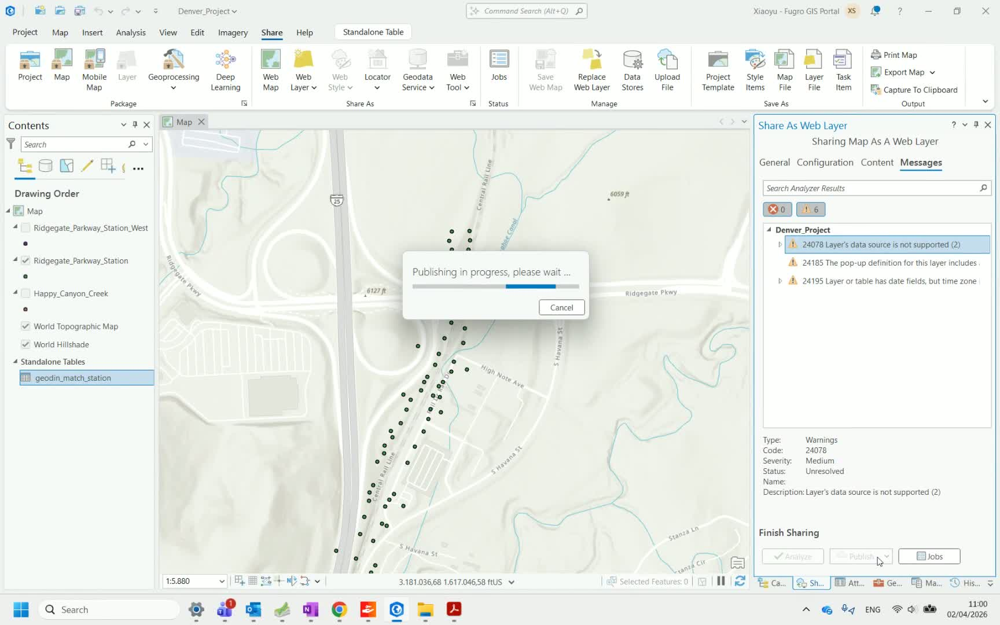
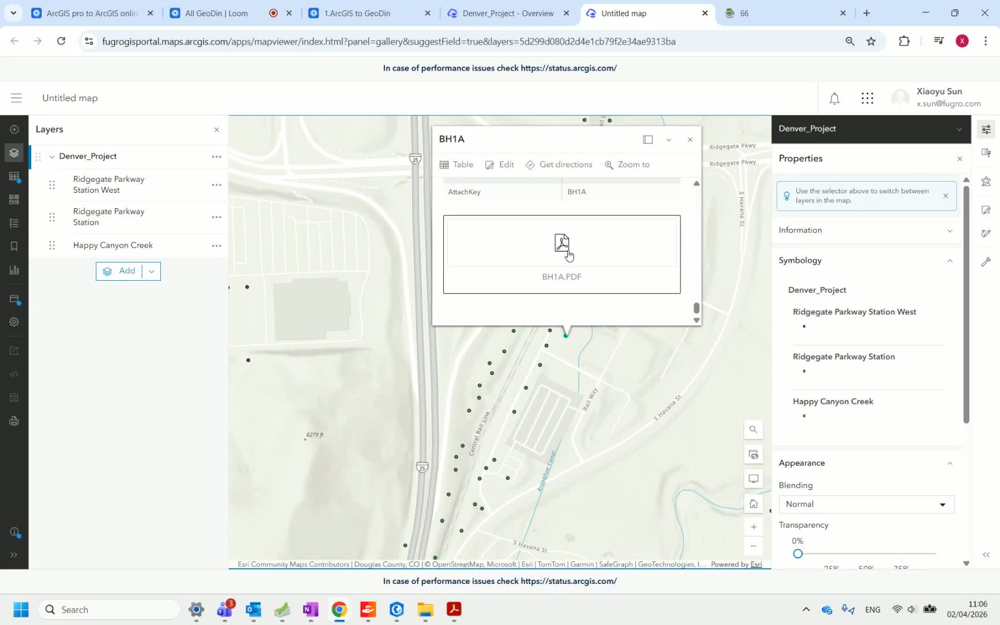

<!--
**Content status:** Polished from Loom how-to video, screenshots included
**Source quality:** A (step-by-step video walkthrough)
**Needs:** editorial review
**Video:** https://loom.com/share/b4204e56f5684fe89df01f83bc4aab1a
-->

# Publish to ArcGIS Online

This final step in the integration workflow publishes your borehole feature layers — including attached GeoDin reports — to ArcGIS Online, making them accessible through a web browser to stakeholders and team members.

## Step 1: Open the project in ArcGIS Pro

Open ArcGIS Pro with the project containing your borehole feature classes and attached reports. <!-- src: loom/publish-arcgis-online#step-1 -->

## Step 2: Log in to ArcGIS Online

Log in to your ArcGIS Online account from within ArcGIS Pro. This connects your desktop project to your organization's online portal. <!-- src: loom/publish-arcgis-online#step-2 -->

## Step 3: Share the data

Choose the option to share your feature layer data. Select the appropriate sharing level (organization, specific groups, or public) depending on your project requirements. <!-- src: loom/publish-arcgis-online#step-3 -->

## Step 4: Name and publish

Give the published layer a descriptive name. If there are validation warnings, use the **auto-assign** option to resolve them. Click **Publish** to upload the data to ArcGIS Online. <!-- src: loom/publish-arcgis-online#step-4 -->

## Step 5: Confirm publication

Verify that the data has been published successfully. Click **Manage the web data** to open the ArcGIS Online management interface. <!-- src: loom/publish-arcgis-online#step-5 -->

## Step 6: View feature layers

In the web data management section, locate your published feature layers. Make the layers visible to verify that the borehole points appear correctly on the map. <!-- src: loom/publish-arcgis-online#step-6 -->

## Step 7: Access reports online

Click on individual borehole points to verify that the attached GeoDin reports are accessible. Both borehole log reports and CPT reports should be available as downloadable attachments directly from the web map. <!-- src: loom/publish-arcgis-online#step-7 -->

## Step 8: Browse additional boreholes

Navigate between borehole points on the map to verify that all locations have their corresponding reports attached and accessible. <!-- src: loom/publish-arcgis-online#step-8 -->

---

**This completes the GeoDin ↔ ArcGIS integration workflow.** Your team can now access geotechnical reports directly from the web map without needing GeoDin or ArcGIS Pro installed.

[Watch the full video walkthrough](https://loom.com/share/b4204e56f5684fe89df01f83bc4aab1a)

---

## Related pages

- [Plan and Export to GeoDin](plan-and-export-to-geodin.md) — Step 1: ArcGIS → GeoDin
- [Export to ArcGIS Pro](export-to-arcgis-pro.md) — Step 2: GeoDin → ArcGIS
- [Generate Reports](generate-reports.md) — Step 3: Create PDFs in GeoDin
- [Attach Reports](attach-reports.md) — Step 4: Link PDFs to features
