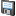

# Adding Layers

A GeoDin Map is a container: it stores a combination of layers, their individual settings, the drawing order, and the general map settings. This page covers creating a map, adding and deleting layers, and the property dialogs and context-menu functions used to control how each layer is displayed.

## Creating a new map

A GeoDin Map is made up of several individual map themes. The combination of layers, their settings, the order in the map and the general map settings are all saved in a map: hence a map is a kind of container.

The map document is created through [Document management](../navigating-the-geodin-workspace/documents/managing-documents.md). Follow the steps below.



#### Step 1: Open Document management

First of all the [Document management](../navigating-the-geodin-workspace/documents/managing-documents.md) is started.


#### Step 2: Organize a folder hierarchy

At this point it is advisable to create a folder hierachy to organize the documents using the **New folder** button. For instance this can be a folder for shape files, or another for layouts. The map document itself (created in the next step) can be in a folder, but it is often easier to have one or maps at the root level of the document management structure.


#### Step 3: Create a new document

Now create a new document (that is going to be the map) via the **New document** button.


#### Step 4: Choose the Embedded GIS map type

In the \<Add document> dialogue window select the radio button -Create document- and then click on the new file icon and choose "**Embedded GIS map"** from the list and confirm by clicking the blue tick icon. This is referred to as "Step 1" at the top of the \<Add document> window.


#### Step 5: Name the map

You must then enter a file name for the map before proceeding by clicking the **Next** button. Note that by default maps are saved in the database but they can also be saved as discrete files.


#### Step 6: Select the document description type

In this dialogue window ("Step 2") the available document descriptions in your GeoDin installation are shown in the top panel. The correct document type for a map is "(DOC) GeoDin map" which should be selected from the \<Chose document description type> panel. If it is not visible (i.e. not available for your GeoDin installation) you must first install it by clicking the **<**[Register document descriptions](../navigating-the-geodin-workspace/documents/document-organization.md)**>** button.

6a. This brings up a new dialogue window with two panels. The top panel shows the documents types available in your installation and the registered document descriptions for your database in the bottom panel. Install the correct document type so that it appears in the top panel and then register it for the database by clicking the **Register** button. You can now close the window.


#### Step 7: Select the registered map type

Once installed and registered select the document type "(DOC) GeoDin map" from the top panel of the \<Add document> window (i.e. "Step 2").


#### Step 8: Complete the description (Step 3)

Step 3 involves completing the description for the map document (content and comments). This data may also be entered later if required. Note that that the type of meta data that can be entered here depends on the document type selected. Be sure to have chosen "(DOC) GeoDin map" and not older document description types such as (EDC) or (ADC) etc. The newer DOC types are multilingual.


#### Step 9: Confirm

Finally click the **OK** button to complete the creation of a GeoDin map. This is the basis on which further layers etc. can be added.



### Adding layers

In a GeoDin Map you may display documents from the "Document management" (e.g. shapes, grid data) or GeoDin objects (e.g. boreholes and measurement points).

To add a new layer, simply drag & drop a node from the GeoDin Object Manager (GOM) into the map window. Layers are drawn in the order that they were added to the map i.e. the last layer added will be superimposed on all other layers. To change this drawing order select a layer with the mouse, press and hold whilst moving the layer up or down in the list.

Every kind of data that the map view can show is moved there this way. If the data you are dragging cannot be displayed in the map view, the cursor changes to a "no parking" sign and the dataset cannot be dropped. The display name of a new layer is generated automatically from the name of the document or the document link. The formats GeoDin can read are listed under [supported file formats](getting-started-with-maps.md#supported-file-formats).

GeoDin data is added in exactly the same way as GIS data: both user queries and the common branches (for example **All Locations**) can be dragged in as sources.

**Adding a whole folder at once**

For several files at a time it is faster to drag a complete folder out of the document structure instead of the individual documents. GeoDin collects all the data in that folder that can be used in GeoDin Maps and opens a dialog with further options.

**Adding a layer from disk**

The icons above the legend - **\<Add layer>**, **\<Add WMS layer>** and **\<Add Web Tile Layer>** - add GIS layers without going through the Object Manager. Choose the file you want in the dialog window and GeoDin saves the necessary document files automatically to the folder _Documents/Linked documents_. The two web layer icons are described under [WMS and Web Tile Layers](wms-and-web-tile-layers.md).


Adding layers from the legend icons requires the international document object types (DOC), introduced with GeoDin 8.1. Install them and [register the document descriptions](../navigating-the-geodin-workspace/documents/document-organization.md) in the database in question before using this function.


<!-- src: help/H0000010541#add-layer -->

### Deleting layers

The context menu for a layer has an option for deleting the layer.

### Adding a cross-section and previewing it

A constructed cross-section can be shown in the map as a line, with the section itself displayed in a preview window when you click that line.

1. Construct the cross-section (see [Creating cross-sections](../data-visualization/cross-sections/creating-cross-sections.md)) and add it to the project as a document through [Document management](../navigating-the-geodin-workspace/documents/managing-documents.md).
2. Drag & drop the cross-section document onto the map. It appears there as a line.
3. Activate the cross-section preview with its icon on the map toolbar.
4. Click a cross-section line in the map. The cross-section is displayed in the preview window.

<!-- src: help/H0000008798#cross-section-preview -->

### Adding map data to the document management

Preparing GIS data for GeoDin Maps is covered in [Getting Started with Maps](getting-started-with-maps.md).

Which layouts a query layer offers for object details and for graphic printing is controlled by its favourite layouts, described under [Preparing GIS data for GeoDin Maps](getting-started-with-maps.md#preparing-gis-data-for-geodin-maps).

***

## Reference: The legend

In the legend, all layers of the map are displayed.

**Visibility**

Check (or un-check) the box in front of the layer name to display the layer in the map.

**Order**

The order of the layers can be simply changed by "drag and drop".

### Context menu

_Change parameter_

This function can be used to change parameters of GeoDin layers if [Parameterized query](../data-analysis/queries/parameterized-queries.md) have been used as the data basis for the layer. The changes are displayed accordingly in the map.

_Zoom to layer_

With this function the map is zoomed to the extent of the selected layer.

_Refresh_

Use this function to refresh linked data in the GIS window. A refresh can be necessary when new GeoDin locations have been added during the session or if you have changed shape-files or DXF-data using other tools.

_Remove layer_

This function removes the selected layer from the map.

_Assign to group_

Assign a layer to a specific group. All groups available in the map are shown. Change to the grouped layer view by clicking the tab \*\*at the bottom of the legend.

_Export_

This function allows you to export a layer in the formats SHP, GML, MIF, KML, JSON and DXF. The dialog and its options are described under [Reference: Exporting a layer](#reference-exporting-a-layer).

_Interpolation_

The function [Interpolation](../data-visualization/groundwater-visualizations.md) allows you to perform interpolaions on vector layers that contains point objects.

_Properties_

You can edit the properties of the selected layer using this function **Properties**. The properties that can be changed depend on the type of layer.

_Presentation options_

Vis the context mneu you can access **Presentation options** for the layer.

_Attach presentation to document source_

## Reference: Layer properties

The tabs **Layer** and **Section** are available for both vector and raster layers. Here, you can find general information and make some basic settings for the visualisation. Depending on the map size and the performance of the computer hardware, the display settings can be optimized.

**Presentation options** on the layer context menu opens this dialog. It comes in two forms - the _Vector_ dialog box for vector layers and the _Raster_ dialog box for raster layers (images, grids) - and covers colouring, labeling, coordinate system adjustment, chart creation and the rest of the display customization.

Consistent with GIS principles, and unlike more CAD-oriented solutions, the layer's visual properties are saved to the project file or to the layer properties file. Changing the layer properties does not alter the layer file itself in any way. Keeping the properties out of the layer file allows for greater interoperability: the same layer file can be used in different ways in several projects or applications.

### Sections

A **section** is a set of visual properties defined for a range of zoom levels, so one layer can look different at different scales. All settings in the properties dialog apply to the section currently selected in the **Section list**. The **Visible** section is the default section; the visual properties defined for it are valid at any zoom level.

To add a section, activate the layer by clicking its name in the legend, open **Presentation options** from its context menu, switch to any tab that shows the **Section list**, and click the add button at the left-hand side of the list. Deleting works the same way: select the section in the **Section list** first, then click the delete button beside the list. A further button beside the list removes all custom sections from the layer at once.

### Wizard

The **Wizard** button in the _Vector_ and _Raster_ dialog boxes customizes the visual properties automatically instead of tab by tab.

* For a vector layer it opens the **Rendering Wizard**: pick the attribute in the **Formula...** drop-down list, click **Next**, keep **Continuous values** selected and check that **Minimal value** and **Maximal value** are correct, click **Next**, select **Color** in the **Render by** list and click **Apply**. All shapes are then coloured proportionally to that numeric attribute.
* For a grid layer it opens the **Grid Wizard**, which creates optimal colour zones. Adjust the colours with the three colour buttons if needed and click **Apply**.

Confirm the properties dialog with **OK** afterwards to keep the result.

<!-- src: help/H0000005953#sections-and-wizard -->

### Presentation settings inside a system query

A query used as a layer can carry its own presentation settings. Because the display options are stored with the query definition, a system query can do more than test conditions and return results - it can also bring its own colours, fill patterns and legend settings into the embedded GIS.


These settings can get complex to write by hand. It is usually easier to build them first in the embedded GIS with the integrated assistant, then copy them as a text block from the layer properties into the system queries branch.


<!-- src: help/H0000011483#presentation-in-system-queries -->

### Vector dialog box

The _Vector_ dialog box is the layer property dialog box for the vector type layers. It consists of 6 up to 8 settings tabs (depending of the vector layer format):

1. _Layer tab_
2. _Section tab_
3. _Renderer tab_
4. _Line tab_ - appears only if the layer supports line type shapes
5. _Area tab_ - appears only if the layer supports polygon type shapes
6. _Marker tab_ - appears only if the layer supports point or multipoint type shapes
7. _Label tab_
8. _Chart tab_

### Raster dialog box

The **Raster** dialog box is the layer property dialog box for the raster type layers (images, grids). It consists of 3 settings tabs :

1. _Layer tab_
2. _Section tab_
3. _Pixel tab_ - appears if the layer was not recognized as a grid layer.
4. _Grid tab_ - appears only when the layer was recognized as a grid layer.

## Reference: Exporting a layer

Right-click a layer in the legend and select **Export...** to write it out to `*.shp`, `*.gml`, `*.mif`, `*.kml`, `*.json` or `*.dxf`. The export window has the following settings.

| Setting | What it does |
|---|---|
| **Output file** | Name, format and storage location of the export file. Click the **\<...>** button in the field to choose them. |
| **Objects** | Which objects are exported: -all- (every object in the layer), -selected- (the objects previously picked in the layer with the selection tool), or -current map extent- (every object visible in the current map section). |
| **Geometry type** | Only for Shape export (`*.shp`): specify points, arcs or polygons. |
| **EPSG code** | The EPSG code of the coordinate system used for the export, taken from the layer properties. It can only be changed here if the option -ask user- was selected in the layer's export options. |
| **Preview** | Shows the objects of the layer that will be exported, following the choice made under **Objects**. |

### Exporting layer polygons

*Layer* here means the geological layers of the exported cross-section, not a map layer.

Layer polygons can be exported as well as layers. Right-click the profile cross-section in the map legend, select **Export** and then the submenu **Layer polygons**. In the window that opens you choose whether all existing objects or only the previously selected ones are exported, and how overlapping polygons are handled - either intersect the polygons, or keep the shape.

<!-- src: help/H0000010939#export-dialog -->

## Reference: Selection properties

**Select in**

Select from the different options: all layers, active layer, top layer.

The selection tool then operates only in the selected layers.

**Color**

Here, the color for outlining and filling the selected objects can be set.

**Show outline only**

Select this option to mark a selection only with a coloured outline. If this option is not selected, the selected objects are colored transparently in the color selected above. This makes objects easy to recognize, but sometimes hides objects in the background.

## Reference: Contour lines

The **"Contour lines"** method is available for layers of type _Grid_ (\*.grd).

_**Minimum:**_

Enter the limit value(s) below which the values for the calculation of the contour lines are not to be taken into account.

_**Distance:**_

Enter the distance between the contour lines here.

**reset / get from grid**

Use this button to reset the entered values to automatically determined values that result from the existing data.

_**Decimal places:**_

Here you specify the number of decimal places for the displayed values.

_\[Save line values into attribute field]_

Check this box if the line values are to be written to the attribute table of the newly created layer.

_**Field name:**_

The column created in the attribute table (see above) receives the column name entered here.

Start the calculation with this button and get a first overview in the preview window.

Save the result in Shape format, (\*.shp), Geography Markup Language (\*.gml), MapInfo File (\*.mif), Keyhole Markup Language (\*.km) or JavaScript Object Notation (\*.json). After saving, you will be asked whether the saved file should be transferred to the map and displayed. If you want this, confirm with   **\<Yes>.**

***

Shared reference content for this area lives in [WMS and Web Tile Layers](wms-and-web-tile-layers.md).
