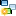

# Digitizing Objects

GeoDin Maps lets you select, search, and display GeoDin objects on the map, tune how each layer behaves, and draw new point, line, and area objects directly into your database. This page is the reference for the map window's object tools - layer properties, the detail and search panels, mini graphics, and the four-step object digitisation flow.

## Reference: Properties

**Objects selectable**

Use this option to make objects from this layer selectable. Uncheck this option if a layer only contains objects which shall not be selected.

**Show in overview map**

Select this option to display the selected layer in the overview map in the lower left corner.

## Reference: Display for object data

In this view, details about the currently selected GeoDin objects in the map are displayed. The layouts used can contain links to other layouts, making it possible to browse the detail data of the objects.

Elements with links can be identified by their colour and the different mouse cursor. Click on the object link to display further detailed information about the object.

## Reference: Quick search

In the Quick Search field, simple searches for objects on the map can be made to navigate to these objects. After entering the search key word, a dropdown list shows all items where the condition is true. By pressing the ENTER-Key or by clicking on the symbol to the right , the object can be highlighted.

The search field can be configured to different searches (depending on the layer), as described in **Quick search**.

### Search / filter objects assistant

<!-- src: help/H0000007092#search-filter-assistant -->

Beyond the single-keyword quick search, the **Search / filter objects** assistant finds objects in the map by condition, then selects them or removes them from the displayed map view.

**Layer** - choose whether the search or filter is applied to the current layer only, or to all layers in the map.

**Extent** - choose the search extent. Select *Visible map extent* to search only within the map extent currently on screen, or *Full map extent* to search everything.

**Entering conditions**

Searching and filtering are driven by the conditions you enter in the text field in the middle of the window. If a condition is true for an object, that object can be selected or filtered. The dialog assists you with the available fields, the possible operators, and the field values found in the attribute tables of the objects in the map.

Build a search systematically, in this order:

1. Field name
2. Operator
3. Field value

**Data fields / Occurring field values** - this dropdown lists all attributes currently available for a search; which fields are offered depends on whether you are searching one layer or several. Selecting a field enters its name into the condition text field. The first 50 values of that field are then listed in the *Occurring field values* dropdown; selecting one enters it into the text field too, formatted for the field type - text values are placed in inverted commas automatically, numeric values are entered without them. Field names and values can also be typed directly into the text field.

**Operators** - this list holds the most common operators.

Once the condition is defined, choose what happens to the matching objects:

| Option | Effect |
|---|---|
| **Select all matching objects** | Selects every object in the map that fulfills the conditions. |
| **Select all matching objects successively** | Steps from one matching object to the next via the **Search / Continue** button. If the next object lies outside the visible map extent, the map can optionally pan to it; the zoom level stays constant. |
| **Hide objects not matching** | Hides all non-matching objects from the map - useful for showing only the relevant datasets temporarily. While a filter is active, a button is available to deactivate it. |

## Reference: Preferences

**Draw scalebar**

Choose this option to draw a scale bar in the lower right corner of the map window.

**Flash existing objects while selecting in GOM**

Elements selected in the GeoDin object manager (GOM) can be selected to blink in the Map. The objects from the object manager can be easily recognized in the map.

Only objects which can be displayed in the map will blink, objects not in the map are ignored.

## Reference: Adding map data to the document management

Preparing GIS data for GeoDin Maps is covered in [Getting Started with Maps](getting-started-with-maps.md).

## Reference: Search in polygons

You can use this tool to make a location-based selection of objects. All objects in a previously selected polygon of a surface layer are selected.

**Polygon layer:**

Select one of the offered polygon layers that contains one or more polygons in which GeoDin objects are to be searched.

**Selection / or Condition**

If the option Selection is selected, select one or more polygons of the surface layer defined in the first step by clicking on them on the map. If you want to select the corresponding surface layer according to defined attributes, use the option Condition and enter the corresponding data using the SQL syntax.

_\[Buffer]_

If you would like to optionally set an extended search radius around the selected surface layers, enter this in meters.

**GeoDin-Layer:**

Specify the layer that contains the GeoDin objects to be determined. Note: Only layers with GeoDin objects are available for selection, no other point layers added to the map (\*.shp or similar). If \[Automatically update preview ] is checked, the found objects are displayed in the preview window (loading process varies depending on the scope of the search result).

**Select objects**

By clicking on \<Select objects> the selected objects are displayed at the node "Object selection" in the GeoDin object manager.

If a layout is displayed in the [Display for object data](digitizing-objects.md) of the map, it is filled with the data of the found objects. It is recommended to use a layout with [Multi object frame](../data-visualization/layouts/object-frames.md) if more than one object is found by the "Search in polygons".

## Reference: Mini graphics for the layer

With the option "**Mini graphics**" you can place your objects in the map layouts of your choice, e.g. showing a _drill log_ or a _measurement diagram_.

Add a new layout with the buttons **Add New Element** (to the end of the layout list) or **Insert New Element** (above the selected layout).

With the button   **Duplicate element** you duplicate the selected layout. If you want to make changes to the list without an immediate update, use the button **Edit without update** .

The following setting options are available for editing the mini graphics:

(All changes are immediately visible on the map so you can check the result immediately.)

_\[Activated]_

By ticking the box, the mini graphic is visible on the map. So you can keep numerous layouts available on the object layer, only the activated ones will be displayed.

**Layout:**

Select a layout by navigating to the storage location using the button on the right.

**Alignment:**

Here you set how the layout should be aligned to the object symbol.

**Transparency:**

If you want to make the mini graphics inserted into the map transparent in order not to cover the underlying map completely, move the slider until the desired result is achieved.

**Max. allowed image overlapping %:**

Depending on the zoom level and the proximity of the holes to each other, layouts may overlap. To optimize the display, you can set the maximum allowed overlap of adjacent layouts in % of the layout area.

_\[Draw frame]_

Check the box to draw a frame around the layout whose color and line width you can specify.

## Reference: Digitise object

With the function "Digitise objects" it is possible to draw point, line and area objects directly in GeoDin Maps and save them as objects.

The digitisation process takes place in four steps.

1. [Choose object type and destination project](#choose-object-type-and-destination-project)
2. [Map contents to GeoDin data fields](#map-contents-to-geodin-data-fields)
3. [Create geometry in the map window](#create-geometry-in-the-map-window)
4. [Input general data](../navigating-the-geodin-workspace/objects/general-data.md)

In order to digitise objects in the integrated GIS, it is assumed that the map has a coordinate system.

### Choose object type and destination project

Defining the type of object and the target object is the first step in digitising objects in the maps module. Various settings can be made in a new window that opens when the function is started.

In the **object type** field, the type of object to be created can be selected; only object types that provide GEOWKT geometry tables are permitted. These object types (e.g. examination areas) must be installed beforehand.

In the next section, the project assignment for the new object is defined. There are two possibilities for this:

1. Manual assignment: simple selection of the project in which the object is to be saved later.
2. Definition via a field of a map layer: the field must contain the PRJID (for this case, use the button **<...>** in field "Take from map" and select the corresponding field in the new window).

### Map contents to GeoDin data fields

<!-- src: help/H0000011228#step-2-field-mapping -->

In the second step, data fields of the map - for example from shape files - can optionally be assigned to GeoDin data fields. Use the **<...>** button behind the respective field to make an assignment.


This step may be skipped. Digitisation works without any field assignment.


**Example.** The map contains a layer with polygons of the German federal states. To carry the federal-state information from the polygon over to a manually digitised point, select the field the information should be written to in the **general data** column, and enter the corresponding field of the map layer in the **source** column.

The same mechanism, applied to more fields and set up once for repeated use, is described under [Digitizer options](#digitizer-options).

### Create geometry in the map window

<!-- src: help/H0000011229#step-3-geometry -->

In the third step, the geometry of the object is captured. Depending on the object type, points, lines, or areas can be drawn. Three functions are available:

| Function | Use |
|---|---|
| **<draw>** | Draw the geometry of the new object in the map window. |
| **<edit object>** | Reopen the drawn object to adjust its geometry. |
| **<delete>** | Remove the drawn geometry. |

The **<Snap>** function lets you nominate a layer that the supporting points of the digitised object attach themselves to, so new geometry aligns exactly with existing features.


Snap can be activated or deactivated separately at any time.


When the geometry is complete, all field assignments and the project assignment are applied.

### Digitizer options

<!-- src: help/H0000010551#auto-fill-from-map-layers -->

The **Digitizer options** hold settings that speed up digitising GeoDin objects. While digitising, field values from different map layers can be used to fill GeoDin data fields automatically - not only the PRJID case used for project assignment, but any GeoDin data field.

**Example.** Your GeoDin object type contains a field **Map Number**. Load a layer (for example a shape file) that carries this information into the map window, then create a field allocation from that layer's field to the GeoDin data field. From then on, **Map Number** is filled automatically from the shape whenever you digitise inside it.
