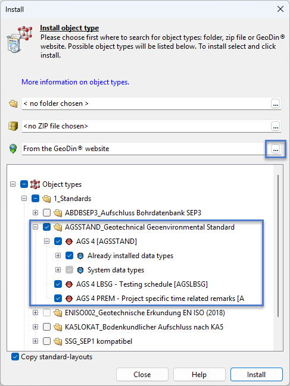
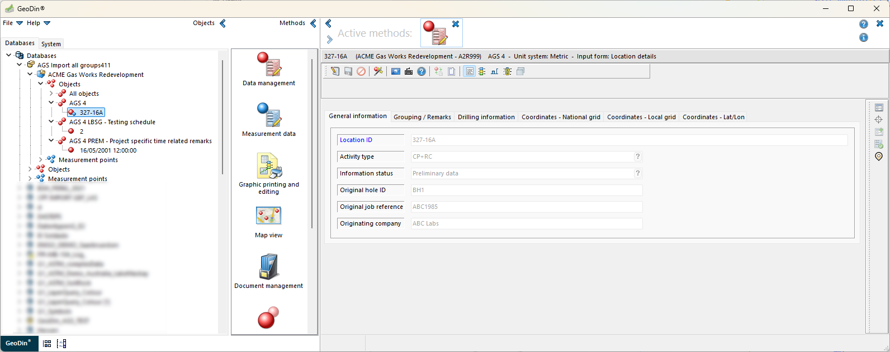

# AGS 4

### 1. Overview

The AGS 4 Standard consists of three different object types developed according to AGS 4.1.1 with additions from AGS 4.0.4. The default settings are AGS 4.1.1.

All three must be installed in GeoDin to ensure full functionality:

1. **AGS 4 \[AGSSTAND]**: Includes general location data, geological layers, samples, well design information, object type tables, and data types.
2. **AGS 4 LBSG - Testing schedule \[AGSLBSG]**: Used to define and manage project-specific testing schedules.
3. **AGS 4 PREM - Project-specific time-related remarks \[AGSPREM]**: Used to record project-specific time-dependent events (e.g., “Heavy rainfall for two days; site flooded”).

<figure><figcaption></figcaption></figure>

Follow the process outlined [here](https://docs.geodin.com/navigating-the-geodin-workspace/object-types/installing) in Method 1 and select **“AGSSTAND\_Geotechnical Geoenvironmental Standard“** to install all three object types including the associated data types.

<figure><figcaption></figcaption></figure>

#### 1.1	Missing AGS groups in GeoDin

Some AGS groups are not stored in GeoDin because they are either automatically generated during the AGS export process or are not supported by GeoDin’s data model and therefore cannot be stored within the system.

• ABBR – automatically generated on AGS Export\
• DICT – not part of the GeoDin structure\
• FILE – automatically generated on AGS Export\
• TRAN – not imported into GeoDin; users must complete these values during the AGS Export in Step 4\
• TYPE – automatically generated on AGS Export\
• UNIT – GeoDin provides its own dedicated unit dictionary (PU)\
• STND – not part of the GeoDin structure

#### 1.2	General information for GeoDin

**1.2.1 Parameters and Groups**

Parameters or groups that are only included in AGS 4.1.1 and not in AGS 4.0.4 are marked with the note “(4.1)”.

**Example:**\
CTRG – Cyclic triaxial test \[CTRG] is a new group for AGS 4.1.1.

<figure><figcaption></figcaption></figure>

**1.2.2 Input Forms**

GeoDin allows users to enter data using input forms (masks). GeoDin provides support for entering parameters. The description of the AGS parameter name can be found below the mask as a note containing the long field name and, in brackets, the short field name.

<figure><figcaption></figcaption></figure>

**1.2.3 Grid View**

When entering data via the grid view, users can switch between the long field name and the AGS short field name. To do this, the user clicks on the column heading with the right mouse button, and a menu bar appears, as shown in the image. Users can also use this menu bar to switch the unit view on and off.

<figure><figcaption></figcaption></figure>

<figure><figcaption></figcaption></figure>

**1.2.4 Dictionaries**

* GeoDin includes comprehensive dictionaries that store all AGS codes from the **AGS 4.1.1** and **AGS 4.0.4** standards.
* The following dictionaries are **exceptions** and are intentionally empty:
  * **(AGS) Layer data: GEOL – Second geology code**
  * **(AGS) Layer data: GEOL – Geology code**\
    These must be populated with **project-specific codes** in accordance with AGS standards.
* Users can **edit GeoDin dictionaries**.
  * Once modified, dictionaries are **not updated during an object type update**, ensuring user changes are retained.
* The following **database-specific dictionaries** must be populated by user input:
  * **(AGS) Testing schedule: LBSG – Schedule reference**, used in data type **LBST**
  * **(AGS) Monitoring installation: PIPE – Pipe reference**, used in data type **MONG**\
    These dictionaries are only usable once the required information has been entered into the database.
*   In contrast to the AGS structure, GeoDin includes an **additional EPSG dictionary** to enable location display in:

    * Map preview
    * GeoDin Maps

    <figure><figcaption></figcaption></figure>
* The following dictionaries are repeatedly used in GeoDin:
  * **(AGS) Units: UNIT – Unit**, defining all units used for data headings and data records
    * Used multiple times for all AGS types = **PU**
  * **(AGS) Yes or No: YN**
    * Used multiple times for all AGS types = **YN**
* The dictionary **(AGS) Data type: PTST – Type of permeability test** contains **duplicate entries** with different upper- and lower-case letters, reflecting differences between **AGS 4.0** and **AGS 4.1** standards.
* GeoDin does **not allow spaces or colons (:)** in dictionary codes.
  * AGS-standard codes containing spaces are converted to **underscores (\_)** within GeoDin.
  * AGS-standard codes containing colons are converted to **minus (-)** within GeoDin.
  * This conversion is handled automatically by the **importer and exporter**, where it is reversed.
* Users can enter their own **ABBR codes** into GeoDin dictionaries.
  * During export, these codes are written to the **ABBR group** with their corresponding long texts.
  * Such entries are marked with **“GeoDin”** instead of **“AGS4”** in the **ABBR\_LIST** heading.

**1.2.5 Presentation with Fill Patterns**

GeoDin uses fill patterns defined in the AGS dictionaries to visually represent geological layers and backfill materials in drilling logs. This enables clear graphical differentiation of materials and ensures consistent, AGS-compliant visual outputs.

**Dictionaries used:**

* **(AGS) Layer data: GEOL – Legend code**
* **(AGS) Well design: BKFL – Backfill legend**

<figure><figcaption></figcaption></figure>

### 2. Data structure of the GeoDin object types

The below image shows an extensive data structure for the GeoDin object types:

<figure><figcaption></figcaption></figure>

### 3. Object type AGS 4 \[AGSSTAND]

The **AGS 4 object type** is the **core structure** for AGS data in GeoDin. It contains:

* General location data
* Geological layer descriptions
* Sampling information
* Well design details
* Supplementary object type tables
* Data types for all groups of the **AGS 4.1.1** and **AGS 4.0.4** standards

<figure><figcaption></figcaption></figure>

The user can find the AGS groups and the associated parameters in GeoDin in the following structure:

| General data | Layer data | Samples | Well design | Object type tables |
| ------------ | ---------- | ------- | ----------- | ------------------ |
| LOCA         | GEOL       | SAMP    | HDIA        | CDIA               |
|              | DETL       |         | FLSH        | CHIS               |
|              | DLOG       |         | BKFL        | HDPH               |
|              |            |         | PIPE        | DREM               |
|              |            |         | FILT        | DOBS               |
|              |            |         |             | HORN               |

All AGS groups **except LBSG and PREM** that are **not listed above** are implemented in GeoDin as **data types**. The complete list of AGS data types is provided in **Chapter 6 – Data Types**.

#### 3.1	General data – Location details - LOCA

<figure><figcaption></figcaption></figure>

#### 3.2	Layer data – GEOL, DETL, DLOG

**3.2.1 Field geological description - GEOL**

<figure><figcaption></figcaption></figure>

**3.2.2 Stratum detail description - DETL**

<figure><figcaption></figcaption></figure>

**3.2.3 Driller geological description (4.1) - DLOG**

The DLOG group represents the driller’s geological description according to AGS 4.1.1.

<figure><figcaption></figcaption></figure>

#### 3.3 Samples - SAMP

<figure><figcaption></figcaption></figure>

#### 3.4 Well design – HDIA, FLSH, BKFL, PIPE, FILT

**3.4.1 Hole diameter - HDIA**

<figure><figcaption></figcaption></figure>

**3.4.2 Flushing details - FLSH**

<figure><figcaption></figcaption></figure>

**3.4.3 Backfill - BKFL**

<figure><figcaption></figcaption></figure>

**3.4.4 Monitoring installation pipe - PIPE**

The user must create a **Pipe reference entry** in order to make it available in the **Pipe reference dictionary** and to use it for the **Monitoring Installations and Instruments \[MONG]** data type.

<figure><figcaption></figcaption></figure>

The entries of the dictionary **(AGS) Monitoring installation: PIPE - Pipe reference** are only available, if the user creates an entry in the Monitoring installation pipe. The dictionary is database specific.

<figure><figcaption></figcaption></figure>

**3.4.5 Filter details - FILT**

Pipe reference in monitoring installation pipe (PIPE group) and in filter details should be identical. Pipe name in filter details is used as the name (monitoring point ID) in the MONG group.

<figure><figcaption></figcaption></figure>

#### 3.5 Additional object type tables – CDIA, CHIS, HDPH, DREM, DOBS, HORN

Additional object type tables store advanced drilling information that supports detailed project documentation:

1. CDIA – Casing diameter
2. CHIS – Chiseling details
3. HDPH – Depth‑related hole information
4. DREM – Depth related remarks
5. DOBS – Drilling advancement observation and parameters
6. HORN – Hole orientation and inclination

<figure><figcaption></figcaption></figure>

**3.5.1 Casing diameter - CDIA**

<figure><figcaption></figcaption></figure>

**3.5.2 Chiseling details - CHIS**

<figure><figcaption></figcaption></figure>

**3.5.3 Depth related hole information - HDPH**

<figure><figcaption></figcaption></figure>

**3.5.4 Depth related remarks - DREM**

<figure><figcaption></figcaption></figure>

**3.5.5 Drilling advancement observation and parameters - DOBS**

<figure><figcaption></figcaption></figure>

**3.5.6 Hole orientation and inclination - HORN**

<figure><figcaption></figcaption></figure>

### 4. Object type AGS 4 LBSG - Testing schedule \[AGSLBSG]

#### 4.1	General data - Testing schedule - LBSG

<figure><figcaption></figcaption></figure>

A **testing schedule object** must be created so that its reference can be used in the **Testing Schedule Details \[LBST]** data type records.

The dictionary **(AGS) Testing schedule: LBSG – Schedule reference** is **database‑specific**. Schedule references are only available if corresponding objects are created in the **AGS 4 LBSG – Testing schedule** object type.

Using the **Add objects** method at the level of the opened database, testing schedule objects can be copied from one database to another. Once copied, they are also available as schedule references for the **Testing Schedule Details \[LBST]** data type.

<figure><figcaption></figcaption></figure>

### 5. Object Type AGS 4 PREM – Project-Specific Time-Related Remarks \[AGSPREM]

#### 5.1	General data - Project specific time related remarks - PREM

The **AGS 4 PREM object** allows users to document project‑specific, time‑dependent events such as delays, weather events, and site accessibility issues. These records form part of the project’s **AGS‑compliant documentation**.

<figure><figcaption></figcaption></figure>

### 6.	Data types&#x20;

#### 6.1	General information

There are **three types of measuring points** used in the AGS object type:

* **(AGS) Location \[AGL]**
* **(AGS) Samples \[AGS]**
* **(AGS) Screens / filter \[AGF]**

GeoDin includes **86 AGS data types**, each linked either to:

* **(AGS) Location \[AGL]**, or
* **(AGS) Samples \[AGS]**

<figure><figcaption></figcaption></figure>

There are currently **no data types** linked to **(AGS) Screens / filter \[AGF]**.

#### Naming Pattern

Each data type follows the naming pattern:

**"(AGS) GROUPNAME"**\
Example: **“(AGS) AAVT”**

Data types may include **first-, second-, and third‑level sub data types**, which provide a more detailed structure for specific measurements.

All data types are listed in the tables below.

#### Short Name Convention

The **short name** of each data type:

* consists of **three letters**
* usually uses the **first three letters** of the AGS group name
* if two groups would have identical short names, the **third letter is replaced by the fourth** to differentiate them

#### Measurement Programs

GeoDin provides **measurement programs** for the AGS data types. These programs correspond to the AGS version in use:

* **AGS 4.1.1** (default)
* **AGS 4.0.4**

If differences exist between AGS 4.1.1 and AGS 4.0.4, GeoDin provides the corresponding version‑specific measurement program.

**6.1.1 Location data types**

A total of **28 data types** are linked to **Locations**, including **18 sub‑data types**.

<table data-header-hidden><thead><tr><th valign="bottom">Data type</th><th valign="bottom">Shortname</th><th width="198" valign="bottom">Longname</th><th valign="bottom">GeoDin   Table</th><th valign="bottom">1. level   sub-data type</th><th valign="bottom">2. level   sub-data type</th></tr></thead><tbody><tr><td valign="bottom">
 

(AGS) CORE 

 
</td><td valign="bottom">
 

COR

 
</td><td valign="bottom">
 

Coring Information

 
</td><td valign="bottom">
 

CORTAB01

 
</td><td valign="bottom"></td><td valign="bottom"></td></tr><tr><td valign="bottom">
 

(AGS) DISC

 
</td><td valign="bottom">
 

DIS

 
</td><td valign="bottom">
 

Discontinuity Data

 
</td><td valign="bottom">
 

DISTAB01

 
</td><td valign="bottom"></td><td valign="bottom"></td></tr><tr><td valign="bottom">
 

(AGS) DCPG

 
</td><td valign="bottom">
 

DPG

 
</td><td valign="bottom">
 

Dynamic Cone Penetrometer Tests - General

 
</td><td valign="bottom">
 

DPGTAB01

 
</td><td valign="bottom">
 

DCPT

 
</td><td valign="bottom"></td></tr><tr><td valign="bottom">
 

(AGS) DPRG

 
</td><td valign="bottom">
 

DRG

 
</td><td valign="bottom">
 

Dynamic Probe Tests - General

 
</td><td valign="bottom">
 

DRGTAB01

 
</td><td valign="bottom">
 

DPRB

 
</td><td valign="bottom"></td></tr><tr><td valign="bottom">
 

(AGS) FGHG

 
</td><td valign="bottom">
 

<em>FGG</em>

 
</td><td valign="bottom">
 

<em>Field Geohydraulic Testing - General (4.1)</em>

 
</td><td valign="bottom">
 

<em>FGGTAB01</em>

 
</td><td valign="bottom">
 

<em>FGHI</em>

 

<em>FGHS</em>

 
</td><td valign="bottom">
 

<em>FGHT</em>

 
</td></tr><tr><td valign="bottom">
 

(AGS) FRAC

 
</td><td valign="bottom">
 

FRA

 
</td><td valign="bottom">
 

Fracture Spacing

 
</td><td valign="bottom">
 

FRATAB01

 
</td><td valign="bottom"></td><td valign="bottom"></td></tr><tr><td valign="bottom">
 

(AGS) ICBR

 
</td><td valign="bottom">
 

ICB

 
</td><td valign="bottom">
 

In Situ California Bearing Ratio Tests

 
</td><td valign="bottom">
 

ICBTAB01

 
</td><td valign="bottom"></td><td valign="bottom"></td></tr><tr><td valign="bottom">
 

(AGS) IDEN

 
</td><td valign="bottom">
 

IDE

 
</td><td valign="bottom">
 

In Situ Density Tests

 
</td><td valign="bottom">
 

IDETAB01

 
</td><td valign="bottom"></td><td valign="bottom"></td></tr><tr><td valign="bottom">
 

(AGS) IFID

 
</td><td valign="bottom">
 

IFI

 
</td><td valign="bottom">
 

On Site Volatile Headspace Testing Using Flame Ionisation Detector

 
</td><td valign="bottom">
 

IFITAB01

 
</td><td valign="bottom"></td><td valign="bottom"></td></tr><tr><td valign="bottom">
 

(AGS) IPEN

 
</td><td valign="bottom">
 

IPE

 
</td><td valign="bottom">
 

In Situ Hand Penetrometer Tests

 
</td><td valign="bottom">
 

IPETAB01

 
</td><td valign="bottom"></td><td valign="bottom"></td></tr><tr><td valign="bottom">
 

(AGS) IPRG*

 
</td><td valign="bottom">
 

IPG

 
</td><td valign="bottom">
 

In Situ Permeability Tests - General (4.0.4)

 
</td><td valign="bottom">
 

IPGTAB01

 
</td><td valign="bottom">
 

IPRT*

 
</td><td valign="bottom"></td></tr><tr><td valign="bottom">
 

(AGS) IRDX

 
</td><td valign="bottom">
 

IRD

 
</td><td valign="bottom">
 

In Situ Redox Tests

 
</td><td valign="bottom">
 

IRDTAB01

 
</td><td valign="bottom"></td><td valign="bottom"></td></tr><tr><td valign="bottom">
 

(AGS) IRES

 
</td><td valign="bottom">
 

IRE

 
</td><td valign="bottom">
 

In Situ Resistivity Tests

 
</td><td valign="bottom">
 

IRETAB01

 
</td><td valign="bottom"></td><td valign="bottom"></td></tr><tr><td valign="bottom">
 

(AGS) ISAG

 
</td><td valign="bottom">
 

ISG

 
</td><td valign="bottom">
 

Soakaway Tests - General

 
</td><td valign="bottom">
 

ISGTAB01

 
</td><td valign="bottom">
 

ISAT

 
</td><td valign="bottom"></td></tr><tr><td valign="bottom">
 

(AGS) ISPT

 
</td><td valign="bottom">
 

ISP

 
</td><td valign="bottom">
 

Standard Penetration Test Results

 
</td><td valign="bottom">
 

ISPTAB01

 
</td><td valign="bottom"></td><td valign="bottom"></td></tr><tr><td valign="bottom">
 

(AGS) IVAN

 
</td><td valign="bottom">
 

IVA

 
</td><td valign="bottom">
 

In Situ Vane Tests

 
</td><td valign="bottom">
 

IVATAB01

 
</td><td valign="bottom"></td><td valign="bottom"></td></tr><tr><td valign="bottom">
 

(AGS) MONG

 
</td><td valign="bottom">
 

MOG

 
</td><td valign="bottom">
 

Monitoring Installations and Instruments

 
</td><td valign="bottom">
 

MOGTAB01

 
</td><td valign="bottom">
 

MOND

 
</td><td valign="bottom"></td></tr><tr><td valign="bottom">
 

(AGS) PLTG

 
</td><td valign="bottom">
 

PLG

 
</td><td valign="bottom">
 

Plate Loading Tests - General

 
</td><td valign="bottom">
 

PLGTAB01

 
</td><td valign="bottom">
 

PLTT

 
</td><td valign="bottom"></td></tr><tr><td valign="bottom">
 

(AGS) PMTG

 
</td><td valign="bottom">
 

PMG

 
</td><td valign="bottom">
 

Pressuremeter Test Results - General

 
</td><td valign="bottom">
 

PMGTAB01

 
</td><td valign="bottom">
 

PMTD

 

PMTL

 
</td><td valign="bottom"></td></tr><tr><td valign="bottom">
 

(AGS) PTIM 

 
</td><td valign="bottom">
 

PTI

 
</td><td valign="bottom">
 

Boring/Drilling Progress by Time

 
</td><td valign="bottom">
 

PTITAB01

 
</td><td valign="bottom"></td><td valign="bottom"></td></tr><tr><td valign="bottom">
 

(AGS) PUMG

 
</td><td valign="bottom">
 

PUG

 
</td><td valign="bottom">
 

Pumping Tests - General

 
</td><td valign="bottom">
 

PUGTAB01

 
</td><td valign="bottom">
 

PUMT

 
</td><td valign="bottom"></td></tr><tr><td valign="bottom">
 

(AGS) SCPG

 
</td><td valign="bottom">
 

SCG

 
</td><td valign="bottom">
 

Static Cone Penetration Tests - General

 
</td><td valign="bottom">
 

SCGTAB01

 
</td><td valign="bottom">
 

SCDG

 

SCPP

 

SCPT

 
</td><td valign="bottom">
 

SCDT

 
</td></tr><tr><td valign="bottom">
 

(AGS) TREM

 
</td><td valign="bottom">
 

TRE

 
</td><td valign="bottom">
 

Location Specific Time Related Remarks

 
</td><td valign="bottom">
 

TRETAB01

 
</td><td valign="bottom"></td><td valign="bottom"></td></tr><tr><td valign="bottom">
 

(AGS) WADD

 
</td><td valign="bottom">
 

WAD

 
</td><td valign="bottom">
 

Water Added Records

 
</td><td valign="bottom">
 

WADTAB01

 
</td><td valign="bottom"></td><td valign="bottom"></td></tr><tr><td valign="bottom">
 

(AGS) WETH

 
</td><td valign="bottom">
 

WET

 
</td><td valign="bottom">
 

Weathering

 
</td><td valign="bottom">
 

WETTAB01

 
</td><td valign="bottom"></td><td valign="bottom"></td></tr><tr><td valign="bottom">
 

(AGS) WGPG

 
</td><td valign="bottom">
 

<em>WGG</em>

 
</td><td valign="bottom">
 

<em>Wireline Geophysics - General (4.1)</em>

 
</td><td valign="bottom">
 

<em>WGGTAB01</em>

 
</td><td valign="bottom">
 

<em>WGPT</em>

 
</td><td valign="bottom"></td></tr><tr><td valign="bottom">
 

(AGS) WINS

 
</td><td valign="bottom">
 

WIN

 
</td><td valign="bottom">
 

Window or Windowless Sampling Run Details

 
</td><td valign="bottom">
 

WINTAB01

 
</td><td valign="bottom"></td><td valign="bottom"></td></tr><tr><td valign="bottom">
 

(AGS) WSTG

 
</td><td valign="bottom">
 

WSG

 
</td><td valign="bottom">
 

Water Strike - General

 
</td><td valign="bottom">
 

WSGTAB01

 
</td><td valign="bottom">
 

WSTD

 
</td><td valign="bottom"></td></tr></tbody></table>

&#x20;

**6.1.2 Sample data types**

**58 data types** are linked to **Samples**, including **19 sub‑data types**.

<table data-header-hidden><thead><tr><th valign="bottom">Data type</th><th width="89" valign="bottom">Shortname</th><th width="289" valign="bottom">Longname</th><th valign="bottom">GeoDin   Table</th><th valign="bottom">1. level   sub-data type</th><th valign="bottom">2. level   sub-data type</th><th valign="bottom"></th></tr></thead><tbody><tr><td valign="bottom">
 

(AGS) AAVT

 
</td><td valign="bottom">
 

AAV

 
</td><td valign="bottom">
 

Aggregate Abrasion Tests

 
</td><td valign="bottom">
 

AAVTAB01

 
</td><td valign="bottom"></td><td valign="bottom"></td><td valign="bottom"></td></tr><tr><td valign="bottom">
 

(AGS) ACVT

 
</td><td valign="bottom">
 

ACV

 
</td><td valign="bottom">
 

Aggregate Crushing Value Tests

 
</td><td valign="bottom">
 

ACVTAB01

 
</td><td valign="bottom"></td><td valign="bottom"></td><td valign="bottom"></td></tr><tr><td valign="bottom">
 

(AGS) AELO

 
</td><td valign="bottom">
 

AEL

 
</td><td valign="bottom">
 

Aggregate Elongation Index Tests

 
</td><td valign="bottom">
 

AELTAB01

 
</td><td valign="bottom"></td><td valign="bottom"></td><td valign="bottom"></td></tr><tr><td valign="bottom">
 

(AGS) AFLK

 
</td><td valign="bottom">
 

AFL

 
</td><td valign="bottom">
 

Aggregate Flakiness Tests

 
</td><td valign="bottom">
 

AFLTAB01

 
</td><td valign="bottom"></td><td valign="bottom"></td><td valign="bottom"></td></tr><tr><td valign="bottom">
 

(AGS) AIVT

 
</td><td valign="bottom">
 

AIV

 
</td><td valign="bottom">
 

Aggregate Impact Value Tests

 
</td><td valign="bottom">
 

AIVTAB01

 
</td><td valign="bottom"></td><td valign="bottom"></td><td valign="bottom"></td></tr><tr><td valign="bottom">
 

(AGS) ALOS

 
</td><td valign="bottom">
 

ALO

 
</td><td valign="bottom">
 

Los Angeles Abrasion Tests

 
</td><td valign="bottom">
 

ALOTAB01

 
</td><td valign="bottom"></td><td valign="bottom"></td><td valign="bottom"></td></tr><tr><td valign="bottom">
 

(AGS) APSV

 
</td><td valign="bottom">
 

APS

 
</td><td valign="bottom">
 

Aggregate Polished Stone Tests

 
</td><td valign="bottom">
 

APSTAB01

 
</td><td valign="bottom"></td><td valign="bottom"></td><td valign="bottom"></td></tr><tr><td valign="bottom">
 

(AGS) ARTW

 
</td><td valign="bottom">
 

ART

 
</td><td valign="bottom">
 

Aggregate Determination of the Resistance to Wear (micro-Deval)

 
</td><td valign="bottom">
 

ARTTAB01

 
</td><td valign="bottom"></td><td valign="bottom"></td><td valign="bottom"></td></tr><tr><td valign="bottom">
 

(AGS) ASDI

 
</td><td valign="bottom">
 

ASD

 
</td><td valign="bottom">
 

Slake Durability Index Tests

 
</td><td valign="bottom">
 

ASDTAB01

 
</td><td valign="bottom"></td><td valign="bottom"></td><td valign="bottom"></td></tr><tr><td valign="bottom">
 

(AGS) ASNS

 
</td><td valign="bottom">
 

ASN

 
</td><td valign="bottom">
 

Aggregate Soundness Tests

 
</td><td valign="bottom">
 

ASNTAB01

 
</td><td valign="bottom"></td><td valign="bottom"></td><td valign="bottom"></td></tr><tr><td valign="bottom">
 

(AGS) AWAD

 
</td><td valign="bottom">
 

AWA

 
</td><td valign="bottom">
 

Aggregate Water Absorption Tests

 
</td><td valign="bottom">
 

AWATAB01

 
</td><td valign="bottom"></td><td valign="bottom"></td><td valign="bottom"></td></tr><tr><td valign="bottom">
 

(AGS) CBRG

 
</td><td valign="bottom">
 

CBG

 
</td><td valign="bottom">
 

California Bearing Ratio Tests - General

 
</td><td valign="bottom">
 

CBGTAB01

 
</td><td valign="bottom">
 

CBRT

 
</td><td valign="bottom"></td><td valign="bottom"></td></tr><tr><td valign="bottom">
 

(AGS) CHOC

 
</td><td valign="bottom">
 

CHO

 
</td><td valign="bottom">
 

Chain of Custody Information

 
</td><td valign="bottom">
 

CHOTAB01

 
</td><td valign="bottom"></td><td valign="bottom"></td><td valign="bottom"></td></tr><tr><td valign="bottom">
 

(AGS) CMPG

 
</td><td valign="bottom">
 

CMG

 
</td><td valign="bottom">
 

Compaction Tests - General

 
</td><td valign="bottom">
 

CMGTAB01

 
</td><td valign="bottom">
 

CMPT

 
</td><td valign="bottom"></td><td valign="bottom"></td></tr><tr><td valign="bottom">
 

(AGS) CONG 

 
</td><td valign="bottom">
 

COG

 
</td><td valign="bottom">
 

Consolidation Tests - General

 
</td><td valign="bottom">
 

COGTAB01

 
</td><td valign="bottom">
 

CONS

 
</td><td valign="bottom"></td><td valign="bottom"></td></tr><tr><td valign="bottom">
 

(AGS) CTRG

 
</td><td valign="bottom">
 

<em>CTG</em>

 
</td><td valign="bottom">
 

<em>Cyclic Triaxial Tests - General (4.1)</em>

 
</td><td valign="bottom">
 

<em>CTGTAB01</em>

 
</td><td valign="bottom">
 

<em>CTRC</em>

 

<em>CTRS</em>

 
</td><td valign="bottom">
 

<em>CTRP</em>

 
</td><td valign="bottom">
 

<em>CTRD</em>

 
</td></tr><tr><td valign="bottom">
 

(AGS) ECTN

 
</td><td valign="bottom">
 

<em>ECT</em>

 
</td><td valign="bottom">
 

<em>Sample Container Details (4.1)</em>

 
</td><td valign="bottom">
 

<em>ECTTAB01</em>

 
</td><td valign="bottom"></td><td valign="bottom"></td><td valign="bottom"></td></tr><tr><td valign="bottom">
 

(AGS) ELRG

 
</td><td valign="bottom">
 

<em>ELR</em>

 
</td><td valign="bottom">
 

<em>Environmental Laboratory Reporting (4.1)</em>

 
</td><td valign="bottom">
 

<em>ELRTAB01</em>

 
</td><td valign="bottom"></td><td valign="bottom"></td><td valign="bottom"></td></tr><tr><td valign="bottom">
 

(AGS) ERES* 

 
</td><td valign="bottom">
 

ERE

 
</td><td valign="bottom">
 

Environmental Contaminant Testing (4.0.4)

 
</td><td valign="bottom">
 

ERETAB01

 
</td><td valign="bottom"></td><td valign="bottom"></td><td valign="bottom"></td></tr><tr><td valign="bottom">
 

(AGS) ESCG

 
</td><td valign="bottom">
 

ESG

 
</td><td valign="bottom">
 

Effective Stress Consolidation Tests - General

 
</td><td valign="bottom">
 

ESGTAB01

 
</td><td valign="bottom">
 

ESCT

 
</td><td valign="bottom"></td><td valign="bottom"></td></tr><tr><td valign="bottom">
 

(AGS) FRST

 
</td><td valign="bottom">
 

FRS

 
</td><td valign="bottom">
 

Frost Susceptibility Tests

 
</td><td valign="bottom">
 

FRSTAB01

 
</td><td valign="bottom"></td><td valign="bottom"></td><td valign="bottom"></td></tr><tr><td valign="bottom">
 

(AGS) GCHM

 
</td><td valign="bottom">
 

GCM

 
</td><td valign="bottom">
 

Geotechnical Chemistry Testing

 
</td><td valign="bottom">
 

GCMTAB01

 
</td><td valign="bottom"></td><td valign="bottom"></td><td valign="bottom"></td></tr><tr><td valign="bottom">
 

(AGS) GRAG 

 
</td><td valign="bottom">
 

GRG

 
</td><td valign="bottom">
 

Particle Size Distribution Analysis - General

 
</td><td valign="bottom">
 

GRGTAB01

 
</td><td valign="bottom">
 

GRAT

 
</td><td valign="bottom"></td><td valign="bottom"></td></tr><tr><td valign="bottom">
 

(AGS) IPID

 
</td><td valign="bottom">
 

IPI

 
</td><td valign="bottom">
 

On Site Volatile Headspace Testing by Photo Ionisation Detector

 
</td><td valign="bottom">
 

IPITAB01

 
</td><td valign="bottom"></td><td valign="bottom"></td><td valign="bottom"></td></tr><tr><td valign="bottom">
 

(AGS) LBST

 
</td><td valign="bottom">
 

LBT

 
</td><td valign="bottom">
 

Testing Schedule Details

 
</td><td valign="bottom">
 

LBTTAB01

 
</td><td valign="bottom"></td><td valign="bottom"></td><td valign="bottom"></td></tr><tr><td valign="bottom">
 

(AGS) LDEN

 
</td><td valign="bottom">
 

LDE

 
</td><td valign="bottom">
 

Density Tests

 
</td><td valign="bottom">
 

LDETAB01

 
</td><td valign="bottom"></td><td valign="bottom"></td><td valign="bottom"></td></tr><tr><td valign="bottom">
 

(AGS) LDYN

 
</td><td valign="bottom">
 

LDY

 
</td><td valign="bottom">
 

Dynamic Testing

 
</td><td valign="bottom">
 

LDYTAB01

 
</td><td valign="bottom"></td><td valign="bottom"></td><td valign="bottom"></td></tr><tr><td valign="bottom">
 

<em>(AGS) LFCN</em>

 
</td><td valign="bottom">
 

<em>LFC</em>

 
</td><td valign="bottom">
 

<em>Laboratory Fall Cone Tests (4.1)</em>

 
</td><td valign="bottom">
 

<em>LFCTAB01</em>

 
</td><td valign="bottom"></td><td valign="bottom"></td><td valign="bottom"></td></tr><tr><td valign="bottom">
 

(AGS) LLIN

 
</td><td valign="bottom">
 

LLI

 
</td><td valign="bottom">
 

Linear Shrinkage Tests

 
</td><td valign="bottom">
 

LLITAB01

 
</td><td valign="bottom"></td><td valign="bottom"></td><td valign="bottom"></td></tr><tr><td valign="bottom">
 

(AGS) LLPL

 
</td><td valign="bottom">
 

LLP

 
</td><td valign="bottom">
 

Liquid and Plastic Limit Tests

 
</td><td valign="bottom">
 

LLPTAB01

 
</td><td valign="bottom"></td><td valign="bottom"></td><td valign="bottom"></td></tr><tr><td valign="bottom">
 

(AGS) LNMC

 
</td><td valign="bottom">
 

LNM

 
</td><td valign="bottom">
 

Water/Moisture Content Tests

 
</td><td valign="bottom">
 

LNMTAB01

 
</td><td valign="bottom"></td><td valign="bottom"></td><td valign="bottom"></td></tr><tr><td valign="bottom">
 

(AGS) LPDN

 
</td><td valign="bottom">
 

LPD

 
</td><td valign="bottom">
 

Particle Density Tests

 
</td><td valign="bottom">
 

LPDTAB01

 
</td><td valign="bottom"></td><td valign="bottom"></td><td valign="bottom"></td></tr><tr><td valign="bottom">
 

(AGS) LPEN

 
</td><td valign="bottom">
 

LPE

 
</td><td valign="bottom">
 

Laboratory Hand Penetrometer Tests

 
</td><td valign="bottom">
 

LPETAB01

 
</td><td valign="bottom"></td><td valign="bottom"></td><td valign="bottom"></td></tr><tr><td valign="bottom">
 

(AGS) LRES

 
</td><td valign="bottom">
 

LRE

 
</td><td valign="bottom">
 

Laboratory Resistivity Tests

 
</td><td valign="bottom">
 

LRETAB01

 
</td><td valign="bottom"></td><td valign="bottom"></td><td valign="bottom"></td></tr><tr><td valign="bottom">
 

(AGS) LSTG

 
</td><td valign="bottom">
 

LSG

 
</td><td valign="bottom">
 

Initial Consumption of Lime Tests - General

 
</td><td valign="bottom">
 

LSGTAB01

 
</td><td valign="bottom">
 

LSTT

 
</td><td valign="bottom"></td><td valign="bottom"></td></tr><tr><td valign="bottom">
 

(AGS) LSLT

 
</td><td valign="bottom">
 

LSL

 
</td><td valign="bottom">
 

Shrinkage Limit Tests

 
</td><td valign="bottom">
 

LSLTAB01

 
</td><td valign="bottom"></td><td valign="bottom"></td><td valign="bottom"></td></tr><tr><td valign="bottom">
 

(AGS) LSWL 

 
</td><td valign="bottom">
 

LSW

 
</td><td valign="bottom">
 

Swelling Index Testing

 
</td><td valign="bottom">
 

LSWTAB01

 
</td><td valign="bottom"></td><td valign="bottom"></td><td valign="bottom"></td></tr><tr><td valign="bottom">
 

<em>(AGS) LTCH</em>

 
</td><td valign="bottom">
 

<em>LTC</em>

 
</td><td valign="bottom">
 

<em>Laboratory Thermal Conductivity (4.1)</em>

 
</td><td valign="bottom">
 

<em>LTCTAB01</em>

 
</td><td valign="bottom"></td><td valign="bottom"></td><td valign="bottom"></td></tr><tr><td valign="bottom">
 

(AGS) LUCT

 
</td><td valign="bottom">
 

<em>LUC</em>

 
</td><td valign="bottom">
 

<em>Laboratory Unconfined Compression Test (4.1)</em>

 
</td><td valign="bottom">
 

<em>LUCTAB01</em>

 
</td><td valign="bottom"></td><td valign="bottom"></td><td valign="bottom"></td></tr><tr><td valign="bottom">
 

(AGS) LVAN

 
</td><td valign="bottom">
 

LVA

 
</td><td valign="bottom">
 

Laboratory Vane Tests

 
</td><td valign="bottom">
 

LVATAB01

 
</td><td valign="bottom"></td><td valign="bottom"></td><td valign="bottom"></td></tr><tr><td valign="bottom">
 

(AGS) MCVG

 
</td><td valign="bottom">
 

MCG

 
</td><td valign="bottom">
 

MCV Tests - General

 
</td><td valign="bottom">
 

MCGTAB01

 
</td><td valign="bottom">
 

MCVT

 
</td><td valign="bottom"></td><td valign="bottom"></td></tr><tr><td valign="bottom">
 

(AGS) PTST

 
</td><td valign="bottom">
 

PTS

 
</td><td valign="bottom">
 

Laboratory Permeability Tests

 
</td><td valign="bottom">
 

PTSTAB01

 
</td><td valign="bottom"></td><td valign="bottom"></td><td valign="bottom"></td></tr><tr><td valign="bottom">
 

(AGS) RCAG

 
</td><td valign="bottom">
 

<em>RAG</em>

 
</td><td valign="bottom">
 

<em>Rock Abrasiveness Tests - General (4.1)</em>

 
</td><td valign="bottom">
 

<em>RAGTAB01</em>

 
</td><td valign="bottom">
 

<em>RCAT</em>

 
</td><td valign="bottom"></td><td valign="bottom"></td></tr><tr><td valign="bottom">
 

(AGS) RESG

 
</td><td valign="bottom">
 

<em>RCG</em>

 
</td><td valign="bottom">
 

<em>Resonant Column Test - General (4.1)</em>

 
</td><td valign="bottom">
 

<em>RCGTAB01</em>

 
</td><td valign="bottom">
 

<em>RESC</em>

 

<em>RESD</em>

 

<em>RESS</em>

 
</td><td valign="bottom">
 

 

 

<em>RESP</em>

 
</td><td valign="bottom"></td></tr><tr><td valign="bottom">
 

(AGS) RCCV

 
</td><td valign="bottom">
 

RCV

 
</td><td valign="bottom">
 

Chalk Crushing Value Tests

 
</td><td valign="bottom">
 

RCVTAB01

 
</td><td valign="bottom"></td><td valign="bottom"></td><td valign="bottom"></td></tr><tr><td valign="bottom">
 

(AGS) RDEN

 
</td><td valign="bottom">
 

RDE

 
</td><td valign="bottom">
 

Rock Porosity and Density Tests

 
</td><td valign="bottom">
 

RDETAB01

 
</td><td valign="bottom"></td><td valign="bottom"></td><td valign="bottom"></td></tr><tr><td valign="bottom">
 

(AGS) RELD

 
</td><td valign="bottom">
 

REL

 
</td><td valign="bottom">
 

Relative Density Tests

 
</td><td valign="bottom">
 

RELTAB01

 
</td><td valign="bottom"></td><td valign="bottom"></td><td valign="bottom"></td></tr><tr><td valign="bottom">
 

(AGS) RPLT

 
</td><td valign="bottom">
 

RPL

 
</td><td valign="bottom">
 

Point Load Testing

 
</td><td valign="bottom">
 

RPLTAB01

 
</td><td valign="bottom"></td><td valign="bottom"></td><td valign="bottom"></td></tr><tr><td valign="bottom">
 

(AGS) RSCH

 
</td><td valign="bottom">
 

RSC

 
</td><td valign="bottom">
 

Schmidt Rebound Hardness Tests

 
</td><td valign="bottom">
 

RSCTAB01

 
</td><td valign="bottom"></td><td valign="bottom"></td><td valign="bottom"></td></tr><tr><td valign="bottom">
 

(AGS) RSHR

 
</td><td valign="bottom">
 

RSH

 
</td><td valign="bottom">
 

Shore Scleroscope Hardness Tests

 
</td><td valign="bottom">
 

RSHTAB01

 
</td><td valign="bottom"></td><td valign="bottom"></td><td valign="bottom"></td></tr><tr><td valign="bottom">
 

(AGS) RTEN

 
</td><td valign="bottom">
 

RTE

 
</td><td valign="bottom">
 

Tensile Strength Testing

 
</td><td valign="bottom">
 

RTETAB01

 
</td><td valign="bottom"></td><td valign="bottom"></td><td valign="bottom"></td></tr><tr><td valign="bottom">
 

(AGS) RUCS

 
</td><td valign="bottom">
 

RUC

 
</td><td valign="bottom">
 

Rock Uniaxial Compressive Strength and Deformability Tests

 
</td><td valign="bottom">
 

RUCTAB01

 
</td><td valign="bottom"></td><td valign="bottom"></td><td valign="bottom"></td></tr><tr><td valign="bottom">
 

(AGS) RWCO

 
</td><td valign="bottom">
 

RWC

 
</td><td valign="bottom">
 

Water Content of Rock Tests

 
</td><td valign="bottom">
 

RWCTAB01

 
</td><td valign="bottom"></td><td valign="bottom"></td><td valign="bottom"></td></tr><tr><td valign="bottom">
 

(AGS) SHBG

 
</td><td valign="bottom">
 

SHG

 
</td><td valign="bottom">
 

Shear Box Testing - General

 
</td><td valign="bottom">
 

SHGTAB01

 
</td><td valign="bottom">
 

SHBT

 
</td><td valign="bottom"></td><td valign="bottom"></td></tr><tr><td valign="bottom">
 

(AGS) SUCT

 
</td><td valign="bottom">
 

SUC

 
</td><td valign="bottom">
 

Suction Tests

 
</td><td valign="bottom">
 

SUCTAB01

 
</td><td valign="bottom"></td><td valign="bottom"></td><td valign="bottom"></td></tr><tr><td valign="bottom">
 

(AGS) TREG

 
</td><td valign="bottom">
 

TEG

 
</td><td valign="bottom">
 

Triaxial Tests - Effective Stress - General

 
</td><td valign="bottom">
 

TEGTAB01

 
</td><td valign="bottom">
 

TRET

 
</td><td valign="bottom"></td><td valign="bottom"></td></tr><tr><td valign="bottom">
 

(AGS) TRIG

 
</td><td valign="bottom">
 

TIG

 
</td><td valign="bottom">
 

Triaxial Tests - Total Stress - General

 
</td><td valign="bottom">
 

TIGTAB01

 
</td><td valign="bottom">
 

TRIT

 
</td><td valign="bottom"></td><td valign="bottom"></td></tr><tr><td valign="bottom">
 

(AGS) TNPC

 
</td><td valign="bottom">
 

TNP

 
</td><td valign="bottom">
 

Ten Per Cent Fines

 
</td><td valign="bottom">
 

TNPTAB01

 
</td><td valign="bottom"></td><td valign="bottom"></td><td valign="bottom"></td></tr></tbody></table>

**6.1.3 List of sub-data types**

<table data-header-hidden><thead><tr><th width="109" valign="bottom">Sub-data type</th><th width="247" valign="bottom">Longname</th><th width="239" valign="bottom">Group name</th><th valign="bottom">GeoDin Table</th></tr></thead><tbody><tr><td valign="bottom">CBT</td><td valign="bottom">(CBRT) California Bearing Ratio Tests - Data</td><td valign="bottom">California Bearing Ratio Tests - Data</td><td valign="bottom">CBTTAB01</td></tr><tr><td valign="bottom">CMT</td><td valign="bottom">(CMPT) Compaction Tests - Data</td><td valign="bottom">Compaction Tests - Data</td><td valign="bottom">CMTTAB01</td></tr><tr><td valign="bottom">COS</td><td valign="bottom">(CONS) Consolidation Tests - Data</td><td valign="bottom">Consolidation Tests - Data</td><td valign="bottom">COSTAB01</td></tr><tr><td valign="bottom"><em>CTC</em></td><td valign="bottom"><em>(CTRC) Cyclic Triaxial Tests - Consolidation</em></td><td valign="bottom"><em>Cyclic Triaxial Tests - Consolidation (4.1)</em></td><td valign="bottom"><em>CTCTAB01</em></td></tr><tr><td valign="bottom"><em>CTD</em></td><td valign="bottom"><em>(CTRD) Cyclic Triaxial Tests - Data</em></td><td valign="bottom"><em>Cyclic Triaxial Tests - Data (4.1)</em></td><td valign="bottom"><em>CTDTAB01</em></td></tr><tr><td valign="bottom"><em>CTP</em></td><td valign="bottom"><em>(CTRP) Cyclic Triaxial Tests - Derived Parameters</em></td><td valign="bottom"><em>Cyclic Triaxial Tests - Derived Parameters (4.1)</em></td><td valign="bottom"><em>CTPTAB01</em></td></tr><tr><td valign="bottom"><em>CTS</em></td><td valign="bottom"><em>(CTRS) Cyclic Triaxial Tests - Saturation</em></td><td valign="bottom"><em>Cyclic Triaxial Tests - Saturation (4.1)</em></td><td valign="bottom"><em>CTSTAB01</em></td></tr><tr><td valign="bottom">DPT</td><td valign="bottom">(DCPT) Dynamic Cone Penetrometer Tests - Data</td><td valign="bottom">Dynamic Cone Penetrometer Tests - Data</td><td valign="bottom">DPTTAB01</td></tr><tr><td valign="bottom">DRB</td><td valign="bottom">(DPRB) Dynamic Probe Tests - Data</td><td valign="bottom">Dynamic Probe Tests - Data</td><td valign="bottom">DRBTAB01</td></tr><tr><td valign="bottom">EST</td><td valign="bottom">(ESCT) Effective Stress Consolidation Tests - Data</td><td valign="bottom">Effective Stress Consolidation Tests - Data</td><td valign="bottom">ESTTAB01</td></tr><tr><td valign="bottom"><em>FGI</em></td><td valign="bottom"><em>(FGHI) Field Geohydraulic Testing - Instrumentation Details</em></td><td valign="bottom"><em>Field Geohydraulic Testing - Instrumentation Details (4.1)</em></td><td valign="bottom"><em>FGITAB01</em></td></tr><tr><td valign="bottom"><em>FGS</em></td><td valign="bottom"><em>(FGHS) Field Geohydraulic Testing - Test Results (per stage)</em></td><td valign="bottom"><em>Field Geohydraulic Testing - Test Results (per stage) (4.1)</em></td><td valign="bottom"><em>FGSTAB01</em></td></tr><tr><td valign="bottom"><em>FGT</em></td><td valign="bottom"><em>(FGHT) Field Geohydraulic Testing - Test Results</em></td><td valign="bottom"><em>Field Geohydraulic Testing - Test Results (4.1)</em></td><td valign="bottom"><em>FGTTAB01</em></td></tr><tr><td valign="bottom">GRT</td><td valign="bottom">(GRAT) Particle Size Distribution Analysis - Data</td><td valign="bottom">Particle Size Distribution Analysis - Data</td><td valign="bottom">GRTTAB01</td></tr><tr><td valign="bottom">IPT*</td><td valign="bottom">(IPRT) In Situ Permeability Tests - Data</td><td valign="bottom">In Situ Permeability Tests - Data (4.0.4)</td><td valign="bottom">IPTTAB01</td></tr><tr><td valign="bottom">IST</td><td valign="bottom">(ISAT) Soakaway Tests - Data</td><td valign="bottom">Soakaway Tests - Data</td><td valign="bottom">ISTTAB01</td></tr><tr><td valign="bottom">LST</td><td valign="bottom">(LSTT) Initial Consumption of Lime Tests - Data</td><td valign="bottom">Initial Consumption of Lime Tests - Data</td><td valign="bottom">LSTTAB01</td></tr><tr><td valign="bottom">MCT</td><td valign="bottom">(MCVT) MCV Tests - Data</td><td valign="bottom">MCV Tests - Data</td><td valign="bottom">MCTTAB01</td></tr><tr><td valign="bottom">MOD</td><td valign="bottom">(MOND) Monitoring Readings</td><td valign="bottom">Monitoring Readings</td><td valign="bottom">MODTAB01</td></tr><tr><td valign="bottom">PLT</td><td valign="bottom">(PLTT) Plate Loading Tests - Data</td><td valign="bottom">Plate Loading Tests - Data</td><td valign="bottom">PLTTAB01</td></tr><tr><td valign="bottom">PMD</td><td valign="bottom">(PMTD) Pressuremeter Test - Data</td><td valign="bottom">Pressuremeter Test Results - Data</td><td valign="bottom">PMDTAB01</td></tr><tr><td valign="bottom">PML</td><td valign="bottom">(PMTL) Pressuremeter Test Results - Individual Loops</td><td valign="bottom">Pressuremeter Test Results - Individual Loops</td><td valign="bottom">PMLTAB01</td></tr><tr><td valign="bottom">PUT</td><td valign="bottom">(PUMT) Pumping Tests - Data</td><td valign="bottom">Pumping Tests - Data</td><td valign="bottom">PUTTAB01</td></tr><tr><td valign="bottom"><em>RAT</em></td><td valign="bottom"><em>(RCAT) Rock Abrasiveness Tests - Data</em></td><td valign="bottom"><em>Rock Abrasiveness Tests - Data (4.1)</em></td><td valign="bottom"><em>RATTAB01</em></td></tr><tr><td valign="bottom"><em>RCC</em></td><td valign="bottom"><em>(RESC) Resonant Column Tests - Consolidation</em></td><td valign="bottom"><em>Resonant Column Test - Consolidation (4.1)</em></td><td valign="bottom"><em>RCCTAB01</em></td></tr><tr><td valign="bottom"><em>RCD</em></td><td valign="bottom"><em>(RESD) Resonant Column Tests - Data</em></td><td valign="bottom"><em>Resonant Column Test - Data (4.1)</em></td><td valign="bottom"><em>RCDTAB01</em></td></tr><tr><td valign="bottom"><em>RCP</em></td><td valign="bottom"><em>(RESP) Resonant Column Tests - Derived Parameters</em></td><td valign="bottom"><em>Resonant Column Test - Derived Parameters (4.1)</em></td><td valign="bottom"><em>RCPTAB01</em></td></tr><tr><td valign="bottom"><em>RCS</em></td><td valign="bottom"><em>(RESS) Resonant Column Tests - Saturation</em></td><td valign="bottom"><em>Resonant Column Test - Saturation (4.1)</em></td><td valign="bottom"><em>RCSTAB01</em></td></tr><tr><td valign="bottom">SCP</td><td valign="bottom">(SCPP) Static Cone Penetration Tests - Derived Parameters</td><td valign="bottom">Static Cone Penetration Tests - Derived Parameters</td><td valign="bottom">SCPTAB01</td></tr><tr><td valign="bottom">SCT</td><td valign="bottom">(SCPT) Static Cone Penetration Tests - Data</td><td valign="bottom">Static Cone Penetration Tests - Data</td><td valign="bottom">SCTTAB01</td></tr><tr><td valign="bottom">SDG</td><td valign="bottom">(SCDG) Static Cone Dissipation Tests - General</td><td valign="bottom">Static Cone Dissipation Tests - General</td><td valign="bottom">SDGTAB01</td></tr><tr><td valign="bottom">SDT</td><td valign="bottom">(SCDT) Static Cone Dissipation Tests - Data</td><td valign="bottom">Static Cone Dissipation Tests - Data</td><td valign="bottom">SDTTAB01</td></tr><tr><td valign="bottom">SHT</td><td valign="bottom">(SHBT) Shear Box Testing - Data</td><td valign="bottom">Shear Box Testing - Data</td><td valign="bottom">SHTTAB01</td></tr><tr><td valign="bottom">TET</td><td valign="bottom">(TRET) Triaxial Tests - Effective Stress - Data</td><td valign="bottom">Triaxial Tests - Effective Stress - Data</td><td valign="bottom">TETTAB01</td></tr><tr><td valign="bottom">TIT</td><td valign="bottom">(TRIT) Triaxial Tests - Total Stress - Data</td><td valign="bottom">Triaxial Tests - Total Stress - Data</td><td valign="bottom">TITTAB01</td></tr><tr><td valign="bottom"><em>WGT</em></td><td valign="bottom"><em>(WGPT) Wireline Geophysics - Readings</em></td><td valign="bottom"><em>Wireline Geophysics - Readings (4.1)</em></td><td valign="bottom"><em>WGTTAB01</em></td></tr><tr><td valign="bottom">WSD</td><td valign="bottom">(WSTD) Water Strike - Details</td><td valign="bottom">Water Strike - Details</td><td valign="bottom">WSDTAB01</td></tr></tbody></table>

### 7. Installation of the Plugins for Import and Export of AGS Files

Users can install plugins on the **System** side of GeoDin, as shown below. By pressing the **Connecting** button, GeoDin displays a list of all **available plugins**.

If a plugin is already installed, it appears under **Installed plugins**.

<figure><figcaption></figcaption></figure>

#### **System Requirements**

* **GeoDin version 15.4 or higher**
* **.NET 8 Desktop Runtime or higher**

Users running **GeoDin versions 15.0 to 15.3** can update **GeoDin** by using the **“Update GeoDin”** function on the **System** page.

<figure><figcaption></figcaption></figure>

When the AGS plugins are started and the required .NET runtime is not already installed, a message is displayed informing the user that the .NET Desktop Runtime must be downloaded and installed first. If the user confirms the prompt by selecting “Yes”, they are automatically redirected to the official [Microsoft download](https://dotnet.microsoft.com/en-us/download/dotnet) page. From there, the user can download and install the required .NET Desktop Runtime to proceed with the plugin import/export process.

<figure><figcaption></figcaption></figure>

#### 7.1 General

GeoDin stores dictionary entries as **long texts** in the database. During **import**, the GeoDin dictionaries are checked, and the corresponding long texts are written into the GeoDin database. During **export**, the exporter reviews the database contents and writes the appropriate **codes** into the AGS file.

Some official AGS codes contain **spaces and colons**, which are **not permitted** in GeoDin dictionaries.\
To address this:

* In GeoDin dictionaries, **spaces are replaced with underscores (\_)**.
* In GeoDin dictionaries, **colons are replaced with minus symbol (-)**.
* During **import**, the importer converts AGS codes by replacing spaces with underscores.
* During **export**, the exporter converts underscores **back to spaces** to generate **PA entries** that comply with the AGS standard.

#### 7.2 AGS Importer

<figure><figcaption></figcaption></figure>

The AGS Importer is available at the level of an open GeoDin database and at the level of a GeoDin project.


Note: The AGS Importer can automatically create the required database tables for AGS object types only when using a **Microsoft Access database** in GeoDin.
\
If you are working with a **client–server database** and the AGS object types have not yet been registered, you must first create these tables manually via GeoDin. Ensure that the relevant user has **permission to create tables** in the client–server database.


**Creating AGS Database Tables in a Client–Server Database**

1. In GeoDin, Open a project in your client-server database and go to the “Objects“ node. Start the “New object“ method.
2. Select the object type “AGS 4“ \[AGSSTAND] and confirm with “OK“. GeoDin will now create the corresponding tables in your client-server database.
   \
   You may cancel the data entry afterwards by clicking the “Cancel edits“ button (prohibition sign).
3. Repeat the process for the following object types to create all necessary AGS tables:
   * “AGS 4 LBSG – Testing schedule” \[AGSLBSG]
   * “AGS 4 PREM – Project specific time related remarks” \[AGSPREM]

These steps only need to be performed once per client-server database.

After all required tables have been created, you can proceed with the AGS import using the AGS Importer.

**The AGS Importer guides users through a four‑step process:**

**Step 1** **– AGS Import configuration:** The user can choose between the standard formats AGS 4.1.1 or AGS 4.0.4. Information about the standard can be found in the TRAN group in the TRAN\_AGS parameter of the AGS import files.

Checkbox: “Update existing data with uploaded AGS.”

* [x] If all key fields are filled in, existing data will be replaced with the current data record.
* [ ] If all key fields are filled in, existing data will NOT be replaced with the current data set.

Empty key fields lead to multiple imports because no comparison can take place.

Checkbox: “Ignore AGS project identifiers.”

* [x] Import the data into the selected project without comparing the PROJ group.

<figure><figcaption></figcaption></figure>

**Step 2 – File selection:** The user selects the AGS file(s) to be imported. It is possible to import multiple AGS files at the same time.

Importing multiple files for the same object:

1\.     If the data within the AGS files differs, the data from the last file will be written, provided that the checkbox “Update existing data with uploaded AGS” is selected.

2\.     If the checkbox is not selected, the data from the first file will be written to the database. The data from the following files will then no longer be written to the database unless the parameter is not yet assigned.

<figure><figcaption></figcaption></figure>

**Step 3 – Validation:** Before importing, a validator checks the AGS file and issues warnings if there are any problems. In this case, importing is not possible, and the file must first be modified to comply with the standard and the import process restarted.

<figure><figcaption></figcaption></figure>

**Step 4 - Import:** The database structure is written during the first import after creating a GeoDin database. Warnings can be output as a list after the import has been completed (e.g. dictionary entry does not exist in GeoDin).

Warning can be saved as a list for review.

<figure><figcaption></figcaption></figure>

<figure><figcaption></figcaption></figure>

<figure><figcaption></figcaption></figure>

#### 7.3	AGS Exporter

The AGS Exporter is available at the level of a GeoDin project. Starting the method you can navigate thru the plugin.

<figure><figcaption></figcaption></figure>

The AGS Exporter creates a fully validated AGS file.

**Step 1 – Select objects:** The tool is loading all objects from the project. You can select all locations, deselect or filter by the object name. Once selected, the user can go to the next step.

It is important that the user selects not only the LOCA objects, but also the corresponding PREM and LBSG objects for the export.

<figure><figcaption></figcaption></figure>

**Step 2 – AGS export configuration:** The user must choose the AGS export configuration. The Standards AGS 4.0.4 and AGS 4.1.1 are available. By choosing one standard, all parameters according to the standard are exported. Currently, it is not possible to export user-defined parameters from data types. The user can also choose AGS groups for the export. By default, all groups are exported.

A check mark can be used to remove empty headings if the lines do not contain any data.

<figure><figcaption></figcaption></figure>

**Step 3 – Project details:** The user must insert mandatory project details for the AGS Export, like project identifier \[PROJ\_ID] (PRJ\_ALIAS in GeoDin) and Project name \[PROJ\_NAME] (PRJ\_NAME in GeoDin and read-only). These fields are marked with a star, read from the GeoDin database and can be changed by the user. All other fields are optional.

The PROJ group must be filled in by the user because most of the data (Headings) are not stored in GeoDin: Location of site \[PROJ\_LOC], Client name \[PROJ\_CLNT], Contractors name \[PROJ\_CONT], Project Engineer \[PROJ\_ENG], General project comments \[PROJ\_MEMO]

<figure><figcaption></figcaption></figure>

**Step 4 – Transmission details:** In the next, the user must insert the transmission details, like Producer \[TRAN\_PROD], Issue sequence reference \[TRAN\_ISNO], Recipient \[TRAN\_RECV] and Transmission status \[TRAN\_STAT]. The two fields Description \[TRAN\_DESC] and Remarks \[TRAN\_REM] are optional fields. The AGS Edition Reference \[TRAN\_AGS] is read from the Step 2 (AGS export configuration) and can only be changed by the user in Step 2.

The TRAN group must be filled in by the user because the data is not stored in GeoDin. Mandatory fields marked with \* are filled in automatically and can be changed by the user.

By clicking on the Export button, the user must choose the path and the name for the export file.

<figure><figcaption></figcaption></figure>

<figure><figcaption></figcaption></figure>

**Step 5 - Export:** The export starts automatically. Once the export has been successfully completed, the user is provided with a link to the AGS export file. Clicking on the link, the file is shown in an editor.

<figure><figcaption></figcaption></figure>

<figure><figcaption></figcaption></figure>

During the export, the file is validated. Any deviations from the AGS standard are listed.

<figure><figcaption></figcaption></figure>

If an error is detected, the export is aborted with the error message: “The export could not be completed.” Example: The database contains data for version 4.1.1 and is exported as format 4.0.4

<figure><figcaption></figcaption></figure>

