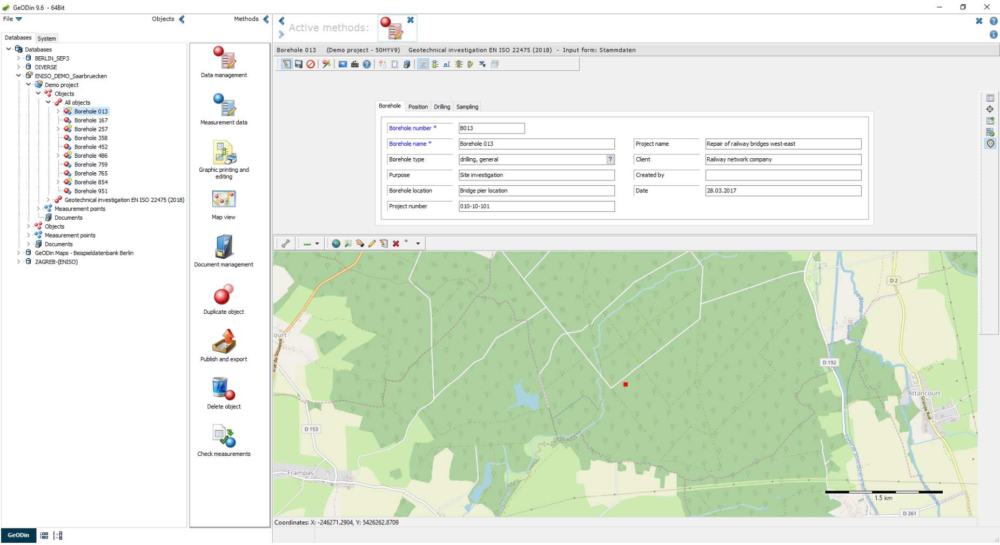

# Geotechnical Investigation EN ISO 22475

This object type supports standardized documentation of **geological and geotechnical investigations** in accordance with **EN ISO 22475** and related standards. It is designed for recording boreholes, groundwater monitoring points, and wells, including associated field and laboratory data.

## Overview

The object type **"Geotechnical Investigation EN ISO 22475 (2018)"** is a further development of the earlier **2007 version**. It enables comprehensive acquisition, evaluation, and graphical representation of geotechnical data using standardized input forms, dictionaries, layouts, and database structures.

For current projects, the **2018 object type \[ENISO002]** is recommended and is provided to all GeoDin users via the GeoDin server.

<figure><figcaption>The Geotechnical Investigation EN ISO 22475 (2018) object type open in GeoDin - the General data input form (Borehole tab) on the left, with the map preview of the borehole location below.</figcaption></figure>

## Working with the object type

### Detailed soil and rock description

Soil and rock characteristics can be recorded in detail using dedicated input forms, including:

* Discontinuities
* Degree of decomposition
* Consistency
* Degree of weathering
* Rock strength
* Rock quality
* Cored section boundaries

These forms are available in **German/Austrian and English**.

<figure><figcaption>Layer data with selection dialogue of additional input forms for the acquisition of discontinuities, degree of decomposition, etc.</figcaption></figure>

### Advanced layer data handling

Layer data include selection dialogs that provide access to additional input forms for detailed geological descriptions, ensuring consistent and standardized data entry.

### Standard-compliant layouts

Predesigned layouts allow output in accordance with:

* **DIN 4943**
* **EN ISO 22475**
* **EN ISO 14688**
* **EN ISO 14689**

Geological fill patterns comply with:

* **DIN 4023**
* **ÖNORM EN ISO 14688/14689**
* **BS 5930‑1990**

<figure><figcaption>GeoDin layout for the visualisation of a trial pit according to ÖNORM.</figcaption></figure>

<figure><figcaption>GeoDin layout for the output of bore hole logs according to EN ISO 14688/89.</figcaption></figure>

<figure><figcaption>GeoDin layout for visualisation of drilling profile and well design in according to DIN 4943.</figcaption></figure>

### Visualization outputs

Available layouts include:

* Trial pit visualization (ÖNORM)
* Borehole logs according to EN ISO 14688/14689
* Drilling profiles and well design according to DIN 4943

## Technical notes and compatibility

* The object type uses the **new descriptor (E2)** due to technical adjustments.
* Full functionality is available **from GeoDin version 9 onwards**.
* The object type is **not downward compatible** with earlier GeoDin versions.

***

## Reference: Standards and normative references

The object type is based on the following standards:

* **DIN / ÖNORM EN ISO 22475 (2007/2006)**
* **DIN / ÖNORM / SN EN ISO 14688‑1 / 14688‑2**
* **DIN / ÖNORM / SN EN ISO 14689 (2020)**
* **DIN 4943 (2013)**

These standards define the structure, terminology, symbols, and layouts used for soil and rock description, borehole logging, and well documentation.

## Reference: Supported data and checklist

The object type includes the following main data categories:

### General data

* Project and location data
* Map preview
* Extended general data according to **DIN 4943**

### Layer data

* Stratigraphy
* Discontinuities
* Degree of decomposition
* Consistency
* Degree of weathering
* Rock strength
* Rock quality
* Cored section boundaries

### Sample data

* Field and laboratory samples
* Documentation of test results

### Well and groundwater data

* Well design
* Groundwater monitoring points
* Filter and screen information
* Backfill and casing details

### Data sequences

* In-situ tests such as:
  * CPT
  * SPT
* Other measurement sequences

### Additional data

* Official notifications
* Bilingual geological standard (German / English)
* Customizable dictionaries and input forms

<figure><figcaption>Additional general data according to DIN 4943.</figcaption></figure>

## Reference: Application areas

The object type is commonly used in:

* Geology
* Environmental geology
* Geotechnics
* Civil engineering
* Documentation and graphical representation of:
  * Boreholes
  * Wells
  * Groundwater monitoring points

Field and laboratory investigation results used to assess soil suitability for construction purposes can be documented using dedicated data types.

## Reference: Database tables (selection)

The following database tables are used by the object type:

* **GEODIN\_LOC\_E2GENER** - General data
* **GEODIN\_LOC\_E2LAYER** - Layer data
* **GEODIN\_LOC\_E2STRATI** - Stratigraphy
* **GEODIN\_LOC\_E2TF** - Discontinuities
* **GEODIN\_LOC\_E2TFNAB** - Discontinuities (standard distances)
* **GEODIN\_LOC\_E2RMZ** - Degree of decomposition
* **GEODIN\_LOC\_E2RMLK** - Consistency
* **GEODIN\_LOC\_E2RMV** - Degree of weathering
* **GEODIN\_LOC\_E2RMGF** - Rock strength
* **GEODIN\_LOC\_E2RMFQ** - Rock quality
* **GEODIN\_LOC\_E2RMKM** - Cored section boundaries
* **GEODIN\_LOC\_E2SAMPLE** - Sample data
* **GEODIN\_LOC\_E2GWATER** - Groundwater data
* **GEODIN\_LOC\_E2BESCH** - Official notifications
* **GEODIN\_LOC\_E2WDGEN** - Well design: general data
* **GEODIN\_LOC\_E2WDHOLE** - Well design: borehole
* **GEODIN\_LOC\_E2WDCAS** - Well design: casing/screens
* **GEODIN\_LOC\_E2WDFILD** - Filter/screen information
* **GEODIN\_LOC\_E2WDBCKF** - Well design: backfill
* **GEODIN\_LOC\_E2WDFLUI** - Well design: flushing
* **GEODIN\_LOC\_E2WDSPCL** - Well design: special features
* **GEODIN\_LOC\_E2DSREG** - Register of data sequences
