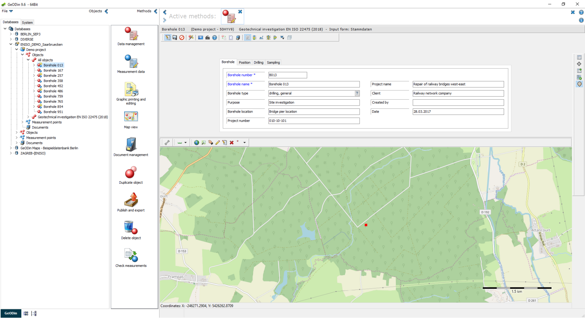

# Miscellaneous object types

Besides the standard geotechnical object types, GeoDin includes a number of miscellaneous object types built for specific use cases. These usually have general data tables configured for a particular purpose, and allow further data to be collected and evaluated using dedicated data types and predesigned GeoDin layouts.

This page currently covers the Climate monitoring station object type.

## Climate monitoring station

The **"Climate monitoring station"** object type records, displays, and evaluates general data for each monitoring station together with its corresponding measurements, using pre-configured, customizable GeoDin layouts.

<figure><figcaption>General data mask for the object type "Climate monitoring station" with map preview.</figcaption></figure>

Checklist:

* General data
* Bilingual (German, English)
* Customizable dictionaries
* Compatible with version 9

### Features

The general data mask records the position and elevation of the monitoring station. Two dedicated data types, each with a matching GeoDin layout, are available for recording and displaying measurement results - these can be entered on site or imported at a later time. Both the object type and its data types are bilingual and support SI and United States customary units.

#### Data type "(E) Wind measurements"

The data type "(E) Wind measurements" records the following parameters, some of which are calculated automatically:

* Wind speed \[m/s] - measured with an anemometer or estimated with a windsock
* Beaufort scale - extended scale dividing wind strength into twelve ranges from 0 (calm) to 12 (hurricane); automatically assigned from the measured wind speed
* Wind gusts \[m/s] - a brief increase in wind speed, usually of short duration (under 20 seconds)
* Wind direction \[deg] - direction the wind comes from (0-360 degrees)
* Cardinal direction - cardinal, intercardinal, and secondary intercardinal directions the wind comes from; can be calculated automatically from the wind direction

The predesigned layout **"(KLM) Wind Measurement"** displays wind direction and wind speed as a wind rose as well as a histogram.

<figure><figcaption>GeoDin layout for displaying wind direction and wind speed.</figcaption></figure>

#### Data type "(U) Climate measurements"

The parameters of the data type "(U) Climate measurements" are divided into two groups: on-site parameters and daily values.

On-site parameters include air temperature (5 cm and 2 m above ground), ground and soil temperature (10 cm and 20 cm below ground), soil moisture, air pressure, relative humidity, snow depth, cloud obscuration and coverage, cloud type, visibility, and free-text remarks. Daily values include daily precipitation depth and type, daily minimum/maximum/average air temperature at both heights, daily average air pressure, sunshine duration, and global radiation.

Three predesigned GeoDin layouts are available for evaluating these parameters:

* **"(KLM) Soil diagram"** - presents soil moisture and soil temperature at two depths over a defined period. Temperature minima, maxima, and mean are calculated automatically.

  <figure><figcaption>GeoDin layout for displaying soil moisture and soil temperature.</figcaption></figure>
* **"(KLM) Climate diagram"** - displays the monthly precipitation amount and monthly temperature course over a selected period, with automatically calculated temperature minima, maxima, and mean.

  <figure><figcaption>GeoDin layout for displaying precipitation amount and temperature, including an evaluation of temperature minima, maxima, and averages.</figcaption></figure>
* **"(KLM) Weather diagram"** - displays relative humidity, sunshine duration, and cloud coverage over a given period as weekly and monthly averages in tabular form.

  <figure><figcaption>GeoDin layout for displaying relative humidity, sunshine duration, and cloud coverage.</figcaption></figure>

<!-- src: support/miscellaneous-object-types#climate-monitoring-station -->

***

## Reference: Wind measurement parameters

| Parameter | Description |
|---|---|
| Wind speed \[m/s] | Measured with an anemometer or estimated with a windsock |
| Beaufort scale | Twelve ranges from 0 (calm) to 12 (hurricane); auto-assigned from wind speed |
| Wind gusts \[m/s] | Brief increase in wind speed, usually under 20 seconds |
| Wind direction \[deg] | Direction the wind comes from, 0-360 degrees |
| Cardinal direction | Cardinal, intercardinal, and secondary intercardinal direction; can be auto-calculated from wind direction |

## Reference: Climate measurement parameters

| Group | Parameter | Description |
|---|---|---|
| On-site | Air temperature (5cm) \[C] | Air temperature 5 cm above ground surface |
| On-site | Air temperature (2m) \[C] | Air temperature 2 m above ground surface |
| On-site | Ground temperature (-10cm) \[C] | Ground temperature 10 cm below ground surface |
| On-site | Soil temperature (-20cm) \[C] | Soil temperature 20 cm below ground surface |
| On-site | Soil moisture \[%] | Soil moisture under grass and sandy loam |
| On-site | Air pressure \[hPa] | Pressure within the earth's atmosphere |
| On-site | Relative humidity \[%] | - |
| On-site | Snow depth \[cm] | Absolute height of snow cover at the location |
| On-site | Obscuration \[1/8] | Proportion of sky obscured by clouds, 0/8-8/8; 9 = sky obscured |
| On-site | Coverage | Ratio of cloud area to free sky area, calculated from obscuration |
| On-site | Type of cloud | Cumulus, stratocumulus, cirrus, etc. |
| On-site | Visibility \[km] | Maximum horizontal distance a dark object is visible against a bright background |
| On-site | Remarks | Free text |
| Daily values | Daily precipitation depth \[mm] | Daily amount of precipitation |
| Daily values | Precipitation type | Rain, hail, snow, etc. |
| Daily values | Daily minimum air temperature (5cm) \[C] | - |
| Daily values | Daily maximum air temperature (5cm) \[C] | - |
| Daily values | Daily minimum air temperature (2m) \[C] | - |
| Daily values | Average air temperature (2m) \[C] | - |
| Daily values | Daily maximum air temperature (2m) \[C] | - |
| Daily values | Air pressure (daily average) \[hPa] | - |
| Daily values | Sunshine duration \[h] | Measurement of sunshine duration per day |
| Daily values | Global radiation \[Wh/(m2-d)] | Sum of global radiation per day |
