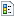
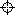
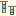
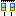
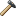
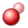
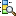

# Object Operations Reference

> **Editorial note:** This page is a temporary holding area for object-operations reference content extracted from the legacy `installing.md` page. Editorial review may split it into per-feature pages (e.g. into `objects/data-management.md`, `objects/sample-data.md`, etc.). All citations and inline icons are preserved.

### Objects

A project may contain up to 9998 objects or boreholes. Because the number of projects in a database is unlimited, the number of objects in a database is also unlimited.

A object may be defined in the GeoDin system as an object that has at least a name and is related to a project. Objects can be boreholes, monitoring wells, cone testing holes as well as climate measuring stations, surface water collection points etc.

Each object must be defined by general data containing information like its name and where present its coordinates. Depending upon the type of object further information may then be entered and displayed, for example a borehole log, CPT results, a groundwater monitoring well. There are over 100 different types of objects ("Object types\*\*"\*\*) in GeoDin, which cover all types of data collection and presentation.

The default installation provides the user a set of object types, depending on the language version. Further object types can be installed from the CD. For example all German geological survey organizations (Geologische Landesämter) have their own input masks for which special syntax controls have been defined. Other international standards are supported (e.g. BS5930, NEN, ÖNORM) as well as specific national standards (e.g. Dept. of Geological Survey, Botswana). A project may contain several different types of objects as long as these are installed in the GeoDin-System folder. In addition there are controls to allow or to prevent the creation of certain types of objects (e.g. read only).

The difference between a measurement point and a object is that the former cannot be created directly - a measurement point is part of a object. For example a measurement point could be a point at which groundwater levels, groundwater or sediment chemistry values are recorded. In each case GeoDin will generate the measurement point automatically, when either a filter or a sampling point is defined. In special object types, like climate measuring stations, the measurement point is generated, when the object is defined.

In the GeoDin object manager a project is always subdivided into objects and measurement points. Both categories may be further subdivided depending on what data is to be collected. As a user you cannot alter this arrangement, because each subdivision is automatically generated.

Datenbases

DemoDB

GeoDin Demo

Objects

All objects

General borehole log

Measurement points

### View in Object Manager

A list of objects and measurement points is shown in the GeoDin object manager, either by clicking on the group header name or on the plus <**+**> symbol:

GeoDin Demo Project

Objects

All objects

Standard outcrop SEP compatible

Borehole 01

Borehole 02

Borehole 03

Borehole 04

Cone penetration test

Measurement points

Filter

Samples

B01: (1.4-1.8m)

B01: (2.5-2.9m)

B01: (5.2-5.6m)

The objects are shown with their longname. The measurement point identifier is made up of the shortname of the object, the name of the measurement point and depth (where present).

In addition to these automatically generated views, you may use queries and groups to generate any number of completely different views where both the type and amount of information displayed can be controlled (e.g. the SHORTNAME with the height of ground surface in brackets). Hence the way that objects are displayed can be customized to your way of working.

GeoDin Demo Project

Objects

All objects

Standard outcrop SEP compatible

Borehole 01

Borehole 02

Borehole 03

Borehole 04

Cone penetration test

Short name (height)

B01 (105m)

B02 (107m)

B03 (107m)

B04 (115m)

Both the entries "Borehole 01" and "B01 (105m)" refer to the same object in the database. What you see in the GeoDin object manager is simply a "**view**" of the database. The entry "Borehole 01" is only present once in the database, although it may appear several times in different views. Hence an object (e.g. a borehole) that appears under "All objects" and under the specific object type exists only once in the database but is presented in two different views. Views are the result of queries - in this example GeoDin automatically generates the queries. The chapter **Creation of queries and groups** explains the concepts of queries and groups more detailed.

### Create object

A new object can be accessed when _**Object**_, _**All objects**_ or the particular **object type** (in the example "General borehole log") is selected in the GeoDin object manager.

GeoDin Demo Project

Object

All objects

General borehole log

Create a new object with a double-click the method   **New object**:

If the method was selected whilst either _**Object**_ or _**All objects**_ were selected, a dialogue field appears containing the option to choose, which type of object should be created.

The option of choosing the unit system to be used is only available for certain object types that support this feature.\
\
In the dialogue you can optionally choose that -Data types are created automatically\*\*-\*\*. For this it is required, that the object type has the permission and that a measurement program for data types has been created ([Measurement programs](../measurement-values/working-with-measurement-data.md)). If at least one data type for the chosen object type, has not yet been created, then this option can be activated. Upon adding this object the relevant tables for the data type with the parameters of the measurement program will be created.

Objects

All objects

General borehole log

New object

If a specific object type was selected whilst starting the method **"New object"**, then the same type of object will be created.

After creating a object it is automatically inserted into the GeoDin object manager and the [Data management](../objects/data-management.md) mask is opened.

If you mistakenly create a new object you can undo this by clicking the **Cancel Edits** button in the data collection:

After a warning you may then delete the object by clicking on **OK**.

Normally however you will want to continue in the **"data management"** mask using one of the five editors: General data, Layer data, Sample data, Well design and Data sequences. Detailed information is available in the following chapters.

Once you are in the data management mask, there is no need to change over to the GeoDin object manager in order to create another objects. Instead just click the button **New object**. This may be repeated as often as you like.

### Data management

When you create a new object the **"Data management"** method automatically opens (as described in the previous section). When you want to edit an existing object, select it in the GeoDin object manager and double click the  [Data management](../objects/data-management.md) method icon.

The **"Data management"** method always shows the data corresponding to the current selection in the GeoDin object manager. If you change the selection, your edits are automatically saved to the database and the data for the new selection shown. If you select an object, which GeoDin is not able to display in the current editor, then a message appears in the edit window, which remains open. This is advantageous when you temporarily need to carry out other operations or call up other functions, before continuing with the data management.

The **"Data management"** method has two tool bars that may be horizontally re-positioned. The tools displayed depend on the object selection in the GeoDin object manager.

The following tools are always available:

**Modify object (Start editing) / Stop editing**

When activated (**Modify object**) the tables and masks can be edited. In the deactivated state all entry fields are gray and editing is not possible.\
\
This browser-mode (read only/ write-protected) is useful, if inadvertent changes in object data are to be avoided or if another user is simultaneously working on the same object.

The editing mode stays active as long as the icon is not re-clicked (**Stop editing**). All alterations in the object data are stored automatically by toggling this button.

_**Tip:**_ _If you change boreholes (objects) then GeoDin also saves automatically. This can optionally be turned off by editing the configuration parameter_ _**AutoSave**_ _to =false (see Installation - Configuration file: GeoDin.ini)._

**Save**

By clicking the **Save** icon you can save all the changes made in the current editing session. The **Save** button leaves the editing modus open.

**Cancel edits**

By clicking the **Cancel edits** icon you can undo all the changes made in the current editing session. The **Cancel edits** button deactivates data editing.

After an alert message, all alterations for the current object are discarded and the original status of the object restored for all data (general data, geological tables, well design, samples etc.)

_**Tip:**_ _The_ _**Cancel edits**_ _icon has another very useful function. When you select a object containing faulty data GeoDin will not let you move on to another object before the syntax errors have been corrected. This can arise when working with imported data or when you have accidentally created a new object. Using Cancel edits the syntax check can be bypassed or the new object deleted._

**New object**\
\
Creates a new object without leaving the Data management method (see also: [Create object](../objects/creating-objects.md)).

**Go to object**

In the data entry grid each object is shown as one line. By clicking this icon, you are taken to the general data input masks for the object selected in the current line.

&#x20; **Create object group**

The data records of the GeoDin objects can be filtered in the general data grid. Not all objects of the underlying query or group will then be displayed as rows. Using the Create Object Group function, these filtered GeoDin objects can be combined into a new group in the Object Manager.

```
**Cut, Copy and Paste**\
```

\
These icons are used for the clipboard functions. These functions can also be activated by using the standard key combinations **Ctrl + X**, **Ctrl + C**, **Ctrl + V**.

**Data collection language**

Here you can choose a different language for the data collection masks than the GeoDin user interface. If you want to use the same language, just keep the default "Automatic" setting. This setting is also used for the [Document description](../documents/document-organization.md) masks types.

The language for previewing the layer data (as a log profile and text) can be defined separately.

\*\*_Note:_ _Only data input masks in different languages can be shown for object types that have multilingual support and an existing translation. Currently this is available only for the object type "Geotechnical investigation EN ISO 22745" in English and German and for the international document description objects (DOC) for English, French, German, Spanish and Russian (March 2015)._

**Keyboard short cuts**

A dialogue with the current keyboard short cuts is displayed. Many functions of the editor can be called up with the help of the listed keys.

**Help**

The help option is started.

&#x20; **Page layout** (direct link to the graphic preview)\
\
This function saves any changes made in the [Data management](../objects/data-management.md) method and opens the graphic preview for the current object. Hence using this preview method you always view the actual status of the database.

**Manage documents**

The **Document management** for the current object is started. If you edit a sample or a groundwater measurement point the document branch for this measurement is opened.

Data collection is carried out in specific editors, which are also located in the upper tool bar:

The number of editors available depends on the object type chosen. There are tools available for the collection of:

'General data'

'Layer data'

'Samples'

'Well design'

'Data sequences'

If for the current object an input of these data is not possible the particular icons are not present in the tool bar. For example for a climate measurement point only the general data can be entered, so only one icon appears in the tool bar.

### General data

The input masks for recording general data are accessed by clicking on this icon.

The **Object information** card opens by default in the editor after creating a object.

In the General Borehole Log, the two further masks allow **Site information** and **Extras** to be entered. Depending on your object type there may be further cards available, with differing constellations of entry fields.\
\
To scroll through the index cards one can either click the corresponding tab with the mouse or use the **Page up** and **Page down** keys. To jump from one entry box to the next use either the **Tab** or **Enter** keys. To reach the previous entry box hold the **Shift** key and press **Tab**.\
\
A short explanation to each entry box is shown in the status bar. For several input fields, a longer support text can be called up via the keys **Ctrl** + **F1**.

The following special icons are available for the input of the general data:

&#x20; **Select input form**

For the input of the data different masks can in some cases be used. The selection of (another) input form is done with this icon.

**Edit general data**

\
The general information for a project is entered in the general input mask. By using **Defaults** general data, recurring information such as site description, drilling company, data security etc. must only be entered once (i.e. the site description remains the same for each object, although each object has different coordinates). Click to start and stop (i.e. save) the default entries, so that they appear automatically with each new object.

To use the default general data completely it is best to enter the relevant information before beginning with the first object. The top bar above the program icons shows which general data is active. Now enter all chosen presets in the entry fields.

Depending upon the object type there will be a ceratin number of obligatory entry fields in the input mask: **Short name**, **Full object name**, **Easting** (X coordinate), **Northing** (Y coordinate) and **Depth** of borehole are always required, though further entries may be necessary . More data can be entered as required, depending on the availability, complexity and future use.

Dictionary fields such as _Field log, Summary log, Data security_ and _Checked by_ in the BS 5930 object typeare user-definable i.e. you can customize the dictionaries linked to each field. For example, if always the same persons check the data their names can be stored in the relevant dictionary and can be subsequently chosen from the pull-down menu to quicken data collection.

&#x20; **Input control**

When entering data in an input field it is tested automatically for correctness of its content (e.g. invalid code or number).

Right-click to adjust the input configuration settings **\<Input control>.**

_\[Underline errors]_ - turns the feature on and off

_\[Check after entering separator]_ - activates the feature when a separator is entered

The second option results in the data enter being first checked when a comma, bracket or other separator has been entered and the next field selected. The default setting is "off" for this feature so that when typing several letters an error may be shown before one has completed the data entry. Once data entry is finished it will however be clear whether errors have been made. This feature does basic checks on data entry and is fully supported in the table grid view.

&#x20; **Map preview**

This icon shows an object plotted as a red cross (x) on a OpenStreetMaps background. You must have an internet connection to display the OSM map. In the edit modus you can move the position of the cross. There are two options available by clicking the three bar icon in the top left corner of the map:\
\
Show valid extent in map - shows the map limits for the chosen coordinate system

Move object to valid extent center - moves the object to the map center within the chosen coordinate system

Beneath the map information on erroneous entries or missing EPSG codes is shown

Use the menu button in the top left corner of the map to access the following functions:

**"Show valid extent in map"**

The valid extent of the coordinate system is shown by a red rectangle superimposed on the map. Note that for global coordinate systems (e.g. WGS 84) the whole world will be shown!The po

**"Move object to valid extent center"**

The object position (red cross) is centered within the valid map extent. The coordinate entries are NOT changed. This first happens when the position of the cross is changed by either manually moving it or right-clicking in another position; then the new coordinates can be saved.

This method is useful for quickly bringing objects with no or erroneous coordinates within the coordinate system where fine positional adjustments can be made.

**Geometry panel**

The geometry panel in the general data editor can be used for manual input or correction of coordinates.

_**Note:**_ _The input fields always refer to the x-coordinate, y-coordinate and EPGS code and are independent of the object type._

The edit fields also update when the object is moved on the map.

&#x20; **Coordinate transformation**

The tool for the coordinate transformation can be used by clicking on the crosshair symbol in the general data editor.

The tool uses the coordinates and the coordinate system of the current object for the coordinate transformation as input data. The target system can be selected in the next field. To do so, click on the question mark symbol and select the desired coordinate system in the new window. _**Note: The default setting is the last coordinate system used.**_

To calculate the coordinates, click on the **Calculate** button. After converting the coordinates, the **OK** button becomes active and the newly calculated values can be transferred to the object.

&#x20; **Export master data**

In the table/grid view of the master data, the \<Export> button is also available in the upper toolbar. This allows you to export the table to Excel in the form in which it is displayed.

### Sample data

All sampling information is recorded in the sample editor.

Depths are entered in m below ground.

The following special icons are available for the input of sample data:

**\<First row> -** Moves to first data record

\
&#xNAN;**\<Previous row> -** Moves to previous data record

\
&#xNAN;**\<Next row> -** Moves to next data record\
\
&#xNAN;**\<Last row> -** Moves to last data record

**\<Insert line> -** Inserts data recordin current row

**\<Duplicate record> -** Duplicates current data record

**\<Remove line> -** Deletes current data record

**Input control**

When entering data in an input field it is tested automatically for correctness of its content (e.g. invalid code or number).

Right-click to adjust the input configuration settings **\<Input control>.**

_\[Underline errors]_ - turns the feature on and off

_\[Check after entering separator]_ - activates the feature when a separator is entered

The second option results in the data enter being first checked when a comma, bracket or other separator has been entered and the next field selected. The default setting is "off" for this feature so that when typing several letters an error may be shown before one has completed the data entry. Once data entry is finished it will however be clear whether errors have been made. This feature does basic checks on data entry and is fully supported in the table grid view.

With the key combination **Ctrl + Del** complete rows can be deleted and inserted with the key combination **Ctrl + Ins**. The **F2** key or clicking on the question mark at the end of the entry field can be used to search in the dictionaries. After ending a row a new row can be created using the **Tab** key or the **Arrow Down** key. The number of rows is not limited.

Key functions for the input in the table:

**Tab stop** Moves to next entry field or at the end of a line creates new line

**Shift + Tab** Goes to previous entry in the line

**Arrow Up** Goes to previous line

**Arrow Down** Goes to next line or creates new line

**Ins** Inserts new line (above current line - following lines move down)

**Ctrl + Del** Deletes current line (following lines move up)

Please also see the help notes [Using the data entry grid](../measurement-values/working-with-measurement-data.md).

### Well design data

Information on technical construction of a groundwater monitoring wells are collected in the editor for well design.

With the exception of the general data and measurement point information, all other data is entered in grid tables. Each table in a grid is composed of various entry fields and drop-down choice boxes. A new row can be created either at the end of a row by using the Tab key or anywhere within the row using the down-arrow key. The number of rows is not limited.

When entering information on backfill, casing and special features, codes (abbreviations) are used for the elements. These can either be searched for in the associated dictionaries and used, or entered directly in the field. **Depths** are generally entered in **m below ground surface**; depth information for **elements above ground** must be preceded by a **negative sign**.

Well design information is divided into the following groups (shown as individual editors in the GUI):

&#x20; **Borehole information, drilling method and tools**

This table is used to collect information on drilling progress, including the drilling method and the tools used.

The following fields are mandatory:

• Depth from (in m below ground surface)

• Depth to (in m below ground surface)

• Borehole diameter (in mm)

This information is used for the graphical presentation of the borehole true to scale. The optional entries for drilling methods and tools can be chosen using the key combinations **Shift down-arrow** and **Shift up-arrow**.

&#x20; **Backfill information**

Backfill information is also entered in a table, whereby the following fields are mandatory:

• Type of backfill (code)\
• Depth from (in m below ground surface)\
• Depth to (in m below ground surface)

The type of material is entered using easy to remember abbreviations. This can be entered directly or chosen from the dictionary list. As soon as the entry matches a known code, the plain text translation appears in the Material field.\
\
The automatic entries in the Material field can be overwritten and will be used in the graphical presentation of the backfill. Additional information on the grain size (from - to) can be optionally entered in two fields. This will also be displayed graphically.

&#x20; **Casing information**

This table is used for entering the individual components of the monitoring well such as filters and end caps etc. If such a well has several piezometers, each one will have a separate entry table. The tables are created as index cards and can be accessed by clicking on the tabs at the lower window boundary. You can also use the key combination **Ctrl+digit**. Each piezometer is numbered successively, up to a maximum of nine per object.

Following fields require an entry:

• Element (code)\
• Depth from (in m below ground surface)\
• Depth to (in m below ground surface)\
• Element diameter (Dia.) (in mm)

Individual elements are entered using codes, either directly or from the dictionary list. The plain text appears automatically in the field _"Type of casing"_. Here to this text can be edited, overwritten or deleted. Depth information for elements above ground must be preceded by a negative sign.

The depth and diameter information are used for the true scale graphical presentation.

In the field _"casing material"_ further information can be entered. This can be chosen from a list and will be used in combination with _"the type of casing"_ for labeling the well design graphic. This is an optional field as is the element thickness (Thk.).

&#x20; **Filter details**

After entering an element of the type **"Filter"** the data entry mask can be used for collecting further details on the groundwater monitoring well.

This entry mask is available via the casing table when the cursor is in an entry row where there is a filter element. None of the mask entries are compulsory - the information is evaluated using the measurement editor. If there are more than one set of casing then you can move between them using the "up arrow" and "down arrow" buttons.

&#x20; **Information on special features**

Here special features can be recorded that cannot be attributed to individual casing elements, for example concrete rings, hydrant covers etc. With these elements complicated well housing features for multiple piezometer installations above and below the ground surface can be constructed. All these elements are drawn centred on the borehole.

Special features are also entered using codes that are either entered in the **Type** field or chosen from the list. The field **Feature type** is automatically filled out with plain text upon entry of a Type code - this text can be over-written, changed etc. and is used for well design labelling.

&#x20; **Additional information**

General data for a groundwater monitoring well can be entered in this mask.

&#x20; **Copy well-design data from another object**

This feature allows you to copy well design data from another object.

Please also see the help notes in Chapter [Using the data entry grid](../measurement-values/working-with-measurement-data.md).

The following icons are also available when enetering data in a table (grid) :

**Go to first data record**

\
**Go to previous data record**

\
**Go to next data record**\
\
**Go to last data recordInsert data record in current rowDuplicate current data recordDelete current data recordInput control**

When entering data in an input field it is tested automatically for correctness of its content (e.g. invalid code or number).

Right-click to adjust the input configuration settings **\<Input control>.**

_\[Underline errors]_ - turns the feature on and off

_\[Check after entering separator]_ - activates the feature when a separator is entered

The second option results in the data enter being first checked when a comma, bracket or other separator has been entered and the next field selected. The default setting is "off" for this feature so that when typing several letters an error may be shown before one has completed the data entry. Once data entry is finished it will however be clear whether errors have been made. This feature does basic checks on data entry and is fully supported in the table grid view.

### Graphic printing and editing

For the printout and / or the editing of graphic presentations the method **"Graphic printing and editing"** is used.

If the method **"Data management"** is opened, the icon **Page layout** is available to change to the layout overview.

In the window \<Layout overview> all available page layouts are displayed. In the right sector of the window the available layouts and folders are shown similar to the Windows Explorer. On the left the layouts and folders appear in a symbol view. The navigation to a specific layout can either be done in the tree view (by selecting the particular branches and the chosen entry) or by double-clicking on one of the previews displayed on the right.

After selecting the chosen layout the objects, which are selected in the GeoDin object manager, are displayed automatically and can be printed out. If a query or a group of objects is marked in the object manager instead of a single object (for example the branch '**All objects**') these objects can be shown and printed out in one step.

**LIst of objects**

The list of objects shown beneath the tree view contains the objects selected in the GeoDin object manager.

**Delete from the lis**

Objects can be removed from the list of objects to be displayed (printed out).

**Move selected entry up** / **Move selected entry down**

The order can be edited, which is also the order of the printout and in a mult-object frame the order of the objetcs

&#x20; **Edit without refresh**

The order in larger lists can be edited without continuously refreshing the graphic view.

The objects selected in the object manager are automatically displayed in the layout. Keep the **Ctrl** key pressed to select another object, without recalculating the presentation. With pressed **Ctrl** key further objects can be dragged and dropped from the object manager in the list of objects to display. These objects are added to the list and the view is recalculated.

The graphic preview in a page layout can be enlarged and reduced and the displayed (enlarged) section can be moved using the buttons:

**Zoom inZoom outPanZoom to pageNext pagePrevious page**

Also the icons for going through the pages are available, if for example a borehole is distributed on several pages.

With the option **Print / Export** the printout or export of a graph is started. Select the chosen target of the output in the drop down menu before. Define, whether the graphic should be printed or created as file according to the format. By selecting the file format for each object at least one file is created, which has the name of the object with the particular file format ending (for example borehole 01.wmf). If several pages result from an object (for example distribution caused by the adjusted scale) for each page a file is created. From the second page on the file names include the page number (for example borehole 01 (2).wmf).

**Full screen on / off**

If kept pressed, this icon fades out the overview of available layouts, so that the current view of the layout is displayed in the entire window and details are easier visible. A change of the object in the object manager leads to an automatic actualization of the view. The print / export of the presentation is possible with the particular icon in the top icon bar. Click again on the icon **\<Full screen on / off**> to show the overview of available layouts.

**Layout Interfaces**

Below the list of objects to display the available layout interfaces for the current page layout are shown. Here for example the vertical scale of the actual view, a labeling text, the view section of an axis etc. can be configured. Each page layout has its own amount of layout interfaces. Layouts of older GeoDin versions have no configured layout interfaces, but these can be added easily.

&#x20; **Edit quick settings**

In the window **Edit quick settings** use the icon   **Edit** to add or remove quick settings. All layout interface possibilities are grouped. Activate the interfaces, which should be available in this layout template. The images displayed on the right are previews of the quick settings. Consider that the layout interfaces, which are not available in the actual layout, cannot be activated. For example the interfaces '**Vertical scale**' cannot (sensibly) be used in a layout, which contains a report of measurement values, because no graphic element exists, on which a vertical scale could be adjusted.

A detailed description of the functions of layout interfaces is available in the particular chapter [Layout interfaces](../../data-visualization/layouts/layout-editor-basics.md).

**Save quick settings**

If you have changed a setting by using the layout interfaces and you want to apply this setting permanently in the default state of the layout use the button <**Save**> below the quick settings.

**Previews (symbol presentation)**

Layouts are shown in the left part of the window 'Layout overview' as miniature images. These images are created automatically out of the information of a layout, if the layout contains no saved preview (for example older GeoDin versions). Because layouts only contain frames for the objects to display the images are not always meaningful. You can define the current view of a layout (with the related contents) as preview for the layout overview. Use the icon <**Create new preview**>.

**Edit details of current graphic**

Often the use of layout interfaces for the determined editing of some chosen presentation options are sufficient to get to the desired view. If major changes are required for the presentation, using the icon <**Edit details of current graphic**> a change to the graphic window with full editing options is possible. The chapter [Create and edit graphic](../../data-visualization/layouts/layout-editor-basics.md) gives further detailed information.

**Edit other graphics**

A change to the graphic window with full editing options can also be achieved using the icon <**Edit other graphics**>. Then the graphic window starts with a new empty page.

**Configuration of the available layouts**

If you call up the layout overview the standard '**Layout lists**' file and the '**Layout folder**' of the GeoDin installation are investigated and the available layouts are displayed. To include another or an additional layout list or folder in the search, select in the tree view the first branch '**Available layouts**'. Using the icons <**New**> and <**Remove**> further layout lists or folders can be added or removed from the service. The icon <**Refresh**> renews the search for layouts (use this function for example you want to examine the folder after copying layout files with the Windows Explorer in the layout folder).

**Automatic updating layouts**

The update of a currently displayed layout is done by default when choosing a layout from the layout list or by the change of an object in the GeoDin object manager. In rare cases, when using layouts which require long calculation time, they may disturb the navigation both in the object manager and the layout overview. Because of this the option 'Automatic calculation of layouts' is available. The option has to be set for each folder and possible subfolders. If you set this option for the major folder it will not affect the subfolders. If this option is inactive, the layout will not be updated when changing the layout settings or choosing another object. The calculation can be done by clicking **Calculation / Refresh** or the key **F5**.

**Creating individual PDF-files from several chosen objects**

There is an option in GeoDin to create PDF-files from multiple objects. However the functionality depends from your installed PDF printer driver. Output of a PDF will only be successful, if you have installed Win2PDF on your computer. In virtually all other cases only PostScript-files will be generated.

After clicking the **Print** button you can choose the option to create individual PDF files for several chosen objects. After choosing a folder where to save the files you have to confirm with **OK**. The file name can either be the object name or the object ID in GeoDin. Select a appropriate PDF-printer, such as Win2PDF. After confirming with **OK** the files will be saved to the selected folder. GeoDin will automatically recognize if the files have been generated as PDF or PS (e.g. by using FreePDF). If the files have not been saved as .pdf but as.ps, their filename will be changed to .ps automatically. These PostScript-files can be opened with a double-click and transformed into a PDF file because Windows has automatically mapped the file extension. If WIN2PDF is installed, PDF files will be generated directly and can be opened with Adobe Reader or similar programs.

The following section shows a script with which all .ps files from a folder can be converted to PDF files.

Ghostscript from the installed PDF printer driver is used (e.g. gs9.04) .

You can adapt the script for your installation or Windows set-up.

```
@ECHO OFF

echo.

echo This Batchfile convert all *.ps files in this folder to pdf

echo ghostscript is needed to operate, check the path to the gswin64.exe, edit the Convert_ps2pdf.cmd if needed

echo http://www.ghostscript.com/download/gsdnld.html

echo.

echo !! ALL *.ps files are deleted afterwards !!

echo.

echo.

echo Cancel batch with CTRL + C

echo.

pause

FOR /R %%F in (*.ps) do "C:\Program Files\gs\gs9.04\bin\gswin64.exe" -sDEVICE=pdfwrite -dBATCH -dNOPAUSE -q -sOutputFile="%%~nF.pdf" "%%~nF.ps"

echo.

echo DELETING all *.ps files. Cancel batch with CTRL + C

echo.

pause

del *.ps
```

If Win2PDF is installed, PDF files are generated directly, that can be opened with Adobe-Reader.

**Adjusting the resolution for printing picture files**

The resolution for printing picture files automatically corresponds with your computer settings, which may not fulfill your requirements (e.g. resolution too low for high quality printing). If you need a higher resolution, please switch into the editing-mode **Edit details of current graphic**. For further procedure information please go to [Exporting image files](../../maps/cad-and-gis-exports.md).

### Print DIN formular

From GeoDin 9 onwards the method **"Print DIN formular"** is replaced by the supplied layouts.

Layouts are available for SEP1 and SEP3 object types, as well as for geotechnical exploration EN ISO, which can be used to create and print a corresponding borehole log.

### SEP import

To import files in the SEP format first create a new GeoDin project or open an existing GeoDin project, into which you want to import the data.

Select the method **"SEP import"** at the entry object.

Choose the source of your SEP files. For this you have 3 options:

**1. Chosen files:**

The SEP files are chosen from one or several folders individually and are added to the particular GeoDin project. The SEP files to import have to have the following endings: \*.HY; \*.BV; \*.SE; \*.GE; \*.IG.

**2. Entire folder:**

Here complete directories, which contain SEP files, can be added.

**3. SEP-catalogue:**

Import of a SEP catalogue file (usually contains several boreholes)

\
Chose the option **Files in DOS text** for older files, which were created with the DOS version of SEP. The German vowel mutations are converted in the Windows notation.

Select now, which location type should be imported. All SEP compatible location types are listed.

Optional the coordinates from the SEP files can be transformed into another meridian. For this select the middle meridian. The original coordinates can be saved by selecting the appropriate general data fields for both coordinates.

\
Confirm your selection with **OK**. After completing the import further data can be imported without calling up the option again.

### Data checks and calculations

You can use the method **"Data checks and calculations"** for input controls, search and replace of contents and layer queries.

**Search and Replace in Layer Data**

With this function you can replace wrong codes, which can derive from importing borehole log data to your GeoDin database

First select the entry field, which contains the wrong code, enter the wrong code in the field _"Search for"_ and in the field _"Replace with"_ the right code, for example:

Data field: Stratigraphy

Search for: qx

Replace with: qw

Confirm with **Proceed**. All borehole logs are now searched and corrected.

It is also possible to replace text by code or code by text. So it could be the case that a user not knowing the codes has entered all information as text in inverted commas, for example fS,'pockets,u. For 'pockets' the code poc is available.

\
Write the word in single high commas and run the search for text contents, example:

Data field: Petrography

Search for: 'pockets'

Replace with: poc

The search and replace function is specially developed for coded borehole logs. Here no symbol strings are exchanged (like similar functions in a word processing program would do). The borehole log is made up of individual codes, so it is possible to define the code u (silty) as a search term, in a way that not every letter u is replaced, but only the identified codes u.

**Search and replace in General Data**

With this function you can replace entries in the general data table.

First select the entry field, which contains the value to replace, enter the value in _"Search for"_ and in the field _"Replace with"_ the new value, for example:

Data field: Client

Search for: Drillers & Sons Ltd.

Replace with: Drillers & Partners Inc.

Confirm with **Proceed** to correct the values in all the selected objects .

In the _"Search for"_ field the placeholders "?" and "\*" can be used, where "?" stands for a single character, and "\*" for a string. If you were to look for all the entries starting with Drillers, but are not surehow many characters follow, enter _Drillers\*_. If you want to search for Sons, but don't know whether it has been written with a _u_ or _oh,_ enter _S\*ns_ in the search field, whereby the "\*" may stand for one or two characters. A ? can be used when you want to search for an exact number of unknown characters.

When searching in date fields GeoDin accepts the following formats in _"Search for"_**:**

TT.MM.JJJJ

The separators \[-], \[/] or \[.] can be used (e.g. 09/04/2011 for 9th April 2011).

Here too the placeholders "?" and "\*" are accepted, but only in the format TT.MM.JJJJ with \[.] as the separator.

\
**Input control**\
\
Using this function you test the entered layer data of all selected boreholes on syntax correctness. If syntax errors are found, the following message appears:

2 objects contain syntax errors.

These objects are shown in the group:

'Syntax error 06.04.2006 15:27:12'.

To correct the errors, mark the first borehole of the group and start the method **"Data management"**. Change there to the layer data and in the editing g mode. Click on the icon **Syntax control**, so that you are led directly to the layer, which contains errors. After the correction of all errors you go on with another borehole of the group.

To be sure to have corrected all mistakes start a new test at the entry of the group syntax error.... (The test is only carried out for these boreholes; the others have been tested already). If no borehole contains syntax errors anymore a message appears, otherwise another group is created with the boreholes, which still contain syntax errors.

**Data sequneces: Calculating sequences**

With this method you can calculate new series for all selected objects. A detallied description of the configuration and setup of this method is available in the chapter [Calculating sequences](../../data-collection/import/data-sequences.md).

### Import and export

The following chapters describe the import and export of data sequences and data of various exchange formats.

[Import data sequence](../../data-collection/import/data-sequences.md)

[Create objects from data sequences](../../data-collection/import/data-sequences.md)

[SEP import](../../data-collection/import/special-imports.md)

[SEP1 export](../../data-collection/export.md)

[Export shape files](../../maps/cad-and-gis-exports.md)

[XML export](../../data-collection/export/geodinml-export.md)

### Delete object

To delete a object double-click the method **"Delete object"**:

If the object contains either measurement or document data, it will be shown in the dialogue window (black where present; gray if absent). After confirming your decision you can delete the object permanently.

### Duplicate object

You can also create new object by using the method   **Duplicate object**.

If the object contains subordinated data, like measurement values or document data these can optionally be copied with the object.

The duplicate is then highlighted in the GeoDin object manager and can be renamed etc. by choosing the **"Data management"** method:

MacDuff Distillery 01

MacDuff Distillery 02

MacDuff Distillery 03

MacDuff Distillery 04

MacDuff Distillery 04

[Data management](../objects/data-management.md)

### Delete objects

Alternatively you may choose a group of objects to delete all at once by selecting the appropriate group in the GeoDin object manager

All Objects

Borehole 01

Borehole 02

and selecting the option **"Delete all objects"**.

_**WARNING:**_ _THIS METHOD CANNOT BE UNDONE!_

### Dictionary search

While working with input forms the dictionary search can be started either with the **F2** key or by clicking the question mark <**?**> symbol at the end of the entry fields. In both cases the dictionary of the appropriate entry field is displayed automatically

While entering the search term in the entry field **Search** the list of dictionary entries is automatically reduced on the entries, which are equal to the search term, so that also related terms can easily be found.

If the option **Full text search** is activated, the search term is also found in the middle of a word. Otherwise the search term has to be equal beginning with the first letter.

Optional considering capital and small letters can be activated with **\<Entries are case sensitive!>.**

Beside the search in the **Text** of the dictionaries also a search in the **Code** or the **Standard / Age** entries is possible. Select therefore the chosen option in the section **Search for**.

With the button **Apply** the result of the search (for example the code) can be inserted in the current entry field (from which the search was started) at the actual cursor position. To end the search dialogue without applying the result use the button **Cancel** or the **ESC** key

### Layer data

The layer data editor is used to record geological information for a object. A object can be a single borehole, a groundwater monitoring well or a climate measuring station etc. from which the data originates. Click the <**Layer data**> button to start.

The following special icons are available for the input of the layer data:

**Input form** choice and selection of recording mask

\
**First layer** - scrolls to the first layer (not in full-text mode)

**Previous layer** - scrolls to the previous layer (not in full-text mode)

\
**Next layer** - scrolls to the following layer (not in full-text mode)

**Last layer** - scrolls to the last layer (not in full-text mode)

\
**Insert layer** - inserts a new layer

**Duplicate layer** - duplicates the current layer

\
**Delete layer** - deletes the current layer

\
**Input control** - syntax control

When entering data in an input field it is tested automatically for correctness of its content (e.g. invalid code or number).

Right-click to adjust the input configuration settings **\<Input control>.**

_\[Underline errors]_ - turns the feature on and off

_\[Check after entering separator]_ - activates the feature when a separator is entered

The second option results in the data enter being first checked when a comma, bracket or other separator has been entered and the next field selected. The default setting is "off" for this feature so that when typing several letters an error may be shown before one has completed the data entry. Once data entry is finished it will however be clear whether errors have been made. This feature does basic checks on data entry and is fully supported in the table grid view. Complex checks on interdependencies and key code transitions are not covered.

&#x20; **Borehole profile preview and translation of codes to text**

Both the graphic preview of the borehole and the text description are displayed beneath the data entry mask and are permanently updated during layer data input. You can navigate in this preview by using the scroll bars, a mouse wheel or an equivalent touch gesture (on mice or track pads). By clicking on a layer you can directly go to the data entry mask at the chosen depth.

\
The following keys have special functions for working in the layer data mask editor:

**Ctrl+PageUp** Jumps to the layer above\
**Ctrl+PageDn** Jumps to the layer below

**Crtl+End** Jumps to the last layer

**Crtl+Home** Jumps to the first layer\
**Ins** Inserts a new layer between two existing ones\
**Ctrl+Del** Deletes the current layer

**Crtl+D** Duplicates the current layer

**Crtl+K** Switching between main layer and components

**F2** Opens the appropriate dictionary (which may then be searched)\
**F3** Syntax control\
**F4** Turns the graphic preview on and off

**F7**Preview of layer queries (only for SEP 3)

In the input screen the information of each layer can be edited. The lower layer boundary of the previous and the next layer is displayed left and right beside the entry field for the depth value.

### Data sequences

Data sequence information is collected with the data sequence editor.

All types of data sequences can be entered: CPTs, SPTs, chemical profiles, geophysical logs, etc. Depth values are entered in m below ground surface and the measurement values may have any number of decimal places, or just text.

The data sequence list shows all the data sequences that belong to the object. New data sequences are created by clicking the **New** button upon which it must be given a name.

Confirming with **OK** an empty table is added and data entry can begin.

An existing data sequence can be deleted by clicking the **Remove** button. After confirming the security query the data sequence and all its' values are removed.

The button **Rename** allows existing data sequences to be renamed.

Data sequences such as SPTs with regularly spaced depth intervals should use the option \*\*Automatic depth interval \*\* and enter a value. After inputting the first depth value and associated measurement, in the following rows only the measurement values must be entered.

The **Import** button can import existing data sequences from ASCII files. A detailed description of this function is given in Chapter [Import data sequence](../../data-collection/import/data-sequences.md).

Conversely the **Export** button allows selected data sequences to be exported in CSV-Format. For each data sequence a file with the following format is created in a user defined folder: Objekt.LONGNAME\_SNDNAME\_SNDID.csv.

Please also see the help notes [Using the data entry grid](../measurement-values/working-with-measurement-data.md).

### Configuration

The system configuration contains all global (project independent) settings in GeoDin. Under the index card "System" you can access system configuration. These include dictionaries (Keylists), signature tables, fill patterns, data types etc.

Settings or changes in the system configuration may affect the display of all graphics.

**Example:**

If you change the signature for the key fS (fine sand) in the dictionary "Petrography", the fine sand layers of all boreholes will be displayed with the new signature in all graphics from now on.

If you change the appearance of a signature, all surfaces (also older graphics) that are filled with this signature will be displayed with the new signature. This is due to the fact that in the GeoDin graphics for a filled surface only the name of the signature table and the number of the signature are stored and not the appearance of the signature itself.

These examples show that in multi-user environments it is advisable that not everybody should have the rights to change the system configuration to avoid unwanted changes. In GeoDin this is controlled as described in the chapter

**Edit**.

### Object types

The default setting installs only a limited number of object types. The international English version installs the "General Borehole Log". You will find this under the **System** tab.

There are many more object types for all the different language versions of GeoDin, which each user may install directly from the GeoDin DVD. These include separate object type for all the geological survey organizations in Germany as well as several international types in English and Dutch. Additionally there is a range of object types covering other fields of data collection that are not related to boreholes (for example climate measuring station, surface water measurement point).\
\
&#xNAN;_**Note:**_ _There are also special FUGRO object types available only for internal company use._

The installed object types are shown in the directory **Configuration**.

To install further types double-click the [Install](../../installation/express-installation.md) method and choose the appropriate folder from the chosen directory on the GeoDin DVD.

**Downward compatibility as of GeoDin 9**

Please note that databases created with GeoDin 9 can only be opened with GeoDin 9 and 8.4. Databases created with GeoDin version 8.3 or older must be updated once to the new database structure. When opening an older database in GeoDin 8.4 or higher, a window appears in which you are shown the changes to be made and can agree to the process. The database can now only be used with GeoDin 8.4 or higher.

New layouts created in GeoDin 9 cannot be used with older versions. However, older layouts can be used with GeoDin 9.

### Dictionaries

All codes, which can be used for the data input in the GeoDin system, are contained in dictionaries. The dictionaries are connected with their particular input fields and comprise lists of codes or text strings, which are allowed as valid inputs or serve as a guide for inputting data.

In addition to input control, the dictionaries are also responsible for the type of graphic display (e.g. which fill pattern is used for granite) and contain various foreign language translations.

All installed dictionaries are displayed in the GeoDin object manager. Each dictionary identifier is preceded by an identifier in round brackets. These identifiers are used to distinguish which object type the dictionary belongs to. This is particularly relevant for dictionaries that exist with the same name for different object types. For example, there will be a dictionary for entering petrography in many object types.

### Data collection with SEP3

**Collection of borehole and layer data with SEP3**

Detailed information on and instruction for the collection of borehole and layer data with SEP3 you find on the NLfB website:

http://www.lbeg.niedersachsen.de/master/C39467367\_L20\_D0\_I31802357\_h1.html

General information on the use of input tools you find in the chapter:

[Data management](../objects/data-management.md)

### Import data sequence

The import of borehole measurements and data sequences to an existing object is available in the [Data sequences](../../data-collection/import/data-sequences.md).

To import external measurement values from ASCII click import and choose between Uniplot (CPT) and a free ASCII-file format (User Format).

To import an external ASCII file it must be conform to the following rules:

Example:

\-----------------------------------------------------------------

Project number ,Z-

Sequence ,DS 4

Depth, Cone, Friction, Friction Ratio, w/c

(m), (MPa), (MPa), (mV), (%)

0.02, -0.030, 0.00130, -2.944,

0.04, 0.020, 0.00180, -2.894,

0.06, 0.070, 0.00205, .844,

0.08, 0.120, 0.00230, -2.794, 1.118

0.10, 0.120, 0.00505, -2.794, 0.985

0.12, 0.270, 0.01293, -2.894, 1.373

....

The file may contain any number of columns. The first column must contain depth in m below ground surface. Between individual values in one line there can be a separator but this is not obligatory. Any headers, titles or other text without depth information will be ignored.

By choosing the option **Import new data sequences** new data sequences will be created and existing empty data sequences without values will be deleted. In order to re-import data the option **Import values to data sequence '...'** should be used, whereby the data sequence must be pre selected and the existing data will be deleted. Note existing empty data sequences will not be deleted.

**How the Reduction factor works**

For long data sequences with small measurement increments the amount of data is considerable, although the density of information is not always necessary for presentation in borehole logs (e.g. a object with several data sequences measured at 1 cm intervals produces thousands of records - if a vertical scale of 1:100 is used then for each millimeter 10 values are to be displayed!). Hence the need for a reduction factor that removes selected values without influencing the curve path of a data sequence. This works in the following way:

When the reduction factor = 1 then no data reduction takes place. If the data sequence holds more than 500 values then all they are imported without any data loss, but individual values are not editable. When the reduction factor > 1 then the values are imported according to the following rules :

• The first and last values of a data sequence are always imported

• Groups of points are read (4,6,8 or 10 values) whereby

Factor = 2 -> 2 x 2 = 4 values read\
Factor = 3 -> 3 x 2 = 6 values read\
Factor = 4 -> 4 x 2 = 8 values read\
Factor = 5 -> 5 x 2 = 10 values read

From each group of measurement values the minimum and maximum values with the corresponding depth are imported so that the peaks and troughs are unaffected. The bold numbers represent the number of values imported

• Each column is treated separately, so that a value in one data sequence does not necessarily have a corresponding depth in another sequence.

• The automatic reduction is calculated as follows:

when Number of Values> 500 then factor = (Number of Values / 500) + 1\
The number of values imported = Number of Values / Reduction factor\
(Up to 500 value are imported without any reduction).

\
If a data reduction is not required/wanted, up to 10000 values can be imported per sequence. Hence data sequence with more than 10,000 values must use a reduction factor. In a borehole with several such data sequences the amount of data is several 100Kbyte, which slows down read and write times considerably.

Example of Data reduction: Reduction factor = 3 (i.e. from 6 values only 2 are imported):

***

Depth Cone Used (m), (MPa) 0.02, 1.850 1 X (1. value) 0.04, 1.500 2 X (Min) 0.06, 1.875 3 0.08, 2.250 4 0.10, 2.600 5 0.12, 3.050 6 X (Max)

0.14, 3.900 1 X (Min) 0.16, 4.750 2 0.18, 5.300 3 0.20, 5.950 4 0.22, 12.175 5 0.24, 17.712 6 X (Max)

0.26, 19.706 1 0.28, 21.700 2 X (Max) 0.30, 16.700 3 0.32, 13.100 4 0.34, 10.625 5 0.36, 8.150 6 X (Min)

0.38, 7.000 1 X (Max) 0.40, 6.600 2 0.42, 6.250 3 0.44, 6.000 4 0.46, 5.850 5 0.48, 5.800 6 X (Min)

0.50, 5.850 1 X (Min) 0.52, 5.950 2 0.54, 5.850 3 0.56, 6.050 4 0.58, 6.100 5 X (Max) 0.60, 5.950 6

0.62, 5.850 1 0.64, 5.800 2 X (Min) 0.66, 5.800 3 0.68, 6.150 4 0.70, 6.600 5 0.72, 7.650 6 X (Max)

.... ....

20.00, 3 0.800 X (last value)

***

Display of data sequence using raw values (i.e. without reduction) at 1:100 (Fig. 1) and display of data sequence using reduction factor = 3 at 1:100 (Fig. 2):

**Use of import filters**

For the import of data sequences from ASCII files individual import filters can be defined, to make the reading of many files of the same type easier.

For this the following icons are available in the import dialogue:

**Edit selected filtersNew import filterDelete selected filters**

The definition of individual import filters is stored in the file SONIFLTR.SYS in the folder SYSLIB. Make sure before creating new filters, whether you have the right to store data in this directory.

Give a name for the import filter and select the parameters of the columns to import.

**Multiple series to import:**

For each column to import (measurement series) a name and the number of decimal places to read of the values can be chosen separately.

The change between the series is done in the field "For row". The given name is used for naming the data sequence series in the GeoDin data bank. A change of the names after a standard import in the "free format" is avoided this way.

**Reduction factor:**

If you give in the entry field "Reduction factor" a value <>0, the data of the files are always reduced with this factor. If you enter 0, GeoDin calculates a reduction factor automatically, so that per measurement series maximum 500 values are imported. For an entry of 1 the data are imported without reduction (maximum 10000 values per row). For an entry > 1 the data are reduced with this preset factor.

### Fill patterns

All the fill patterns and symbols available in the GeoDin system are displayed in the object manager of the system objects (via the **System** tab).

This is based on the files stored in the SOURCE folder of the GeoDin installation. The folder contains files with the extension:

.SGA - Signature Table

.SYA - Symbol Table

These files contain the definitions of the fill patterns and symbols in text format and can be modified using the **"Edit"** method.

The formats of the fill pattern and symbol definitions are described in the chapter [Fill patterns](../../configuration/fill-patterns-and-symbols.md)

The drawing definitions can be edited in the \<Instructions> text window.

Using the **Preview** button or the **F4** key, the fill patterns and symbols can be greatly enlarged in the preview bar on the right. If you select a fill pattern or symbol in this bar, it will remain visible as the top entry the next time you activate the preview. Double-clicking on a fill pattern or symbol in the preview list takes you to the first line of the associated definition statement.

To finally apply the changes to the drawing definitions, the **Create** button must be used. The current definition file is then compiled and the result is stored in the SYSLIB folder. The compiled signature tables get the file extension .SGN, while compiled symbol tables get the extension .SYM.

To create a new fill pattern or symbol table, simply copy an existing file or create a new text file with the appropriate extension (.SGA or .SYA) in the SOURCE folder. The new file is now displayed in the object manager of the system objects under [_Fill patterns_](../../configuration/fill-patterns-and-symbols.md) or [_Symbols_](../../configuration/fill-patterns-and-symbols.md). If GeoDin has not been closed in the meantime, you can update the display by right-clicking and selecting the _**Refresh**_ menu item for the corresponding entries.

_**Attention:**_ _The fill pattern \[Empty#0]\[TYPNULL]\[$00FFFFFF] must be defined as the first available fill pattern in every fill pattern table._\
&#xNAN;_&#x44;epending on the local language version, GeoDin may come with a wide variety of fill pattern tables._

_The fill pattern table INTENG.SGN (Source INTENG.SGA) contains the English version of the BS5930 fill patterns and symbols and is therefore identical with the fill pattern table GEODDEF.SGN (Source GEODDEF.SGA). The graphical representation of boreholes uses the INTENG fill pattern table for English language objects. Hence changes to the GEODDEF fill pattern table do not affect the display of boreholes. When filling polygons and other areas in the layout editor, the signature table depends on the selection in the corresponding fill dialogue._\
&#xNAN;_&#x46;or special object types (for example "Geotechnical borehole" or "Botswana Dep. of Geol. Survey") there are custom made fill pattern files (GEOTECH1 and BOTSWANA)._

### Edit

Locking the edit function prevents the **Configuration** from being changed by mistake.

**Locking the System Objects**\
\
To change the lock options make the following new entry under \[System] in the configuration file GeoDin.ini :\
\
&#xNAN;_\[System]_\
&#xNAN;_&#x53;ysPath=C:\Programme\GeoDin\SYSLIB\\_\
&#xNAN;_&#x53;ysObjChange=false_

Restart GeoDin and click the **System** tab. Under system configuration the method **"Remove edit security"** is now shown.

Double-clicking the method opens the dialogue for setting the password the first time. The entered password is used to unlock the editing of the system objects later.

Enter a password, confirm it and press **OK**. The encrypted password is stored in the GeoDin.ini. If you forget your password you must delete both the SysObjChange and SysPassword entries from the configuration file and then define a new password.

Of course this protection is only good in so far as write permission is granted (or forbidden) for the configuration file in your network.

In a password protected GeoDin environment, only viewing methods are available in the system object manager, so that unwanted changes are not possible (i.e. they cannot be edited).

The administrator can remove the protection by double-clicking the **"Remove edit security"** method and entering the correct password.\
\
After entering the password all editing functions are available. This restores full edit options to the system configuration.

### Refresh

With the method **"Update object type"** changes to dictionaries and masks can be incorporated in an existing object type. This can be carried out either from the current GeoDin-CD or from a client who provides you with a new set of files.

You can do this from a current GeoDin DVD or our website or you can get a new set of object type files from a third party (e.g. client). In this case, select the directory or zip archive that contains the current files and perform the update.\
When updating, the files with the most recent date are always saved/received. So if you have made changes to your masks or added entries to your dictionaries, they will be preserved as long as the files you want to update with are not even more current than your changes.

**Example**:

You have added an entry to your dictionary on 15.3.2016. The dictionary file to be updated with is from 04.01.1997. Your dictionary file from 15.03.2016 with your entries will be preserved and not "updated" with the older file. Conversely, you last edited a dictionary on 02.02.2005, but the file to be updated with is from 06.07.2010. In this case your dictionary file will be overwritten with the one from 06.07.2010.

Please restart GeoDin after the update, e.g. because the mask files are only reloaded when GeoDin is started.

The updated object type only affects dictionaries, masks or internal object type functions, but not the table structure (data fields) of the object type in existing databases.

There are various options for adapting existing databases in your table structure to extensions of the object type:

**1. New database**

1.1 Create a new database.\
1.2 After updating the object type on the system side (see above), create the new table structure in the database by creating a (dummy) object of the updated object type in the new database. This object can then be deleted directly.\
1.3 Now copy the desired objects of the old database into the new database using one of the methods [Copy all projects](../projects/copying-and-transferring-projects.md), [Copy project](../projects/copying-and-transferring-projects.md) or **Add objects**

**2. Run a publication to customize standard object types** _(only Access databases tested so far)_

2.1 Download the required **Publications** (\<standard object types> or \<MP surface water>) and save the \*.GPC file in the CONFIG folder of your GeoDin installation.\
2.2 Open and select the relevant database in GeoDin.\
2.3 Now start the method **"Publish and Export"**, select the corresponding publication and execute it.

The object types that can be updated using the publication "Update standard object types\_in\_Access-DB\_" are the following:

\<Abwasser>

\<Altwasseraufschluss>

\<Altwasseraufschluss benutzerdefiniert>

\<Aufschluss Hydrogeologie>

\<Benutzeraufschluss SEP-kompatibel>

\<Bodenkundlicher Aufschluss nach KA5>

\<Bohrung/Sondierung AREAbas-kompatibel>

\<Brunnen>

\<Brunnengalerie>

\<Container>

\<General borehole log>

\<Geotechnische Erkundung EN ISO 22475>

\<Klimamessstation>

\<Komplettaufschluss DIN 4022 / DIN 4023>

\<Lagerbereich>

\<Messpunkt allgemein>

\<Messpunkt Limnologie>

<ÖNORM B4400-1 und -2>

\<Produktionsanlage>

\<Sanierungsanlage>

\<Standardaufschluss gemäß ÖNORM>

\<Standardaufschluss SEP-kompatibel>

\<Wasserwerk>

Publication "MP\_Oberflächenwasser\_in\_Access-DB\_aktualisieren":

\<Messpunkt Oberflächenwasser>

The object type

\<Komplettaufschluss SEP-kompatibel> cannot be updated (not even with the methods mentioned under 1. or 3.).

**3. Update a C/S database using SQL script (recommended only for database administrators)**\
3.1 To update C/S databases, we have provided various SQL scripts for you to download directly from the database for selected object types at http://download.GeoDin.com/SQL\_DB-Update\_SEP1/ for updating C/S databases.

### Properties

The **"Properties"** method displays information about the configuration of the selected object type. This includes the lists of the associated dictionaries, entry masks and signature standards as well as the properties and structures of the associated GeoDin tables. All properties shown are unchangeable for the user in the window. The information serves the purpose of further understanding the object-type-specific data storage and requires further knowledge of the structure and structure of GeoDin object types.

_\[Object type can be created]_

If this box is ticked, the creation of new objects is permitted in the object type called up. If the tick is removed, existing objects can be viewed and edited, but no new objects can be created, e.g. by mistake.

_\[Allow simultaneous creation of data type structures]_

The activated option <**Allow simultaneous creation of data type structures**> activates the simultaneous creation of data types on the dialogue for the creation of a GeoDin object ([Create object](../objects/creating-objects.md)). This way data types can be created optionally, when an object of an object type is created for the first time, if a standard measurement program has been defined for this type (GeoDinHelpLink:<\*\*Measurement program>\*\*CLASS\_HLP\_Conf\_DatType\_Messprograms#).

### Uninstall

To delete an object type that is no longer required, select this type from the object types list and double-click the method **"Uninstall object type"**.

If you have not made any changes to the dictionaries or masks, you can remove them in the same step so that unnecessary files are deleted from the GeoDin system directory (default setting).

### Symbols

All the fill patterns and symbols available in the GeoDin system are displayed in the object manager of the system objects (via the **System** tab).

This is based on the files stored in the SOURCE folder of the GeoDin installation. The folder contains files with the extension:

.SGA - Signature Table

.SYA - Symbol Table

These files contain the definitions of the fill patterns and symbols in text format and can be modified using the **"Edit"** method.

The formats of the fill pattern and symbol definitions are described in the chapter [Fill patterns](../../configuration/fill-patterns-and-symbols.md)

The drawing definitions can be edited in the \<Instructions> text window.

Using the **Preview** button or the **F4** key, the fill patterns and symbols can be greatly enlarged in the preview bar on the right. If you select a fill pattern or symbol in this bar, it will remain visible as the top entry the next time you activate the preview. Double-clicking on a fill pattern or symbol in the preview list takes you to the first line of the associated definition statement.

To finally apply the changes to the drawing definitions, the **Create** button must be used. The current definition file is then compiled and the result is stored in the SYSLIB folder. The compiled signature tables get the file extension .SGN, while compiled symbol tables get the extension .SYM.

To create a new fill pattern or symbol table, simply copy an existing file or create a new text file with the appropriate extension (.SGA or .SYA) in the SOURCE folder. The new file is now displayed in the object manager of the system objects under [_Fill patterns_](../../configuration/fill-patterns-and-symbols.md) or [_Symbols_](../../configuration/fill-patterns-and-symbols.md). If GeoDin has not been closed in the meantime, you can update the display by right-clicking and selecting the _**Refresh**_ menu item for the corresponding entries.

_**Attention:**_ _The fill pattern \[Empty#0]\[TYPNULL]\[$00FFFFFF] must be defined as the first available fill pattern in every fill pattern table._\
&#xNAN;_&#x44;epending on the local language version, GeoDin may come with a wide variety of fill pattern tables._

_The fill pattern table INTENG.SGN (Source INTENG.SGA) contains the English version of the BS5930 fill patterns and symbols and is therefore identical with the fill pattern table GEODDEF.SGN (Source GEODDEF.SGA). The graphical representation of boreholes uses the INTENG fill pattern table for English language objects. Hence changes to the GEODDEF fill pattern table do not affect the display of boreholes. When filling polygons and other areas in the layout editor, the signature table depends on the selection in the corresponding fill dialogue._\
&#xNAN;_&#x46;or special object types (for example "Geotechnical borehole" or "Botswana Dep. of Geol. Survey") there are custom made fill pattern files (GEOTECH1 and BOTSWANA)._

### Dictionary properties

In addition to a list of codes and associated fill patterns there are general settings for each dictionary.

**Numbers are converted into amounts**

\
This option results, that the used keys can be combined with postpositive numbers. These allow quantification or a qualification of the code.

**Example from the Petrography dictionary (SSG):**

fs fine sandy

If a '2' or '4' are used after a code then this is interpreted as slightly or very in some object type dictionaries

fs2 slightly fine sandy

fs4 very fine sandy

The addition of digits is not automatically permitted for every key, but is also controlled by the properties of the key. If the option -Digits are evaluated as part- is switched off, digits are generally evaluated as part of the key. This setting then applies to all keys in the dictionary.

**Example from the Stratigraphy dictionary (SSG):**

so1 Röt 1

**Codes may be combined**

\
With this option it can be selected, that single codes of the dictionary can be combined without a separator while entering. This function is used in the dictionary (SSG) Colour, for example, to make it easier to enter different mixed colours:

**Example:**

In the dictionary color mixtures may be entered using combining individual codes: d (dark) and gr (gray) giving dgr to produce dark gray.

**Recoding during data input**

This option allows keys to be re-coded during input. This can be useful if you need to use older documents for input where outdated keys have been used. To avoid having to constantly check whether the key is out of date and needs to be replaced with a newer key, you can proceed as follows:

Enable the -Recoding during data input- option and close the dialogue with the \<OK> button. This will display an additional column "DB key" next to the column for the key.

The obsolete key and its plaintext are now entered in the dictionary. In addition, the DB KEY field is filled with the new key.

KEY DB-KEY PLAINTEXT

S\_old S\_new Plaintext for Key

The "S\_old" key can now be used when entering data, but it is automatically replaced by "S\_new" when the entry is saved in the database. All keys that do not have an entry in the DB key field are written directly to the database.

Please note that "S\_new" must also exist as a separate dictionary entry or be newly created in order to avoid the error "Abbreviation could not be found in dictionary" during or after updating the data record.

As soon as you have defined an entry with a DB key, this entry is immediately written to the database as an abbreviation. However, the existing data records remain unaffected and are only "recoded" when the data record is changed manually and saved again.

Calling up the old data record and using the Save function in the shift input does not result in recoding, as the data record has not changed. Recoding is only triggered and the new abbreviation saved once the data record has been changed.

Alternatively, you can also use the [Data checks and calculations](../../data-analysis/calculation-engine/data-checks-and-validations.md) method and the Find and Replace function contained therein in shift descriptions to replace old abbreviations.

**First separator divides categories**

From the set of delimiters defined for the current dictionary (in the input line to the right of the list of options), the first character can be defined as a division between categories. For example, the semicolon in the SSG Petrography dictionary is used to separate main and secondary components. This option is mainly used in dictionaries with keys to create signatures, as the main components encoded after the selected separator are excluded from the signature.

\
**Text in apostrophes not allowed**

If this option is switched on, it is no longer possible to enter comments in single inverted commas. This prevents plain text descriptions in input fields with key lists, as these also make it more difficult to analyse the otherwise coded entries. If the option is switched on, key and free text in inverted commas can be combined in the input field.

**Separator**

In the "Separator" input field, all permitted separators are stored in one input field when entering multiple keys. The separators defined for the dictionary may not be used in any key in the dictionary.

**Example:**

;,-()=

### Edit codes

The simplest entry in a dictionary consists of a code and the text:

Code: fS

Text string: Finesand

In a dictionary, all codes and all text strings of the standard language must be unique, i.e. a key or a text string can only be used once.

The system is case-sensitive, for example, the keys fs and fS are considered different.

A plain text can be provided with an explanation in square brackets, which is displayed when searching for plain texts during input, but not in the output in GeoDin. A text string can have additional information to help clarify the input contained in square brackets. This information is shown either as a hint or to distinguish different codes with the same main text entry from one another - the hint information is not written to the database (i.e. not part of a project).

**Example:** Cobaltin \[Cobalt lustre] -> **Display in GeoDin (Layouts, plain text preview):** Cobaltin

During retranslation of the code the additional information text does not appear in borehole log or borehole tab. By attaching additional information texts different keys can be defined by the same text strings, as long as the text strings included the additional information are unique.

"d" Dolomite \[mineral] -> **Display in GeoDin (Layouts etc.):** Dolomite

D Dolomite \[rock] -> **Display in GeoDin (Layouts etc.):** Dolomite

For the keys "d" and D, the plain text is identical and leads to the word dolomite in labelling; the explanatory texts in square brackets give the user the corresponding information as to which key is to be used and ensure the uniqueness of the plain texts in the dictionary.

Various parameters can be defined for each key in the dictionary. These can be divided into the following groups:

1. Plain text translations in different national languages
2. Syntax control and translation control
3. Use of the key for graphical representation with signatures
4. Assignment of the key to specific key groups

**The keys areedited** directly in the table grid of the keys.

The table displays the keys and the plain text, as well as its translations into other languages. The table is sorted alphabetically by key.

To **search** for specific keys, you can use the _"Search for:"_ input field in the menu bar of the dictionary window. The display is then reduced to rows that contain the search term in any column.

You can also search for an abbreviation or a plain text translation using the filter on the right-hand side of the column header.

**A new key** can be added to the current dictionary using the **Insert** key. Enter at least the key and the plain text of the standard language of the dictionary for this key.

To **change a key**, simply edit the desired table field and then either save by clicking on the disc symbol or confirm the prompt when closing the dictionary. If you want to discard a change, close the dictionary without saving.

To **delete a key** from the dictionary, use the key combination **Ctrl+Del**. If the wrong key has been deleted by mistake, you can also close the editing window here and reject the question about saving.

The following settings can be made for each key to control syntactic control and back-translation:

**Quantificators**

The digit attached to a key (Example: u4) is referred to as a quantifier and leads to the extension of the translation texts of the key with the corresponding specification of the quantity, quality, frequency etc. in the back translation. The translation of the digit into text terms (also in other languages) is controlled by the definitions of the system variables of the dictionary.

If the option -Numbers are converted into amounts- has been checked (see description above) then the following three options are available:

_**Number for amount (e.g. some/many)**_

\
The number following a code is interpreted as a quantitative description (in combination with the system variables defined for the dictionary):

**Example:**

"g"1 is translated as: with some gravel

"x"4 is translated as: with many stones

_**Number for amount (e.g. slightly/very)**_

The number following a code is interpreted as a quality description (in combination with the system variables defined for the dictionary):

**Example:**

ms2 is translated as: slightly sandy (schwach mittelsandig)

u5 is translated as: very silty (stark schluffig)

_**Number for amount (e.g. strong/weak)**_

The number following a code is interpreted as a quality description but with a grammatically different translation (in combination with the system variables defined for the dictionary):

_**Number for amount (with some/many)**_

The number following a code is interpreted as a quantitative description (in combination with the system variables defined for the dictionary):

**Example:**

"fs"1 is translated as: with few Feldspar (mit sehr wenig Feldspat)

"gl"4 is translated as: with much Mica (mit viel Glimmer)

_**Number for quality (e.g. poorly/well))**_

\
The number following a code is interpreted as a quality description (in combination with the system variables defined for the dictionary):

**Example:**

kb1 is translated as: very poorly cemented (sehr schlechte Kornbindung)

kb3 is translated as: moderately cemented (mäßige Kornbindung)

**Validation options**_**Requires colon**_

A code must be followed by a colon.

**Example:**

di:0.10 is translated as: Diameter 0.10\
\
&#xNAN;_**Requires bracket**_

A number in brackets must follow the code:

**Example:**

hwl(2.50) is translated as: Highest recorded water level (2.50)

**Translation options**_**No following separator**_

This option is used to remove the separator (e.g. a comma) used in coding information, from the full text description

**Example:**

lag, fS is translated as: layers of fine SAND (lagenweise Feinsand)

voe, mg is translated as: pockets of medium gravel (vereinzelt mittelkiesig)

\
&#xNAN;_**Exclude following code**_

Entering one code prevents the following code being used to generate the fill pattern.

**Example:**

fS;lag,ms is translated as: Fine SAND with layers of medium sand

The graphical representation would only contain fine sand, not medium sand.

_**Combination symbol is a comma instead of a plus sign**_\
\
This option is not required in the English version (see the German help for more details)

**Options for keys in pipe tour element dictionaries**_**Defines groundwater monitoring wells**_\
\
This is only available in the well design casing dictionary and identifies the particular element during data input as a groundwater monitoring well that is assigned a unique ID number. This can be used in GeoDin analysis to link groundwater data such as the depth of the water table and chemical analyses.

_**Only one depth required (point)**_\
\
This is only available in the well design casing dictionary for codes that only require one depth (e.g. groundwater level in a piezometer). The check for a second depth is automatically turned off.

_**Depth of underside of layer not in text**_\
\
The standard setting for elements in the casing dictionary (well design) is to label the upper and lower surfaces. This can be turned off for certain codes (e.g. piezometer cap).

**Group**

This selection is used to assign keys to a specific key group.

Key groups are used to access a subset of keys with the help of labelling instructions. Depending on the object type, certain system variables are available for this purpose, which filter out a subset of keys from all data fields in the layer description and convert them into a text.

**Example:**

The %KALK system variable analyses all data fields of the layer description for keys that have been assigned to the "lime content" group and creates a text from them. It does not matter whether the fact "lime-free" was entered in the input field "Petrography" or in the input field "Lime content" (key kf).

The group assignments also have special significance for the form in accordance with DIN 4022. For example, all the keys assigned to the lime content group are taken into account when filling in the "Lime content" field. The same procedure is used for the other fields of the form.

**Special graphic**

There are many options to further enhance the functionality of the codes.

The graphic type defines the kind of graphic presentation, which should be received by the appropriate code. Depending on the use of a code, e.g. for well design elements, sample types etc. the number entered in the graphic type (and if required in the symbol number) defines, which kind of presentation is displayed in the graphic afterwards.

Presentation options can be adjusted for:

[Special symbol](../../configuration/fill-patterns-and-symbols.md)

[Groundwater](../../data-visualization/groundwater-visualizations.md)

[Well design](../objects/well-design-data.md)

[Samples](../objects/sample-data.md)

The _percentage_ value controls the display in the slice head profile. A layer with the specification 100% has the full width of the drilling column, layers with lower percentage values are displayed correspondingly narrower. The value must be between 0 and 100.

### Special symbol

If the key is assigned to a special character group (e.g. consistency, storage density, etc.), the number of the graphic type determines the type of line or block display. Prepared groups and the freely usable groups 1 to 4 are available as special character groups.

**Example:**

The keys "bre" - mushy and "fe" - solid are assigned to the special character group Consistency.

The number 1 (double wavy line) is defined as the graphic type for "mushy" and the number 5 (double line) for "solid".

The numbers of the available special character graphic types are shown in the appendix [Special symbol](../../configuration/fill-patterns-and-symbols.md).

If the number = 42 is used as the graphic type for displaying the special characters, a symbol number from the symbol library can be entered in the "Symbol number" input field. The corresponding symbol is then drawn instead of a line type.

If the number = 43 is used as the graphic type, a rectangle with the signature set for the key is drawn instead of a line type. This means that vector signatures can also be used for the display.

If the number = 44 is used as the graphic type, a double wavy line (like graphic type = 1) is drawn, but the right-hand line is dashed.

The special character groups "Consistency" and "Storage density" have a special position. Keys for these groups can be displayed on the graphic element [Consistency](../../configuration/ground-description-standards.md) directly to the right of the drill column.

Up to 2 special character keys (in the order in which they are entered in the corresponding data fields) are used for this purpose.

All other special character groups, as well as the "Consistency" and "Bedding density" groups, can be placed at any position and in any frequency in the object frame using the graphic element [Special symbol](../../configuration/fill-patterns-and-symbols.md), e.g. to display the degree of weathering or information on the drill core.

### Groundwater

For keys that allow information on groundwater levels, the type of representation of the groundwater level can be set in the graphic type. The key must be labelled as "Groundwater level" in the Special graphics section. The following figures can be used in the graphic type:

**1** Water struck (empty blue triangle)

**2** Lowest recorded level or water loss from borehole (half filled blue triangle, arrow points downwards)

**3** Highest recorded level or water inflow into the borehole (half filled blue triangle, arrow points upwards)

**4** Groundwater level (full triangle)

**5** Empty triangle with vertical line

**6** Half filled triangle with horizontal line (after completion of drilling)

**7** Groundwater loss (arrow points downwards)

**8** Only text displaying the depth and (where present) the date is shown - no triangle or line is drawn.

**9** Only a horizontal tag line is drawn (no triangle or text)

**10** A horizontal line and a right pointing arrow (Water strike) are drawn

**11** Ground or layer water (highly water-bearing) (ÖNORM)

**12** Ground or layer water (little or suspected water-bearing) (ÖNORM)

**13** Mountain water (ÖNORM)

**14** Cleavage water (ÖNORM)

**15** Groundwater level (France)

**16** Groundwater encountered (France)

**17** Groundwater level risen (France)

**18** Lowered groundwater level (France)

**19** Lowered water level during pumping test (DIN 4943)

_**Note:**_ _Information on groundwater levels must obviously be depth related, hence the option box -Requires entry in brackets- must be checked so that the data input can be controlled._

### Well design

For well design elements the following entries for graphic presentations are possible:

**Grafic type**

The graphic type is defined by the numbers 1 to 21:

**1 -** It is represented by a rectangle with the area fill pattern in the Signature section.

**2 -** Two vertical lines without area filling are used for display.

**3 -** The element is represented by two rectangles with the area fill pattern in the Signature section.

**4 -** The element is represented by a groundwater triangle (for indicating groundwater levels in the development plan).

**5 -** The element is represented by a cone. When using a cone, the diameter entered is the diameter at the upper edge of the element, the lower diameter is determined automatically from the subsequent element.

**6** - The representation is a tip.

**7 -** The representation is a symbol from the symbol library.

It is possible to use a graphic element created with the [Symbols](../../configuration/fill-patterns-and-symbols.md)

To do this, a new symbol is first created with the desired drawing instructions.

**Example:**

The next free symbol number 161 is used for a one-sided bevelled cone with cover (simplified).

\[161#161]

FullRectangle=0,0,30,10

FullPolyline=0,12,30,12,100,90,100,100,0,100

The symbol number just assigned (161) is now entered in the Symbol number input field. Symbols can also be filled with a signature (see also:[Fill patterns](../../configuration/fill-patterns-and-symbols.md)).

**8 -** Cone without upper or lower boundary line. The entered diameter is the diameter on the top of the element; the lower diameter is derived automatically from the next element.

**9 -** Centering device:

It is displayed as two triangles point towards the left and the right. The starting point is varied using the diameter. For the ending point as default the borehole margin is defined, but can be changed manually by changing the width (in cm).

**10 -** Geothermal probe:

This is represented by a square with a truncated triangle at the bottom.

**11 -** Maintenance hole:

It is displayed by two filled rectangles, with selectable width.

**12 -** Hydrant:

It is displayed as a bended pipe with a closing cap, which can be varied using the width.

**13 -** Well house:

It is displayed with a frame with cap and pipe filled by a filling pattern.

**14 -** Geothermal borehole:

It is displayed by 2 rectangles one blue one red. The space inbetween (in the middle) remains empty. The width controls both rectangles concerning their horizontal dimensions.

**15 -** Packer:

It is displayed by two opposing triangles, which meet at the top.

**16 -** Cementing part:

It is displayed by a rectangle which contains circles.

**17** - U-pump:

Represented by a square with a striped division in the lower third.

**18** - Inner dipstick tube (rectangle on the right):

This is represented by a square. You can set the width using the diameter. The position is determined by the wall thickness value and refers to the distance to the centre. So if you want the inner dipstick tube to be displayed in the centre on the right, your wall thickness value would have to be half the tube diameter. You can also fill the inner dipstick tube with a signature.

**19** - Inner dipstick tube (rectangle on the left):

This is represented by a rectangle. You can set the width using the diameter. The position is determined by the wall thickness value and refers to the distance to the centre. So if you want the inner dipstick tube to be displayed in the centre left, your wall thickness value would have to be half the tube diameter. You can also fill the inner dipstick tube with a signature.

**20** - Perforation:

The display is centred by a variable number of rectangles, depending on the element height. You can set the width via the wall thickness value in cm. You can also fill the perforation with a signature.

**21** - Anode display:

The display alternates element by element to the left and right of the centre of the pipe route. The width of the rectangle can be set via the diameter. The distance to the centre is determined via the wall thickness. The rectangle can be filled with a signature.

**Line type**

This specification is only relevant for piezometer casing elements or special elements. It may lie between 0 and 5:

**0** - no line

**1** - normal line

**2** - dashed line

**3** - dotted line

**4** - dash-dot

**5** - dash-dot-dot

**Drawing order**

The drawing order can be set between 1 and 7, whereby 0 (zero) is interpreted as the graphic element is not drawn. If two elements have the same drawing order number, the element with the shallow most starting point will be drawn first. By assigning drawing sequences, it is possible to ensure that certain elements are always drawn first, and can possibly be covered by other elements (whose drawing sequence is higher), regardless of the order of input or the starting depths of the individual elements.

**Text style**

This specification can be used to define how the labelling (incl. small circle) is to be applied to a graphic extension element. This can be in the centre or at the edge of the element.

**0 -** uses the standard setting for each element.

**1 -** to the middle of the element or

**2 -** to the right edge.

### Samples

The graphic type defines the way in which the sample interval is presented:

The numbers for the "Graphic type" shown in the figure lead to the appropriate presentations. Exceptions are the following presentation types:

**0 -** The sample interval is represented by a rectangle with the area filling set in the Signature section. As all signatures can be used, there are very extensive display options. To create an empty (white field), "empty" must be selected as the signature and "white" must be selected as the colour for the foreground and background. The colour of the frame can be set in the layout.

**8 -** The sample interval is represented by a symbol from the symbol library. The number of the desired symbol from the symbol library must be entered in the "Symbol number" input field. The number of symbols in a symbol library is unlimited.

### System variables

In addition to the actual keys, special system variables can be used in a dictionary to control the plain text translation and graphical conversion of keys. The system variables start with the prefix $TR and can be edited or entered like any other key. The system variables are displayed at the end of the key list.

The following variables are defined:

**$TRMINUS** - controls the translation of the minus character (default: \`to´)

**Example coding:** fS-mS is translated into: Fine sand to medium sand

In the above example, the character \` is used to identify subsequent spaces after the word \`to´. The character itself is not used during translation.

**$TRCODE** - controls the translation of trailing digits

The definition of the digit and the type of digit is done by adding the desired digit and a letter A, B, C, D, E, F to the variable $TRCODE.

**Example:** The variables $TRCODE1A, $TRCODE1B, $TRCODE1C to $TRCODE5A, $TRCODE5B, $TRCODE5C are defined for the dictionary '(SSG) Petrography'.

The definition of the variables with the digits 1 to 5 allows the digits 1 to 5 to be added to keys and at the same time controls the language translation.

fs1 - very slightly fine sandy

fs2 - slightly fine sandy

fs3 - fine sandy

fs4 - very fine sandy

fs5 - very fine sandy

The differentiation of the variables with the letters A, B, C, D, E, F controls the linguistic translation of quantities or proportions. Which translation is used depends on the labelling of the key in the option field. This is where the setting is made as to how the digit is to be evaluated:

Digit as quantity

\- the variables $TRCODE(Nr)A control the translation

Digit as a proportion (variant 1)

\- the variables $TRCODE(Nr)B control the translation

Digit as a proportion (variant 2)

\- the variables $TRCODE(No)C control the translation

Digit as with quantity

\- the variables $TRCODE(Nr)D control the translation

Digit as quality

\- the variables $TRCODE(Nr)E control the translation

digit as quantity

\- the variables $TRCODE(Nr)F control the translation

**$TRNUMB** - controls the evaluation of secondary components for signature formation and the addition of special characters to keys in the standard translation. A variable is reserved for each digit (1 to 5 in the example above).

$TRNUMB1 to $TRNUMB5

The specification in the plain text of the variable controls the signature creation (see also chapter [Fill pattern system](../../configuration/fill-patterns-and-symbols.md))

The specification in the 'Standard text' input field can contain characters that are to be output as standard text (e.g. DIN) for the extension of the keys with numerical data.

**Example coding:**

fs2 weak fine sandy

The variable $TRNUMB2 contains the character '

When translating the coding into DIN form (as one of the possible standards), the standard text for the key fs is first determined (in this case identical to the key =fs) and then extended with the character '. The result of the translation is thus

fs'

### Standards

The GeoDin dictionaries can be managed **multilingually and for multiple standards**, i.e. for each key of a dictionary

1. the plain text translation of the key - multilingual
2. the signature intensity, signature type and standard text - multiple standards

can be stored.

Translations of the keys can be entered in the long texts via . These are then used in the interface and graphics depending on the set UI language.

Different signatures or similar can be managed in a dictionary using additional standards .

The display type and/or the translation type can be selected for the graphical display of the drilling columns, expansion plans, variable text elements, etc. This makes it possible, for example, to display a drilling column that has been entered with the DIN abbreviations, both with Dutch labelling and with the corresponding signatures of the NEN standard.

However, the multilingualism of the GeoDin dictionaries can also be used for different interpretations of one and the same key. For these purposes, for example, the "languages" USER1 to USER4 can be used to define different signatures or plain texts while retaining the originals.

Each dictionary initially has a **predefined standard** that cannot be changed. When a dictionary is opened, the standard is displayed as the first column in the grid, followed by all other existing standards.

To add a new standard, use the **language / standard** button in the top toolbar. To add the standard, click on the icon **Add language / standard** and select the desired standard in the dialogue that opens and close the dialogue by clicking on \<OK>.

The back translations for the respective keys in the various languages can be entered directly in the plain text columns. The desired signature can also be set individually for each standard for the key. The signature table used for this is the signature table set for the standard.

The following signature tables are assigned to the standards:

**Standard Signature table**

DIN (german) DIN4023

FRE (french) INTFRE

NEN (nederlands) NENNORM

UIS (german) UISNORM

ÖNORM (austrian) OENORM

INT (english) INTENG

USER 1 USERSGN1

USER 2 USERSGN2

USER 3 USERSGN3

USER 4 USERSGN4

_**Note:**_ _The installation of the GeoDin system does not contain all of the signature tables listed above, as there are no defaults for tables USERSGN1 to USERSGN4, for example. If this is the case, the error message "File ...GeoDin\SYSLIB\USERSGN1.SGN does not exist" appears when the corresponding standard is selected. To create a signature table USERSGN1.SGN, for example, copy one of the files in the SOURCE folder, e.g. the file DIN4023.SGA, to the name USERSGN1.SGA. The signature table now appears in the Object Manager below the signatures and can be opened using the_ _**"Edit"**_ _method. Select the_ _**Create**_ _button. The file USERSGN1.SGN is created._

**Example:**

For the key \*M (metamorphite) in the dictionary "(SSG) Petrography", the translation "METAMORPHIC ROCK" was entered for the language "English". In addition, the corresponding signature from the INTENG signature table was entered:

For example, the following options are available for the graphic and textual representation.

Fig. 1 - Display of the signature and text in accordance with DIN

Fig. 2 - Display of the signature in accordance with DIN, labelling in English

Fig. 3 - Representation of the signature in accordance with British Standards, labelling in English

### Export

A GeoDin dictionary can be exported in an Access database. For this select the method **"Export"**:

Select a target database, in which should be exported. Here you can select an existing Access database or create a new database.

During the export at least one table with codes and text is created. If fill patterns are used in the dictionaries further tables are created containing the appropriate information.
