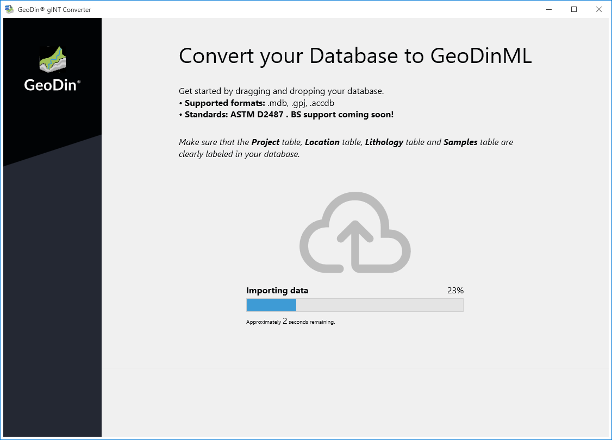
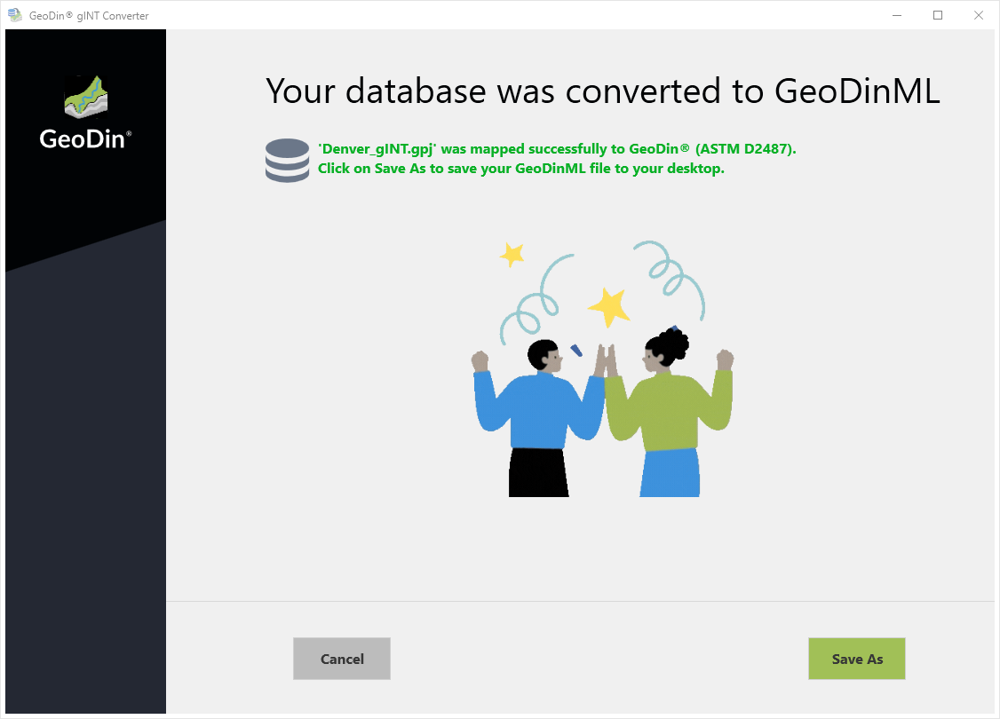
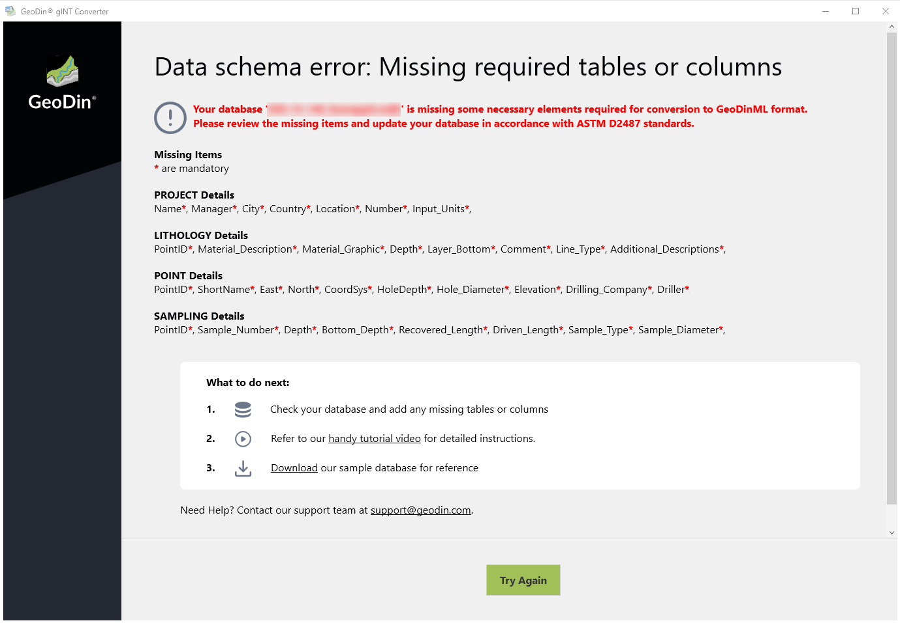

# Convert gINT database

## Introduction

This tutorial will guide you through the process of converting gINT database files into GeoDinML. The gINT converter will convert the groups **PROJECT**, **LITHOLOGY**, **POINT**, and **SAMPLING** into GeoDinML format. If any groups or parameters are missing, adjustments must be made to the gINT database file before conversion.

## Conversion Process

* Open the gINT Converter
* Choose your gINT database. It can be either a gINT database (.gpj) or a Microsoft Access database (.mdb or .accdb)

<figure><figcaption></figcaption></figure>

* The conversion process will begin automatically. The gINT converter will convert the groups **PROJECT**, **LITHOLOGY**, **POINT**, and **SAMPLING** into GeoDinML format.

<figure><figcaption></figcaption></figure>

* Once the conversion is complete, save the GeoDinML file to the desired location

<figure><figcaption></figcaption></figure>

## Troubleshooting

If the uploaded gINT database does not match the mapping schema, the gINT converter will provide information indicating which mandatory groups or parameters are missing.&#x20;

<figure><figcaption></figcaption></figure>

You can then adjust the corresponding tables and parameters within the gINT database file either directly in gINT or by renaming the file extension to `.mdb` or `.accdb` and making the necessary changes in Microsoft Access.

<figure><figcaption></figcaption></figure>

## Mandatory Groups and Parameters

The following gINT groups and parameters are mandatory for the conversion:

| **Group**     | **Parameters**           |
| ------------- | ------------------------ |
| **PROJECT**   | Name                     |
|               | Manager                  |
|               | City                     |
|               | Country                  |
|               | Location                 |
|               | Number                   |
|               | Input\_Units             |
| **POINT**     | PointID                  |
|               | ShortName                |
|               | East                     |
|               | North                    |
|               | CoordSys                 |
|               | HoleDepth                |
|               | Hole\_Diameter           |
|               | Elevation                |
|               | Drilling\_Company        |
|               | Driller                  |
|               | Start\_Date              |
|               | End\_Date                |
|               | Drilling\_Method         |
|               | Drilling\_RigType        |
|               | Logger                   |
|               | Location                 |
|               | Water\_Initial           |
|               | Water\_Liqu              |
|               | Water\_Static            |
|               | CPT\_AreaRatio           |
|               | CPT\_File                |
|               | CPT\_Dir                 |
|               | Expl\_Dir                |
|               | Station\_Number          |
| **LITHOLOGY** | PointID                  |
|               | Material\_Description    |
|               | Material\_Graphic        |
|               | Depth                    |
|               | Layer\_Bottom            |
|               | Comment                  |
|               | Line\_Type               |
|               | Additional\_Descriptions |
| **SAMPLING**  | PointID                  |
|               | Sample\_Number           |
|               | Depth                    |
|               | Bottom\_Depth            |
|               | Recovered\_Length        |
|               | Driven\_Length           |
|               | Sample\_Type             |
|               | Sample\_Diameter         |
