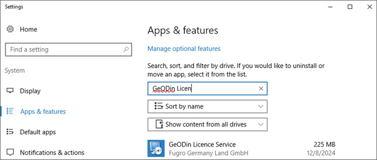

# Upgrade from 10 or earlier

## Before you start

To use GeoDin®, you need a valid GeoDin® licence serial number. You can obtain one by visiting www.geodin.com to purchase a licence or apply for a trial licence.

Ensure you have administrative privileges on the machine where you will install GeoDin®.

Please note that if the GeoDin Licence Service is present from a previous installation, it must be uninstalled before reinstalling GeoDin 15.

You will also need the installer. A download link for the installer will be sent to you automatically via email after your purchase.

Once downloaded, start the installation by double-clicking on the file `geodin-setup.exe`.

.jpg>)

## 1. Licence agreement

Please read the licence agreement carefully and proceed by accepting it.

.jpg>)

## 2. GeoDin® update

The GeoDin® setup detects if older versions of GeoDin® (GeoDin® 9.6 and GeoDin® 10) were installed using previous setups in the standard way. In this case, the setup offers an update option that also retains the existing system configuration during the update process.

The update process is not supported or guaranteed for older versions of GeoDin® or for GeoDin® that was not installed using the regular setup. In such cases, please contact [support@geodin.com](mailto:support@geodin.com) so that we can prepare an offer for you.

.jpg>)

Alternatively, you can also update within GeoDin by navigating to **System Configuration > Update GeoDin**, if you do not receive an automated update prompt.

<figure><figcaption></figcaption></figure>

## 3. Installation settings

The installation settings obtained from previous versions are summarized for you here.

Click `<Install>` to continue.

.jpg>)

## 4. Installation process

The installer copies files to the various directories.

Please wait for it to complete.

.jpg>)

## 5. Finish installation

The installation is now complete!

If you do not wish to start GeoDin® immediately after installation, uncheck the box labeled `Launch GeoDin® after installation completes`.

When you open GeoDin® for the first time, you can enter the licence. There is a separate guide for activating your license.

Click `<Finish>` to finalize the installation.

.jpg>)
